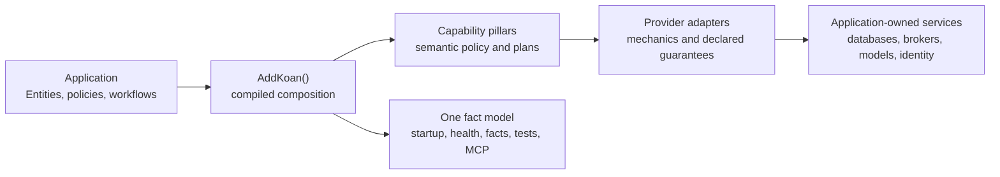

# Evaluate Koan architecture

Koan is an application framework, not a deployment platform. It gives Entity-centric .NET
applications one business-facing grammar for capabilities, compiles referenced modules into one
runtime composition, elects eligible providers, and explains the result. Your application keeps
ownership of its domain, infrastructure topology, production guarantees, and deliberate exceptions.

References make capabilities available; they do not make external commitments disappear. Explicit
provider intent either wins or fails with a correction. Koan does not silently substitute a weaker
durability, consistency, isolation, or delivery guarantee.

## Is Koan a fit?

Choose Koan when the application is naturally Entity-centric, conventions are preferable to repeated
plumbing, and provider decisions must remain inspectable while the application grows across data,
web, work, identity, content, AI, and agent surfaces.

Pause when the design requires a stable 1.0 compatibility contract, general cross-provider
transactions, transparent failover between unequal providers, framework-owned infrastructure
provisioning, a general backup/recovery system, or NativeAOT. Koan 0.20 does not promise those things.

## Responsibility boundary

| Decision | Koan owns | Application and platform own |
|---|---|---|
| Composition | module participation, provider election, corrective failure, runtime facts | referenced capabilities, explicit pins, deliberate overrides |
| Business behavior | concise Entity and capability grammar | domain invariants, workflows, integration contracts |
| Infrastructure | connector discovery, configuration binding, selected-provider health | Docker/Aspire/Kubernetes, service lifecycle, credentials, network topology |
| Reliability | truthful capability and delivery semantics | SLOs, redundancy, failover, idempotency policy, incident response |
| Security | supported authentication, access, tenancy, and redacted explanation surfaces | HTTPS, secrets, trust boundaries, entitlements, compliance, exposed operations |
| Recovery | provider-specific behavior only where explicitly claimed | backups, restore testing, retention, RPO/RTO, disaster recovery |

## Reference profiles

| Profile | Shape | Architectural boundary |
|---|---|---|
| Local-first application | one process with SQLite or another supported local provider | fastest supported start; embedded durability and single-node limits remain explicit |
| Service with managed dependencies | Koan Web plus supported database, identity, AI, or vector connectors | the platform owns service availability, scaling, credentials, backup, and network policy |
| Distributed work | Jobs plus a supported persistence and Communication connector | work is at-least-once; handlers are idempotent; acceptance is not completion |
| Governed agent surface | MCP projection over explicitly exposed and authorized application operations | Entity capability is not automatic tool exposure; transport, identity, and access remain explicit |

These are evaluation profiles, not generated deployment templates. Keep the same application grammar
while selecting only providers whose published guarantees satisfy the intended profile.

## At more than one instance

| Concern | What changes |
|---|---|
| Embedded Data and Local Storage | State is node-local. Replicas do not become a shared database or filesystem. |
| External providers | Replicas can share reach; the selected service still owns consistency, HA, backup, and failover. |
| Jobs and Communication | At-least-once behavior remains. Prove shared persistence and connector reach, then keep handlers idempotent. |
| Health and facts | Each instance reports its own resolved composition; the platform owns aggregation and rollout policy. |

## Architecture review

Before approving a design, confirm:

1. every required capability and provider is admitted by the
   [generated product surface](../reference/product-surface.md);
2. provider-specific consistency, boundedness, durability, and outage behavior satisfy the use case;
3. tenant, actor, authorization, and integration trust boundaries are explicit;
4. external topology, secrets, scaling, backup, recovery, and observability have named owners;
5. readiness, runtime facts, and the composition lockfile expose the decisions operators must verify;
6. unsupported guarantees fail or remain visible rather than becoming assumptions.

## Go deeper

- [Product constitution](product-constitution.md) — durable product and responsibility rules.
- [Framework principles](principles.md) — composition kernel, pillars, adapters, and runtime truth.
- [Entity Semantics Contract](entity-semantics-contract.md) — placement and extension rules.
- [Capability curriculum](../index.md) — application semantics and provider choices.
- [Testing and operations](../reference/operations/index.md) — evidence, health, facts, and correction.
- [External topology](../reference/operations/external-topology.md) — integration with existing
  deployment platforms.
- [Incremental adoption](../getting-started/adopt-existing-app.md) — coexistence with an existing
  ASP.NET Core application.
