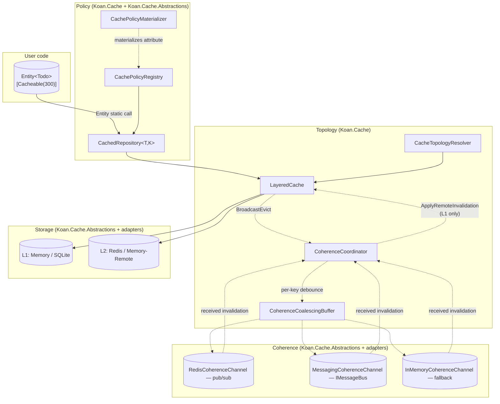

# Koan.Cache — Module Architecture

**Status:** initial release · v0.7.0
**ADR:** [ARCH-0075](../decisions/ARCH-0075-koan-cache-pillar.md) · [ARCH-0076](../decisions/ARCH-0076-repository-decorator-order.md)
**Reference doc:** [cache.md](../reference/data/cache.md)
**Implementation plan:** [caching_implementation_plan.md](../proposals/caching_implementation_plan.md)

The cache pillar is built around **four orthogonal concerns**: Storage, Coherence, Topology, Policy. Each has its own contract and package boundary. The composition lives in `Koan.Cache`; the rest are pluggable.

---

## The four pillars



### Boundaries

| Pillar | Owns | Does NOT know about |
|---|---|---|
| **Storage** | K/V verbs on bytes | Coherence, topology, policy |
| **Coherence** | Cross-node invalidation broadcast | Specific stores, policy |
| **Topology** | L1/L2 wiring, read/write orchestration, applying remote invalidations | Specific transports |
| **Policy** | Per-entity/per-method declarative intent | Wire transports or store types |

Each pillar is unit-testable in isolation. The four pillars meet exactly in `Koan.Cache`.

---

## Storage — `ICacheStore`

Pure K/V on bytes. Adapters implement this interface and self-register via their `KoanAutoRegistrar`.

```csharp
public interface ICacheStore
{
    string Name { get; }                                    // unique store identifier
    CacheStorePlacement Placement { get; }                  // Local | Remote
    CacheStoreCapabilities Capabilities { get; }            // SupportsTags / SupportsSlidingTtl / ...

    ValueTask<CacheFetchResult> Fetch(CacheKey key, CacheReadOptions options, CancellationToken ct);
    ValueTask Set(CacheKey key, CacheValue value, CacheWriteOptions options, CancellationToken ct);
    ValueTask<bool> Remove(CacheKey key, CancellationToken ct);
    ValueTask<bool> Exists(CacheKey key, CancellationToken ct);
    ValueTask Touch(CacheKey key, TimeSpan? newAbsoluteTtl, CancellationToken ct);
    IAsyncEnumerable<TaggedCacheKey> EnumerateByTag(string tag, CancellationToken ct);
}
```

**Critical:** `ICacheStore` does NOT declare any pub/sub or broadcast methods. Storage is storage. The pillar architecturally cannot conflate the two.

| Adapter | Placement | Priority | Notes |
|---|---|---|---|
| `MemoryCacheStore` (built-in) | Local | 10 | Always available, no reference needed |
| `SqliteCacheStore` | Local | 50 | Persists across restart; preempts Memory |
| `RedisCacheStore` | Remote | 100 | Shared across nodes |

---

## Coherence — `ICacheCoherenceChannel`

Transport-agnostic cross-node coordination. Specialization of a generic `ICoherenceChannel<TMessage>` (designed to lift to `Koan.Core.Coherence` when a second non-cache consumer materializes).

```csharp
public interface ICoherenceChannel<TMessage> where TMessage : struct
{
    string TransportName { get; }
    CoherenceCapabilities Capabilities { get; }
    ValueTask Publish(TMessage message, CancellationToken ct);
    ValueTask Subscribe(Func<TMessage, CancellationToken, ValueTask> onReceived, CancellationToken ct);
    ValueTask<string?> CatchUp(string? cursor, Func<TMessage, CancellationToken, ValueTask> onReceived, CancellationToken ct);
}

public interface ICacheCoherenceChannel : ICoherenceChannel<CacheInvalidation> { }
```

`CacheInvalidation` is a `readonly record struct` carrying `Kind` (EvictKey/EvictByTag/EvictAll), `Key`, `Tags`, `Region`, `ScopeId`, `OriginNodeId`, `PublishedAtUtc`.

| Channel | Priority | Capabilities | Notes |
|---|---|---|---|
| `RedisCoherenceChannel` | 100 | BestEffort | Pub/sub, no catch-up |
| `MessagingCoherenceChannel` | 150 | BestEffort | Rides `Koan.Messaging.IMessageBus`; preempts Redis when both registered |
| `InMemoryCoherenceChannel` | `int.MinValue` | BestEffort | In-process bus; primary use is tests |

Priority rationale: `Koan.Messaging` outranks Redis pub/sub because users with an existing message bus shouldn't need to stand up Redis just for cache invalidation. Explicit pin via `Koan:Cache:CoherenceTransport` overrides.

### Consistency model

**Writer write-through, peer evict, always broadcast `EvictKey`.** The broadcast is never `SetWithValue` — values in flight can be overtaken by reality, so peers always re-fetch from L2 or DB. DB is the single serialization point for cross-node races.

```
Node A: todo.Save()
  ├─ DB commits
  ├─ L1 (A) + L2 (shared) write-through
  └─ Channel.Publish(EvictKey, origin=A)

Node B: receives EvictKey
  ├─ Coordinator filters origin
  └─ LayeredCache.ApplyRemoteInvalidation evicts L1 only
```

Coherence is **best-effort**. Defense in depth: L1 TTL is capped to `min(L2, max(30s, L2/2))` at policy materialization — worst-case staleness is bounded even when broadcasts are silent.

---

## Topology — `LayeredCache` + `CoherenceCoordinator`

Composition over inheritance. `LayeredCache` does NOT implement `ICacheStore` — it's a focused orchestrator with explicit verbs.

```csharp
internal sealed class LayeredCache
{
    public ValueTask<CacheFetchResult> Read(CacheKey key, CacheReadOptions options, CancellationToken ct);
    public ValueTask Write(CacheKey key, CacheValue value, CacheWriteOptions options, CancellationToken ct);
    public ValueTask<bool> Evict(CacheKey key, CancellationToken ct);
    public ValueTask Touch(CacheKey key, TimeSpan? newAbsoluteTtl, CancellationToken ct);
    public IAsyncEnumerable<TaggedCacheKey> EnumerateByTag(string tag, CancellationToken ct);

    // Internal — only the coordinator calls this
    internal ValueTask ApplyRemoteInvalidation(CacheInvalidation msg, CancellationToken ct);
}
```

**`ApplyRemoteInvalidation` touches L1 only, never L2, never republishes.** The shared remote tier was already evicted by the originating writer; re-evicting it would be wasted work and republishing would create feedback loops. The method is `internal` with a distinct name so contributors can't accidentally reuse generic `Evict`.

### `CacheTopologyResolver`

Picks one L1 and one L2 at startup:

1. Config pin (`CacheOptions.LocalProvider` / `RemoteProvider` matched against `ICacheStore.Name`)
2. Highest `[ProviderPriority]` among stores with matching `Placement`
3. First store with matching `Placement`
4. Null (single-tier or empty deployment)

### `CoherenceCoordinator` — `IHostedService`

- Generates a per-process `NodeId` (Guid) at construction
- Subscribes to every registered `ICacheCoherenceChannel` at `StartAsync`
- Calls `CatchUp` on channels declaring `SupportsCatchUp = true`
- Routes received messages to `LayeredCache.ApplyRemoteInvalidation` after origin filter
- Honours `CoherenceMode`: `AutoDetect` (default, active iff ≥1 channel) / `Required` (fail at boot if no channel + Remote tier) / `Disabled`
- Optional `CoherenceCoalescingBuffer` for per-key debounce (default off via `CoherenceCoalescingMs = 0`)

---

## Policy — `[Cacheable]` and `[CachePolicy]`

`CacheableAttribute` is a thin subclass of `CachePolicyAttribute` with entity-friendly defaults:

```csharp
public class CacheableAttribute : CachePolicyAttribute
{
    public CacheableAttribute(int ttlSeconds = 300)
        : base(CacheScope.Entity, "{TypeName}:{Partition}:{Id}")
    {
        if (ttlSeconds > 0) AbsoluteTtl = TimeSpan.FromSeconds(ttlSeconds);
        Tier     = CacheTier.Layered;
        Strategy = CacheStrategy.GetOrSet;
        Tags     = new[] { "{TypeName}" };
    }

    public int L1TtlSeconds         { init => L1AbsoluteTtl = TimeSpan.FromSeconds(value); }
    public int SlidingTtlSeconds    { init => SlidingTtl    = TimeSpan.FromSeconds(value); }
    public int AllowStaleForSeconds { init => AllowStaleFor = TimeSpan.FromSeconds(value); }
}
```

The integer-second sister setters sidestep the C# attribute-syntax limitation that `TimeSpan` literals aren't constant expressions.

### `CachePolicyMaterializer`

Materializes attributes into runtime `CachePolicyDescriptor`s at boot. Resolves the `{TypeName}` tag sentinel to `declaringType.Name`, derives the L1 TTL, and validates `L1 ≤ L2`:

```csharp
public static TimeSpan? ResolveL1Ttl(TimeSpan? absoluteTtl, TimeSpan? l1Override)
{
    if (l1Override.HasValue) return l1Override;
    if (!absoluteTtl.HasValue) return null;

    var l2 = absoluteTtl.Value.TotalSeconds;
    var derived = Math.Max(30, l2 / 2.0);
    var clamped = Math.Min(derived, l2);             // clamp to L2 for short L2 TTLs
    return TimeSpan.FromSeconds(clamped);
}
```

### `CachedRepository<T,K>` — the decorator

Wraps `IDataRepository<T,K>` when a policy exists for `typeof(T)`. Reads consult `EntityContext.Current.CacheBehavior` (per-request override); writes always invalidate (broadcast included) regardless of override.

Key building (`TryBuildEntityKey`) seeds the template with `{TypeName}`, `{Partition}`, `{Source}` from ambient `EntityContext` — partition isolation works without extra plumbing.

---

## Package layout

```
src/
  Koan.Cache.Abstractions/        Contracts only — referenced by every adapter
    Stores/                        ICacheStore, CacheStorePlacement, CacheStoreCapabilities
    Coherence/                     ICoherenceChannel<T>, ICacheCoherenceChannel, CacheInvalidation, CoherenceCapabilities, CoherenceMode
    Policies/                      CachePolicyAttribute, CacheableAttribute, CachePolicyDescriptor, ICachePolicyRegistry, CacheBehavior
    Primitives/                    CacheKey, CacheValue, CacheReadOptions, CacheWriteOptions, ...
    Serialization/                 ICacheSerializer

  Koan.Cache/                      Orchestration + built-in Memory L1
    Topology/                      LayeredCache, CacheStoreRegistry, CacheTopologyResolver, CacheTopology
    Coherence/                     CoherenceCoordinator, NodeIdProvider, CoherenceCoalescingBuffer, CursorStore
    Stores/                        CacheClient, MemoryCacheStore
    Decorators/                    CachedRepository<T,K>, CacheRepositoryDecorator [ProviderPriority(100)]
    Policies/                      CachePolicyRegistry, CachePolicyMaterializer, CachePolicyBootstrapper
    Diagnostics/                   CacheInstrumentation, CacheHealthCheck, CacheTraceFilter
    Initialization/                KoanAutoRegistrar (rich boot report)

  Koan.Cache.Adapter.Sqlite/       Persistent L1 (priority 50)
  Koan.Cache.Adapter.Redis/        L2 + RedisCoherenceChannel (priority 100)
  Koan.Cache.Coherence.InMemory/   In-process channel (priority int.MinValue)
  Koan.Cache.Coherence.Messaging/  IMessageBus channel (priority 150)
```

---

## Cross-cutting

### `Koan.Core.Singleflight` (extracted M2)

The per-key semaphore primitive that prevents cache stampedes. Lifted out of `Koan.Cache` so other pillars can use it without taking a cache dependency. Used today by `CacheClient.GetOrAddAsync`; equally applicable to AI embedding computations, heavy DB queries, file ops.

### `EntityContext.CacheBehavior` (M6, in `Koan.Data.Core`)

AsyncLocal ambient mirroring the existing `Partition`/`Source`/`Adapter` fields. Pushed via `EntityContext.WithCacheBehavior(...)`, `NoCache()`, `RefreshCache()`. Inherits through nested `With()` calls; child overrides parent.

### `[ProviderPriority]` decorator order (ARCH-0076)

Bands:
- **100+** read short-circuit (Cache at 100)
- **50–99** read observation (CQRS at 50)
- **0–49** write transformation (soft-delete, multi-tenancy)
- **<0** framework reserved

---

## Observability

| Surface | Where |
|---|---|
| Boot report (Topology, Coherence, NodeId, per-policy with health flag) | `KoanAutoRegistrar.Describe` |
| Health check (`IHealthCheck`) | `CacheHealthCheck`, registered automatically as `"koan-cache"` |
| OpenTelemetry meters | `Meter("Koan.Cache")` |
| OpenTelemetry tracing | `ActivitySource("Koan.Cache")` |
| Per-key prod debug | `KOAN_CACHE_TRACE_KEY` env var → verbose log lines for matching key only |

Metrics list and span tag list in [cache.md §production hardening](../reference/data/cache.md#production-hardening).

---

## What's deferred

| Item | Why deferred |
|---|---|
| `RedisStreamsCoherenceChannel` (catch-up via Redis Streams) | Pub/sub + L1 TTL ceiling is sufficient for typical deployments. Add when first production user reports staleness after network blip. |
| Query-result caching | Predicate invalidation semantics are an unsolved problem; entity-keyed caching covers the high-value cases. |
| Bespoke cache migrations (`InMemoryRoleAttributionCache`, `RagCorpusMetadata._cache`, etc.) | Each is its own PR. M11 pilots `InMemoryMediaTransformCache`. |
| HTTP `/diagnostics/cache` endpoint | Boot report + health check + metrics cover the common needs. Add when an ops team asks. |

---

## See also

- [cache.md](../reference/data/cache.md) — five-minute integration + reference
- [ARCH-0075](../decisions/ARCH-0075-koan-cache-pillar.md) — pillar architecture (Accepted)
- [ARCH-0076](../decisions/ARCH-0076-repository-decorator-order.md) — decorator priority canon (Accepted)
- [implementation plan](../proposals/caching_implementation_plan.md) — milestone history
