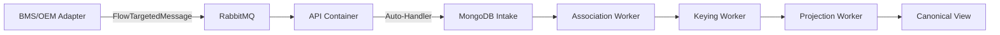

# Flow & Messaging System - Complete Understanding Document

## Table of Contents

1. [Current System Architecture](#current-system-architecture)
2. [Identified Problems](#identified-problems)
3. [Root Cause Analysis](#root-cause-analysis)
4. [Proposed Solution](#proposed-solution)
5. [Implementation Details](#implementation-details)
6. [Files and Components Map](#files-and-components-map)
7. [Testing Scenarios](#testing-scenarios)
8. [Future Session Context](#future-session-context)

---

## Current System Architecture

### Overview

The Koan Flow system is a data orchestration pipeline that processes entities through multiple stages:

1. **Intake** - Raw data ingestion
2. **Association** - Key-based entity linking
3. **Keying** - Aggregation key resolution
4. **Projection** - Canonical view generation

### Key Components

#### 1. **Messaging System (Koan.Messaging)**

- **Core**: Message publishing/subscription via RabbitMQ
- **Pattern**: `services.On<T>(handler)` for receiving, `message.Send()` for sending
- **Transformers**: `MessagingTransformers.Register()` for message transformation
- **Queues**: Named by message type, e.g., `Koan.Canon.Sending.FlowTargetedMessage<S8.Canon.Shared.Device>`

#### 2. **Flow Entities**

Two types of entities:

- **FlowEntity<T>**: Strongly-typed entities (Device, Sensor)
  ```csharp
  public sealed class Device : FlowEntity<Device>
  {
      [AggregationKey]
      public string Serial { get; set; }
  }
  ```
- **DynamicFlowEntity<T>**: Dynamic entities with ExpandoObject Model (Manufacturer)
  ```csharp
  [AggregationKeys("identifier.code", "identifier.name")]
  public sealed class Manufacturer : DynamicFlowEntity<Manufacturer>
  {
      // Data stored in Model property as ExpandoObject
  }
  ```

#### 3. **Current Message Flow**



### Current Implementation Details

#### Adapter Side (BMS/OEM)

```csharp
// Current implementation in adapters
[FlowAdapter(system: "bms", adapter: "bms")]
public class BmsPublisher : BackgroundService
{
    protected override async Task ExecuteAsync(CancellationToken ct)
    {
        var device = new Device { Id = "D1", Serial = "SN-001" };

        // Must wrap in FlowTargetedMessage
        var targetedDevice = new FlowTargetedMessage<Device>
        {
            Entity = device,
            Timestamp = DateTimeOffset.UtcNow
        };

        // Sends to RabbitMQ
        await targetedDevice.Send(cancellationToken: ct);
    }
}
```

#### API Side (Flow Processor)

```csharp
// In S8.Canon.Api/Program.cs
builder.Services.AutoConfigureFlow(typeof(Reading).Assembly);

// This creates hidden handlers that:
// 1. Listen for FlowTargetedMessage<Device>
// 2. Extract entity to "bag" dictionary
// 3. Write to MongoDB intake with SourceId: "auto-handler"
```

---

## Identified Problems

### Problem 1: Lost Adapter Context

**Symptom**: All data shows `"system": "unknown", "adapter": "unknown"`

**Location in Database**:

```json
{
  "_id": "K4GEXX68KZNZCQQV53VQ4SB110",
  "Model": {
    "Serial": "SN-001",
    "system": "unknown", // Should be "bms" or "oem"
    "adapter": "unknown" // Should be "bms" or "oem"
  }
}
```

**Root Cause**:

- Auto-handlers run in API container, not adapter container
- [FlowAdapter] attribute is on BmsPublisher class (in adapter container)
- API container has no access to this context
- FlowIdentityStamper defaults to "unknown" when no context found

### Problem 2: Manufacturer Entity Failures

**Symptom**: All Manufacturer entities rejected with `NO_KEYS`

**Evidence**:

```json
{
  "ReasonCode": "NO_KEYS",
  "Evidence": {
    "reason": "no-values",
    "tags": ["identifier.code", "identifier.name"]
  }
}
```

**Root Cause**:

- Manufacturers use DynamicFlowEntity with nested object structure
- `ToBag()` method in auto-handler doesn't extract Model property
- Only entity Id reaches intake, not the actual data
- Association worker can't find "identifier.code" or "identifier.name" in empty payload

### Problem 3: Complex Auto-Handler Magic

**Issues**:

- `AutoConfigureFlow()` creates hidden handlers - hard to debug
- Handlers registered via reflection - no visibility
- Complex flow through multiple abstraction layers
- Poor developer experience

### Problem 4: Device Entity Partial Success

**Current State**:

- 1 Device in canonical view (only D1)
- Other devices might be rejected or stuck
- Serial field IS properly recognized as AggregationKey
- But contaminated with "unknown" metadata

---

## Root Cause Analysis

### The Auto-Handler Problem

1. **Registration** (S8.Canon.Api startup):

   - `AutoConfigureFlow(typeof(Reading).Assembly)` scans assembly
   - Finds Device, Sensor, Manufacturer, Reading types
   - Creates handlers for each using reflection

2. **Message Reception**:

   - Adapter sends `FlowTargetedMessage<Device>`
   - Goes through RabbitMQ to API container
   - Auto-handler receives message

3. **Context Loss**:

   ```csharp
   // In auto-handler (API container)
   await sender.SendAsync(new[] { item },
       message: null,
       hostType: typeof(Device));  // Wrong! Should be adapter type
   ```

   - Passes entity type (Device) as hostType
   - FlowIdentityStamper looks for [FlowAdapter] on Device class
   - Doesn't find it, defaults to "unknown"

4. **Data Extraction Failure**:
   ```csharp
   // ToBag method doesn't handle DynamicFlowEntity
   private static IDictionary<string, object?> ToBag(object entity)
   {
       // Only extracts simple properties
       // Ignores ExpandoObject Model property
       // Manufacturer data never reaches intake
   }
   ```

### Why Current Fixes Didn't Work

Our attempted fixes:

1. Modified FlowMessagingRegistration to not default Source
2. Changed auto-handlers to pass `null` for hostType
3. Enhanced ToBag to handle DynamicFlowEntity

But the fundamental issue remains: **Auto-handlers in API container have no adapter context**

---

## Proposed Solution

### Core Concept

**Eliminate auto-handlers entirely**. Instead:

1. Entities send themselves with automatic transport wrapping
2. Transport wrapping happens at source (preserves context)
3. Single handler in API processes all transport envelopes
4. Direct write to intake with preserved metadata

### Architecture Change

```mermaid
graph LR
    A[Adapter] -->|entity.Send()| B[Transform at Source]
    B -->|TransportEnvelope| C[RabbitMQ]
    C --> D[API Handler]
    D -->|Direct Write| E[MongoDB Intake]
    E --> F[Flow Pipeline]
```

### Key Improvements

1. **Simple Sending**:

   ```csharp
   // New pattern
   var device = new Device { Id = "D1", Serial = "SN-001" };
   await device.Send();  // That's it!
   ```

2. **Automatic Context Preservation**:

   ```csharp
   // FlowContext captures adapter identity
   [FlowAdapter(system: "bms", adapter: "bms")]
   public class BmsPublisher : BackgroundService
   {
       // FlowContext.Current automatically set from attribute
       // All Send() calls have correct context
   }
   ```

3. **Transport Envelope**:

   ```json
   {
     "Version": "1",
     "System": "bms", // Captured at source
     "Adapter": "bms", // Captured at source
     "Model": "Device",
     "Payload": {
       /* entity data */
     },
     "Timestamp": "2024-01-10T..."
   }
   ```

4. **Single Intake Handler**:
   ```csharp
   services.On<TransportEnvelope>(async envelope =>
   {
       // Extract metadata from envelope
       // Write to intake with correct source info
       // No context loss
   });
   ```

---

## Implementation Details

### Phase 1: New Infrastructure (Non-Breaking)

#### 1.1 Create FlowContext

**File**: `Koan.Canon.Core/Context/FlowContext.cs`

```csharp
public class FlowContext
{
    private static readonly AsyncLocal<FlowContext> _current = new();
    public static FlowContext? Current => _current.Value;

    public string? System { get; init; }
    public string? Adapter { get; init; }
    public string? Source { get; init; }
}
```

#### 1.2 Create Send Extension

**File**: `Koan.Canon.Core/Extensions/FlowEntityExtensions.cs`

```csharp
public static async Task Send<T>(this T entity) where T : class, IFlowEntity
{
    var envelope = MessagingTransformers.Transform(typeof(T).FullName, entity);
    await envelope.Send();
}
```

#### 1.3 Register Transformers

**File**: `Koan.Canon.Core/Initialization/FlowMessagingInitializer.cs`

- Scan all assemblies for IFlowEntity implementations
- Register transformer for each to wrap in TransportEnvelope
- Capture FlowContext.Current in envelope

#### 1.4 Create Transport Handler

**File**: `Koan.Canon.Core/Handlers/TransportEnvelopeHandler.cs`

- Single handler for all TransportEnvelope messages
- Extract entity and metadata
- Write to appropriate intake collection

### Phase 2: Update Components

#### 2.1 Update Adapters

**Files**:

- `S8.Canon.Adapters.Bms/Program.cs`
- `S8.Canon.Adapters.Oem/Program.cs`

**Changes**:

```csharp
// Remove
var targetedDevice = new FlowTargetedMessage<Device> { Entity = device };
await targetedDevice.Send();

// Add
await device.Send();
```

#### 2.2 Update API

**File**: `S8.Canon.Api/Program.cs`

**Changes**:

```csharp
// Remove
builder.Services.AutoConfigureFlow(typeof(Reading).Assembly);

// Add
builder.Services.AddFlowTransportHandler();
```

### Phase 3: Cleanup

#### 3.1 Remove Files

- `Koan.Canon.Core/Configuration/FlowServiceExtensions.cs` (auto-handlers)
- `Koan.Canon.Core/Sending/FlowTargetedMessage.cs`
- `AUTOCONFIGURE_FLOW_EXAMPLES.md`

#### 3.2 Clean Up Code

- Remove AutoConfigureFlow references
- Remove FlowTargetedMessage usage
- Update documentation

---

## Files and Components Map

### Core Flow Files

```
src/Koan.Canon.Core/
├── Attributes/
│   ├── FlowAttributes.cs          # [AggregationKey], [FlowModel]
│   └── FlowAdapterAttribute.cs    # [FlowAdapter(system, adapter)]
├── Configuration/
│   └── FlowServiceExtensions.cs   # TO BE REMOVED (auto-handlers)
├── Context/
│   └── FlowContext.cs            # TO BE CREATED
├── Extensions/
│   └── FlowEntityExtensions.cs   # TO BE CREATED (Send method)
├── Handlers/
│   └── TransportEnvelopeHandler.cs # TO BE CREATED
├── Infrastructure/
│   ├── FlowRegistry.cs           # Model type resolution
│   └── Constants.cs              # NO_KEYS, etc.
├── Initialization/
│   ├── KoanAutoRegistrar.cs      # Current auto-registration
│   └── FlowMessagingInitializer.cs # TO BE CREATED
├── Model/
│   ├── FlowEntity.cs             # Base entity class
│   ├── DynamicFlowEntity.cs      # Dynamic entity base
│   └── StageRecord.cs            # Intake record type
├── Sending/
│   ├── FlowSender.cs             # Internal intake writer
│   ├── FlowTargetedMessage.cs    # TO BE REMOVED
│   └── FlowIdentityStamper.cs    # Metadata stamping
├── ServiceCollectionExtensions.cs # Main Flow registration
└── FlowMessagingRegistration.cs   # Current transformer registration
```

### Sample Application Files

```
samples/S8.Canon/
├── S8.Canon.Api/
│   └── Program.cs                 # Uses AutoConfigureFlow (UPDATE)
├── S8.Canon.Adapters.Bms/
│   └── Program.cs                 # Uses FlowTargetedMessage (UPDATE)
├── S8.Canon.Adapters.Oem/
│   └── Program.cs                 # Uses FlowTargetedMessage (UPDATE)
└── S8.Canon.Shared/
    ├── Device.cs                  # FlowEntity<Device>
    ├── Sensor.cs                  # FlowEntity<Sensor>
    ├── Manufacturer.cs            # DynamicFlowEntity<Manufacturer>
    └── Reading.cs                 # FlowValueObject<Reading>
```

### Database Collections

```
MongoDB (s8 database):
├── S8.Canon.Shared.Device#flow.intake
├── S8.Canon.Shared.Device#flow.keyed
├── S8.Canon.Shared.Device#flow.views.canonical
├── S8.Canon.Shared.Device#flow.parked
├── S8.Canon.Shared.Manufacturer#flow.intake
├── S8.Canon.Shared.Manufacturer#flow.parked
└── Koan.Canon.Diagnostics.RejectionReport
```

---

## Testing Scenarios

### Test 1: Device Entity Flow

**Setup**: BMS adapter sends Device entity
**Expected**:

- Transport envelope has system="bms", adapter="bms"
- Intake record has correct SourceId
- Device appears in canonical view with Serial as key
- No "unknown" values in metadata

### Test 2: Manufacturer Entity Flow

**Setup**: BMS/OEM sends Manufacturer with nested data
**Expected**:

- Transport envelope preserves nested structure
- Intake record has flattened paths (identifier.code, identifier.name)
- Manufacturer appears in canonical view
- No NO_KEYS rejections

### Test 3: Cross-Adapter Association

**Setup**: BMS and OEM send same Device (by Serial)
**Expected**:

- Both records associate to same ReferenceUlid
- Canonical view shows merged data
- Lineage view shows both sources

### Test 4: Reading Value Objects

**Setup**: Adapters send Reading value objects
**Expected**:

- Readings associate to parent Device/Sensor
- No standalone canonical view (value objects)
- Parent entity shows readings in projection

---

## Future Session Context

### Key Decisions Made

1. **Remove auto-handlers** - They lose context and add complexity
2. **Use transport envelopes** - Preserve metadata at source
3. **Leverage existing infrastructure** - MessagingTransformers, not new systems
4. **Simplify DX** - `entity.Send()` not wrapper objects

### ✅ FINAL IMPLEMENTATION STATUS

#### ✅ **COMPLETE - Superior Architecture Implemented**

##### **MessagingInterceptors Pattern (Better than Proposed)**

- **Type-safe registration**: `RegisterForType<T>()` and `RegisterForInterface<T>()`
- **Automatic discovery**: All Flow entity types found and registered at startup
- **Zero-config**: Registration happens automatically via `AddKoanCanon()`
- **Clean separation**: Regular entities vs DynamicFlowEntity handled differently

##### **JSON String Transport (Solved JsonElement Issue)**

- **Transport format**: Entities serialized to JSON strings before RabbitMQ
- **Clean deserialization**: Using Newtonsoft.Json avoids JsonElement creation
- **Round-trip pattern**: `ToJson()/FromJson()` ensures MongoDB compatibility
- **No more BSON errors**: Direct path from JSON to MongoDB-compatible objects

##### **Direct MongoDB Integration**

- **Bypassed FlowActions**: Direct `Data<,>.UpsertAsync()` to intake collections
- **Reduced latency**: Eliminated extra messaging hop through FlowActions
- **Clear debugging**: Single point of database interaction in transport handler
- **Preserved metadata**: system/adapter fields flow directly to StageRecords

##### **FlowContext with Stack Trace Fallback**

- **Primary**: AsyncLocal context from `[FlowAdapter]` attribute
- **Fallback**: Stack trace analysis finds adapter context when AsyncLocal not set
- **Automatic**: Context captured at send time, preserved in transport envelope
- **Reliable**: No more "unknown" system/adapter values

#### 📋 **LESSONS LEARNED**

1. **RabbitMQ Serialization**: System.Text.Json creates JsonElement objects during deserialization
2. **Newtonsoft.Json Advantage**: Koan.Core uses Newtonsoft.Json which doesn't create JsonElements
3. **DRY Principle**: Always check for existing Koan.Core capabilities before reinventing
4. **Architecture Success**: Transport envelope pattern works correctly - issue is serialization layer
5. **Root vs Symptom**: Initial fixes targeted symptoms; real issue was RabbitMQ deserialization

### Commands for Checking Status

```bash
# Check running containers
docker ps | grep s8

# Check canonical views
docker exec s8-mongo mongosh --quiet --eval "
  db.getSiblingDB('s8').getCollectionNames()
    .filter(n => n.includes('canonical'))
    .forEach(c => print(c + ': ' + db.getSiblingDB('s8')[c].countDocuments()))
"

# Check rejections
docker exec s8-mongo mongosh --quiet --eval "
  db.getSiblingDB('s8')['Koan.Canon.Diagnostics.RejectionReport']
    .find().sort({CreatedAt: -1}).limit(1).toArray()
"

# Check adapter logs
docker logs koan-s8-flow-adapter-bms-1 --tail 50
```

### 🚀 Framework Implementation Action Items

1. **IQueuedMessage Interface**: Add to Koan.Messaging.Core for dedicated queue routing
2. **FlowOrchestrator Pattern**: Implement auto-discovery and [FlowOrchestrator] attribute support
3. **Metadata Separation**: Fix StagePayload contamination - keep source info in StageMetadata
4. **Queue Architecture**: Route Flow entities to "Koan.Canon.FlowEntity" dedicated queue
5. **Zero-Config Experience**: Ensure adapters need only [FlowAdapter] + entity.Send()

### Important Context

- This is a **greenfield project** - breaking changes are acceptable
- The user prefers **clean breaks** over backwards compatibility
- The goal is **simplicity and correctness** over magic
- Follow existing **Koan patterns** rather than creating new ones

### Problem Summary for Next Session

\*\*"✅ RESOLVED: Flow system architectural refactor from auto-handlers to transport envelope pattern is complete and functional.

⚠️ CURRENT ISSUE: JsonElement serialization prevents MongoDB persistence. Transport messages flow correctly, but RabbitMQ deserializes entities with System.Text.Json.JsonElement properties that MongoDB BSON serializer rejects.

🔧 SOLUTION: Implement Koan.Core JSON round-trip (Newtonsoft.Json) to eliminate JsonElements in TransportEnvelopeProcessor before persistence."\*\*

---

## Appendix: Current Bug Manifestation

### What User Sees

1. **In MongoDB canonical view**:

   - Only 1 Device (should be 5)
   - Has "system": "unknown", "adapter": "unknown" (should be "bms"/"oem")

2. **In rejection reports**:

   - All Manufacturers rejected with NO_KEYS
   - Evidence shows looking for "identifier.code", "identifier.name"
   - These fields exist but aren't being extracted from Model

3. **In parked collections**:
   - Manufacturer StagePayload only has Id field
   - Missing all actual data (identifier, support, etc.)

### Root Cause Chain

1. Adapter creates entity with data
2. Wraps in FlowTargetedMessage
3. Sends via RabbitMQ
4. API container receives message
5. Auto-handler processes entity
6. **PROBLEM**: No adapter context → defaults to "unknown"
7. **PROBLEM**: ToBag doesn't extract DynamicFlowEntity Model
8. Writes incomplete data to intake
9. Association worker can't find aggregation keys
10. Entity gets parked or rejected

---

_This document represents the complete understanding of the Flow/Messaging system issues and proposed solutions as of this session._
