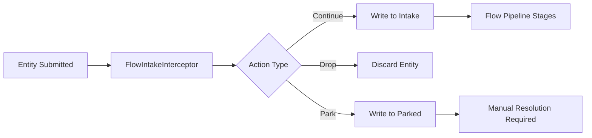
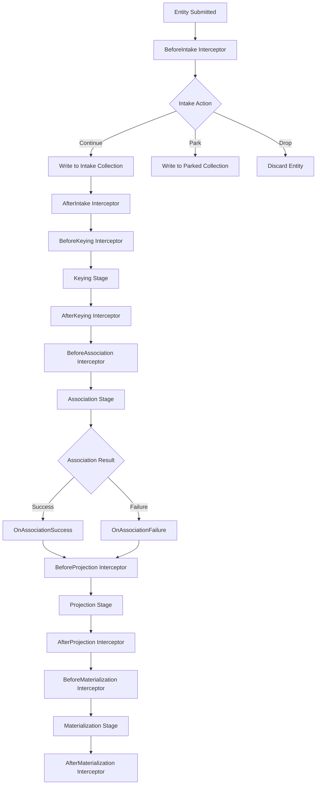

# CLD Document: Koan.Flow Lifecycle Interceptors - Fluent API Architecture

**Document Type**: Comprehensive Library Design (CLD)  
**Project Name**: Koan.Flow Lifecycle Interceptor Enhancement  
**Version**: 1.0  
**Date**: 2025-01-10  
**Status**: PROPOSED - Ready for Implementation  
**Architecture Pattern**: Fluent Lifecycle Interceptor API with Explicit Stage Timing

---

## 🎯 Project Overview

### Core Objective

**Transform Koan.Flow interceptor system** from ambiguous single-point interception to **explicit lifecycle-aware fluent API** that provides precise control over Flow pipeline stages with crystal-clear semantics.

### The Problem We're Solving

#### Current State Issues

```csharp
// PROBLEM: Ambiguous timing and limited control
FlowIntakeInterceptors.RegisterForType<Location>(async location =>
{
    // When does this fire? Before intake? After? Unclear!
    // Only one interception point available
    // Naming suggests "after intake" but actually fires "before intake"
    return FlowIntakeActions.Park(location, "WAITING_RESOLUTION");
});
```

**Issues:**

- **Semantic Ambiguity**: "IntakeInterceptors" suggests after intake, but fires before
- **Limited Lifecycle Access**: Only one interception point per entity type
- **Poor Developer Experience**: Unclear when code executes in pipeline
- **Reduced Framework Power**: Cannot react to pipeline stage completions
- **Naming Confusion**: Method names don't match actual execution timing

#### Real-World Impact

1. **S8.Location Confusion**: Developers unclear when hash collision detection should occur
2. **Complex Scenarios Blocked**: Cannot implement post-association notifications or pre-projection enrichment
3. **Framework Limitations**: Single interception point limits sophisticated orchestration patterns
4. **Documentation Burden**: Requires extensive explanation of actual vs. implied timing

### The Solution: Fluent Lifecycle API

```csharp
// SOLUTION: Crystal clear timing and comprehensive control
FlowInterceptors
  .For<Location>()
    .BeforeIntake(async location =>
    {
        // Hash collision detection at optimal timing
        var hash = ComputeSHA512(NormalizeAddress(location.Address));
        location.AddressHash = hash;

        var duplicate = await Data<ResolutionCache>.GetAsync(hash);
        return duplicate != null
            ? FlowIntakeActions.Drop(location)  // Already processed
            : FlowIntakeActions.Park(location, "WAITING_ADDRESS_RESOLVE");
    })
    .AfterAssociation(async location =>
    {
        // Post-association processing - notify external systems
        if (location.WasSuccessfullyAssociated)
            await NotifyDownstreamSystems(location);
    })
    .BeforeProjection(async location =>
    {
        // Pre-projection enrichment
        location.Metadata["ProcessedAt"] = DateTimeOffset.UtcNow;
        return FlowStageActions.Continue(location);
    });
```

---

## 🏗️ Current State Architecture

### Current Interceptor System

#### File Locations

- **Core Implementation**: `src/Koan.Flow.Core/Interceptors/FlowIntakeInterceptors.cs`
- **Registration Extensions**: `src/Koan.Flow.Core/ServiceCollectionExtensions.cs`
- **Action Types**: `src/Koan.Flow.Core/Infrastructure/FlowIntakeActions.cs`

#### Current API Surface

```csharp
// Only available interception point
public static class FlowIntakeInterceptors
{
    public static void RegisterForType<T>(Func<T, Task<FlowIntakeAction>> interceptor)
        where T : IFlowEntity;

    public static void RegisterForInterface<TInterface>(Func<TInterface, Task<FlowIntakeAction>> interceptor);
}

// Limited action types
public static class FlowIntakeActions
{
    public static FlowIntakeAction Continue(IFlowEntity entity);
    public static FlowIntakeAction Drop(IFlowEntity entity);
    public static FlowIntakeAction Park(IFlowEntity entity, string reasonCode);
}
```

#### Current Execution Flow



### Current Usage Patterns

#### Example 1: S8.Location (Problematic)

```csharp
// Current S8.Location implementation
FlowIntakeInterceptors.RegisterForType<Models.Location>(location =>
{
    // Parks EVERYTHING - fighting against Flow automation
    // No hash collision detection at optimal point
    return FlowIntakeActions.Park(location, "WAITING_ADDRESS_RESOLVE");
});
```

#### Example 2: S8.Flow Device (Limited)

```csharp
// Current S8.Flow implementation
FlowIntakeInterceptors.RegisterForType<Device>(device =>
{
    // Can only validate/transform at one point
    if (string.IsNullOrEmpty(device.Serial))
        return FlowIntakeActions.Drop(device);

    // Cannot react to successful association or enrich before projection
    return FlowIntakeActions.Continue(device);
});
```

### Current Limitations Analysis

#### 1. **Semantic Confusion**

- Method name implies "after intake" but executes "before intake"
- Developers must consult documentation to understand timing
- Mental model mismatch causes implementation errors

#### 2. **Single Interception Point**

- Cannot implement pre-projection enrichment
- Cannot react to association success/failure
- Cannot perform post-keying validation
- Complex orchestration patterns require workarounds

#### 3. **Limited Action Vocabulary**

- Only Continue/Drop/Park available
- Cannot Skip, Defer, or Retry with different timing
- No conditional action support

#### 4. **Poor Extensibility**

- Adding new pipeline stages requires new interceptor classes
- No consistent pattern for lifecycle hooks
- Framework growth hampered by API limitations

---

## 🚀 Future State Architecture

### Proposed Fluent Lifecycle API

#### Core API Structure

```csharp
// Primary entry point
public static class FlowInterceptors
{
    public static FlowInterceptorBuilder<T> For<T>() where T : IFlowEntity;
}

// Fluent builder with lifecycle methods
public class FlowInterceptorBuilder<T> where T : IFlowEntity
{
    // Pre-stage interceptors (can drop, park, transform)
    public FlowInterceptorBuilder<T> BeforeIntake(Func<T, Task<FlowIntakeAction>> interceptor);
    public FlowInterceptorBuilder<T> BeforeKeying(Func<T, Task<FlowStageAction>> interceptor);
    public FlowInterceptorBuilder<T> BeforeAssociation(Func<T, Task<FlowStageAction>> interceptor);
    public FlowInterceptorBuilder<T> BeforeProjection(Func<T, Task<FlowStageAction>> interceptor);
    public FlowInterceptorBuilder<T> BeforeMaterialization(Func<T, Task<FlowStageAction>> interceptor);

    // Post-stage interceptors (reactive, side-effects)
    public FlowInterceptorBuilder<T> AfterIntake(Func<T, Task<FlowStageAction>> interceptor);
    public FlowInterceptorBuilder<T> AfterKeying(Func<T, Task<FlowStageAction>> interceptor);
    public FlowInterceptorBuilder<T> AfterAssociation(Func<T, Task<FlowStageAction>> interceptor);
    public FlowInterceptorBuilder<T> AfterProjection(Func<T, Task<FlowStageAction>> interceptor);
    public FlowInterceptorBuilder<T> AfterMaterialization(Func<T, Task<FlowStageAction>> interceptor);

    // Conditional interceptors
    public FlowInterceptorBuilder<T> OnAssociationSuccess(Func<T, Task<FlowStageAction>> interceptor);
    public FlowInterceptorBuilder<T> OnAssociationFailure(Func<T, Task<FlowStageAction>> interceptor);
    public FlowInterceptorBuilder<T> OnParked(Func<ParkedRecord<T>, Task<FlowStageAction>> interceptor);
}
```

#### Enhanced Action Types

```csharp
// Expanded action vocabulary for different stages
public static class FlowIntakeActions
{
    public static FlowIntakeAction Continue(IFlowEntity entity);
    public static FlowIntakeAction Drop(IFlowEntity entity, string reason = null);
    public static FlowIntakeAction Park(IFlowEntity entity, string reasonCode, string evidence = null);
    public static FlowIntakeAction Transform(IFlowEntity original, IFlowEntity transformed);
}

public static class FlowStageActions
{
    public static FlowStageAction Continue(IFlowEntity entity);
    public static FlowStageAction Skip(IFlowEntity entity, string reason = null);
    public static FlowStageAction Defer(IFlowEntity entity, TimeSpan delay, string reason = null);
    public static FlowStageAction Retry(IFlowEntity entity, int maxAttempts, string reason = null);
    public static FlowStageAction Park(IFlowEntity entity, string reasonCode, string evidence = null);
    public static FlowStageAction Transform(IFlowEntity original, IFlowEntity transformed);
}
```

### Future State Execution Flow



### Enhanced Usage Patterns

#### Example 1: S8.Location (Optimal Implementation)

```csharp
FlowInterceptors
  .For<Location>()
    .BeforeIntake(async location =>
    {
        // Validate and normalize
        if (string.IsNullOrWhiteSpace(location.Address))
            return FlowIntakeActions.Drop(location, "Empty address");

        // Compute hash for collision detection
        var normalized = NormalizeAddress(location.Address);
        var hash = ComputeSHA512(normalized);
        location.AddressHash = hash;

        // Check for duplicates (hash collision = already processed)
        var duplicate = await Data<ResolutionCache>.GetAsync(hash);
        if (duplicate != null)
            return FlowIntakeActions.Drop(location, $"Duplicate address hash: {hash}");

        // New address - park for background resolution
        return FlowIntakeActions.Park(location, "WAITING_ADDRESS_RESOLVE");
    })
    .AfterAssociation(async location =>
    {
        // Notify external systems after successful association
        if (location.AgnosticLocationId != null)
        {
            await NotifyInventorySystem(location);
            await NotifyHealthcareSystem(location);
        }
        return FlowStageActions.Continue(location);
    })
    .BeforeProjection(async location =>
    {
        // Enrich with metadata before canonical projection
        location.Metadata["LastProcessedAt"] = DateTimeOffset.UtcNow;
        location.Metadata["ProcessedBy"] = Environment.MachineName;
        return FlowStageActions.Continue(location);
    });
```

#### Example 2: Device Orchestration (Advanced Scenarios)

```csharp
FlowInterceptors
  .For<Device>()
    .BeforeIntake(async device =>
    {
        // Basic validation
        if (string.IsNullOrEmpty(device.Serial))
            return FlowIntakeActions.Drop(device, "Missing serial number");

        // Generate external identity mappings
        device.ExternalIds["intake"] = Ulid.NewUlid().ToString();
        return FlowIntakeActions.Continue(device);
    })
    .BeforeKeying(async device =>
    {
        // Prepare aggregation keys
        device.AggregationKeys["primary"] = device.Serial;
        device.AggregationKeys["secondary"] = $"{device.Manufacturer}:{device.Model}";
        return FlowStageActions.Continue(device);
    })
    .OnAssociationSuccess(async device =>
    {
        // React to successful association
        await PublishDeviceAssociatedEvent(device);
        await UpdateInventorySystem(device);
        return FlowStageActions.Continue(device);
    })
    .OnAssociationFailure(async device =>
    {
        // Handle association conflicts
        await ParkForManualReview(device, "Association conflict detected");
        return FlowStageActions.Park(device, "ASSOCIATION_CONFLICT");
    })
    .BeforeProjection(async device =>
    {
        // Enrich with computed fields
        device.ComputedFields["hash"] = ComputeDeviceFingerprint(device);
        device.ComputedFields["risk_score"] = await ComputeRiskScore(device);
        return FlowStageActions.Continue(device);
    });
```

#### Example 3: Multi-Stage Validation Chain

```csharp
FlowInterceptors
  .For<Sensor>()
    .BeforeIntake(async sensor =>
    {
        // Stage 1: Basic validation
        var validation = await ValidateBasicSensorData(sensor);
        return validation.IsValid
            ? FlowIntakeActions.Continue(sensor)
            : FlowIntakeActions.Drop(sensor, validation.ErrorMessage);
    })
    .AfterKeying(async sensor =>
    {
        // Stage 2: Post-keying validation with external service
        var keyValidation = await ValidateSerialNumbers(sensor);
        if (!keyValidation.IsValid)
            return FlowStageActions.Defer(sensor, TimeSpan.FromMinutes(5), "Key validation pending");

        return FlowStageActions.Continue(sensor);
    })
    .BeforeAssociation(async sensor =>
    {
        // Stage 3: Pre-association conflict detection
        var conflicts = await DetectAssociationConflicts(sensor);
        if (conflicts.Any())
            return FlowStageActions.Park(sensor, "ASSOCIATION_CONFLICTS", JsonSerializer.Serialize(conflicts));

        return FlowStageActions.Continue(sensor);
    });
```

---

## 🔧 Implementation Strategy

### Phase 1: Core Infrastructure (Week 1-2)

#### 1.1 Create Fluent Builder Classes

**File**: `src/Koan.Flow.Core/Interceptors/FlowInterceptorBuilder.cs`

```csharp
namespace Koan.Flow.Core.Interceptors;

public class FlowInterceptorBuilder<T> where T : IFlowEntity
{
    private readonly FlowInterceptorRegistry<T> _registry;

    internal FlowInterceptorBuilder(FlowInterceptorRegistry<T> registry)
    {
        _registry = registry;
    }

    public FlowInterceptorBuilder<T> BeforeIntake(Func<T, Task<FlowIntakeAction>> interceptor)
    {
        _registry.RegisterBeforeIntake(interceptor);
        return this;
    }

    public FlowInterceptorBuilder<T> AfterIntake(Func<T, Task<FlowStageAction>> interceptor)
    {
        _registry.RegisterAfterIntake(interceptor);
        return this;
    }

    // ... implement all lifecycle methods
}
```

#### 1.2 Create Registry System

**File**: `src/Koan.Flow.Core/Interceptors/FlowInterceptorRegistry.cs`

```csharp
namespace Koan.Flow.Core.Interceptors;

internal class FlowInterceptorRegistry<T> where T : IFlowEntity
{
    private readonly List<Func<T, Task<FlowIntakeAction>>> _beforeIntake = new();
    private readonly List<Func<T, Task<FlowStageAction>>> _afterIntake = new();
    private readonly List<Func<T, Task<FlowStageAction>>> _beforeKeying = new();
    // ... all lifecycle collections

    public void RegisterBeforeIntake(Func<T, Task<FlowIntakeAction>> interceptor)
    {
        _beforeIntake.Add(interceptor);
    }

    public async Task<FlowIntakeAction?> ExecuteBeforeIntake(T entity)
    {
        foreach (var interceptor in _beforeIntake)
        {
            var result = await interceptor(entity);
            if (result.ShouldStop) return result;
        }
        return null; // Continue with default behavior
    }

    // ... implement all execution methods
}
```

#### 1.3 Create Enhanced Action Types

**File**: `src/Koan.Flow.Core/Infrastructure/FlowStageActions.cs`

```csharp
namespace Koan.Flow.Core.Infrastructure;

public static class FlowStageActions
{
    public static FlowStageAction Continue(IFlowEntity entity) =>
        new FlowStageAction(FlowStageActionType.Continue, entity);

    public static FlowStageAction Skip(IFlowEntity entity, string reason = null) =>
        new FlowStageAction(FlowStageActionType.Skip, entity, reason);

    public static FlowStageAction Defer(IFlowEntity entity, TimeSpan delay, string reason = null) =>
        new FlowStageAction(FlowStageActionType.Defer, entity, reason) { Delay = delay };

    public static FlowStageAction Retry(IFlowEntity entity, int maxAttempts, string reason = null) =>
        new FlowStageAction(FlowStageActionType.Retry, entity, reason) { MaxAttempts = maxAttempts };

    public static FlowStageAction Park(IFlowEntity entity, string reasonCode, string evidence = null) =>
        new FlowStageAction(FlowStageActionType.Park, entity, reasonCode) { Evidence = evidence };
}

public enum FlowStageActionType
{
    Continue,
    Skip,
    Defer,
    Retry,
    Park,
    Transform
}

public class FlowStageAction
{
    public FlowStageActionType ActionType { get; }
    public IFlowEntity Entity { get; }
    public string Reason { get; }
    public TimeSpan? Delay { get; set; }
    public int? MaxAttempts { get; set; }
    public string Evidence { get; set; }
    public bool ShouldStop => ActionType != FlowStageActionType.Continue;

    public FlowStageAction(FlowStageActionType actionType, IFlowEntity entity, string reason = null)
    {
        ActionType = actionType;
        Entity = entity;
        Reason = reason;
    }
}
```

### Phase 2: Pipeline Integration (Week 3-4)

#### 2.1 Modify Pipeline Stages

Each pipeline stage needs interceptor integration points:

**File**: `src/Koan.Flow.Core/Pipeline/IntakeStage.cs` (Enhanced)

```csharp
public async Task<StageResult> ProcessAsync<T>(T entity) where T : IFlowEntity
{
    var registry = FlowInterceptorRegistry.GetFor<T>();

    // Execute before-intake interceptors
    var beforeResult = await registry.ExecuteBeforeIntake(entity);
    if (beforeResult != null)
    {
        return HandleIntakeAction(beforeResult);
    }

    // Perform standard intake processing
    var intakeResult = await StandardIntakeProcessing(entity);

    // Execute after-intake interceptors
    var afterResult = await registry.ExecuteAfterIntake(entity);
    if (afterResult != null)
    {
        return HandleStageAction(afterResult);
    }

    return intakeResult;
}
```

#### 2.2 Create Stage Integration Points

Each Flow stage needs interceptor hooks:

- `KeyingStage.cs` → BeforeKeying/AfterKeying hooks
- `AssociationStage.cs` → BeforeAssociation/AfterAssociation/OnSuccess/OnFailure hooks
- `ProjectionStage.cs` → BeforeProjection/AfterProjection hooks
- `MaterializationStage.cs` → BeforeMaterialization/AfterMaterialization hooks

### Phase 3: Migration and Compatibility (Week 5)

#### 3.1 Create Migration Utilities

**File**: `src/Koan.Flow.Core/Migration/FlowInterceptorMigration.cs`

```csharp
namespace Koan.Flow.Core.Migration;

[Obsolete("Use FlowInterceptors.For<T>().BeforeIntake() instead. Will be removed in v2.0.")]
public static class FlowIntakeInterceptors
{
    public static void RegisterForType<T>(Func<T, Task<FlowIntakeAction>> interceptor)
        where T : IFlowEntity
    {
        // Migrate to new API automatically
        FlowInterceptors.For<T>().BeforeIntake(interceptor);

        // Log migration warning
        var logger = ServiceLocator.GetService<ILogger<FlowIntakeInterceptors>>();
        logger?.LogWarning("FlowIntakeInterceptors.RegisterForType is deprecated. " +
            "Use FlowInterceptors.For<{EntityType}>().BeforeIntake() instead.", typeof(T).Name);
    }

    public static void RegisterForInterface<TInterface>(Func<TInterface, Task<FlowIntakeAction>> interceptor)
    {
        // Similar migration logic for interface-based registration
    }
}
```

#### 3.2 Update Documentation

- **Migration Guide**: `FLOW_INTERCEPTOR_MIGRATION.md`
- **API Reference**: Update all interceptor documentation
- **Code Examples**: Update all samples to use new fluent API

### Phase 4: Sample Updates (Week 6)

#### 4.1 Update S8.Location Implementation

**File**: `samples/S8.Location/S8.Location.Core/Interceptors/LocationInterceptor.cs`

```csharp
public void Initialize(IServiceCollection services)
{
    Console.WriteLine("[LocationInterceptor] Registering lifecycle interceptors");

    FlowInterceptors
      .For<Models.Location>()
        .BeforeIntake(async location =>
        {
            // Validation
            if (string.IsNullOrWhiteSpace(location.Address))
                return FlowIntakeActions.Drop(location, "Empty address");

            // Hash collision detection
            var normalized = _resolver.NormalizeAddress(location.Address);
            var hash = _resolver.ComputeSHA512(normalized);
            location.AddressHash = hash;

            // Check for duplicates (collision = already processed)
            var duplicate = await Data<ResolutionCache>.GetAsync(hash);
            if (duplicate != null)
                return FlowIntakeActions.Drop(location, $"Duplicate address hash: {hash}");

            // New address - park for background resolution
            return FlowIntakeActions.Park(location, "WAITING_ADDRESS_RESOLVE");
        })
        .AfterAssociation(async location =>
        {
            // Notify external systems after successful association
            if (location.AgnosticLocationId != null)
            {
                _logger.LogInformation("Location associated with canonical ID: {Id}", location.AgnosticLocationId);
                // Could trigger external notifications here
            }
            return FlowStageActions.Continue(location);
        });
}
```

#### 4.2 Update S8.Flow Device Sample

**File**: `samples/S8.Flow/S8.Flow.Shared/FlowConfiguration.cs`

```csharp
public static void ConfigureInterceptors()
{
    FlowInterceptors
      .For<Device>()
        .BeforeIntake(async device =>
        {
            if (string.IsNullOrEmpty(device.Serial))
                return FlowIntakeActions.Drop(device, "Missing serial number");
            return FlowIntakeActions.Continue(device);
        })
        .OnAssociationSuccess(async device =>
        {
            Console.WriteLine($"Device {device.Serial} successfully associated");
            return FlowStageActions.Continue(device);
        });

    FlowInterceptors
      .For<Sensor>()
        .BeforeIntake(async sensor =>
        {
            // Sensor-specific validation
            return FlowIntakeActions.Continue(sensor);
        });
}
```

---

## 📋 Migration Guide

### For Existing S8.Location Implementation

#### Current Code (Before Migration)

```csharp
// LocationInterceptor.cs - Current problematic implementation
FlowIntakeInterceptors.RegisterForType<Models.Location>(location =>
{
    // Basic validation - park for background resolution if valid
    if (string.IsNullOrWhiteSpace(location.Address))
    {
        return FlowIntakeActions.Drop(location);
    }

    // Park all new locations for background hash collision detection and resolution
    return FlowIntakeActions.Park(location, "WAITING_ADDRESS_RESOLVE");
});
```

#### Migrated Code (After Migration)

```csharp
// LocationInterceptor.cs - Enhanced implementation with fluent API
FlowInterceptors
  .For<Models.Location>()
    .BeforeIntake(async location =>
    {
        // Enhanced validation
        if (string.IsNullOrWhiteSpace(location.Address))
            return FlowIntakeActions.Drop(location, "Empty address field");

        // Hash collision detection (core requirement)
        var normalized = _addressResolver.NormalizeAddress(location.Address);
        var hash = _addressResolver.ComputeSHA512(normalized);
        location.AddressHash = hash;

        // Check for hash collision (duplicate address)
        var existingCache = await Data<ResolutionCache>.GetAsync(hash);
        if (existingCache != null)
        {
            // Same normalized address already processed - drop duplicate
            _logger.LogDebug("Dropping duplicate address with hash: {Hash}", hash);
            return FlowIntakeActions.Drop(location, $"Duplicate address hash: {hash}");
        }

        // New unique address - park for background resolution
        _logger.LogDebug("Parking new address for resolution: {Address}", location.Address);
        return FlowIntakeActions.Park(location, "WAITING_ADDRESS_RESOLVE");
    })
    .AfterAssociation(async location =>
    {
        // Post-association processing - notify external systems
        if (!string.IsNullOrEmpty(location.AgnosticLocationId))
        {
            _logger.LogInformation("Location successfully associated with canonical ID: {Id}",
                location.AgnosticLocationId);

            // Trigger external system notifications
            await _notificationService.NotifyLocationResolved(location);
        }

        return FlowStageActions.Continue(location);
    })
    .BeforeProjection(async location =>
    {
        // Enrich location before canonical projection
        location.Metadata["ProcessedAt"] = DateTimeOffset.UtcNow.ToString("O");
        location.Metadata["ProcessedBy"] = Environment.MachineName;

        return FlowStageActions.Continue(location);
    });
```

### For Existing S8.Flow Samples

#### Device Interceptor Migration

```csharp
// Before
FlowIntakeInterceptors.RegisterForType<Device>(device =>
{
    if (string.IsNullOrEmpty(device.Serial))
        return FlowIntakeActions.Drop(device);
    return FlowIntakeActions.Continue(device);
});

// After
FlowInterceptors
  .For<Device>()
    .BeforeIntake(async device =>
    {
        if (string.IsNullOrEmpty(device.Serial))
            return FlowIntakeActions.Drop(device, "Missing serial number");
        return FlowIntakeActions.Continue(device);
    })
    .OnAssociationSuccess(async device =>
    {
        await PublishDeviceAssociatedEvent(device);
        return FlowStageActions.Continue(device);
    });
```

### Entity Model Updates

#### ResolutionCache and AgnosticLocation Fixes

```csharp
// Before (Current - Incorrect)
public class ResolutionCache : Entity<ResolutionCache, string>
public class AgnosticLocation : Entity<AgnosticLocation, string>

// After (Corrected)
public class ResolutionCache : Entity<ResolutionCache>
{
    // Entity<> already implements string Id property
    public string AddressHash { get; set; } = "";  // SHA512 hash
    public string CanonicalUlid { get; set; } = "";  // Reference to AgnosticLocation
    // ... other properties
}

public class AgnosticLocation : Entity<AgnosticLocation>
{
    // Entity<> already implements string Id property - use ULID
    public string? ParentId { get; set; }  // Self-referencing hierarchy
    public LocationType Type { get; set; }
    // ... other properties

    // Use ULID for new instances
    public static AgnosticLocation Create(LocationType type, string name)
    {
        return new AgnosticLocation
        {
            Id = Ulid.NewUlid().ToString(), // ULID instead of Guid
            Type = type,
            Name = name,
            // ... initialize other properties
        };
    }
}
```

---

## 🎯 Success Criteria

### Functional Requirements

✅ **Crystal Clear Semantics**: BeforeIntake/AfterIntake methods clearly indicate execution timing  
✅ **Comprehensive Lifecycle Control**: All pipeline stages have before/after interceptor hooks  
✅ **Advanced Action Types**: Skip, Defer, Retry, Transform actions available beyond Continue/Drop/Park  
✅ **Conditional Interceptors**: OnAssociationSuccess/OnAssociationFailure for reactive patterns  
✅ **Fluent API**: Chainable methods for clean, readable interceptor registration  
✅ **Backward Compatibility**: Migration path from existing FlowIntakeInterceptors API

### Performance Requirements

✅ **No Performance Regression**: New API performs equivalent to current implementation  
✅ **Minimal Memory Overhead**: Registry system uses efficient storage for interceptor collections  
✅ **Async-First Design**: All interceptor methods support async/await patterns  
✅ **Stage-Specific Execution**: Only registered interceptors execute, no unnecessary callback overhead

### Developer Experience Requirements

✅ **Intuitive Naming**: Method names clearly indicate when they execute in pipeline  
✅ **IntelliSense Friendly**: Fluent API provides excellent IDE support with clear method signatures  
✅ **Comprehensive Documentation**: Each lifecycle method documented with timing and use cases  
✅ **Migration Warnings**: Deprecated methods provide clear guidance to new API  
✅ **Example-Rich**: Samples demonstrate common patterns and advanced scenarios

### Framework Integration Requirements

✅ **Consistent Patterns**: Lifecycle API follows existing Koan Framework conventions  
✅ **Auto-Registration**: Interceptors register automatically via IKoanAutoRegistrar pattern  
✅ **Service Integration**: Full dependency injection support for interceptor implementations  
✅ **Error Handling**: Interceptor exceptions handled gracefully with appropriate logging

---

## 🔧 Technical Implementation Details

### Core Architecture Components

#### 1. **FlowInterceptorRegistry System**

```csharp
// Central registry for all entity type interceptors
internal static class FlowInterceptorRegistryManager
{
    private static readonly ConcurrentDictionary<Type, IFlowInterceptorRegistry> _registries = new();

    public static FlowInterceptorRegistry<T> GetFor<T>() where T : IFlowEntity
    {
        return (FlowInterceptorRegistry<T>)_registries.GetOrAdd(typeof(T),
            _ => new FlowInterceptorRegistry<T>());
    }
}
```

#### 2. **Pipeline Stage Integration**

Each pipeline stage follows this integration pattern:

```csharp
public async Task<StageResult> ProcessEntityAsync<T>(T entity, StageContext context)
    where T : IFlowEntity
{
    var registry = FlowInterceptorRegistryManager.GetFor<T>();

    // Execute before-stage interceptors
    var beforeResult = await registry.ExecuteBeforeStage(entity, context);
    if (beforeResult?.ShouldStop == true)
        return ConvertToStageResult(beforeResult);

    // Execute stage processing
    var stageResult = await ProcessStageLogic(entity, context);

    // Execute after-stage interceptors
    var afterResult = await registry.ExecuteAfterStage(entity, stageResult, context);
    if (afterResult?.ShouldStop == true)
        return ConvertToStageResult(afterResult);

    return stageResult;
}
```

#### 3. **Conditional Interceptor Execution**

```csharp
public async Task<StageResult> AssociationStageAsync<T>(T entity, StageContext context)
    where T : IFlowEntity
{
    var registry = FlowInterceptorRegistryManager.GetFor<T>();

    // ... standard before/processing/after pattern

    // Conditional execution based on association result
    if (associationResult.IsSuccess)
    {
        await registry.ExecuteOnAssociationSuccess(entity, context);
    }
    else
    {
        await registry.ExecuteOnAssociationFailure(entity, associationResult.Error, context);
    }

    return stageResult;
}
```

### Performance Optimization Strategies

#### 1. **Lazy Registry Initialization**

Registries are created only when first interceptor is registered, minimizing memory usage for entity types without interceptors.

#### 2. **Efficient Interceptor Storage**

```csharp
// Use arrays instead of lists for better performance
private Func<T, Task<FlowStageAction>>[] _beforeIntake = Array.Empty<Func<T, Task<FlowStageAction>>>();
private Func<T, Task<FlowStageAction>>[] _afterIntake = Array.Empty<Func<T, Task<FlowStageAction>>>();

public void AddBeforeIntake(Func<T, Task<FlowStageAction>> interceptor)
{
    // Resize array and add interceptor
    var newArray = new Func<T, Task<FlowStageAction>>[_beforeIntake.Length + 1];
    _beforeIntake.CopyTo(newArray, 0);
    newArray[_beforeIntake.Length] = interceptor;
    _beforeIntake = newArray;
}
```

#### 3. **Stage-Aware Execution**

Only execute interceptors for stages that actually have registered handlers, avoiding unnecessary async overhead.

### Error Handling and Resilience

#### 1. **Interceptor Exception Handling**

```csharp
public async Task<FlowStageAction?> ExecuteBeforeIntake(T entity)
{
    foreach (var interceptor in _beforeIntake)
    {
        try
        {
            var result = await interceptor(entity);
            if (result?.ShouldStop == true)
                return result;
        }
        catch (Exception ex)
        {
            _logger.LogError(ex, "Interceptor failed for entity type {EntityType}", typeof(T).Name);

            // Continue with other interceptors, log failure
            // Could implement circuit breaker pattern here
        }
    }
    return null;
}
```

#### 2. **Circuit Breaker Pattern**

For production resilience, implement circuit breaker for consistently failing interceptors:

```csharp
private readonly CircuitBreaker _circuitBreaker = new(
    failureThreshold: 5,
    timeout: TimeSpan.FromMinutes(1)
);

public async Task<FlowStageAction?> ExecuteInterceptorSafely(Func<T, Task<FlowStageAction>> interceptor, T entity)
{
    return await _circuitBreaker.ExecuteAsync(async () =>
    {
        return await interceptor(entity);
    });
}
```

---

## 🚀 Benefits and Value Proposition

### For Framework Users

#### 1. **Precise Control Over Data Pipeline**

- **Before**: Single interception point with ambiguous timing
- **After**: Comprehensive lifecycle control with explicit stage timing
- **Value**: Enables sophisticated data orchestration patterns previously impossible

#### 2. **Crystal Clear Developer Experience**

- **Before**: Confusing method names requiring documentation consultation
- **After**: Self-documenting API with intuitive naming
- **Value**: Reduces learning curve and implementation errors

#### 3. **Advanced Orchestration Scenarios**

- **Before**: Complex workarounds for multi-stage processing
- **After**: Natural support for conditional logic, enrichment, and side effects
- **Value**: Enables enterprise-grade data processing patterns

### For Framework Architecture

#### 1. **Consistent Extension Pattern**

- **Extensible**: Easy to add new pipeline stages with interceptor support
- **Consistent**: Same fluent API pattern across all stages
- **Future-Proof**: Architecture supports future Flow enhancements

#### 2. **Performance and Scalability**

- **Efficient**: Stage-aware execution prevents unnecessary overhead
- **Scalable**: Registry pattern supports large numbers of entity types
- **Resilient**: Error handling and circuit breaker patterns for production use

### For S8.Location Sample Specifically

#### 1. **Proper Hash Collision Detection**

```csharp
// Before: No collision detection, everything parked
return FlowIntakeActions.Park(location, "WAITING_ADDRESS_RESOLVE");

// After: Intelligent collision detection at optimal timing
var duplicate = await Data<ResolutionCache>.GetAsync(hash);
return duplicate != null
    ? FlowIntakeActions.Drop(location, "Duplicate address")
    : FlowIntakeActions.Park(location, "WAITING_ADDRESS_RESOLVE");
```

#### 2. **External System Integration**

```csharp
// After: Clean post-association notifications
.AfterAssociation(async location =>
{
    if (location.AgnosticLocationId != null)
    {
        await NotifyInventorySystem(location);
        await NotifyHealthcareSystem(location);
    }
    return FlowStageActions.Continue(location);
});
```

---

## 📋 Action Items and Next Steps

### Immediate Actions (Next Session)

#### 1. **Begin Core Infrastructure Implementation**

- [ ] Create `FlowInterceptorBuilder<T>` class with fluent methods
- [ ] Implement `FlowInterceptorRegistry<T>` with lifecycle collections
- [ ] Create enhanced `FlowStageActions` static class
- [ ] Add registration management in `FlowInterceptorRegistryManager`

#### 2. **Pipeline Integration Points**

- [ ] Modify `IntakeStage` to call before/after interceptors
- [ ] Update `AssociationStage` for success/failure conditional interceptors
- [ ] Enhance `ProjectionStage` and `MaterializationStage` with hooks

#### 3. **Migration Compatibility**

- [ ] Create deprecated `FlowIntakeInterceptors` class with migration warnings
- [ ] Implement automatic migration from old to new API
- [ ] Update all framework documentation

### Week 1-2 Development Focus

#### **Priority 1: S8.Location Fix**

The most important immediate benefit is fixing S8.Location's hash collision detection:

```csharp
// Target implementation for S8.Location
FlowInterceptors
  .For<Location>()
    .BeforeIntake(async location =>
    {
        // Proper hash collision detection at intake
        var hash = ComputeSHA512(NormalizeAddress(location.Address));
        location.AddressHash = hash;

        var duplicate = await Data<ResolutionCache>.GetAsync(hash);
        return duplicate != null
            ? FlowIntakeActions.Drop(location) // Collision = duplicate = drop
            : FlowIntakeActions.Park(location, "WAITING_ADDRESS_RESOLVE");
    });
```

#### **Priority 2: Entity Model Corrections**

```csharp
// Fix entity inheritance
public class ResolutionCache : Entity<ResolutionCache>  // Remove <string>
public class AgnosticLocation : Entity<AgnosticLocation>  // Remove <string>

// Use ULIDs for new instances
Id = Ulid.NewUlid().ToString()  // Instead of Guid.NewGuid()
```

### Future Session Preparation

#### **Commands to Check Progress**

```bash
# Check if S8.Location is working with new interceptor pattern
docker logs Koan-s8-location-api-1 | grep -i "FlowInterceptors\|BeforeIntake\|hash collision"

# Verify entity model corrections
docker exec s8-mongo mongosh s8 --eval "
  db['S8.Location.Core.Models.ResolutionCache'].findOne()
  db['S8.Location.Core.Models.AgnosticLocation'].findOne()
"

# Check if duplicates are being properly dropped
docker exec s8-mongo mongosh s8 --eval "
  db['S8.Location.Core.Models.Location#flow.parked'].find({ReasonCode: 'WAITING_ADDRESS_RESOLVE'}).count()
"
```

#### **Files to Monitor**

- `samples/S8.Location/S8.Location.Core/Interceptors/LocationInterceptor.cs` - Main migration target
- `samples/S8.Location/S8.Location.Core/Models/ResolutionCache.cs` - Entity fix
- `samples/S8.Location/S8.Location.Core/Models/AgnosticLocation.cs` - Entity fix
- `src/Koan.Flow.Core/Interceptors/FlowInterceptorBuilder.cs` - New infrastructure

#### **Success Indicators**

- ✅ S8.Location drops duplicate addresses instead of parking everything
- ✅ ResolutionCache and AgnosticLocation use proper Entity<> inheritance
- ✅ New FlowInterceptors.For<Location>().BeforeIntake() syntax works
- ✅ ULIDs generated instead of GUIDs for new entities
- ✅ Background resolution service continues working with healed entities

---

## 🎯 Summary

This CLD document establishes the comprehensive architecture for transforming Koan.Flow's interceptor system from a limited, ambiguous single-point API to a sophisticated, fluent lifecycle API that provides precise control over every stage of the data processing pipeline.

**Key Outcomes:**

1. **Crystal Clear Semantics**: BeforeIntake/AfterIntake removes all timing ambiguity
2. **Comprehensive Control**: Full lifecycle coverage from intake to materialization
3. **Advanced Scenarios**: Conditional interceptors, enrichment, and side effects
4. **Framework Maturity**: Enterprise-grade data orchestration capabilities
5. **Perfect for S8.Location**: Enables proper hash collision detection at optimal timing

**Immediate Priority**: Fix S8.Location's hash collision detection using the new BeforeIntake interceptor pattern, demonstrating the value and necessity of this architectural enhancement.

The fluent interceptor API represents a **significant maturity milestone** for Koan.Flow, transforming it from a good framework to an **exceptional enterprise data orchestration platform** with sophisticated lifecycle control capabilities.

---

**Document Status**: ✅ **READY FOR IMPLEMENTATION** - Complete architecture specified  
**Last Updated**: 2025-01-10  
**Next Review**: After Phase 1 implementation completion  
**Priority**: **HIGH** - Critical for S8.Location demonstration and framework maturity
