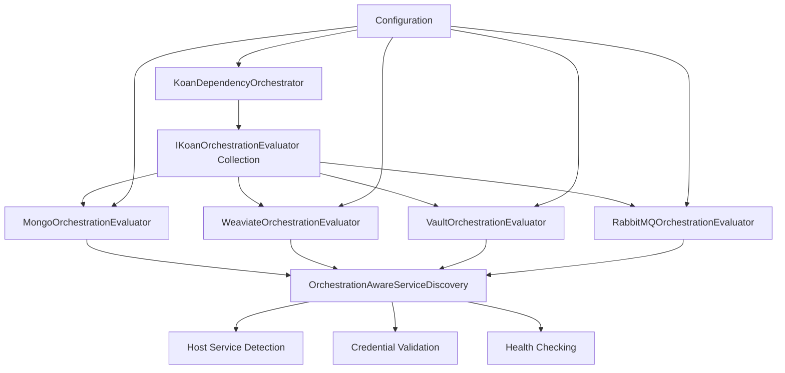

# Koan Framework: Adapter-Driven Smart Host Detection Architecture

**Version**: 1.0
**Date**: September 21, 2025
**Status**: Specification

## Table of Contents

1. [Executive Summary](#executive-summary)
2. [Problem Statement](#problem-statement)
3. [Architecture Overview](#architecture-overview)
4. [Core Interfaces](#core-interfaces)
5. [Configuration Schema](#configuration-schema)
6. [Base Implementation](#base-implementation)
7. [Adapter Implementations](#adapter-implementations)
8. [Self-Orchestration Integration](#self-orchestration-integration)
9. [Configuration Examples](#configuration-examples)
10. [Migration Strategy](#migration-strategy)
11. [Benefits and Trade-offs](#benefits-and-trade-offs)

---

## Executive Summary

This specification defines a new architecture for Koan Framework orchestration that enables intelligent host service detection with credential validation while maintaining proper separation of concerns. Each adapter becomes responsible for evaluating its own orchestration needs, eliminating hardcoded service knowledge from the central orchestration system.

**Key Features:**
- Adapter-driven orchestration decisions
- Smart host service detection with credential validation
- Configuration-driven provisioning strategies
- Proper separation of concerns
- Backward compatibility with existing configurations

---

## Problem Statement

### Current Issues

❌ **Separation of Concerns Violation**: `KoanDependencyOrchestrator` contains hardcoded knowledge of specific adapters
❌ **Missing Smart Detection**: No intelligent host service detection with credential validation
❌ **Inflexible Provisioning**: Always provisions containers regardless of existing host services
❌ **No Configuration Control**: Users cannot control provisioning behavior per service

### Requirements

✅ Each adapter must control its own orchestration decisions
✅ Support for intelligent host service detection
✅ Credential validation for discovered services
✅ Configuration-driven provisioning strategies
✅ Maintain backward compatibility

---

## Architecture Overview



**Principles:**
1. **Adapter Autonomy**: Each adapter decides its orchestration needs
2. **Configuration-Driven**: Global and per-service provisioning control
3. **Smart Detection**: Automatic host service discovery with validation
4. **Graceful Degradation**: Fallback to container provisioning on failure
5. **Parallel Processing**: All service evaluations run concurrently for performance

---

## Core Interfaces

### IKoanOrchestrationEvaluator

```csharp
namespace Koan.Core.Orchestration;

/// <summary>
/// Implemented by adapters to evaluate their orchestration needs
/// </summary>
public interface IKoanOrchestrationEvaluator
{
    /// <summary>
    /// Service name for configuration and logging (e.g., "mongodb", "vault")
    /// </summary>
    string ServiceName { get; }

    /// <summary>
    /// Evaluates whether this service requires container provisioning
    /// </summary>
    Task<OrchestrationDecision> EvaluateAsync(IConfiguration configuration, CancellationToken cancellationToken);
}
```

### OrchestrationDecision

```csharp
public class OrchestrationDecision
{
    public OrchestrationAction Action { get; set; }
    public string Reason { get; set; } = "";
    public DependencyDescriptor? ContainerDescriptor { get; set; }
    public ServiceDiscoveryResult? HostService { get; set; }
    public string? ConnectionDetails { get; set; }
}

public enum OrchestrationAction
{
    NoAction,           // Service not needed or orchestration disabled
    UseHostService,     // Use detected host service
    ProvisionContainer  // Start container for this service
}
```

### ProvisioningMode

```csharp
public enum ProvisioningMode
{
    Auto,     // Smart detection with fallback to provisioning (default)
    Always,   // Always provision containers
    Never,    // Never provision, only use existing services
    Disabled  // Skip orchestration entirely for this service
}
```

### ServiceAccessResult

```csharp
public class ServiceAccessResult
{
    public bool IsAccessible { get; set; }
    public string Reason { get; set; } = "";
    public string? ConnectionDetails { get; set; }
}
```

---

## Configuration Schema

### OrchestrationOptions

```csharp
namespace Koan.Core.Orchestration;

public class OrchestrationOptions
{
    /// <summary>
    /// Global provisioning strategy
    /// </summary>
    public ProvisioningMode Provisioning { get; set; } = ProvisioningMode.Auto;

    /// <summary>
    /// Per-service provisioning overrides
    /// </summary>
    public Dictionary<string, ProvisioningMode> Services { get; set; } = new();

    /// <summary>
    /// Maximum time to spend detecting host services
    /// </summary>
    public TimeSpan DetectionTimeout { get; set; } = TimeSpan.FromSeconds(5);

    /// <summary>
    /// Common ports to scan for each service type
    /// </summary>
    public Dictionary<string, int[]> ServicePorts { get; set; } = new();
}
```

### JSON Schema

```json
{
  "$schema": "http://json-schema.org/draft-07/schema#",
  "type": "object",
  "properties": {
    "Koan": {
      "type": "object",
      "properties": {
        "Orchestration": {
          "type": "object",
          "properties": {
            "Provisioning": {
              "type": "string",
              "enum": ["Auto", "Always", "Never", "Disabled"],
              "default": "Auto"
            },
            "Services": {
              "type": "object",
              "additionalProperties": {
                "type": "string",
                "enum": ["Auto", "Always", "Never", "Disabled"]
              }
            },
            "DetectionTimeout": {
              "type": "string",
              "format": "duration",
              "default": "00:00:05"
            }
          }
        }
      }
    }
  }
}
```

---

## Base Implementation

### BaseOrchestrationEvaluator

```csharp
namespace Koan.Core.Orchestration;

public abstract class BaseOrchestrationEvaluator : IKoanOrchestrationEvaluator
{
    protected readonly IOrchestrationAwareServiceDiscovery _serviceDiscovery;
    protected readonly ILogger _logger;

    protected BaseOrchestrationEvaluator(
        IOrchestrationAwareServiceDiscovery serviceDiscovery,
        ILogger logger)
    {
        _serviceDiscovery = serviceDiscovery;
        _logger = logger;
    }

    public abstract string ServiceName { get; }

    public async Task<OrchestrationDecision> EvaluateAsync(IConfiguration config, CancellationToken cancellationToken)
    {
        var options = config.GetSection("Koan:Orchestration").Get<OrchestrationOptions>() ?? new();
        var serviceMode = GetServiceProvisioningMode(options);

        _logger.LogDebug("Evaluating {ServiceName} with mode {Mode}", ServiceName, serviceMode);

        switch (serviceMode)
        {
            case ProvisioningMode.Disabled:
                return CreateDecision(OrchestrationAction.NoAction, "Orchestration disabled");

            case ProvisioningMode.Always:
                return CreateDecision(OrchestrationAction.ProvisionContainer,
                    "Provisioning mode set to Always", CreateContainerDescriptor(config));

            case ProvisioningMode.Never:
                return await EvaluateHostOnlyMode(config, cancellationToken);

            case ProvisioningMode.Auto:
            default:
                return await EvaluateSmartDetection(config, cancellationToken);
        }
    }

    /// <summary>
    /// Create service discovery options for this service
    /// </summary>
    protected abstract ServiceDiscoveryOptions CreateServiceDiscoveryOptions(IConfiguration config);

    /// <summary>
    /// Validate that the discovered host service is accessible with available credentials
    /// </summary>
    protected abstract Task<ServiceAccessResult> ValidateServiceAccess(
        ServiceDiscoveryResult hostService,
        IConfiguration config,
        CancellationToken cancellationToken);

    /// <summary>
    /// Create container descriptor for self-orchestration
    /// </summary>
    protected abstract DependencyDescriptor CreateContainerDescriptor(IConfiguration config);

    private async Task<OrchestrationDecision> EvaluateHostOnlyMode(IConfiguration config, CancellationToken cancellationToken)
    {
        var hostService = await TryDiscoverHostService(config, cancellationToken);
        if (hostService == null)
        {
            throw new InvalidOperationException($"No host {ServiceName} found and provisioning disabled");
        }

        var accessResult = await ValidateServiceAccess(hostService, config, cancellationToken);
        if (!accessResult.IsAccessible)
        {
            throw new InvalidOperationException($"Host {ServiceName} inaccessible: {accessResult.Reason}");
        }

        return CreateDecision(OrchestrationAction.UseHostService,
            $"Using host service: {hostService.ServiceUrl}",
            hostService: hostService,
            connectionDetails: accessResult.ConnectionDetails);
    }

    private async Task<OrchestrationDecision> EvaluateSmartDetection(IConfiguration config, CancellationToken cancellationToken)
    {
        // Phase 1: Try to discover host service
        var hostService = await TryDiscoverHostService(config, cancellationToken);
        if (hostService == null)
        {
            return CreateDecision(OrchestrationAction.ProvisionContainer,
                "No host service detected", CreateContainerDescriptor(config));
        }

        // Phase 2: Validate service accessibility
        var accessResult = await ValidateServiceAccess(hostService, config, cancellationToken);
        if (!accessResult.IsAccessible)
        {
            return CreateDecision(OrchestrationAction.ProvisionContainer,
                $"Host service inaccessible: {accessResult.Reason}", CreateContainerDescriptor(config));
        }

        // Phase 3: Use host service
        return CreateDecision(OrchestrationAction.UseHostService,
            $"Host service validated: {hostService.ServiceUrl}",
            hostService: hostService,
            connectionDetails: accessResult.ConnectionDetails);
    }

    private async Task<ServiceDiscoveryResult?> TryDiscoverHostService(IConfiguration config, CancellationToken cancellationToken)
    {
        try
        {
            var discoveryOptions = CreateServiceDiscoveryOptions(config);
            var result = await _serviceDiscovery.DiscoverServiceAsync(ServiceName, discoveryOptions, cancellationToken);
            return result;
        }
        catch (Exception ex)
        {
            _logger.LogDebug(ex, "Host service discovery failed for {ServiceName}", ServiceName);
            return null;
        }
    }

    private ProvisioningMode GetServiceProvisioningMode(OrchestrationOptions options)
    {
        return options.Services.TryGetValue(ServiceName, out var serviceMode)
            ? serviceMode
            : options.Provisioning;
    }

    private OrchestrationDecision CreateDecision(
        OrchestrationAction action,
        string reason,
        DependencyDescriptor? container = null,
        ServiceDiscoveryResult? hostService = null,
        string? connectionDetails = null)
    {
        return new OrchestrationDecision
        {
            Action = action,
            Reason = reason,
            ContainerDescriptor = container,
            HostService = hostService,
            ConnectionDetails = connectionDetails
        };
    }
}
```

---

## Adapter Implementations

### MongoDB Adapter

```csharp
namespace Koan.Data.Connector.Mongo.Orchestration;

public class MongoOrchestrationEvaluator : BaseOrchestrationEvaluator
{
    public override string ServiceName => "mongodb";

    public MongoOrchestrationEvaluator(
        IOrchestrationAwareServiceDiscovery serviceDiscovery,
        ILogger<MongoOrchestrationEvaluator> logger) : base(serviceDiscovery, logger) { }

    protected override ServiceDiscoveryOptions CreateServiceDiscoveryOptions(IConfiguration config)
    {
        return ServiceDiscoveryExtensions.ForMongoDB(
            GetDatabaseName(config),
            GetUsername(config),
            GetPassword(config));
    }

    protected override async Task<ServiceAccessResult> ValidateServiceAccess(
        ServiceDiscoveryResult hostService,
        IConfiguration config,
        CancellationToken cancellationToken)
    {
        var database = GetDatabaseName(config);
        var credentialSets = GetCredentialSets(config);

        foreach (var credentials in credentialSets)
        {
            try
            {
                var connectionString = BuildMongoConnectionString(
                    hostService.ServiceUrl,
                    credentials.Username,
                    credentials.Password,
                    database);

                using var client = new MongoClient(connectionString);

                // MongoDB-specific validation
                using var cts = CancellationTokenSource.CreateLinkedTokenSource(cancellationToken);
                cts.CancelAfter(TimeSpan.FromSeconds(3));

                await client.GetDatabase(database).RunCommandAsync(
                    new BsonDocument("ping", 1),
                    cancellationToken: cts.Token);

                return new ServiceAccessResult
                {
                    IsAccessible = true,
                    ConnectionDetails = connectionString
                };
            }
            catch (Exception ex)
            {
                _logger.LogDebug("MongoDB credential validation failed: {Error}", ex.Message);
                continue;
            }
        }

        return new ServiceAccessResult
        {
            IsAccessible = false,
            Reason = "No valid credentials found for host MongoDB"
        };
    }

    protected override DependencyDescriptor CreateContainerDescriptor(IConfiguration config)
    {
        var database = GetDatabaseName(config);
        var username = GetUsername(config) ?? "root";
        var password = GetPassword(config) ?? "mongodb";

        return new DependencyDescriptor
        {
            Name = "mongodb",
            Image = "mongo:8.0",
            Port = 27017,
            StartupPriority = 150,
            HealthTimeout = TimeSpan.FromSeconds(30),
            HealthCheckCommand = "mongosh --eval \"db.runCommand('ping').ok\" --quiet",
            Environment = new Dictionary<string, string>
            {
                ["MONGO_INITDB_ROOT_USERNAME"] = username,
                ["MONGO_INITDB_ROOT_PASSWORD"] = password,
                ["MONGO_INITDB_DATABASE"] = database
            },
            Volumes = new List<string> { $"koan-mongodb-{{sessionId}}:/data/db" }
        };
    }

    private string GetDatabaseName(IConfiguration config)
    {
        return Configuration.ReadFirst(config, "KoanDatabase",
            "Koan:Data:Mongo:Database",
            "Koan:Data:Database");
    }

    private string? GetUsername(IConfiguration config)
    {
        return Configuration.ReadFirst(config, "",
            "Koan:Data:Mongo:Username",
            "Koan:Data:Username");
    }

    private string? GetPassword(IConfiguration config)
    {
        return Configuration.ReadFirst(config, "",
            "Koan:Data:Mongo:Password",
            "Koan:Data:Password");
    }

    private CredentialSet[] GetCredentialSets(IConfiguration config)
    {
        var credentials = new List<CredentialSet>();

        // User-specified credentials first
        var username = GetUsername(config);
        var password = GetPassword(config);
        if (!string.IsNullOrWhiteSpace(username))
        {
            credentials.Add(new CredentialSet(username, password));
        }

        // MongoDB adapter defaults (MongoDB can run without auth)
        credentials.AddRange(new[]
        {
            new CredentialSet(null, null),           // No auth (dev environments)
            new CredentialSet("admin", "admin"),     // Common default
            new CredentialSet("root", "mongodb"),    // Docker compose default
            new CredentialSet("mongo", "mongo")      // Alternative default
        });

        return credentials.ToArray();
    }

    private static string BuildMongoConnectionString(string host, string? username, string? password, string database)
    {
        var uri = new Uri(host);
        var auth = !string.IsNullOrWhiteSpace(username) ? $"{username}:{password}@" : "";
        return $"mongodb://{auth}{uri.Host}:{uri.Port}/{database}";
    }
}

public record CredentialSet(string? Username, string? Password);
```

### Weaviate Adapter (No Authentication)

```csharp
namespace Koan.Data.Vector.Connector.Weaviate.Orchestration;

public class WeaviateOrchestrationEvaluator : BaseOrchestrationEvaluator
{
    public override string ServiceName => "weaviate";

    public WeaviateOrchestrationEvaluator(
        IOrchestrationAwareServiceDiscovery serviceDiscovery,
        ILogger<WeaviateOrchestrationEvaluator> logger) : base(serviceDiscovery, logger) { }

    protected override ServiceDiscoveryOptions CreateServiceDiscoveryOptions(IConfiguration config)
    {
        return ServiceDiscoveryExtensions.ForWeaviate();
    }

    protected override async Task<ServiceAccessResult> ValidateServiceAccess(
        ServiceDiscoveryResult hostService,
        IConfiguration config,
        CancellationToken cancellationToken)
    {
        try
        {
            using var client = new HttpClient();
            using var cts = CancellationTokenSource.CreateLinkedTokenSource(cancellationToken);
            cts.CancelAfter(TimeSpan.FromSeconds(3));

            // Try multiple Weaviate health endpoints
            var healthEndpoints = new[]
            {
                "/.well-known/ready",
                "/v1/.well-known/ready",
                "/v1/schema"
            };

            foreach (var endpoint in healthEndpoints)
            {
                try
                {
                    var response = await client.GetAsync($"{hostService.ServiceUrl}{endpoint}", cts.Token);
                    if (response.IsSuccessStatusCode)
                    {
                        return new ServiceAccessResult
                        {
                            IsAccessible = true,
                            ConnectionDetails = hostService.ServiceUrl
                        };
                    }
                }
                catch { continue; }
            }
        }
        catch { }

        return new ServiceAccessResult
        {
            IsAccessible = false,
            Reason = "Weaviate health checks failed"
        };
    }

    protected override DependencyDescriptor CreateContainerDescriptor(IConfiguration config)
    {
        return new DependencyDescriptor
        {
            Name = "weaviate",
            Image = "semitechnologies/weaviate:latest",
            Port = 8080,
            StartupPriority = 300,
            HealthTimeout = TimeSpan.FromSeconds(45),
            Environment = new Dictionary<string, string>
            {
                ["QUERY_DEFAULTS_LIMIT"] = "25",
                ["AUTHENTICATION_ANONYMOUS_ACCESS_ENABLED"] = "true",
                ["PERSISTENCE_DATA_PATH"] = "/var/lib/weaviate"
            },
            Volumes = new List<string> { $"koan-weaviate-{{sessionId}}:/var/lib/weaviate" }
        };
    }
}
```

### Vault Adapter (Token Authentication)

```csharp
namespace Koan.Secrets.Connector.Vault.Orchestration;

public class VaultOrchestrationEvaluator : BaseOrchestrationEvaluator
{
    public override string ServiceName => "vault";

    public VaultOrchestrationEvaluator(
        IOrchestrationAwareServiceDiscovery serviceDiscovery,
        ILogger<VaultOrchestrationEvaluator> logger) : base(serviceDiscovery, logger) { }

    protected override ServiceDiscoveryOptions CreateServiceDiscoveryOptions(IConfiguration config)
    {
        return ServiceDiscoveryExtensions.ForVault();
    }

    protected override async Task<ServiceAccessResult> ValidateServiceAccess(
        ServiceDiscoveryResult hostService,
        IConfiguration config,
        CancellationToken cancellationToken)
    {
        var tokens = GetTokens(config);

        foreach (var token in tokens)
        {
            try
            {
                using var client = new HttpClient();
                client.DefaultRequestHeaders.Add("X-Vault-Token", token);

                using var cts = CancellationTokenSource.CreateLinkedTokenSource(cancellationToken);
                cts.CancelAfter(TimeSpan.FromSeconds(3));

                var response = await client.GetAsync($"{hostService.ServiceUrl}/v1/sys/health", cts.Token);
                if (response.IsSuccessStatusCode)
                {
                    return new ServiceAccessResult
                    {
                        IsAccessible = true,
                        ConnectionDetails = $"{hostService.ServiceUrl}|{token}"
                    };
                }
            }
            catch { continue; }
        }

        return new ServiceAccessResult
        {
            IsAccessible = false,
            Reason = "No valid Vault token found"
        };
    }

    protected override DependencyDescriptor CreateContainerDescriptor(IConfiguration config)
    {
        return new DependencyDescriptor
        {
            Name = "vault",
            Image = "hashicorp/vault:latest",
            Port = 8200,
            StartupPriority = 400,
            HealthTimeout = TimeSpan.FromSeconds(30),
            Environment = new Dictionary<string, string>
            {
                ["VAULT_DEV_ROOT_TOKEN_ID"] = "root-token",
                ["VAULT_DEV_LISTEN_ADDRESS"] = "0.0.0.0:8200",
                ["VAULT_API_ADDR"] = "http://127.0.0.1:8200"
            },
            Volumes = new List<string> { $"koan-vault-{{sessionId}}:/vault/data" }
        };
    }

    private string[] GetTokens(IConfiguration config)
    {
        var tokens = new List<string>();

        // User-configured token first
        var userToken = Configuration.ReadFirst(config, "",
            "Koan:Secrets:Vault:Token",
            "VAULT_TOKEN");
        if (!string.IsNullOrWhiteSpace(userToken))
        {
            tokens.Add(userToken);
        }

        // Vault dev defaults
        tokens.AddRange(new[]
        {
            "root-token",    // Standard dev token
            "dev-token",     // Alternative dev token
            "vault-token"    // Generic dev token
        });

        return tokens.ToArray();
    }
}
```

---

## Self-Orchestration Integration

### Updated KoanDependencyOrchestrator

```csharp
namespace Koan.Orchestration.Aspire.SelfOrchestration;

public class KoanDependencyOrchestrator : IKoanDependencyOrchestrator
{
    private readonly IEnumerable<IKoanOrchestrationEvaluator> _evaluators;
    private readonly IKoanContainerManager _containerManager;
    private readonly ILogger<KoanDependencyOrchestrator> _logger;
    private readonly IConfiguration _configuration;

    public KoanDependencyOrchestrator(
        IEnumerable<IKoanOrchestrationEvaluator> evaluators,
        IKoanContainerManager containerManager,
        ILogger<KoanDependencyOrchestrator> logger,
        IConfiguration configuration)
    {
        _evaluators = evaluators;
        _containerManager = containerManager;
        _logger = logger;
        _configuration = configuration;
    }

    public async Task StartDependenciesAsync(CancellationToken cancellationToken = default)
    {
        _logger.LogInformation("Self-orchestration evaluating services for session {SessionId}", KoanEnv.SessionId);

        // Always evaluate services in parallel for performance
        var decisions = await EvaluateServicesInParallelAsync(cancellationToken);

        var containersToStart = decisions
            .Where(d => d.Action == OrchestrationAction.ProvisionContainer)
            .ToList();

        if (containersToStart.Count == 0)
        {
            _logger.LogInformation("No containers to provision - using existing host services");
            return;
        }

        _logger.LogInformation("Self-orchestration starting {Count} containers: {Services}",
            containersToStart.Count,
            string.Join(", ", containersToStart.Select(d => d.ContainerDescriptor!.Name)));

        // Start containers in priority order
        foreach (var decision in containersToStart.OrderBy(d => d.ContainerDescriptor!.StartupPriority))
        {
            await StartContainer(decision.ContainerDescriptor!, cancellationToken);
        }
    }

    private async Task<List<OrchestrationDecision>> EvaluateServicesInParallelAsync(CancellationToken cancellationToken)
    {
        var tasks = _evaluators.Select(async evaluator =>
        {
            try
            {
                var decision = await evaluator.EvaluateAsync(_configuration, cancellationToken);
                LogDecision(evaluator.ServiceName, decision);
                return decision;
            }
            catch (Exception ex)
            {
                _logger.LogError(ex, "Failed to evaluate {ServiceName}", evaluator.ServiceName);
                return new OrchestrationDecision
                {
                    Action = OrchestrationAction.NoAction,
                    Reason = $"Evaluation failed: {ex.Message}"
                };
            }
        });

        return (await Task.WhenAll(tasks)).ToList();
    }

    private void LogDecision(string serviceName, OrchestrationDecision decision)
    {
        switch (decision.Action)
        {
            case OrchestrationAction.UseHostService:
                _logger.LogInformation("[{ServiceName}] Using host service: {Reason}", serviceName, decision.Reason);
                break;
            case OrchestrationAction.ProvisionContainer:
                _logger.LogInformation("[{ServiceName}] Will provision container: {Reason}", serviceName, decision.Reason);
                break;
            case OrchestrationAction.NoAction:
                _logger.LogDebug("[{ServiceName}] No action needed: {Reason}", serviceName, decision.Reason);
                break;
        }
    }

    private async Task StartContainer(DependencyDescriptor dependency, CancellationToken cancellationToken)
    {
        try
        {
            var containerName = await _containerManager.StartContainerAsync(dependency, KoanEnv.SessionId, cancellationToken);
            var isHealthy = await _containerManager.WaitForContainerHealthyAsync(containerName, dependency, cancellationToken);

            if (!isHealthy)
            {
                _logger.LogWarning("{DependencyName} did not become healthy within timeout", dependency.Name);
            }
            else
            {
                _logger.LogInformation("{DependencyName} is healthy and ready", dependency.Name);
            }
        }
        catch (Exception ex)
        {
            _logger.LogError(ex, "Failed to start dependency {DependencyName}", dependency.Name);
            throw new InvalidOperationException($"Failed to start required dependency {dependency.Name}: {ex.Message}", ex);
        }
    }
}
```

### Registration in Auto-Registrars

Each adapter must register its orchestration evaluator in its `KoanAutoRegistrar.Initialize()` method:

```csharp
// In MongoAutoRegistrar.Initialize()
services.TryAddEnumerable(ServiceDescriptor.Singleton<IKoanOrchestrationEvaluator, MongoOrchestrationEvaluator>());

// In WeaviateAutoRegistrar.Initialize()
services.TryAddEnumerable(ServiceDescriptor.Singleton<IKoanOrchestrationEvaluator, WeaviateOrchestrationEvaluator>());

// In VaultAutoRegistrar.Initialize()
services.TryAddEnumerable(ServiceDescriptor.Singleton<IKoanOrchestrationEvaluator, VaultOrchestrationEvaluator>());

// In RabbitMQAutoRegistrar.Initialize()
services.TryAddEnumerable(ServiceDescriptor.Singleton<IKoanOrchestrationEvaluator, RabbitMQOrchestrationEvaluator>());
```

---

## Configuration Examples

### Development Environment (Auto Detection)

```json
{
  "Koan": {
    "Orchestration": {
      "Provisioning": "Auto",
      "DetectionTimeout": "00:00:05"
    },
    "Data": {
      "Mongo": {
        "Database": "MyAppDatabase",
        "Username": "devuser",
        "Password": "devpass"
      }
    }
  }
}
```

### Production Environment (Explicit Services)

```json
{
  "Koan": {
    "Orchestration": {
      "Provisioning": "Never"
    },
    "Data": {
      "Mongo": {
        "Database": "ProductionDB",
        "Username": "produser",
        "Password": "$(MONGO_PASSWORD)"
      }
    },
    "Secrets": {
      "Vault": {
        "Token": "$(VAULT_TOKEN)"
      }
    }
  }
}
```

### Mixed Development Environment

```json
{
  "Koan": {
    "Orchestration": {
      "Provisioning": "Always",
      "Services": {
        "mongodb": "Auto",
        "vault": "Never"
      }
    }
  }
}
```

### CI/CD Environment

```json
{
  "Koan": {
    "Orchestration": {
      "Provisioning": "Always",
      "DetectionTimeout": "00:00:02"
    }
  }
}
```

---

## Migration Strategy

### Phase 1: Core Infrastructure
1. Create `IKoanOrchestrationEvaluator` interface in `Koan.Core`
2. Implement `BaseOrchestrationEvaluator` abstract class
3. Add `OrchestrationOptions` configuration support
4. Update `OrchestrationAwareServiceDiscovery` if needed

### Phase 2: Adapter Implementation
1. Create orchestration evaluators for each adapter:
   - `MongoOrchestrationEvaluator`
   - `WeaviateOrchestrationEvaluator`
   - `VaultOrchestrationEvaluator`
   - `RabbitMQOrchestrationEvaluator`
2. Register evaluators in respective auto-registrars
3. Test individual adapter functionality

### Phase 3: Self-Orchestration Integration
1. Update `KoanDependencyOrchestrator` to use evaluators
2. Remove hardcoded service knowledge
3. Implement parallel evaluation for all services
4. Implement decision logging

### Phase 4: Testing and Validation
1. Test all configuration scenarios
2. Validate credential detection works correctly
3. Test container provisioning fallback
4. Performance testing for startup time impact

### Phase 5: Documentation and Rollout
1. Update framework documentation
2. Create migration guide for existing projects
3. Add configuration examples
4. Release as major version update

---

## Benefits and Trade-offs

### Benefits

✅ **Proper Separation of Concerns**: Each adapter controls its orchestration decisions
✅ **Configuration-Driven**: Flexible provisioning strategies per deployment environment
✅ **Smart Host Detection**: Automatic detection of existing services with credential validation
✅ **Performance Optimized**: Parallel evaluation for all services by default
✅ **Backward Compatible**: Existing configurations continue working
✅ **Extensible**: New adapters simply implement the interface
✅ **Production Ready**: Fine-grained control for enterprise deployments

### Trade-offs

⚠️ **Startup Latency**: Host detection adds 2-5 seconds to startup time
⚠️ **Complexity**: More failure modes and configuration options
⚠️ **Network Dependencies**: Requires network access during startup
⚠️ **Security Considerations**: Credential validation in logs must be handled carefully

### Mitigation Strategies

1. **Timeout Controls**: Aggressive timeouts (3-5 seconds) prevent excessive delays
2. **Parallel Evaluation**: All services evaluated concurrently for maximum performance
3. **Graceful Degradation**: Always falls back to container provisioning
4. **Feature Flags**: Can be disabled entirely via configuration
5. **Secure Logging**: Credentials masked in log output

---

## Conclusion

This architecture provides a robust foundation for intelligent orchestration while maintaining proper separation of concerns. Each adapter becomes responsible for its own orchestration decisions, enabling sophisticated host service detection without violating architectural principles.

The configuration-driven approach provides the flexibility needed for different deployment environments while maintaining backward compatibility with existing Koan Framework applications. Parallel evaluation ensures minimal performance impact during startup while maximizing the benefits of smart detection.

---

## Implementation Checklist

### Core Framework Changes

- [ ] Create `IKoanOrchestrationEvaluator` interface
- [ ] Implement `BaseOrchestrationEvaluator` abstract class
- [ ] Add `OrchestrationOptions` configuration support
- [ ] Update `KoanDependencyOrchestrator` to use evaluators
- [ ] Remove hardcoded service knowledge from orchestrator

### Adapter Updates

- [ ] Create `MongoOrchestrationEvaluator`
- [ ] Create `WeaviateOrchestrationEvaluator`
- [ ] Create `VaultOrchestrationEvaluator`
- [ ] Create `RabbitMQOrchestrationEvaluator`
- [ ] Register evaluators in auto-registrars
- [ ] Test credential validation for each service

### Documentation and Testing

- [ ] Add configuration schema documentation
- [ ] Create migration guide
- [ ] Add performance benchmarks
- [ ] Test across all orchestration modes
- [ ] Validate security considerations

### Release Preparation

- [ ] Update version numbers
- [ ] Prepare release notes
- [ ] Update samples and examples
- [ ] Review breaking changes
- [ ] Plan rollout strategy
