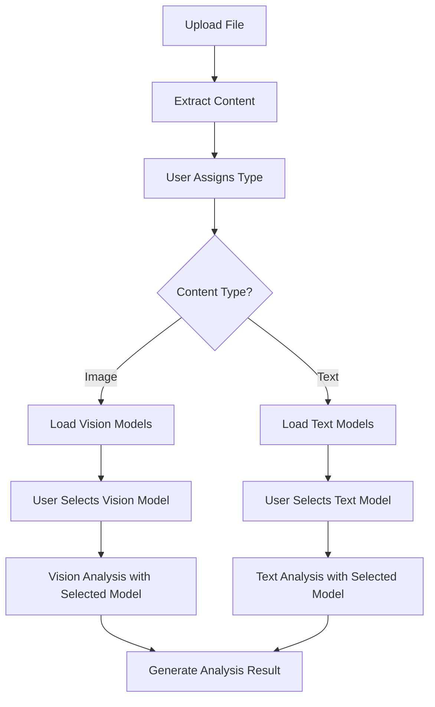

#### **Background Processing Flow Commands**
```csharp
public sealed record TypeAssignedCommand : FlowCommand
{
    public Guid FileId { get; init; }
    public Guid TypeId { get; init; }
    public Guid UserId { get; init; } // Who assigned the type
}

public sealed class FileProcessingEvent : FlowEntity<FileProcessingEvent>
{
    public Guid FileId { get; set; }
    public ProcessingStage Stage { get; set; }
    public FileState State { get; set; }
    public object? EventData { get; set; }
    public string? ErrorMessage { get; set; }
    public TimeSpan? Duration { get; set; }
    public Guid? UserId { get; set; } // User who triggered the processing
}

public enum ProcessingStage
{
    TypeAssigned,        // User assigned document type
    AnalysisStarted,     // AI analysis begun
    AnalysisCompleted,   // Analysis successfully generated
    AnalysisFailed       // Analysis failed with error
}
```

#### **File Analysis Orchestrator (User-Triggered)**
```csharp
public class FileAnalysisOrchestrator : FlowCommandHandler<TypeAssignedCommand>
{
    private readonly FileAnalysisService _analysisService;
    private readonly ILogger<FileAnalysisOrchestrator> _logger;

    public FileAnalysisOrchestrator(
        FileAnalysisService analysisService,
        ILogger<FileAnalysisOrchestrator> logger)
    {
        _analysisService = analysisService;
        _logger = logger;
    }

    public override async Task HandleAsync(TypeAssignedCommand command, CancellationToken ct)
    {
        var file = await File.Get(command.FileId, ct);
        var type = await Type.Get(command.TypeId, ct);

        _logger.LogInformation("Starting analysis for file {FileId} with type {TypeName}",
            command.FileId, type.Name);

        await RecordEvent(command.FileId, ProcessingStage.TypeAssigned, FileState.TypeAssigned, command.UserId);

        try
        {
            // Update file state
            file.State = FileState.Analyzing;
            await file.Save(ct);

            await RecordEvent(command.FileId, ProcessingStage.AnalysisStarted, FileState.Analyzing, command.UserId);

            // Check if analysis already exists (idempotency)
            var existingAnalysis = await Analysis
                .Where(a => a.FileId == command.FileId && a.TypeId == command.TypeId)
                .FirstOrDefault();

            if (existingAnalysis != null)
            {
                _logger.LogInformation("Analysis already exists for file {FileId}", command.FileId);
                file.State = FileState.Analyzed;
                await file.Save(ct);
                await RecordEvent(command.FileId, ProcessingStage.AnalysisCompleted, FileState.Analyzed, command.UserId);
                return;
            }

            // Generate AI analysis
            var analysis = await _analysisService.GenerateAnalysisAsync(file, type, ct);
            await analysis.Save(ct);

            // Mark file as analyzed
            file.State = FileState.Analyzed;
            await file.Save(ct);

            await RecordEvent(command.FileId, ProcessingStage.AnalysisCompleted, FileState.Analyzed, command.UserId);

            _logger.LogInformation("Analysis completed for file {FileId} with confidence {Confidence}",
                command.FileId, analysis.ConfidenceScore);
        }
        catch (Exception ex)
        {
            _logger.LogError(ex, "Analysis failed for file {FileId}", command.FileId);

            file.State = FileState.AnalysisFailed;
            file.ProcessingError = ex.Message;
            await file.Save(ct);

            await RecordEvent(command.FileId, ProcessingStage.AnalysisFailed, FileState.AnalysisFailed, command.UserId,
                              new { Error = ex.Message, StackTrace = ex.StackTrace });

            throw; // Let Flow handle retry logic
        }
    }

    private async Task RecordEvent(Guid fileId, ProcessingStage stage, FileState state, Guid? userId, object? data = null)
    {
        var evt = new FileProcessingEvent
        {
            FileId = fileId,
            Stage = stage,
            State = state,
            EventData = data,
            UserId = userId
        };
        await evt.Save();
    }
}
```

### **4. Auto-Generated APIs with Enriched EntityControllers**

Following Koan Framework's "auto-generated via EntityController<T>" principle, all APIs provide full CRUD operations plus custom business logic enrichments.

#### **File API Controller (Individual Document Processing)**
```csharp
[Route("api/files")]
public class FilesController : EntityController<File>
{
    private readonly IObjectStorageClient _storage;
    private readonly FileAnalysisService _analysisService;

    public FilesController(
        IObjectStorageClient storage,
        FileAnalysisService analysisService)
    {
        _storage = storage;
        _analysisService = analysisService;
    }

    // Auto-generated endpoints from EntityController<File>:
    // GET /api/files - with pagination, filtering, sorting
    // GET /api/files/{id} - single file with analysis results
    // POST /api/files - create new file entity
    // PUT /api/files/{id} - update file metadata
    // DELETE /api/files/{id} - remove file

    // Custom enrichments for S13.DocMind workflow:

    [HttpPost("upload")]
    public async Task<ActionResult<File>> Upload([FromForm] IFormFile uploadedFile)
    {
        // Upload and extract content immediately
        await using var stream = uploadedFile.OpenReadStream();
        await using var hashingStream = new HashingReadStream(stream, SHA512.Create());

        var uploadResult = await _storage.UploadAsync(new ObjectUploadRequest
        {
            Bucket = "files",
            ObjectName = $"{Guid.NewGuid():N}/{uploadedFile.FileName}",
            ContentType = uploadedFile.ContentType,
            Content = hashingStream
        });

        var sha512 = hashingStream.ComputeHashHex();

        // Check for duplicates
        var existing = await File.Query(f => f.Sha512Hash == sha512).FirstOrDefault();
        if (existing != null)
        {
            return Ok(existing);
        }

        // Extract content immediately (no type assignment needed for extraction)
        var extractedText = await _analysisService.ExtractContentAsync(
            uploadResult.ObjectName, uploadedFile.ContentType);

        var file = new File
        {
            FileName = uploadResult.ObjectName,
            ContentType = uploadedFile.ContentType,
            FileSize = uploadedFile.Length,
            Sha512Hash = sha512,
            StorageBucket = uploadResult.Bucket,
            StorageKey = uploadResult.ObjectName,
            ExtractedText = extractedText,
            ExtractionMethod = DetermineExtractionMethod(uploadedFile.ContentType),
            ExtractedAt = DateTime.UtcNow,
            State = FileState.Uploaded // Ready for type assignment
        };

        await file.Save();
        return CreatedAtAction(nameof(GetById), new { id = file.Id }, file);
    }

    // Analyze individual file (GDoc pattern: per-file analysis first)
    [HttpPost("{id}/analyze")]
    public async Task<ActionResult<File>> AnalyzeFile(Guid id, [FromBody] AnalyzeFileRequest request)
    {
        var file = await File.Get(id);
        if (file == null) return NotFound();

        if (string.IsNullOrEmpty(file.ExtractedText))
        {
            return BadRequest("File must have extracted text before analysis");
        }

        // Validate type exists
        var type = await Type.Get(request.TypeId);
        if (type == null) return BadRequest("Invalid type ID");

        // Set type if not already set
        if (file.TypeId != request.TypeId)
        {
            file.TypeId = request.TypeId;
            file.TypeAssignedAt = DateTime.UtcNow;
        }

        // Perform AI analysis and store results directly on file
        file.State = FileState.Analyzing;
        await file.Save();

        try
        {
            // Generate analysis using FileAnalysisService
            var analysisResult = await _analysisService.AnalyzeFileAsync(file, type);

            // Store results directly on file entity (embedded pattern)
            file.AnalysisResult = analysisResult.Content;
            file.FilledTemplate = analysisResult.FilledTemplate;
            file.ConfidenceScore = analysisResult.ConfidenceScore;
            file.AnalyzedAt = DateTime.UtcNow;
            file.ModelUsed = analysisResult.ModelUsed;
            file.InputTokens = analysisResult.InputTokens;
            file.OutputTokens = analysisResult.OutputTokens;
            file.ProcessingDuration = analysisResult.ProcessingDuration;
            file.State = FileState.Analyzed;

            await file.Save();
            return Ok(file);
        }
        catch (Exception ex)
        {
            file.State = FileState.AnalysisFailed;
            file.ProcessingError = ex.Message;
            await file.Save();
            return StatusCode(500, new { error = ex.Message });
        }
    }

    // Get file with embedded analysis results
    [HttpGet("{id}/with-analysis")]
    public async Task<ActionResult<File>> GetFileWithAnalysis(Guid id)
    {
        var file = await File.Get(id);
        return file != null ? Ok(file) : NotFound();
    }

    [HttpGet("{id}/status")]
    public async Task<ActionResult> GetProcessingStatus(Guid id)
    {
        var file = await File.Get(id);
        if (file == null) return NotFound();

        return Ok(new
        {
            file.Id,
            file.State,
            file.TypeId,
            file.TypeAssignedAt,
            file.ProcessingError,
            HasAnalysis = await Analysis.Where(a => a.FileId == id).Any()
        });
    }

    [HttpGet("{id}/processing-history")]
    public async Task<ActionResult<List<FileProcessingEvent>>> GetProcessingHistory(Guid id)
    {
        var events = await FileProcessingEvent
            .Where(e => e.FileId == id)
            .OrderBy(e => e.Timestamp)
            .All();
        return Ok(events);
    }

    // ENHANCED ENDPOINTS (GDoc Feature Parity)

    // Rich structured analysis with enhanced extraction
    [HttpPost("{id}/analyze-structured")]
    public async Task<ActionResult<File>> AnalyzeFileStructured(Guid id, [FromBody] AnalyzeStructuredRequest request)
    {
        var file = await File.Get(id);
        if (file == null) return NotFound();

        var type = await Type.Get(request.TypeId);
        if (type == null) return BadRequest("Invalid type ID");

        // Set type and perform rich structured analysis
        file.TypeId = request.TypeId;
        file.TypeAssignedAt = DateTime.UtcNow;
        file.State = FileState.Analyzing;

        var enhancedAnalysisService = HttpContext.RequestServices.GetRequiredService<EnhancedFileAnalysisService>();
        var extractedInfo = await enhancedAnalysisService.AnalyzeFileStructuredAsync(file, type);

        // Store rich analysis results
        file.ExtractedInformation = extractedInfo;
        file.ConfidenceScore = extractedInfo.ConfidenceScore;
        file.AnalyzedAt = extractedInfo.ExtractedAt;
        file.ModelUsed = extractedInfo.ModelUsed;
        file.IsExtractionComplete = true;
        file.State = FileState.Analyzed;

        await file.Save();

        return Ok(file);
    }

    // Auto-suggest document types based on content
    [HttpPost("{id}/suggest-types")]
    public async Task<ActionResult<List<TypeMatchResult>>> SuggestDocumentTypes(Guid id)
    {
        var file = await File.Get(id);
        if (file == null) return NotFound();

        if (string.IsNullOrWhiteSpace(file.ExtractedText))
            return BadRequest("File must have extracted text for type suggestions");

        var enhancedAnalysisService = HttpContext.RequestServices.GetRequiredService<EnhancedFileAnalysisService>();
        var suggestions = await enhancedAnalysisService.SuggestDocumentTypesAsync(file);

        return Ok(suggestions);
    }

    // Apply auto-suggested type with confidence
    [HttpPost("{id}/apply-suggested-type")]
    public async Task<ActionResult<File>> ApplySuggestedType(Guid id, [FromBody] ApplySuggestedTypeRequest request)
    {
        var file = await File.Get(id);
        if (file == null) return NotFound();

        var type = await Type.Get(request.TypeId);
        if (type == null) return BadRequest("Invalid type ID");

        file.TypeId = request.TypeId;
        file.TypeAssignedAt = DateTime.UtcNow;
        file.DocumentTypeMatchConfidence = request.Confidence;
        file.IsAutoClassified = true;

        await file.Save();

        return Ok(file);
    }

    // Analyze image for visual content understanding
    [HttpPost("{id}/analyze-image")]
    public async Task<ActionResult<DocumentImage>> AnalyzeImage(Guid id)
    {
        var file = await File.Get(id);
        if (file == null) return NotFound();

        if (!file.ContentType.StartsWith("image/"))
            return BadRequest("File must be an image for visual analysis");

        var imageService = HttpContext.RequestServices.GetRequiredService<ImageUnderstandingService>();
        var image = await imageService.AnalyzeImageAsync(file);

        return CreatedAtAction(nameof(GetImage), new { id = file.Id }, image);
    }

    // Get image analysis results
    [HttpGet("{id}/image")]
    public async Task<ActionResult<DocumentImage>> GetImage(Guid id)
    {
        var file = await File.Get(id);
        if (file == null) return NotFound();

        var image = await file.GetImage();
        return image != null ? Ok(image) : NotFound();
    }

    // Chunk large document for processing
    [HttpPost("{id}/chunk")]
    public async Task<ActionResult<List<DocumentChunk>>> ChunkDocument(Guid id)
    {
        var file = await File.Get(id);
        if (file == null) return NotFound();

        if (string.IsNullOrWhiteSpace(file.ExtractedText))
            return BadRequest("File must have extracted text for chunking");

        var chunkingService = HttpContext.RequestServices.GetRequiredService<DocumentChunkingService>();
        var chunks = await chunkingService.ChunkDocumentAsync(file);

        return Ok(chunks);
    }

    // Analyze document chunks
    [HttpPost("{id}/analyze-chunks")]
    public async Task<ActionResult<List<DocumentChunk>>> AnalyzeChunks(Guid id, [FromBody] AnalyzeChunksRequest request)
    {
        var file = await File.Get(id);
        if (file == null) return NotFound();

        var type = await Type.Get(request.TypeId);
        if (type == null) return BadRequest("Invalid type ID");

        var chunkingService = HttpContext.RequestServices.GetRequiredService<DocumentChunkingService>();
        var chunks = await chunkingService.AnalyzeChunksAsync(file, type);

        return Ok(chunks);
    }

    // Get document chunks
    [HttpGet("{id}/chunks")]
    public async Task<ActionResult<List<DocumentChunk>>> GetDocumentChunks(Guid id)
    {
        var file = await File.Get(id);
        if (file == null) return NotFound();

        var chunks = await file.GetChunks();
        return Ok(chunks);
    }

    // Update file metadata and UX features
    [HttpPatch("{id}/metadata")]
    public async Task<ActionResult<File>> UpdateFileMetadata(Guid id, [FromBody] UpdateFileMetadataRequest request)
    {
        var file = await File.Get(id);
        if (file == null) return NotFound();

        if (!string.IsNullOrWhiteSpace(request.UserFileName))
            file.UserFileName = request.UserFileName;

        if (!string.IsNullOrWhiteSpace(request.Notes))
            file.Notes = request.Notes;

        await file.Save();
        return Ok(file);
    }

    // Enhanced file search with rich filtering
    [HttpGet("search")]
    public async Task<ActionResult<PagedResult<File>>> SearchFiles(
        [FromQuery] string? query = null,
        [FromQuery] Guid? typeId = null,
        [FromQuery] bool? isAnalyzed = null,
        [FromQuery] double? minConfidence = null,
        [FromQuery] string? contentType = null,
        [FromQuery] int page = 1,
        [FromQuery] int pageSize = 20)
    {
        var files = File.Query();

        if (!string.IsNullOrWhiteSpace(query))
        {
            files = files.Where(f =>
                f.FileName.Contains(query) ||
                f.UserFileName!.Contains(query) ||
                f.Notes.Contains(query) ||
                f.ExtractedText.Contains(query));
        }

        if (typeId.HasValue)
            files = files.Where(f => f.TypeId == typeId.Value);

        if (isAnalyzed.HasValue)
            files = files.Where(f => f.IsExtractionComplete == isAnalyzed.Value);

        if (minConfidence.HasValue)
            files = files.Where(f => f.ConfidenceScore >= minConfidence.Value);

        if (!string.IsNullOrWhiteSpace(contentType))
            files = files.Where(f => f.ContentType == contentType);

        var totalCount = await files.Count();
        var pagedFiles = await files
            .Skip((page - 1) * pageSize)
            .Take(pageSize)
            .OrderByDescending(f => f.CreatedAt)
            .All();

        return Ok(new PagedResult<File>
        {
            Items = pagedFiles,
            TotalCount = totalCount,
            Page = page,
            PageSize = pageSize,
            TotalPages = (int)Math.Ceiling((double)totalCount / pageSize)
        });
    }

    private ExtractionMethod DetermineExtractionMethod(string contentType)
    {
        return contentType switch
        {
            "text/plain" => ExtractionMethod.None,
            "application/pdf" => ExtractionMethod.PdfParser,
            "image/jpeg" or "image/png" => ExtractionMethod.OcrEngine,
            "application/vnd.openxmlformats-officedocument.wordprocessingml.document" => ExtractionMethod.DocxParser,
            _ => ExtractionMethod.Custom
        };
    }
}

// ENHANCED REQUEST CLASSES (GDoc Feature Parity)

public class AnalyzeStructuredRequest
{
    public Guid TypeId { get; set; }
}

public class ApplySuggestedTypeRequest
{
    public Guid TypeId { get; set; }
    public double Confidence { get; set; }
}

public class AnalyzeChunksRequest
{
    public Guid TypeId { get; set; }
}

public class UpdateFileMetadataRequest
{
    public string? UserFileName { get; set; }
    public string? Notes { get; set; }
}

public class PagedResult<T>
{
    public List<T> Items { get; set; } = new();
    public int TotalCount { get; set; }
    public int Page { get; set; }
    public int PageSize { get; set; }
    public int TotalPages { get; set; }
}

public class AssignTypeRequest
{
    public Guid TypeId { get; set; }
    public Guid UserId { get; set; }
}
```

#### **Type API Controller**
```csharp
[Route("api/types")]
public class TypeController : EntityController<Type>
{
    private readonly FileAnalysisService _analysisService;

    public TypeController(FileAnalysisService analysisService)
    {
        _analysisService = analysisService;
    }

    // Auto-generated CRUD endpoints + custom business logic

    [HttpPost("generate")]
    public async Task<ActionResult<Type>> GenerateType([FromBody] TypeGenerationRequest request)
    {
        var type = await _analysisService.GenerateTypeAsync(request.Prompt, CancellationToken.None);
        return CreatedAtAction(nameof(GetById), new { id = type.Id }, type);
    }

    [HttpGet("{id}/files")]
    public async Task<ActionResult<List<File>>> GetFiles(Guid id)
    {
        var type = await Type.Get(id);
        if (type == null) return NotFound();

        var files = await type.GetFiles(); // Automatic relationship
        return Ok(files);
    }

    [HttpGet("{id}/analyses")]
    public async Task<ActionResult<List<Analysis>>> GetAnalyses(Guid id)
    {
        // Get multi-document analysis requests using this type as template
        var analyses = await Analysis.Query(a => a.TypeId == id);
        return Ok(analyses);
    }

    // ENHANCED TYPE FEATURES (GDoc Feature Parity)

    // Update type embedding for semantic matching
    [HttpPost("{id}/update-embedding")]
    public async Task<ActionResult<Type>> UpdateTypeEmbedding(Guid id)
    {
        var type = await Type.Get(id);
        if (type == null) return NotFound();

        // Generate embedding from type context (name + description + examples)
        var embeddingContent = $"{type.Name}\n{type.Description}\n{type.ExtractionPrompt}\n{type.Examples}";
        var embedding = await AI.Embed(embeddingContent).ExecuteAsync();

        type.TypeEmbedding = embedding;
        await type.Save();

        return Ok(type);
    }

    // Test type matching against sample content
    [HttpPost("{id}/test-matching")]
    public async Task<ActionResult<TypeMatchResult>> TestTypeMatching(Guid id, [FromBody] TestMatchingRequest request)
    {
        var type = await Type.Get(id);
        if (type == null) return NotFound();

        var matchingService = HttpContext.RequestServices.GetRequiredService<DocumentTypeMatchingService>();

        // Create temporary file for testing
        var testFile = new File { ExtractedText = request.SampleContent };
        var matches = await matchingService.SuggestTypesAsync(testFile, maxSuggestions: 1);

        var match = matches.FirstOrDefault(m => m.Type.Id == id);
        return match != null ? Ok(match) : Ok(new TypeMatchResult
        {
            Type = type,
            Confidence = 0.0,
            Reasoning = "No match found"
        });
    }

    // Get type usage analytics
    [HttpGet("{id}/analytics")]
    public async Task<ActionResult<TypeAnalytics>> GetTypeAnalytics(Guid id)
    {
        var type = await Type.Get(id);
        if (type == null) return NotFound();

        var files = await type.GetFiles();
        var analyses = await Analysis.Query(a => a.TypeId == id).All();

        var analytics = new TypeAnalytics
        {
            TypeId = id,
            TotalFiles = files.Count,
            TotalAnalyses = analyses.Count,
            AverageConfidence = files.Where(f => f.ConfidenceScore.HasValue)
                                    .Select(f => f.ConfidenceScore!.Value)
                                    .DefaultIfEmpty(0)
                                    .Average(),
            RecentUsage = files.Where(f => f.TypeAssignedAt.HasValue)
                              .GroupBy(f => f.TypeAssignedAt!.Value.Date)
                              .OrderByDescending(g => g.Key)
                              .Take(30)
                              .ToDictionary(g => g.Key, g => g.Count()),
            TopContentTypes = files.GroupBy(f => f.ContentType)
                                  .OrderByDescending(g => g.Count())
                                  .Take(5)
                                  .ToDictionary(g => g.Key, g => g.Count())
        };

        return Ok(analytics);
    }

    // Bulk enable/disable auto-matching
    [HttpPatch("auto-matching")]
    public async Task<ActionResult> UpdateAutoMatching([FromBody] UpdateAutoMatchingRequest request)
    {
        var types = await Type.Query(t => request.TypeIds.Contains(t.Id)).All();

        foreach (var type in types)
        {
            type.EnableAutoMatching = request.Enabled;
            await type.Save();
        }

        return Ok(new { UpdatedCount = types.Count });
    }
}

public class TypeGenerationRequest
{
    public string Prompt { get; set; } = "";
}

public class TestMatchingRequest
{
    public string SampleContent { get; set; } = "";
}

public class UpdateAutoMatchingRequest
{
    public List<Guid> TypeIds { get; set; } = new();
    public bool Enabled { get; set; }
}

public class TypeAnalytics
{
    public Guid TypeId { get; set; }
    public int TotalFiles { get; set; }
    public int TotalAnalyses { get; set; }
    public double AverageConfidence { get; set; }
    public Dictionary<DateTime, int> RecentUsage { get; set; } = new();
    public Dictionary<string, int> TopContentTypes { get; set; } = new();
}
```

#### **Document Image API Controller**
```csharp
[Route("api/images")]
public class DocumentImageController : EntityController<DocumentImage>
{
    private readonly ImageUnderstandingService _imageService;

    public DocumentImageController(ImageUnderstandingService imageService)
    {
        _imageService = imageService;
    }

    // Auto-generated CRUD endpoints from EntityController<DocumentImage>

    // Get image as structured graph
    [HttpGet("{id}/graph")]
    public async Task<ActionResult<DiagramGraph>> GetImageGraph(Guid id)
    {
        var image = await DocumentImage.Get(id);
        if (image == null) return NotFound();

        var graph = image.GetStructuredGraph();
        return graph != null ? Ok(graph) : NotFound("No structured graph available");
    }

    // Get image as markdown summary
    [HttpGet("{id}/markdown")]
    public async Task<ActionResult<string>> GetImageMarkdown(Guid id)
    {
        var image = await DocumentImage.Get(id);
        if (image == null) return NotFound();

        var markdown = image.ToMarkdown();
        return Ok(markdown);
    }

    // Get images by file
    [HttpGet("by-file/{fileId}")]
    public async Task<ActionResult<DocumentImage>> GetByFileId(Guid fileId)
    {
        var image = await DocumentImage.Query(d => d.FileId == fileId).FirstOrDefault();
        return image != null ? Ok(image) : NotFound();
    }

    // Search images by content
    [HttpGet("search")]
    public async Task<ActionResult<List<DocumentImage>>> SearchImages(
        [FromQuery] string? query = null,
        [FromQuery] string? securityMechanism = null,
        [FromQuery] string? risk = null,
        [FromQuery] int limit = 20)
    {
        var images = DocumentImage.Query();

        if (!string.IsNullOrWhiteSpace(query))
        {
            images = images.Where(d =>
                d.Summary.Contains(query) ||
                d.FlowSteps.Any(step => step.Contains(query)));
        }

        if (!string.IsNullOrWhiteSpace(securityMechanism))
        {
            images = images.Where(d =>
                d.SecurityMechanisms.Any(mech => mech.Contains(securityMechanism)));
        }

        if (!string.IsNullOrWhiteSpace(risk))
        {
            images = images.Where(d =>
                d.Risks.Any(r => r.Contains(risk)));
        }

        var results = await images
            .OrderByDescending(d => d.AnalyzedAt)
            .Take(limit)
            .All();

        return Ok(results);
    }
}
```

#### **Document Chunk API Controller**
```csharp
[Route("api/chunks")]
public class DocumentChunkController : EntityController<DocumentChunk>
{
    private readonly DocumentChunkingService _chunkingService;

    public DocumentChunkController(DocumentChunkingService chunkingService)
    {
        _chunkingService = chunkingService;
    }

    // Auto-generated CRUD endpoints from EntityController<DocumentChunk>

    // Get chunks by file
    [HttpGet("by-file/{fileId}")]
    public async Task<ActionResult<List<DocumentChunk>>> GetByFileId(Guid fileId)
    {
        var chunks = await DocumentChunk
            .Query(c => c.FileId == fileId)
            .OrderBy(c => c.ChunkIndex)
            .All();
        return Ok(chunks);
    }

    // Get chunk analysis summary
    [HttpGet("{id}/analysis")]
    public async Task<ActionResult<ExtractedDocumentInformation>> GetChunkAnalysis(Guid id)
    {
        var chunk = await DocumentChunk.Get(id);
        if (chunk?.ExtractedInformation == null) return NotFound();

        return Ok(chunk.ExtractedInformation);
    }

    // Search across chunk content
    [HttpGet("search")]
    public async Task<ActionResult<List<DocumentChunk>>> SearchChunks(
        [FromQuery] string query,
        [FromQuery] Guid? fileId = null,
        [FromQuery] double? minConfidence = null,
        [FromQuery] int limit = 50)
    {
        var chunks = DocumentChunk.Query();

        if (!string.IsNullOrWhiteSpace(query))
        {
            chunks = chunks.Where(c =>
                c.Content.Contains(query) ||
                c.ChunkAnalysis!.Contains(query));
        }

        if (fileId.HasValue)
            chunks = chunks.Where(c => c.FileId == fileId.Value);

        if (minConfidence.HasValue)
            chunks = chunks.Where(c => c.ConfidenceScore >= minConfidence.Value);

        var results = await chunks
            .OrderByDescending(c => c.AnalyzedAt)
            .Take(limit)
            .All();

        return Ok(results);
    }

    // Aggregate chunk analyses for file
    [HttpGet("by-file/{fileId}/aggregate")]
    public async Task<ActionResult<AggregatedChunkAnalysis>> GetAggregatedAnalysis(Guid fileId)
    {
        var chunks = await DocumentChunk
            .Query(c => c.FileId == fileId && c.ExtractedInformation != null)
            .All();

        if (!chunks.Any()) return NotFound("No analyzed chunks found");

        var aggregated = new AggregatedChunkAnalysis
        {
            FileId = fileId,
            TotalChunks = chunks.Count,
            AverageConfidence = chunks.Average(c => c.ConfidenceScore ?? 0.0),
            AllEntities = chunks.SelectMany(c => c.ExtractedInformation!.Entities.Values.SelectMany(v => v)).Distinct().ToList(),
            AllTopics = chunks.SelectMany(c => c.ExtractedInformation!.Topics).Distinct().ToList(),
            AllKeyFacts = chunks.SelectMany(c => c.ExtractedInformation!.KeyFacts).ToList(),
            CombinedSummary = string.Join("\n\n", chunks.Select(c => c.ExtractedInformation!.Summary))
        };

        return Ok(aggregated);
    }
}

public class AggregatedChunkAnalysis
{
    public Guid FileId { get; set; }
    public int TotalChunks { get; set; }
    public double AverageConfidence { get; set; }
    public List<string> AllEntities { get; set; } = new();
    public List<string> AllTopics { get; set; } = new();
    public List<KeyFact> AllKeyFacts { get; set; } = new();
    public string CombinedSummary { get; set; } = "";
}
```

#### **Model Management API Controller (Matching Original gdoc)**
```csharp
[Route("api/models")]
public class ModelManagementController : ControllerBase
{
    private readonly ModelManagementService _modelService;
    private readonly ILogger<ModelManagementController> _logger;

    public ModelManagementController(ModelManagementService modelService, ILogger<ModelManagementController> logger)
    {
        _modelService = modelService;
        _logger = logger;
    }

    // Model Discovery & Installation (from original gdoc ConfigurationController)

    [HttpGet("available")]
    public async Task<ActionResult<List<AvailableModel>>> GetAvailableModels()
    {
        var models = await _modelService.GetAvailableModelsAsync();
        return Ok(models.OrderBy(m => m.Name));
    }

    [HttpGet("installed")]
    public async Task<ActionResult<List<AvailableModel>>> GetInstalledModels()
    {
        var models = await _modelService.GetAvailableModelsAsync();
        return Ok(models.Where(m => m.IsInstalled).OrderBy(m => m.Name));
    }

    [HttpGet("search")]
    public async Task<ActionResult<List<AvailableModel>>> SearchModels(
        [FromQuery] string? name = null,
        [FromQuery] bool onlyInstalled = false,
        [FromQuery] bool onlyVision = false,
        [FromQuery] string? provider = null)
    {
        var models = await _modelService.GetAvailableModelsAsync();

        if (!string.IsNullOrEmpty(name))
            models = models.Where(m => m.Name.Contains(name, StringComparison.OrdinalIgnoreCase)).ToList();

        if (onlyInstalled)
            models = models.Where(m => m.IsInstalled).ToList();

        if (onlyVision)
            models = models.Where(m => m.IsVisionCapable).ToList();

        if (!string.IsNullOrEmpty(provider))
            models = models.Where(m => m.Provider.Equals(provider, StringComparison.OrdinalIgnoreCase)).ToList();

        return Ok(models.OrderBy(m => m.Name));
    }

    [HttpPost("{modelName}/install")]
    public async Task<ActionResult> InstallModel(string modelName, [FromQuery] string provider = "ollama")
    {
        try
        {
            var success = await _modelService.InstallModelAsync(modelName, provider);
            if (success)
            {
                return Ok(new { message = $"Model '{modelName}' installation started successfully" });
            }
            return BadRequest($"Failed to install model '{modelName}'");
        }
        catch (Exception ex)
        {
            _logger.LogError(ex, "Error installing model: {ModelName}", modelName);
            return StatusCode(500, $"Error installing model '{modelName}': {ex.Message}");
        }
    }

    // Current Model Configuration

    [HttpGet("config")]
    public async Task<ActionResult<ModelConfiguration>> GetConfiguration()
    {
        var config = await _modelService.GetCurrentConfigurationAsync();
        return Ok(config);
    }

    [HttpPut("text-model")]
    public async Task<ActionResult> SetCurrentTextModel([FromBody] SetModelRequest request)
    {
        var success = await _modelService.SetCurrentTextModelAsync(request.ModelName, request.Provider);
        if (success)
        {
            return Ok(new { message = $"Text model set to '{request.ModelName}'" });
        }
        return BadRequest($"Failed to set text model to '{request.ModelName}'");
    }

    [HttpPut("vision-model")]
    public async Task<ActionResult> SetCurrentVisionModel([FromBody] SetModelRequest request)
    {
        var success = await _modelService.SetCurrentVisionModelAsync(request.ModelName, request.Provider);
        if (success)
        {
            return Ok(new { message = $"Vision model set to '{request.ModelName}'" });
        }
        return BadRequest($"Failed to set vision model to '{request.ModelName}'");
    }

    // Analysis with Model Selection

    [HttpPost("analyze")]
    public async Task<ActionResult<Analysis>> AnalyzeWithModel([FromBody] AnalyzeWithModelRequest request)
    {
        var file = await File.Get(request.FileId);
        if (file == null) return NotFound("File not found");

        var type = await Type.Get(request.TypeId);
        if (type == null) return NotFound("Type not found");

        try
        {
            var analysis = await _modelService.AnalyzeWithSelectedModel(file, type, request.ModelOverride);
            await analysis.Save();

            // Update file state
            file.State = FileState.Analyzed;
            await file.Save();

            return Ok(analysis);
        }
        catch (Exception ex)
        {
            _logger.LogError(ex, "Analysis failed for file {FileId} with model {Model}", request.FileId, request.ModelOverride);
            return StatusCode(500, $"Analysis failed: {ex.Message}");
        }
    }
}

public class SetModelRequest
{
    public string ModelName { get; set; } = "";
    public string? Provider { get; set; }
}

public class AnalyzeWithModelRequest
{
    public Guid FileId { get; set; }
    public Guid TypeId { get; set; }
    public string? ModelOverride { get; set; }
}
```

#### **Analysis API Controller**
```csharp
[Route("api/analysis")]
public class AnalysisController : EntityController<Analysis>
{
    private readonly RequestAnalysisService _requestAnalysisService;

    public AnalysisController(RequestAnalysisService requestAnalysisService)
    {
        _requestAnalysisService = requestAnalysisService;
    }

    // Auto-generated CRUD endpoints from EntityController<Analysis>:
    // GET /api/analysis - list all analysis requests
    // GET /api/analysis/{id} - get specific analysis request
    // POST /api/analysis - create new analysis request
    // PUT /api/analysis/{id} - update analysis request
    // DELETE /api/analysis/{id} - remove analysis request

    // Custom enrichments for multi-document analysis workflow:

    [HttpPost("{id}/analyze")]
    public async Task<ActionResult<Analysis>> AnalyzeRequest(Guid id)
    {
        var analysis = await Analysis.Get(id);
        if (analysis == null) return NotFound();

        if (analysis.State != AnalysisState.ReadyToAnalyze && analysis.State != AnalysisState.Created)
        {
            return BadRequest($"Analysis must be ready to analyze. Current state: {analysis.State}");
        }

        // Perform multi-document analysis using individual file results
        var result = await _requestAnalysisService.AnalyzeRequestAsync(analysis);
        return Ok(result);
    }

    [HttpGet("{id}/status")]
    public async Task<ActionResult> GetAnalysisStatus(Guid id)
    {
        var analysis = await Analysis.Get(id);
        if (analysis == null) return NotFound();

        var files = await analysis.GetFiles();
        var analyzedFiles = files.Count(f => f.State == FileState.Analyzed);

        return Ok(new
        {
            analysis.Id,
            analysis.Name,
            analysis.State,
            FilesTotal = files.Count,
            FilesAnalyzed = analyzedFiles,
            ReadyToAnalyze = analyzedFiles == files.Count && files.Count > 0,
            analysis.AnalyzedAt,
            analysis.ConfidenceScore
        });
    }

    [HttpGet("by-type/{typeId}")]
    public async Task<ActionResult<List<Analysis>>> GetByType(Guid typeId)
    {
        var analyses = await Analysis.Query(a => a.TypeId == typeId);
        return Ok(analyses);
    }

    [HttpGet("completed")]
    public async Task<ActionResult<List<Analysis>>> GetCompleted()
    {
        var analyses = await Analysis.Query(a => a.State == AnalysisState.Completed);
        return Ok(analyses);
    }
}

// Request models for API operations
public class AnalyzeFileRequest
{
    public Guid TypeId { get; set; }
}
```

### **5. AI Model Management & Image Processing (From Original gdoc)**

The S13.DocMind sample incorporates the sophisticated model management capabilities from the original gdoc solution, enabling users to discover, install, and select AI models for both text and image analysis.

#### **Key Features Replicated from Original gdoc**

1. **Separate Text and Vision Model Selection**
   - Independent model configuration for text processing and image analysis
   - Vision model validation ensures only vision-capable models are used for images
   - Automatic model selection based on content type

2. **Dynamic Model Discovery**
   - Browse available models from multiple providers (Ollama, OpenAI, etc.)
   - Filter by installed status, vision capabilities, and provider
   - Model search with name/description filtering

3. **Model Installation Management**
   - Install models directly from the UI (similar to `ollama pull`)
   - Remove unused models to manage storage
   - Installation progress tracking

4. **Multi-Provider Support**
   - Multiple Ollama instances support
   - Cross-provider model comparison
   - Provider health monitoring

#### **User Workflow: Model Selection & File Processing**



#### **Frontend Integration Examples**

```typescript
// Model selection dropdown population
const loadAvailableModels = async (type: 'text' | 'vision') => {
    const response = await fetch(`/api/models/search?onlyInstalled=true&onlyVision=${type === 'vision'}`);
    const models = await response.json();
    return models.map(m => ({ value: m.name, label: `${m.name} (${m.size})` }));
};

// File processing with model selection
const processFileWithModel = async (fileId: string, typeId: string, selectedModel?: string) => {
    const response = await fetch('/api/models/analyze', {
        method: 'POST',
        headers: { 'Content-Type': 'application/json' },
        body: JSON.stringify({
            fileId,
            typeId,
            modelOverride: selectedModel
        })
    });
    return response.json();
};

// Model installation
const installModel = async (modelName: string, provider: string = 'ollama') => {
    const response = await fetch(`/api/models/${modelName}/install?provider=${provider}`, {
        method: 'POST'
    });
    return response.json();
};
```

#### **Image Processing Capabilities (Matching Original)**

The original gdoc solution uses Ollama's vision models for image analysis. S13.DocMind replicates this with Koan's AI abstraction:

**Original gdoc Image Processing:**
```csharp
// From LlmDiagramGraphExtractor.cs
var resp = await _llm.AnalyzeImageAsync(preprocessed.Base64Image, system, user, ct);
```

**S13.DocMind Equivalent:**
```csharp
var response = await AI.VisionPrompt(prompt, base64Image)
    .WithModel(selectedVisionModel)
    .WithMaxTokens(2000)
    .ExecuteAsync();
```

#### **Vision Model Detection (From Original gdoc)**

The original gdoc uses "vision indicators" to detect which models support image analysis:

```csharp
// Original vision capability detection patterns
public List<string> GetDefaultVisionIndicators() => new()
{
    "vision", "llava", "llava-phi3", "minicpm-v", "moondream", "bakllava"
};
```

S13.DocMind integrates this through Koan's capability detection:
```csharp
var models = await AI.Models.GetAvailable("ollama");
var visionModels = models.Where(m => m.HasCapability("vision")).ToList();
```

### **5. Enhanced User Interface & Workflow Design**

#### **Complete Document Intelligence Workflow**

S13.DocMind provides a comprehensive user experience covering the entire document intelligence pipeline with both manual and AI-agent orchestrated paths.

**Core Processing Pipeline:**
```
Upload → Content Extraction → Auto-Classification → Type Assignment →
Structured Analysis → Image Analysis → Chunking (if needed) → Results & Export
```

#### **Document Upload & Management Interface**

```html
<!-- Enhanced File Upload with Metadata -->
<div class="document-upload-zone">
  <div class="upload-area" (drop)="onFilesDrop($event)" (dragover)="onDragOver($event)">
    <div class="upload-content">
      <i class="upload-icon"></i>
      <h3>Upload Documents for Intelligence Analysis</h3>
      <p>Drag & drop files or click to browse</p>
      <p class="supported-formats">Supports: PDF, DOCX, TXT, Images (PNG, JPG, GIF)</p>
    </div>
    <input type="file" multiple accept=".pdf,.docx,.txt,.png,.jpg,.gif" (change)="onFilesSelected($event)">
  </div>

  <!-- Upload Options -->
  <div class="upload-options" *ngIf="pendingFiles.length > 0">
    <div class="processing-preferences">
      <h4>Processing Preferences</h4>

      <div class="option-group">
        <label>
          <input type="checkbox" [(ngModel)]="autoClassify" checked>
          Auto-classify document types using AI
        </label>
        <span class="option-help">Uses semantic similarity to suggest document types</span>
      </div>

      <div class="option-group">
        <label>
          <input type="checkbox" [(ngModel)]="analyzeImages" checked>
          Analyze visual content (diagrams, charts, photos)
        </label>
        <span class="option-help">Extract insights from images and diagrams</span>
      </div>

      <div class="option-group">
        <label>
          <input type="checkbox" [(ngModel)]="enableChunking">
          Enable document chunking for large files
        </label>
        <span class="option-help">Process large documents in manageable sections</span>
      </div>

      <div class="option-group">
        <label>Confidence Threshold:</label>
        <input type="range" min="0.5" max="0.95" step="0.05" [(ngModel)]="confidenceThreshold" value="0.8">
        <span class="threshold-value">{{confidenceThreshold | number:'1.2-2'}}</span>
      </div>
    </div>

    <button class="upload-btn primary" (click)="startProcessing()">
      Start Document Intelligence Processing
    </button>
  </div>
</div>
```

#### **Processing Status & Progress Tracking**

```html
<!-- Real-time Processing Dashboard -->
<div class="processing-dashboard" *ngIf="processingFiles.length > 0">
  <h3>Document Processing Status</h3>

  <div class="file-processing-list">
    <div *ngFor="let file of processingFiles" class="file-processing-card">
      <div class="file-header">
        <i class="file-icon" [class]="getFileTypeIcon(file.contentType)"></i>
        <div class="file-info">
          <h4>{{file.userFileName || file.originalName}}</h4>
          <span class="file-size">{{file.size | fileSize}}</span>
        </div>
        <div class="processing-status" [class]="file.status">
          {{getStatusLabel(file.status)}}
        </div>
      </div>

      <!-- Processing Progress -->
      <div class="processing-progress">
        <div class="progress-bar">
          <div class="progress-fill" [style.width.%]="getProgressPercentage(file.status)"></div>
        </div>
        <div class="progress-steps">
          <div class="step" [class.completed]="isStepCompleted(file, 'upload')">Upload</div>
          <div class="step" [class.completed]="isStepCompleted(file, 'extract')">Extract</div>
          <div class="step" [class.completed]="isStepCompleted(file, 'classify')">Classify</div>
          <div class="step" [class.completed]="isStepCompleted(file, 'analyze')">Analyze</div>
          <div class="step" [class.completed]="isStepCompleted(file, 'complete')">Complete</div>
        </div>
      </div>

      <!-- Auto-Classification Results -->
      <div class="classification-suggestions" *ngIf="file.suggestedTypes?.length > 0">
        <h5>AI-Suggested Document Types:</h5>
        <div class="type-suggestions">
          <div *ngFor="let suggestion of file.suggestedTypes"
               class="type-suggestion"
               [class.selected]="suggestion.isSelected"
               (click)="selectDocumentType(file, suggestion)">
            <span class="type-name">{{suggestion.typeName}}</span>
            <span class="confidence">{{suggestion.confidence | percent:'1.0-2'}}</span>
            <span class="reasoning" *ngIf="suggestion.reasoning">{{suggestion.reasoning}}</span>
          </div>
        </div>
      </div>

      <!-- Error Display -->
      <div class="processing-error" *ngIf="file.status === 'failed'">
        <i class="error-icon"></i>
        <span class="error-message">{{file.errorMessage}}</span>
        <button class="retry-btn" (click)="retryProcessing(file)">Retry Processing</button>
      </div>
    </div>
  </div>
</div>
```

#### **Document Analysis Results Interface**

```html
<!-- Comprehensive Analysis Results -->
<div class="document-analysis-results" *ngIf="selectedFile && selectedFile.status === 'completed'">
  <div class="results-header">
    <h3>Analysis Results: {{selectedFile.userFileName}}</h3>
    <div class="result-actions">
      <button class="btn secondary" (click)="exportResults(selectedFile)">Export Results</button>
      <button class="btn secondary" (click)="shareResults(selectedFile)">Share Analysis</button>
      <button class="btn primary" (click)="startMultiDocAnalysis(selectedFile)">Add to Multi-Doc Analysis</button>
    </div>
  </div>

  <!-- Analysis Summary Cards -->
  <div class="analysis-summary">
    <div class="summary-card">
      <h4>Document Overview</h4>
      <div class="overview-stats">
        <div class="stat">
          <label>Document Type:</label>
          <span class="type-badge">{{selectedFile.documentType?.name}}</span>
          <span class="confidence">({{selectedFile.typeConfidence | percent:'1.0-2'}} confidence)</span>
        </div>
        <div class="stat">
          <label>Processing Time:</label>
          <span>{{selectedFile.processingDuration}}ms</span>
        </div>
        <div class="stat" *ngIf="selectedFile.extractedInformation?.pageCount">
          <label>Pages:</label>
          <span>{{selectedFile.extractedInformation.pageCount}}</span>
        </div>
        <div class="stat" *ngIf="selectedFile.isChunked">
          <label>Chunks:</label>
          <span>{{selectedFile.chunkCount}} sections</span>
        </div>
      </div>
    </div>

    <!-- Extracted Entities -->
    <div class="summary-card" *ngIf="selectedFile.extractedInformation?.entities?.length > 0">
      <h4>Key Entities ({{selectedFile.extractedInformation.entities.length}})</h4>
      <div class="entity-list">
        <div *ngFor="let entity of selectedFile.extractedInformation.entities"
             class="entity-item"
             [class]="entity.entityType.toLowerCase()">
          <span class="entity-name">{{entity.text}}</span>
          <span class="entity-type">{{entity.entityType}}</span>
          <span class="entity-confidence">{{entity.confidence | percent:'1.0-2'}}</span>
        </div>
      </div>
    </div>

    <!-- Topics & Key Facts -->
    <div class="summary-card" *ngIf="selectedFile.extractedInformation?.topics?.length > 0">
      <h4>Main Topics</h4>
      <div class="topic-list">
        <div *ngFor="let topic of selectedFile.extractedInformation.topics" class="topic-item">
          <span class="topic-name">{{topic.name}}</span>
          <span class="topic-relevance">{{topic.relevance | percent:'1.0-2'}}</span>
        </div>
      </div>
    </div>

    <!-- Key Facts -->
    <div class="summary-card" *ngIf="selectedFile.extractedInformation?.keyFacts?.length > 0">
      <h4>Key Facts & Insights</h4>
      <div class="facts-list">
        <div *ngFor="let fact of selectedFile.extractedInformation.keyFacts"
             class="fact-item"
             [class.high-confidence]="fact.confidence > 0.8">
          <div class="fact-content">{{fact.text}}</div>
          <div class="fact-meta">
            <span class="fact-type">{{fact.factType}}</span>
            <span class="fact-confidence">{{fact.confidence | percent:'1.0-2'}}</span>
          </div>
        </div>
      </div>
    </div>
  </div>

  <!-- Image Analysis Results -->
  <div class="image-analysis-section" *ngIf="selectedFile.documentImages?.length > 0">
    <h4>Visual Content Analysis</h4>
    <div class="image-analysis-grid">
      <div *ngFor="let image of selectedFile.documentImages" class="image-analysis-card">
        <div class="image-preview">
          
        </div>
        <div class="image-analysis-content">
          <h5>{{image.imageType}} Analysis</h5>
          <p class="image-description">{{image.description}}</p>

          <!-- Diagram-specific analysis -->
          <div class="diagram-analysis" *ngIf="image.imageType === 'diagram'">
            <div class="flow-steps" *ngIf="image.flowSteps?.length > 0">
              <h6>Process Flow:</h6>
              <ol>
                <li *ngFor="let step of image.flowSteps">{{step}}</li>
              </ol>
            </div>

            <div class="security-mechanisms" *ngIf="image.securityMechanisms?.length > 0">
              <h6>Security Mechanisms:</h6>
              <div class="mechanism-tags">
                <span *ngFor="let mechanism of image.securityMechanisms" class="mechanism-tag">
                  {{mechanism}}
                </span>
              </div>
            </div>

            <div class="risks-identified" *ngIf="image.risks?.length > 0">
              <h6>Identified Risks:</h6>
              <ul class="risk-list">
                <li *ngFor="let risk of image.risks" class="risk-item">{{risk}}</li>
              </ul>
            </div>
          </div>
        </div>
      </div>
    </div>
  </div>

  <!-- Document Content Viewer -->
  <div class="content-viewer-section">
    <div class="viewer-tabs">
      <button class="tab" [class.active]="activeTab === 'structured'" (click)="activeTab = 'structured'">
        Structured Analysis
      </button>
      <button class="tab" [class.active]="activeTab === 'raw'" (click)="activeTab = 'raw'">
        Raw Content
      </button>
      <button class="tab" [class.active]="activeTab === 'chunks'" (click)="activeTab = 'chunks'"
              *ngIf="selectedFile.isChunked">
        Document Chunks ({{selectedFile.chunkCount}})
      </button>
    </div>

    <div class="tab-content">
      <!-- Structured Analysis View -->
      <div class="structured-content" *ngIf="activeTab === 'structured'">
        <pre class="analysis-json">{{selectedFile.extractedInformation | json}}</pre>
      </div>

      <!-- Raw Content View -->
      <div class="raw-content" *ngIf="activeTab === 'raw'">
        <div class="content-header">
          <span class="content-stats">
            {{selectedFile.extractedText?.length | number}} characters
          </span>
        </div>
        <div class="content-text">{{selectedFile.extractedText}}</div>
      </div>

      <!-- Chunks View -->
      <div class="chunks-content" *ngIf="activeTab === 'chunks' && selectedFile.isChunked">
        <div class="chunk-list">
          <div *ngFor="let chunk of selectedFile.documentChunks; let i = index"
               class="chunk-item"
               [class.expanded]="chunk.isExpanded">
            <div class="chunk-header" (click)="toggleChunk(chunk)">
              <span class="chunk-number">Chunk {{i + 1}}</span>
              <span class="chunk-size">{{chunk.content.length}} chars</span>
              <span class="chunk-confidence" *ngIf="chunk.analysisConfidence">
                {{chunk.analysisConfidence | percent:'1.0-2'}} confidence
              </span>
            </div>
            <div class="chunk-content" *ngIf="chunk.isExpanded">
              <div class="chunk-text">{{chunk.content}}</div>
              <div class="chunk-analysis" *ngIf="chunk.chunkAnalysis">
                <h6>Chunk Analysis:</h6>
                <div class="chunk-analysis-content">{{chunk.chunkAnalysis}}</div>
              </div>
            </div>
          </div>
        </div>
      </div>
    </div>
  </div>
</div>
```

#### **AI Agent Orchestration Interface**

```html
<!-- MCP Agent Integration Panel -->
<div class="mcp-agent-panel" *ngIf="mcpEnabled">
  <div class="agent-header">
    <h3>AI Agent Orchestration</h3>
    <div class="agent-status">
      <span class="status-indicator" [class]="mcpStatus"></span>
      <span class="status-text">{{getMcpStatusText()}}</span>
    </div>
  </div>

  <!-- Available MCP Tools -->
  <div class="mcp-tools-section">
    <h4>Available Document Intelligence Tools</h4>
    <div class="tools-grid">
      <div class="tool-card" *ngFor="let tool of availableMcpTools">
        <div class="tool-info">
          <h5>{{tool.name}}</h5>
          <p>{{tool.description}}</p>
        </div>
        <button class="tool-execute-btn" (click)="executeMcpTool(tool)">
          Execute Tool
        </button>
      </div>
    </div>
  </div>

  <!-- Agent Workflow Templates -->
  <div class="workflow-templates">
    <h4>Pre-built Agent Workflows</h4>
    <div class="template-list">
      <div class="template-item" (click)="executeWorkflow('full-analysis')">
        <h5>Complete Document Analysis</h5>
        <p>Upload → Extract → Classify → Analyze → Results</p>
        <span class="template-steps">5 steps</span>
      </div>
      <div class="template-item" (click)="executeWorkflow('batch-processing')">
        <h5>Batch Document Processing</h5>
        <p>Process multiple documents with consistent settings</p>
        <span class="template-steps">Multi-document</span>
      </div>
      <div class="template-item" (click)="executeWorkflow('visual-analysis')">
        <h5>Visual Content Focus</h5>
        <p>Specialized workflow for image-heavy documents</p>
        <span class="template-steps">Image-focused</span>
      </div>
    </div>
  </div>

  <!-- Agent Activity Log -->
  <div class="agent-activity-log">
    <h4>Agent Activity</h4>
    <div class="activity-list">
      <div *ngFor="let activity of agentActivities" class="activity-item">
        <div class="activity-timestamp">{{activity.timestamp | date:'short'}}</div>
        <div class="activity-description">{{activity.description}}</div>
        <div class="activity-status" [class]="activity.status">{{activity.status}}</div>
      </div>
    </div>
  </div>
</div>
```

#### **Model Configuration & Performance Interface**

```html
<!-- Advanced Model Configuration -->
<div class="model-configuration">
  <h4>AI Model Configuration</h4>

  <!-- Text Analysis Models -->
  <div class="model-selector">
    <label>Text Analysis Model:</label>
    <select [(ngModel)]="selectedTextModel" (change)="updateTextModel()">
      <option *ngFor="let model of textModels" [value]="model.name">
        {{model.name}} ({{model.size}}) - {{model.provider}}
      </option>
    </select>
    <button (click)="browseModels('text')">Browse More Models</button>
  </div>

  <!-- Vision Models -->
  <div class="model-selector">
    <label>Image Analysis Model:</label>
    <select [(ngModel)]="selectedVisionModel" (change)="updateVisionModel()">
      <option *ngFor="let model of visionModels" [value]="model.name">
        {{model.name}} ({{model.size}}) - Vision Capable
      </option>
    </select>
    <button (click)="browseModels('vision')">Browse Vision Models</button>
  </div>

  <!-- Performance Monitoring -->
  <div class="performance-metrics">
    <h5>Processing Performance</h5>
    <div class="metrics-grid">
      <div class="metric">
        <label>Avg Processing Time:</label>
        <span>{{performanceMetrics.avgProcessingTime}}ms</span>
      </div>
      <div class="metric">
        <label>Success Rate:</label>
        <span>{{performanceMetrics.successRate | percent:'1.0-2'}}</span>
      </div>
      <div class="metric">
        <label>Model Usage:</label>
        <span>{{performanceMetrics.modelUsage}} requests/hour</span>
      </div>
    </div>
  </div>
</div>
```

#### **Performance Considerations**

Following the original gdoc's approach:
- **Model caching**: Installed models are cached for quick selection
- **Lazy loading**: Model lists loaded on-demand
- **Provider health checks**: Regular connectivity tests to multiple Ollama instances
- **Graceful fallbacks**: Default model selection when preferred models are unavailable

### **6. Multi-Provider Data Strategy**

#### **Provider Configuration**
```csharp
// appsettings.json - Koan auto-detects and elects providers
{
  "Koan": {
    "Data": {
      "Providers": {
        "mongodb": {
          "connectionString": "mongodb://localhost:27017",
          "database": "s13docmind"
        },
        "weaviate": {
          "endpoint": "http://localhost:8080",
          "priority": 5
        }
      }
    }
  }
}
```

#### **Strategic Provider Assignment**
```csharp
// Provider election happens automatically, but can be influenced:

[DataAdapter("mongodb")] // Document-heavy workloads
public sealed class Document : Entity<Document> { }

// Processing events stored in MongoDB with other entities
public sealed class DocumentProcessingEvent : FlowEntity<DocumentProcessingEvent> { }

[DataAdapter("weaviate")] // Vector operations
[VectorAdapter("weaviate")]
public sealed class DocumentEmbedding : Entity<DocumentEmbedding> { }

// In-memory caching handled by framework, no separate cache entity needed
// public sealed class ProcessingCache : Entity<ProcessingCache> { }
```

### **6. MCP Agent Orchestration Integration**

S13.DocMind provides complete MCP (Model Context Protocol) integration enabling AI agents to orchestrate the entire document intelligence workflow.

#### **Process-Complete MCP Tools**

**Document Management Tools**
```csharp
[McpTool(
    Name = "upload_document_with_metadata",
    Description = "Upload document with processing preferences and user context",
    InputSchema = typeof(EnhancedUploadRequest)
)]
public async Task<File> UploadWithMetadataAsync(
    IFormFile file,
    string? userFileName = null,
    string? expectedType = null,
    bool autoProcess = true) { /* implementation */ }

[McpTool(Name = "get_processing_status")]
public async Task<ProcessingStatusResponse> GetProcessingStatusAsync(string fileId) { /* implementation */ }

[McpTool(
    Name = "extract_document_content",
    Description = "Extract raw text content from uploaded document",
    InputSchema = typeof(ExtractionRequest)
)]
public async Task<TextExtractionResult> ExtractContentAsync(
    string fileId,
    bool preserveFormatting = false,
    bool extractMetadata = true) { /* implementation */ }
```

**AI-Powered Analysis Tools**
```csharp
[McpTool(
    Name = "analyze_document_structured",
    Description = "Extract entities, topics, key facts with confidence scoring",
    InputSchema = typeof(StructuredAnalysisRequest)
)]
public async Task<ExtractedDocumentInformation> AnalyzeStructuredAsync(
    string fileId,
    string? documentTypeId = null,
    double confidenceThreshold = 0.7) { /* implementation */ }

[McpTool(
    Name = "suggest_document_types",
    Description = "AI-powered document type classification with confidence scores",
    InputSchema = typeof(TypeSuggestionRequest)
)]
public async Task<TypeSuggestionResponse> SuggestTypesAsync(
    string fileId,
    int maxSuggestions = 5,
    bool includeReasons = true) { /* implementation */ }

[McpTool(
    Name = "analyze_image_content",
    Description = "Comprehensive visual analysis: diagrams, charts, photos, screenshots",
    InputSchema = typeof(ImageAnalysisRequest)
)]
public async Task<DocumentImage> AnalyzeImageAsync(
    string fileId,
    ImageAnalysisType analysisType = ImageAnalysisType.Comprehensive) { /* implementation */ }
```

**Large Document Processing Tools**
```csharp
[McpTool(
    Name = "chunk_large_document",
    Description = "Process large documents in manageable chunks with overlap",
    InputSchema = typeof(ChunkingRequest)
)]
public async Task<ChunkingResult> ChunkDocumentAsync(
    string fileId,
    int chunkSize = 4000,
    int overlapSize = 200,
    bool preserveBoundaries = true) { /* implementation */ }

[McpTool(
    Name = "analyze_document_chunks",
    Description = "Analyze individual chunks and aggregate results",
    InputSchema = typeof(ChunkAnalysisRequest)
)]
public async Task<AggregatedAnalysisResult> AnalyzeChunksAsync(
    string fileId,
    bool includeChunkDetails = false) { /* implementation */ }
```

**Multi-Document Workflow Tools**
```csharp
[McpTool(
    Name = "create_document_analysis_request",
    Description = "Start coordinated analysis of multiple documents",
    InputSchema = typeof(CreateAnalysisRequest)
)]
public async Task<Analysis> CreateAnalysisRequestAsync(
    string requestName,
    string[] fileIds,
    string? templateId = null) { /* implementation */ }

[McpTool(
    Name = "generate_aggregate_analysis",
    Description = "Generate comprehensive analysis across multiple documents",
    InputSchema = typeof(AggregateAnalysisRequest)
)]
public async Task<AggregatedAnalysisResult> GenerateAggregateAnalysisAsync(
    string analysisId,
    bool includeSourceDetails = true) { /* implementation */ }
```

#### **MCP Resources (Document Content Access)**

```csharp
// Document Content Resources
[McpResource(
    Uri = "file://documents/{id}/content",
    Description = "Raw extracted text content",
    MimeType = "text/plain",
    Annotations = new { Priority = 0.9, Audience = "assistant" }
)]
public async Task<string> GetDocumentContentAsync(string id) { /* implementation */ }

[McpResource(
    Uri = "file://documents/{id}/analysis",
    Description = "Complete structured analysis results",
    MimeType = "application/json"
)]
public async Task<ExtractedDocumentInformation> GetAnalysisResultsAsync(string id) { /* implementation */ }

[McpResource(
    Uri = "file://documents/{id}/chunks",
    Description = "Individual document chunks with analysis",
    MimeType = "application/json"
)]
public async Task<IEnumerable<DocumentChunk>> GetDocumentChunksAsync(string id) { /* implementation */ }

// Template and Configuration Resources
[McpResource(
    Uri = "https://docmind/templates/{typeId}",
    Description = "Document type template with analysis guidelines",
    MimeType = "application/json"
)]
public async Task<DocumentType> GetDocumentTemplateAsync(string typeId) { /* implementation */ }

[McpResource(
    Uri = "https://docmind/capabilities",
    Description = "Available AI models, supported formats, system limits",
    MimeType = "application/json"
)]
public async Task<SystemCapabilities> GetSystemCapabilitiesAsync() { /* implementation */ }
```

#### **MCP Prompts (AI-Guided Workflows)**

```csharp
[McpPrompt(
    Name = "document_analysis_guidance",
    Description = "Guide users through document analysis process",
    Arguments = new[] { "document_type", "analysis_goals", "confidence_level" }
)]
public McpPromptTemplate GetAnalysisGuidancePrompt(
    string documentType,
    string analysisGoals,
    string confidenceLevel)
{
    return new McpPromptTemplate
    {
        Messages = new[]
        {
            new McpMessage
            {
                Role = "system",
                Content = $"""
                You are helping analyze a {documentType} document.
                Analysis goals: {analysisGoals}
                Required confidence level: {confidenceLevel}

                Guide the user through:
                1. Document upload and validation
                2. Content extraction verification
                3. Type classification confirmation
                4. Structured analysis execution
                5. Results interpretation and export

                Provide specific, actionable steps for each phase.
                """
            }
        }
    };
}

[McpPrompt(
    Name = "document_type_classification",
    Description = "Help classify document types based on content patterns",
    Arguments = new[] { "content_sample", "available_types" }
)]
public McpPromptTemplate GetClassificationPrompt(string contentSample, string availableTypes) { /* implementation */ }

[McpPrompt(
    Name = "analysis_results_interpretation",
    Description = "Help interpret and act on analysis results",
    Arguments = new[] { "analysis_results", "user_goals" }
)]
public McpPromptTemplate GetResultsInterpretationPrompt(string analysisResults, string userGoals) { /* implementation */ }
```

#### **MCP Configuration**

**Development Mode (Full Access)**
```json
{
  "Koan": {
    "Mcp": {
      "Enabled": true,
      "Transports": ["Stdio", "HttpSse"],
      "Security": {
        "RequireAuthentication": false,
        "AllowedScopes": ["*"],
        "EnableDebugTools": true
      },
      "Entities": {
        "File": { "EnableMutations": true, "EnableDebug": true },
        "DocumentType": { "EnableMutations": true },
        "Analysis": { "EnableMutations": true }
      }
    }
  }
}
```

**Production Mode (Secured)**
```json
{
  "Koan": {
    "Mcp": {
      "Enabled": true,
      "Transports": ["HttpSse"],
      "Security": {
        "RequireAuthentication": true,
        "AllowedScopes": ["documents:read", "documents:write", "documents:analyze"],
        "EnableDebugTools": false,
        "RateLimiting": {
          "RequestsPerMinute": 100,
          "ConcurrentConnections": 50
        }
      }
    }
  }
}
```

#### **AI Agent Workflow Example**

```typescript
// Complete document analysis workflow via MCP
async function analyzeDocument(filePath: string, expectedType?: string) {
    // 1. Upload document
    const file = await mcpClient.callTool('upload_document_with_metadata', {
        file: filePath,
        expectedType,
        autoProcess: true
    });

    // 2. Monitor extraction
    await mcpClient.waitForStatus(file.id, 'extracted');

    // 3. Get type suggestions
    const typeSuggestions = await mcpClient.callTool('suggest_document_types', {
        fileId: file.id,
        maxSuggestions: 3
    });

    // 4. Run structured analysis
    const analysis = await mcpClient.callTool('analyze_document_structured', {
        fileId: file.id,
        documentTypeId: typeSuggestions.suggestions[0].typeId,
        confidenceThreshold: 0.8
    });

    // 5. Analyze images if present
    if (analysis.hasImages) {
        const images = await mcpClient.callTool('analyze_image_content', {
            fileId: file.id,
            analysisType: 'comprehensive'
        });
    }

    // 6. Get final results
    const results = await mcpClient.getResource(`file://documents/${file.id}/analysis`);

    return results;
}
```

### **7. Bootstrap and Auto-Registration**
