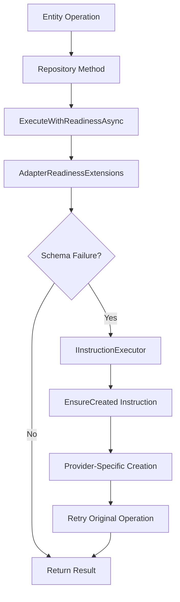

# Auto-Provisioning System - Deep Dive

**Document Type**: ARCHITECTURE
**Target Audience**: Framework Contributors, Advanced Developers
**Last Updated**: 2025-01-27
**Framework Version**: v0.2.18+

---

## Overview

The Koan Framework implements a sophisticated **automatic schema provisioning system** that creates database collections, tables, and indices on-demand without developer intervention. This system enables the "just works" experience for Entity<> patterns across multiple storage providers.

**Key Principle**: _Storage structures should be created automatically when first accessed, not manually configured._

---

## 🏗️ System Architecture

### Core Components



### 1. **AdapterReadinessExtensions** (`src/Koan.Core.Adapters/Readiness/`)

**Central orchestration layer for schema provisioning:**

```csharp
public static async Task<T> ExecuteWithSchemaProvisioningAsync<T, TEntity>(
    object adapter,
    Func<Task<T>> operation,
    CancellationToken ct = default)
{
    try
    {
        // First attempt: Execute operation normally
        return await operation().ConfigureAwait(false);
    }
    catch (Exception ex) when (IsSchemaRelatedFailure(ex))
    {
        // Schema failure detected - attempt auto-provisioning
        var executorType = typeof(IInstructionExecutor<>).MakeGenericType(typeof(TEntity));

        if (executorType.IsInstanceOfType(adapter))
        {
            // Execute EnsureCreated instruction via reflection
            var executeMethod = executorType.GetMethod("ExecuteAsync")
                ?.MakeGenericMethod(typeof(bool));

            if (executeMethod != null)
            {
                var instruction = new Instruction(DataInstructions.EnsureCreated);
                var task = (Task<bool>?)executeMethod.Invoke(adapter,
                    new object[] { instruction, ct });

                if (task != null)
                {
                    await task.ConfigureAwait(false);
                }
            }

            // Retry the operation after schema provisioning
            return await operation().ConfigureAwait(false);
        }

        throw;
    }
}
```

**Key Features:**

- **Transparent Integration**: All repository operations automatically wrapped
- **Provider Agnostic**: Works with any adapter implementing `IInstructionExecutor<T>`
- **Failure Detection**: Smart pattern matching for schema-related exceptions
- **Retry Logic**: Single retry after successful provisioning

### 2. **Schema Failure Detection**

```csharp
private static bool IsSchemaRelatedFailure(Exception ex)
{
    var message = ex.Message?.ToLowerInvariant() ?? string.Empty;

    return message.Contains("keyspace not found") ||           // Couchbase
           message.Contains("collection does not exist") ||     // NoSQL
           message.Contains("table") && message.Contains("does not exist") || // SQL
           message.Contains("invalid object name") ||           // SQL Server
           message.Contains("relation") && message.Contains("does not exist") || // PostgreSQL
           message.Contains("no such table") ||                // SQLite
           message.Contains("unknown collection") ||           // MongoDB
           message.Contains("index not found") ||              // Vector stores
           (ex.GetType().Name.Contains("Schema") && message.Contains("not found"));
}
```

**Multi-Provider Recognition**: Handles provider-specific error patterns automatically.

### 3. **Instruction Executor Pattern**

Every adapter implements `IInstructionExecutor<TEntity>` for schema operations:

```csharp
public interface IInstructionExecutor<TEntity>
{
    Task<TResult> ExecuteAsync<TResult>(Instruction instruction, CancellationToken ct = default);
}

// Standard instructions
public static class DataInstructions
{
    public const string EnsureCreated = "EnsureCreated";
    public const string Clear = "Clear";
    public const string Drop = "Drop";
}
```

**Provider Implementation Example (Couchbase)**:

```csharp
public Task<TResult> ExecuteAsync<TResult>(Instruction instruction, CancellationToken ct = default)
    => ExecuteWithReadinessAsync(async () =>
    {
        var ctx = await ResolveCollectionAsync(ct).ConfigureAwait(false);

        switch (instruction.Name)
        {
            case DataInstructions.EnsureCreated:
                await EnsureCollectionAsync(ctx, ct).ConfigureAwait(false);
                return (TResult)(object)true;

            case DataInstructions.Clear:
                var deleted = await DeleteAllAsync(ct).ConfigureAwait(false);
                return (TResult)(object)deleted;

            default:
                throw new NotSupportedException(
                    $"Instruction '{instruction.Name}' not supported by Couchbase adapter.");
        }
    }, ct);
```

---

## 🔄 Provisioning Flow

### Step-by-Step Execution

1. **Operation Triggered**

   ```csharp
   var todos = await Todo.All(); // User calls Entity<> method
   ```

2. **Repository Method Invocation**

   ```csharp
   public Task<IReadOnlyList<TEntity>> QueryAsync(object? query, CancellationToken ct = default)
       => ExecuteWithReadinessAsync(() => QueryInternalAsync(query, null, ct), ct);
   ```

3. **Readiness Extension Wrapping**

   ```csharp
   // All operations automatically wrapped by ExecuteWithSchemaProvisioningAsync
   return await adapter.WithReadinessAsync<TEntity>(() => QueryInternalAsync(...), ct);
   ```

4. **First Attempt Execution**

   ```csharp
   // Try normal query operation
   var result = await ctx.Cluster.QueryAsync<T>(finalStatement, queryOptions);
   ```

5. **Exception Analysis**

   ```csharp
   // Exception caught: "Keyspace not found in CB datastore: default:Koan._default.Todos"
   // IsSchemaRelatedFailure(ex) returns true
   ```

6. **Automatic Provisioning**

   ```csharp
   // Reflection-based instruction execution
   await adapter.ExecuteAsync<bool>(new Instruction("EnsureCreated"), ct);
   ```

7. **Provider-Specific Creation**

   ```csharp
   // Couchbase: Create scope + collection
   await manager.CreateScopeAsync(scopeName);
   await manager.CreateCollectionAsync(new CollectionSpec(scope, collection));
   await Task.Delay(2000, ct); // Wait for readiness
   ```

8. **Retry Original Operation**
   ```csharp
   // Execute the original query again - should now succeed
   return await operation().ConfigureAwait(false);
   ```

---

## 🎯 Provider-Specific Implementations

### Couchbase (`EnsureCollectionAsync`)

```csharp
private async Task EnsureCollectionAsync(CouchbaseCollectionContext ctx, CancellationToken ct)
{
    var manager = ctx.Bucket.Collections;

    // Create scope if not default
    if (!string.Equals(ctx.ScopeName, "_default", StringComparison.Ordinal))
    {
        try
        {
            await manager.CreateScopeAsync(ctx.ScopeName).ConfigureAwait(false);
            _logger?.LogInformation("Created Couchbase scope: {Scope}", ctx.ScopeName);
        }
        catch (CouchbaseException ex) when (IsAlreadyExists(ex))
        {
            _logger?.LogDebug("Scope {Scope} already exists", ctx.ScopeName);
        }
    }

    // Create collection
    var spec = new CollectionSpec(ctx.ScopeName, ctx.CollectionName);
    try
    {
        await manager.CreateCollectionAsync(spec).ConfigureAwait(false);
        _logger?.LogInformation("Created collection: {Collection} in scope {Scope}",
            ctx.CollectionName, ctx.ScopeName);

        // Wait for collection to be ready for N1QL queries
        await Task.Delay(2000, ct).ConfigureAwait(false);
        _logger?.LogDebug("Collection {Collection} ready for queries", ctx.CollectionName);
    }
    catch (CouchbaseException ex) when (IsAlreadyExists(ex))
    {
        _logger?.LogDebug("Collection {Collection} already exists", ctx.CollectionName);
    }
}

private static bool IsAlreadyExists(CouchbaseException ex)
    => ex.Context?.Message?.Contains("already exists", StringComparison.OrdinalIgnoreCase) == true;
```

**Key Patterns:**

- **Idempotent Operations**: Safe to call multiple times
- **Timing Awareness**: Waits for collections to be query-ready
- **Hierarchy Support**: Creates scopes before collections
- **Error Handling**: Distinguishes "already exists" from real failures

### MongoDB Implementation Pattern

```csharp
private async Task EnsureCollectionAsync(string collectionName, CancellationToken ct)
{
    var database = GetDatabase();

    // Check if collection exists
    var collections = await database.ListCollectionNames().ToListAsync(ct);
    if (collections.Contains(collectionName))
        return;

    // Create collection with appropriate settings
    await database.CreateCollectionAsync(collectionName, null, ct);

    // Create standard indices
    await CreateDefaultIndicesAsync(collectionName, ct);
}
```

### SQL Provider Pattern

```csharp
private async Task EnsureTableAsync(string tableName, CancellationToken ct)
{
    var createSql = GenerateCreateTableSql<TEntity>(tableName);

    try
    {
        await _connection.ExecuteAsync(createSql);
        _logger?.LogInformation("Created table: {Table}", tableName);
    }
    catch (SqlException ex) when (IsTableExistsError(ex))
    {
        _logger?.LogDebug("Table {Table} already exists", tableName);
    }
}
```

---

## ⚡ Performance Considerations

### 1. **Single Operation Cost**

- **First Access**: ~2-5 seconds (includes provisioning)
- **Subsequent Access**: ~50-200ms (normal operation)
- **Concurrent Access**: Handled via provider-level locking

### 2. **Caching and Optimization**

```csharp
// Providers typically cache existence checks
private readonly ConcurrentDictionary<string, bool> _collectionCache = new();

private async Task<bool> CollectionExistsAsync(string name, CancellationToken ct)
{
    if (_collectionCache.TryGetValue(name, out var exists))
        return exists;

    exists = await CheckCollectionExistsAsync(name, ct);
    _collectionCache.TryAdd(name, exists);
    return exists;
}
```

### 3. **Bulk Provisioning**

```csharp
// Framework supports bulk provisioning for multiple entities
await Entity<Todo>.EnsureCreated();
await Entity<User>.EnsureCreated();
await Entity<Product>.EnsureCreated();
// vs individual discovery during first operations
```

---

## 🔧 Configuration and Customization

### 1. **Disable Auto-Provisioning**

```json
{
  "Koan": {
    "Data": {
      "AutoProvisioning": {
        "Enabled": false,
        "RetryAttempts": 0
      }
    }
  }
}
```

### 2. **Provider-Specific Settings**

```json
{
  "Koan": {
    "Data": {
      "Couchbase": {
        "AutoProvisioning": {
          "CollectionReadinessDelay": "3000ms",
          "CreateIndices": true,
          "DefaultScopeName": "_default"
        }
      }
    }
  }
}
```

### 3. **Custom Instructions**

```csharp
// Providers can implement custom provisioning instructions
public const string CreateIndices = "CreateIndices";
public const string OptimizeStorage = "OptimizeStorage";

// Usage:
await repository.ExecuteAsync<bool>(new Instruction("CreateIndices"), ct);
```

---

## 🚨 Error Handling and Recovery

### 1. **Provisioning Failures**

```csharp
catch (Exception provisioningEx)
{
    throw new InvalidOperationException(
        $"Schema auto-provisioning failed for {entityType.Name}. " +
        $"Original error: {ex.Message}",
        ex); // Preserve original exception
}
```

### 2. **Partial Provisioning**

- **Scope exists, collection missing**: Continue with collection creation
- **Collection exists, indices missing**: Create missing indices only
- **Network interruption**: Retry with exponential backoff

### 3. **Monitoring and Alerting**

```csharp
// Metrics integration
_telemetry.RecordProvisioningTime(entityType, elapsed);
_telemetry.IncrementProvisioningFailures(entityType, providerName);

// Health checks
public async Task<bool> IsProvisioningHealthyAsync()
{
    // Check if critical collections can be provisioned
    return await TestProvisioningCapabilityAsync();
}
```

---

## 🧪 Testing Patterns

### 1. **Unit Testing Auto-Provisioning**

```csharp
[Test]
public async Task Should_AutoProvision_When_Collection_Missing()
{
    // Arrange: Clean database state
    await DropCollectionIfExistsAsync("Todos");

    // Act: Trigger operation requiring collection
    var todos = await Todo.All();

    // Assert: Collection created and operation succeeded
    Assert.IsTrue(await CollectionExistsAsync("Todos"));
    Assert.IsNotNull(todos);
}
```

### 2. **Integration Testing**

```csharp
[Test]
public async Task Should_Handle_Concurrent_Provisioning()
{
    await DropCollectionIfExistsAsync("Todos");

    // Multiple concurrent operations requiring same collection
    var tasks = Enumerable.Range(0, 10)
        .Select(_ => Todo.All())
        .ToArray();

    var results = await Task.WhenAll(tasks);

    // Should succeed without conflicts
    Assert.IsTrue(results.All(r => r != null));
    Assert.AreEqual(1, await CountCollectionsCreatedAsync("Todos"));
}
```

---

## 🎯 Best Practices

### For Framework Contributors

1. **Implement Idempotent Provisioning**: Always safe to call multiple times
2. **Handle Timing Issues**: Wait for structures to be fully ready
3. **Proper Error Classification**: Distinguish schema errors from data errors
4. **Comprehensive Logging**: Track provisioning decisions and timing
5. **Test Edge Cases**: Concurrent access, partial failures, network issues

### For Application Developers

1. **Trust the System**: Don't manually create collections/tables
2. **Handle First-Access Latency**: Expect higher latency on first access
3. **Use Bulk Operations**: More efficient than individual entity operations
4. **Monitor Provisioning**: Track provisioning events in production
5. **Test with Clean State**: Ensure tests work with fresh databases

---

## 📚 Related Documentation

- [Bootstrap Lifecycle](bootstrap-lifecycle.md) - Understanding startup coordination
- [Adapter & Data Connectivity](../../support/troubleshooting.md#adapter--data-connectivity) - Troubleshooting provisioning failures
- [Entity Storage Patterns](entity-storage-patterns.md) - How Entity<> leverages auto-provisioning
- [Performance Optimization](../../advanced/performance-optimization/query-optimization.md) - Optimizing provisioned structures

---

_The auto-provisioning system enables Koan's "just works" philosophy by eliminating manual database schema management while maintaining production reliability and performance._
