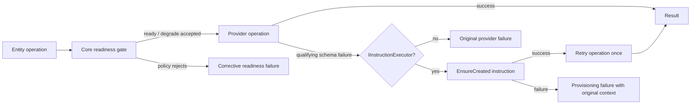

# Data schema provisioning and adapter readiness

Koan separates two promises that older documentation combined:

1. **readiness** decides whether an operation may enter a backend adapter;
2. **schema recovery** is a Data-owned retry available only where the selected provider implements the
   required instruction contract.

An application developer normally configures neither. `AddKoan()` composes the shared lifecycle, and a
referenced Data provider contributes its own defaults and creation behavior.

## Ownership

| Concern | Owner | Meaning |
|---|---|---|
| adapter state, initialization order, wait/degrade/fail policy | `Sylin.Koan.Core` | shared by Data, AI, Communication, and future backend families |
| Data readiness and default-page option binding | `Sylin.Koan.Data.Core` | Data-specific configuration only |
| schema creation instruction | selected Data provider | provider knows which table, collection, bucket, or index it can create |
| entity-operation retry | `Sylin.Koan.Data.Core` | retries once only after a qualifying schema failure and successful instruction |
| health participation | Data runtime + selected provider | only selected/participating routes become application-critical |

This removes a public `Core.Adapters` package without moving Data semantics into Core. The public
types `IAdapterReadiness`, `AdaptersReadinessOptions`, and related state types remain under the
`Koan.Core.Adapters` namespace but ship in `Sylin.Koan.Core`.

## Operation flow


```mermaid
flowchart LR
    A[Entity operation] --> B[Core readiness gate]
    B -->|ready / degrade accepted| C[Provider operation]
    B -->|policy rejects| X[Corrective readiness failure]
    C -->|success| D[Result]
    C -->|qualifying schema failure| E{IInstructionExecutor<TEntity>?}
    E -->|no| F[Original provider failure]
    E -->|yes| G[EnsureCreated instruction]
    G -->|success| H[Retry operation once]
    G -->|failure| I[Provisioning failure with original context]
    H --> D
```

The Core gate is `AdapterReadinessExtensions.WithReadinessAsync`. Data composes
`DataAdapterReadinessExtensions.WithDataReadinessAsync<T,TEntity>` around it. A provider does not
replace the shared readiness policy, and Core does not know what a schema is.

## Readiness policies

- `Hold`: wait for readiness up to the configured timeout.
- `Immediate`: ask the adapter for its current readiness and fail if it cannot accept work.
- `Degrade`: allow the operation to proceed while the adapter reports degraded state.

`EnableReadinessGating=false` bypasses only the gate. It does not claim that a backend is healthy and
does not change the Data provider's own error behavior.

Shared defaults live under:

```text
Koan:Adapters:Readiness:DefaultPolicy
Koan:Adapters:Readiness:DefaultTimeout
Koan:Adapters:Readiness:InitializationTimeout
Koan:Adapters:Readiness:EnableMonitoring
```

Data providers may bind concern-specific overrides under `Koan:Data:{Provider}:Readiness:*` and the
Data-wide fallback under `Koan:Data:Readiness:*`. Use provider documentation and startup facts rather
than assuming every connector exposes every override.

## Provider implementation contract

A provider that supports on-demand creation implements the existing Data instruction boundary for the
entity type:

```csharp
public Task<TResult> Execute<TResult>(Instruction instruction, CancellationToken ct = default)
{
    if (instruction.Name == DataInstructions.EnsureCreated)
    {
        // Create only the storage structure this provider owns.
    }

    // Return the provider-specific result or reject unsupported instructions.
}
```

The provider remains responsible for idempotency, concurrency, authorization, and backend-specific
DDL/creation restrictions. Koan does not turn a provider without this instruction into a provisioning
provider by reflection or convention.

## What qualifies for recovery

The current document-store recovery boundary recognizes a bounded set of missing-structure signals,
including familiar missing table, collection, keyspace, relation, object, and index messages. This is
a pragmatic correction path, not a universal database-error taxonomy.

Consequences:

- unrelated provider failures are rethrown unchanged;
- a provider that does not implement `IInstructionExecutor<TEntity>` is not retried;
- provisioning is attempted once and the original operation is retried once;
- a provisioning failure is surfaced as an `InvalidOperationException` naming the entity type and
  retaining the provisioning exception as its inner exception;
- this path does not promise transactional DDL, rollback, fleet-wide migration ordering, or safe
  production schema evolution.

## Application use

For ordinary entities, there is no provisioning API to call:

```csharp
public sealed class Todo : Entity<Todo>
{
    public required string Title { get; init; }
}

await new Todo { Title = "Ship the meaningful slice" }.Save(ct);
```

The selected provider decides whether this operation needs creation, performs its supported behavior,
and reports its participation through the normal Data health and runtime-fact surfaces.

Use explicit migrations or backend administration when your deployment requires reviewed DDL,
cross-version coordination, destructive changes, data backfills, or a privilege boundary that forbids
application-owned creation.

## Inspection and correction

- Startup provenance reports shared adapter readiness defaults from `Sylin.Koan.Core`.
- Data health reports inactive providers as non-critical and participating providers as critical.
- `/.well-known/Koan/facts` and the equivalent MCP facts projection describe the same composed runtime
  decisions; package presence alone is not evidence that a route is active.
- A readiness timeout, missing instruction support, or provider creation failure remains explicit.
  Koan does not silently switch providers or report an unqualified success.

## Related references

- [Data Core package](../../../src/Koan.Data.Core/README.md)
- [Core package](../../../src/Koan.Core/README.md)
- [Entity access and streaming](../data/entity-access-and-streaming.md)
- [Runtime facts](../../engineering/runtime-facts.md)
