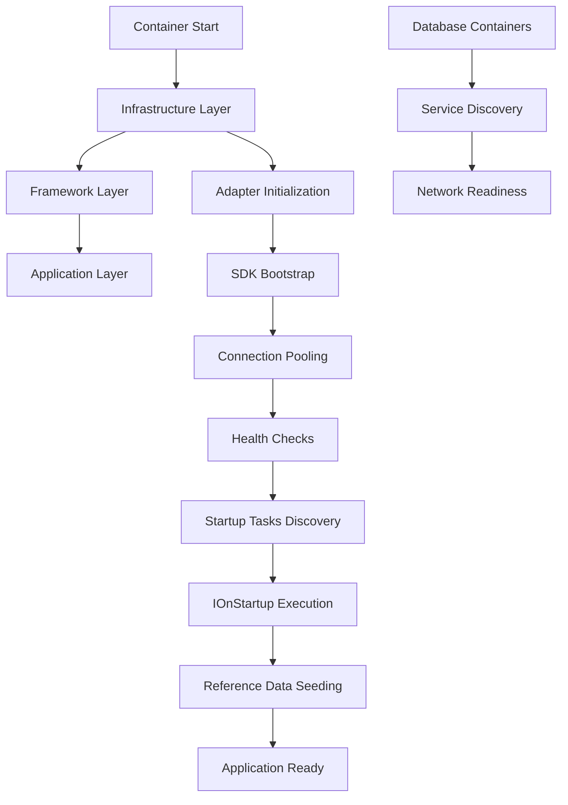
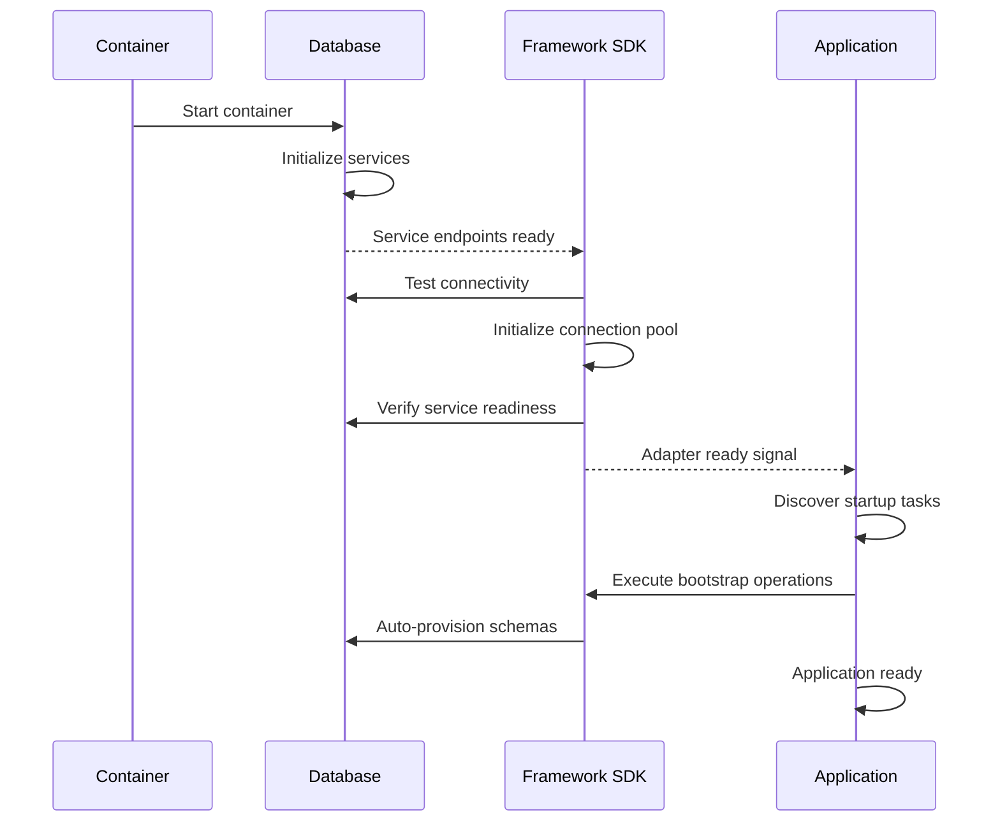

# Bootstrap Lifecycle - Deep Dive

<!-- Previous inline metadata kept above has been normalized into front-matter. -->

---

## Overview

The Koan Framework implements a **sophisticated multi-layer bootstrap system** that coordinates infrastructure readiness, framework initialization, and application startup. Understanding this lifecycle is crucial for diagnosing startup issues and ensuring reliable deployments.

**Key Principle**: _Each layer must achieve readiness before the next layer begins, but the system handles timing coordination and failure recovery automatically._

---

## 🏗️ Bootstrap Architecture

### System Layers



### Coordination Mechanisms

1. **Health Checks**: Verify each layer is ready before proceeding
2. **Startup Probes**: Framework-level readiness verification
3. **Dependency Ordering**: Explicit dependency chains between services
4. **Retry Logic**: Automatic recovery from timing issues
5. **Bootstrap Reporting**: Comprehensive initialization status tracking

---

## 📋 Layer 1: Infrastructure Bootstrap

### Database Container Initialization

**Phase 1: Container Startup**

```bash
# Container lifecycle
docker-compose up -d database
# Container starts but services may not be ready
```

**Phase 2: Service Discovery**

```csharp
// From CouchbaseClusterProvider.cs
private async Task WaitForCouchbaseAndCheckInitializationAsync(
    string baseUrl, string username, string password, string bucketName, CancellationToken ct)
{
    for (int attempt = 1; attempt <= maxRetries; attempt++)
    {
        try
        {
            // Test basic HTTP connectivity
            using var httpClient = new HttpClient();
            var response = await httpClient.GetAsync($"{baseUrl}/", ct);

            if (response.IsSuccessStatusCode)
            {
                _logger?.LogDebug("Couchbase web console is ready");
                break;
            }
        }
        catch (HttpRequestException ex)
        {
            _logger?.LogDebug("Waiting for Couchbase to be ready (attempt {Attempt}/{MaxAttempts}) {Error}",
                attempt, maxRetries, ex.Message);
            await Task.Delay(waitDelay, ct);
        }
    }
}
```

**Phase 3: Cluster Initialization**

```csharp
// Auto-provision cluster if needed
if (await IsClusterInitializedAsync(baseUrl, username, password, ct))
{
    _logger?.LogDebug("Couchbase cluster is already initialized");
    return true;
}

_logger?.LogInformation("Initializing Couchbase cluster");
await InitializeClusterAsync(baseUrl, username, password, bucketName, ct);
```

**Timing Considerations:**

- **Container Ready ≠ Service Ready**: HTTP responses don't guarantee query services
- **Cluster vs Service**: Cluster can be initialized but N1QL service still starting
- **Persistence**: State persisted in volumes affects initialization decisions

---

## 🔧 Layer 2: Framework Bootstrap

### Adapter Readiness System

**Phase 1: Auto-Registration**

```csharp
// From KoanAutoRegistrar pattern
[assembly: KoanAutoRegistrar(typeof(CouchbaseAutoRegistrar))]

public class CouchbaseAutoRegistrar : IKoanAutoRegistrar
{
    public void Register(IServiceCollection services, IConfiguration configuration)
    {
        services.AddKoanOptions<CouchbaseOptions>();
        services.AddSingleton<ICouchbaseClusterProvider, CouchbaseClusterProvider>();
        services.AddHealthChecks().AddCouchbaseHealth();

        // Bootstrap reporting
        services.Configure<BootstrapReportingOptions>(options =>
        {
            options.ReportAdapterCapabilities("couchbase", capabilities);
        });
    }
}
```

**Phase 2: SDK Initialization**

```csharp
// Enhanced SDK bootstrap with timing fixes
public async Task EnsureConnectionAsync(CancellationToken ct = default)
{
    if (_cluster != null) return;

    using var activity = CouchbaseTelemetry.Activity.StartActivity("couchbase.connect");

    _logger?.LogDebug("Connecting to Couchbase cluster at {ConnectionString}",
        Redaction.DeIdentify(options.ConnectionString));

    _cluster = await Cluster.ConnectAsync(options.ConnectionString, clusterOptions);

    // CRITICAL: Wait for SDK bootstrap completion
    _logger?.LogDebug("Waiting for Couchbase cluster to finish bootstrapping");
    await _cluster.WaitUntilReadyAsync(TimeSpan.FromSeconds(30));
    _logger?.LogDebug("Couchbase cluster bootstrap completed");
}
```

**Phase 3: Service Readiness Verification**

```csharp
// N1QL-specific readiness check
private async Task WaitForN1QLServiceReadinessAsync(string baseUrl, string username, string password, CancellationToken ct)
{
    _logger?.LogDebug("Waiting for N1QL query service to become ready");

    for (int i = 0; i < maxRetries; i++)
    {
        try
        {
            // Test actual N1QL functionality
            var response = await httpClient.PostAsync($"{baseUrl}/query/service", queryData, ct);

            if (response.IsSuccessStatusCode)
            {
                var content = await response.Content.ReadAsStringAsync(ct);
                if (content.Contains("\"test\":1") || content.Contains("\"status\":\"success\""))
                {
                    _logger?.LogInformation("N1QL query service is ready and responding");
                    return;
                }
            }
        }
        catch (Exception ex)
        {
            _logger?.LogDebug("Waiting for N1QL service readiness (attempt {Attempt}/{MaxAttempts})",
                i + 1, maxRetries);
        }

        await Task.Delay(delayMs, ct);
    }
}
```

**Phase 4: Health Reporting**

```csharp
// StartupProbeService validation
public async Task<HealthCheckResult> CheckHealthAsync(HealthCheckContext context, CancellationToken ct)
{
    try
    {
        await _clusterProvider.EnsureConnectionAsync(ct);
        return HealthCheckResult.Healthy("Couchbase cluster ready");
    }
    catch (Exception ex)
    {
        return HealthCheckResult.Unhealthy("Couchbase cluster not ready", ex);
    }
}
```

---

## 🚀 Layer 3: Application Bootstrap

### Startup Task Discovery

**Phase 1: Task Discovery**

```csharp
// From SchedulingOrchestrator
public async Task StartAsync(CancellationToken cancellationToken)
{
    _logger?.LogInformation("Starting scheduling orchestrator - building task runners");

    // Discover IScheduledTask implementations
    var tasks = _serviceProvider.GetServices<IScheduledTask>().ToList();

    // Filter for startup tasks
    var startupTasks = tasks.OfType<IOnStartup>().ToList();

    _logger?.LogInformation("Scheduling orchestrator started with {TaskCount} task runners",
        startupTasks.Count);
}
```

**Critical Issue**: Task discovery timing can miss tasks if services aren't fully initialized.

### Reference Data Bootstrap

**Phase 2: Bootstrap Task Execution**

```csharp
// Generic bootstrap task pattern
public async Task RunAsync(CancellationToken ct)
{
    // Quick check: skip if reference data already exists
    var existingData = await CheckExistingReferenceDataAsync(ct);

    if (existingData.HasRequiredData)
    {
        _logger?.LogInformation("Bootstrap: reference data already present. Skipping seeding.");
        return;
    }

    // Only run if reference data missing
    if (!existingData.HasReferenceData)
    {
        _logger?.LogInformation("Bootstrap: no reference data found, seeding required data...");

        // CRITICAL: Reference data seeding execution
        var seeder = new ReferenceDataSeeder();
        await seeder.SeedReferenceDataAsync(ct);

        // Verification
        var categories = await Category.All(ct);
        if (categories.Any())
        {
            var names = string.Join(", ", categories.Select(c => $"'{c.Name}'"));
            _logger?.LogInformation("Bootstrap: reference data seeded successfully. Categories: {Names}", names);
        }
        else
        {
            _logger?.LogWarning("Bootstrap: Failed to seed reference data - no Categories found.");
        }
    }
}
```

**Phase 3: Reference Data Seeder Execution**

```csharp
// Generic reference data seeder pattern
public async Task SeedReferenceDataAsync(CancellationToken ct = default)
{
    _logger?.LogInformation("Starting reference data seeding process");

    await SeedCategoriesAsync(ct);
    await SeedStatusesAsync(ct);
    await SeedConfigurationAsync(ct);

    _logger?.LogInformation("Reference data seeding process completed");
}

private async Task SeedCategoriesAsync(CancellationToken ct)
{
    var existing = await Category.All(ct);
    if (existing.Any())
    {
        _logger?.LogInformation("Categories already seeded ({Count} found)", existing.Count);
        return;
    }

    var categories = new[]
    {
        new Category { Id = "cat-electronics", Name = "Electronics", DisplayName = "Electronics",
                      Description = "Electronic devices and accessories", SortOrder = 1 },
        new Category { Id = "cat-books", Name = "Books", DisplayName = "Books",
                      Description = "Books and educational materials", SortOrder = 2 },
        // ... additional categories
    };

    // CRITICAL: Entity<> auto-provisioning integration
    await categories.Save(ct);

    _logger?.LogInformation("Seeded {Count} Categories", categories.Length);
}
```

---

## ⚡ Bootstrap Timing and Dependencies

### Proper Startup Sequence



### Common Timing Issues

#### 1. **Task Discovery Race Condition**

**Problem**: Startup tasks discovered before adapters fully initialized

```csharp
// ISSUE: SchedulingOrchestrator starts too early
services.AddHostedService<SchedulingOrchestrator>();  // Starts immediately

// SOLUTION: Coordinate with adapter readiness
services.Configure<HostOptions>(opts => opts.StartupTimeout = TimeSpan.FromMinutes(2));
```

#### 2. **SDK vs Service Readiness Gap**

**Problem**: SDK reports ready but services still initializing

```csharp
// ISSUE: Connection ready ≠ Query services ready
await _cluster.WaitUntilReadyAsync(TimeSpan.FromSeconds(30));
// Queries may still fail immediately after

// SOLUTION: Service-specific readiness verification
await WaitForN1QLServiceReadinessAsync(baseUrl, username, password, ct);
```

#### 3. **Container Restart vs Fresh Start**

**Problem**: Different behavior on restart vs fresh deployment

```csharp
// Fresh start: All initialization runs
// Restart: Cached state may skip initialization

// SOLUTION: Stateless initialization checks
private async Task<bool> IsClusterInitializedAsync(...)
{
    // Always verify actual capabilities, not just cached state
    var bucketResponse = await httpClient.GetAsync($"{baseUrl}/pools/default/buckets", ct);
    return bucketResponse.IsSuccessStatusCode;
}
```

---

## 🔧 Bootstrap Configuration

### Environment-Specific Settings

```json
{
  "Koan": {
    "Bootstrap": {
      "MaxRetryAttempts": 12,
      "RetryDelay": "5000ms",
      "StartupTimeout": "120000ms",
      "HealthCheckInterval": "2000ms",
      "EnableDetailedLogging": true
    },
    "Data": {
      "Couchbase": {
        "Bootstrap": {
          "ClusterInitTimeout": "60000ms",
          "ServiceReadinessTimeout": "30000ms",
          "N1QLReadinessDelay": "2000ms"
        }
      }
    }
  }
}
```

### Container Orchestration

```yaml
# docker-compose.yml
version: "3.8"
services:
  couchbase:
    image: couchbase:latest
    healthcheck:
      test: ["CMD", "curl", "-f", "http://localhost:8091/pools/default"]
      interval: 5s
      timeout: 3s
      retries: 30
      start_period: 30s

  api:
    depends_on:
      couchbase:
        condition: service_healthy
    environment:
      - Koan__Bootstrap__EnableDetailedLogging=true
```

---

## 🚨 Troubleshooting Bootstrap Issues

### Diagnostic Commands

```bash
# 1. Check container startup order
docker-compose logs --timestamps | grep -E "(started|ready|healthy)"

# 2. Verify adapter readiness
docker logs [api-container] | grep -E "(StartupProbe|Healthy|ready)"

# 3. Monitor bootstrap task execution
docker logs [api-container] | grep -E "(bootstrap|startup|seeding)"

# 4. Check timing coordination
docker logs [api-container] | grep -E "(attempt|retry|waiting)"
```

### Common Bootstrap Failures

#### 1. **Startup Tasks Not Discovered**

```
Symptoms:
- No bootstrap task logs
- Reference data not seeded
- Application ready but collections empty

Diagnosis:
- Check SchedulingOrchestrator logs
- Verify IOnStartup registration
- Test task discovery timing

Resolution:
- Restart containers to trigger fresh discovery
- Add explicit task registration
- Increase startup timeout
```

#### 2. **Adapter Readiness Timing**

```
Symptoms:
- "Connection refused" errors
- SDK ready but operations fail
- Intermittent connection issues

Diagnosis:
- Check infrastructure readiness
- Verify service-specific readiness
- Monitor SDK bootstrap completion

Resolution:
- Add service-specific readiness checks
- Implement retry logic with backoff
- Coordinate adapter and application startup
```

#### 3. **Reference Data Issues**

```
Symptoms:
- Bootstrap task runs but no data created
- Collection provisioning failures
- "Reference entity not found" errors

Diagnosis:
- Check auto-provisioning system
- Verify Entity<> operations
- Monitor database connectivity

Resolution:
- Ensure adapters fully ready before bootstrap
- Test manual provisioning
- Verify collection creation timing
```

---

## 🎯 Best Practices

### For Framework Development

1. **Layer Separation**: Clear boundaries between infrastructure, framework, and application concerns
2. **Readiness Verification**: Test actual capabilities, not just connectivity
3. **Timing Coordination**: Handle async initialization with proper waiting
4. **Comprehensive Logging**: Track bootstrap decisions and timing
5. **Idempotent Operations**: Safe to retry bootstrap operations

### For Application Development

1. **Trust Bootstrap System**: Don't manually initialize infrastructure
2. **Handle Startup Timing**: Expect higher latency during initialization
3. **Monitor Bootstrap Health**: Track bootstrap success/failure metrics
4. **Test Fresh Deployments**: Ensure reliable initialization from clean state
5. **Container Dependencies**: Use health checks and dependency ordering

### For Operations

1. **Health Check Configuration**: Comprehensive readiness verification
2. **Startup Monitoring**: Track bootstrap timing and failure patterns
3. **Container Orchestration**: Proper dependency ordering in compose/k8s
4. **Log Aggregation**: Centralized bootstrap event tracking
5. **Recovery Procedures**: Automated restart policies for bootstrap failures

---

## 📚 Related Documentation

- [Auto-Provisioning System](auto-provisioning-system.md) - Schema provisioning integration
- [Adapter & Data Connectivity](../../support/troubleshooting.md#adapter--data-connectivity) - Troubleshooting bootstrap-adjacent failures
- [Boot & Auto-Registration](../../support/troubleshooting.md#boot--auto-registration) - Startup sequencing runbook
- [Framework Principles](../../architecture/principles.md) - Understanding framework design philosophy

---

_The bootstrap lifecycle is the foundation of Koan's "just works" experience. Understanding this system enables reliable deployments and effective troubleshooting when initialization issues occur._
