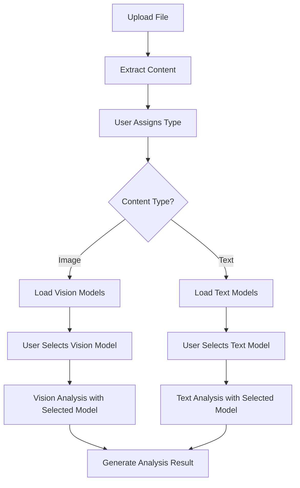

# **S13.DocMind: AI-Native Document Intelligence Platform**

## **Executive Summary**

**S13.DocMind** is a guided sample that showcases how the Koan Framework stitches together data, flow, and AI capabilities to build an AI-native document intelligence experience. Rather than prescribing an enterprise migration, it walks readers through the architectural patterns and building blocks they can reuse when crafting their own solutions.

This sample assumes lightweight evaluation datasets (dozens of documents, individual files ≤10 MB) and is optimized for interactive walkthroughs, scripted demos, and workshop labs. Larger workloads, multi-team governance, and production-grade SLAs are called out as optional explorations for teams who want to push the framework further.

### **Transformation Overview**

| **Aspect** | **Original Solution** | **S13.DocMind (Koan-Native)** |
|------------|-------------------|---------------------------|
| **Architecture** | Traditional .NET with manual DI | Entity-first with auto-registration |
| **Data Layer** | MongoDB-only, repository pattern | Sample multi-provider patterns (MongoDB + Weaviate core, PostgreSQL/Redis optional) |
| **AI Integration** | Manual Ollama client | Built-in `AI.Prompt()` and `AI.Embed()` with sample workflows |
| **APIs** | Manual controller implementation | Auto-generated via `EntityController<T>` |
| **Processing** | Synchronous with manual orchestration | Flow-driven background orchestration patterns |
| **Scalability** | Single provider, container-aware | Sample scaling hooks and stretch guidance |
| **Developer Experience** | Complex setup, manual patterns | "Reference = Intent", zero configuration |

---

## **Problem Domain Analysis**

### **Original Solution Capabilities**
The reference document intelligence solution provides sophisticated features:

- **Multi-format Processing**: .txt, .pdf, .docx, images with text extraction
- **AI-Powered Analysis**: Document information extraction and template filling
- **Template System**: Configurable document type templates with AI generation
- **Retrieval Pipeline**: Deterministic embeddings with experimental RAG capabilities
- **Diagram Understanding**: Graph extraction and visual content analysis
- **Generation Workflow**: Source documents → requests → runs → results pipeline

### **Architectural Challenges Identified**
1. **Manual Infrastructure**: 60+ lines of DI registration in `Program.cs`
2. **Provider Lock-in**: MongoDB-specific implementation patterns
3. **Complex Orchestration**: Manual service coordination and error handling
4. **Limited Scalability**: Single-provider architecture constrains growth
5. **AI Integration Complexity**: Custom HTTP clients and response parsing
6. **Development Friction**: Significant boilerplate for CRUD operations

---

## **S13.DocMind Architecture**

### **1. Entity-First Data Models**

#### **File Entity (Raw Content + Extracted Text)**
```csharp
[DataAdapter("mongodb")] // Document storage optimized for file metadata
public sealed class File : Entity<File>
{
    // Raw file metadata
    public string FileName { get; set; } = "";
    public string ContentType { get; set; } = "";
    public long FileSize { get; set; }
    public string Sha512Hash { get; set; } = "";

    // Storage references
    public string? StorageBucket { get; set; }
    public string? StorageKey { get; set; }

    // Extracted content (ready for AI processing)
    public string ExtractedText { get; set; } = "";
    public ExtractionMethod ExtractionMethod { get; set; }
    public DateTime? ExtractedAt { get; set; }

    // User-assigned type (trigger for AI processing)
    [Parent(typeof(Type))]
    public Guid? TypeId { get; set; }
    public DateTime? TypeAssignedAt { get; set; }

    // Processing state
    public FileState State { get; set; } = FileState.Uploaded;
    public string? ProcessingError { get; set; }
}

public enum FileState
{
    Uploaded,           // File uploaded, content extracted, awaiting type assignment
    TypeAssigned,       // User assigned type, analysis queued
    Analyzing,          // AI analysis in progress
    Analyzed,           // Analysis completed successfully
    AnalysisFailed      // Analysis failed with error
}

public enum ExtractionMethod
{
    None,        // Text files - no extraction needed
    PdfParser,   // PDF → text extraction
    OcrEngine,   // Images → OCR text
    DocxParser,  // DOCX → text extraction
    Custom       // Extensible for other formats
}
```

The user-driven processing workflow demonstrates Koan's separation of concerns and background orchestration:

- **Upload & Extraction**: Files are uploaded with immediate content extraction (PDF→text, OCR for images, etc.) but remain in "Uploaded" state
- **User-Driven Classification**: Users select document Type via UI, which assigns `File.TypeId` and triggers background AI processing
- **Background Analysis**: `TypeAssignedCommand` is queued, allowing Koan Flow workers to process AI analysis asynchronously with retry logic
- **State Tracking**: Clear progression from Uploaded → TypeAssigned → Analyzing → Analyzed with error handling

```csharp
public sealed class HashingReadStream : Stream
{
    private readonly Stream _inner;
    private readonly HashAlgorithm _hash;

    public HashingReadStream(Stream inner, HashAlgorithm hash)
    {
        _inner = inner;
        _hash = hash;
    }

    private bool _finalized;

    public string ComputeHashHex()
    {
        if (!_finalized)
        {
            _hash.TransformFinalBlock(Array.Empty<byte>(), 0, 0);
            _finalized = true;
        }
        return Convert.ToHexString(_hash.Hash ?? Array.Empty<byte>());
    }

    public override async ValueTask<int> ReadAsync(Memory<byte> buffer, CancellationToken cancellationToken = default)
    {
        var bytesRead = await _inner.ReadAsync(buffer, cancellationToken);
        if (bytesRead > 0)
        {
            _hash.TransformBlock(buffer.Span[..bytesRead], 0, bytesRead, null, 0);
        }
        return bytesRead;
    }

    public override int Read(byte[] buffer, int offset, int count)
    {
        var bytesRead = _inner.Read(buffer, offset, count);
        if (bytesRead > 0)
        {
            _hash.TransformBlock(buffer, offset, bytesRead, null, 0);
        }
        return bytesRead;
    }

    public override async ValueTask DisposeAsync()
    {
        if (!_finalized)
        {
            _hash.TransformFinalBlock(Array.Empty<byte>(), 0, 0);
            _finalized = true;
        }
        await base.DisposeAsync();
    }

    #region Stream forwarding members
    public override bool CanRead => _inner.CanRead;
    public override bool CanSeek => false;
    public override bool CanWrite => false;
    public override long Length => _inner.Length;
    public override long Position { get => _inner.Position; set => throw new NotSupportedException(); }
    public override void Flush() => _inner.Flush();
    public override long Seek(long offset, SeekOrigin origin) => throw new NotSupportedException();
    public override void SetLength(long value) => throw new NotSupportedException();
    public override void Write(byte[] buffer, int offset, int count) => throw new NotSupportedException();
    #endregion
}
```

Key design notes:

- **Externalized binaries**: Only storage provider identifiers plus relative paths are persisted with the entity. Raw files live under the mounted filesystem root by default, keeping MongoDB lean and making it easy to clean or snapshot demo assets.
- **Streaming-friendly metadata**: Hashes, embeddings, and template associations are calculated without loading the whole document into process memory.
- **Vector fields remain optional**: When Weaviate is disabled, the Koan vector attribute is ignored, preserving compatibility with the minimal stack.

#### **Type Entity (Document Classification + AI Instructions)**
```csharp
public sealed class Type : Entity<Type>
{
    // Classification info
    public string Name { get; set; } = "";           // "Meeting Transcript"
    public string Code { get; set; } = "";           // "MEETING"
    public string Description { get; set; } = "";
    public List<string> Tags { get; set; } = new();

    // AI extraction instructions
    public string ExtractionPrompt { get; set; } = "";     // How to analyze content
    public string TemplateStructure { get; set; } = "";    // Output format template
    public string Examples { get; set; } = "";             // Few-shot examples

    // Auto-classification hints
    public List<string> KeywordTriggers { get; set; } = new();
    public double ConfidenceThreshold { get; set; } = 0.7;

    // Vector matching for type classification
    [Vector(Dimensions = 1536)]
    public double[]? TypeEmbedding { get; set; }

    // Child relationships - files assigned to this type
    public async Task<List<File>> GetFiles() => await GetChildren<File>();
}
```

#### **Analysis Entity (AI-Generated Results)**
```csharp
public sealed class Analysis : Entity<Analysis>
{
    [Parent(typeof(File))]
    public Guid FileId { get; set; }

    [Parent(typeof(Type))]
    public Guid TypeId { get; set; }

    // AI-generated content
    public string ExtractedContext { get; set; } = "";          // Structured extraction
    public string FilledTemplate { get; set; } = "";            // Template-formatted result
    public Dictionary<string, object> StructuredData { get; set; } = new();

    // Quality metrics
    public double ConfidenceScore { get; set; }
    public string QualityFlags { get; set; } = "";              // "low-confidence", "partial-extraction"

    // Processing metadata
    public string ModelUsed { get; set; } = "";
    public long InputTokens { get; set; }
    public long OutputTokens { get; set; }
    public TimeSpan ProcessingDuration { get; set; }
}
```

### **2. AI-First Processing Architecture**

#### **File Analysis Service**
```csharp
public class FileAnalysisService
{
    private readonly ILogger<FileAnalysisService> _logger;

    public async Task<Analysis> GenerateAnalysisAsync(File file, Type type, CancellationToken ct)
    {
        var prompt = $"""
            {type.ExtractionPrompt}

            Document content:
            {file.ExtractedText}

            Instructions:
            Extract information according to the template below and provide structured output.

            Template:
            {type.TemplateStructure}
            """;

        var response = await AI.Prompt(prompt)
            .WithModel("gpt-4-turbo")
            .WithMaxTokens(2000)
            .WithTemperature(0.1)
            .ExecuteAsync(ct);

        return new Analysis
        {
            FileId = file.Id,
            TypeId = type.Id,
            ExtractedContext = response.Content,
            FilledTemplate = await ApplyTemplateAsync(type.TemplateStructure, response.Content, ct),
            ConfidenceScore = CalculateConfidence(response.Content, type),
            ModelUsed = response.Model ?? "gpt-4-turbo",
            InputTokens = response.Usage?.InputTokens ?? 0,
            OutputTokens = response.Usage?.OutputTokens ?? 0,
            ProcessingDuration = response.ProcessingTime ?? TimeSpan.Zero
        };
    }

    public async Task<string> ExtractContentAsync(string storageKey, string contentType, CancellationToken ct)
    {
        return contentType switch
        {
            "application/pdf" => await _pdfExtractor.ExtractTextAsync(storageKey, ct),
            "image/jpeg" or "image/png" => await _ocrService.ExtractTextAsync(storageKey, ct),
            "application/vnd.openxmlformats-officedocument.wordprocessingml.document" =>
                await _docxExtractor.ExtractTextAsync(storageKey, ct),
            "text/plain" => await _storage.ReadTextAsync(storageKey, ct),
            _ => throw new NotSupportedException($"Content type {contentType} not supported")
        };
    }

    public async Task<Type> GenerateTypeAsync(string prompt, CancellationToken ct)
    {
        var generationPrompt = $"""
            Create a document type configuration based on: {prompt}

            Output JSON format:
            {{
              "name": "Document Type Name",
              "code": "SHORT_CODE",
              "description": "Brief description",
              "extractionPrompt": "Instructions for AI analysis...",
              "templateStructure": "Output format template with placeholders"
            }}
            """;

        var response = await AI.Prompt(generationPrompt).ExecuteAsync(ct);
        var typeData = JsonSerializer.Deserialize<TypeGenerationData>(response.Content);

        var type = new Type
        {
            Name = typeData.Name,
            Code = typeData.Code,
            Description = typeData.Description,
            ExtractionPrompt = typeData.ExtractionPrompt,
            TemplateStructure = typeData.TemplateStructure
        };

        return await type.Save(ct);
    }
}
```

#### **AI Model Management Service (Following Original gdoc Patterns)**
```csharp
public class ModelManagementService
{
    public async Task<List<AvailableModel>> GetAvailableModelsAsync()
    {
        // Koan AI abstraction layer for cross-provider model discovery
        var ollamaModels = await AI.Models.GetAvailable("ollama");
        var openaiModels = await AI.Models.GetAvailable("openai");

        return ollamaModels.Concat(openaiModels)
            .Select(m => new AvailableModel
            {
                Name = m.Name,
                Provider = m.Provider,
                IsVisionCapable = m.HasCapability("vision"),
                IsInstalled = m.IsInstalled,
                Size = m.Size,
                Description = m.Description,
                Tags = m.Tags
            })
            .OrderBy(m => m.Name)
            .ToList();
    }

    public async Task<ModelConfiguration> GetCurrentConfigurationAsync()
    {
        return new ModelConfiguration
        {
            DefaultTextModel = await AI.Models.GetCurrent("text"),
            DefaultVisionModel = await AI.Models.GetCurrent("vision"),
            AvailableProviders = await AI.Providers.GetAvailable(),
            ActiveProvider = await AI.Providers.GetActive(),
            TextModelOptions = await GetTextModelOptionsAsync(),
            VisionModelOptions = await GetVisionModelOptionsAsync()
        };
    }

    public async Task<bool> SetCurrentTextModelAsync(string modelName, string? provider = null)
    {
        return await AI.Models.SetCurrent("text", modelName, provider);
    }

    public async Task<bool> SetCurrentVisionModelAsync(string modelName, string? provider = null)
    {
        return await AI.Models.SetCurrent("vision", modelName, provider);
    }

    public async Task<bool> InstallModelAsync(string modelName, string provider = "ollama")
    {
        // Dynamic model installation via provider-specific mechanisms
        return await AI.Models.Install(modelName, provider);
    }

    public async Task<Analysis> AnalyzeWithSelectedModel(File file, Type type, string? modelOverride = null)
    {
        var modelName = modelOverride ?? await DetermineOptimalModel(file, type);

        if (IsImageFile(file.ContentType))
        {
            return await AnalyzeImageContent(file, type, modelName);
        }
        else
        {
            return await AnalyzeTextContent(file, type, modelName);
        }
    }

    private async Task<Analysis> AnalyzeImageContent(File file, Type type, string modelName)
    {
        var base64Image = await GetBase64ImageAsync(file.StorageKey);

        var response = await AI.VisionPrompt($"""
            {type.ExtractionPrompt}

            Instructions: Analyze this image and extract structured information.
            Template: {type.TemplateStructure}
            """, base64Image)
            .WithModel(modelName)
            .WithMaxTokens(2000)
            .ExecuteAsync();

        return new Analysis
        {
            FileId = file.Id,
            TypeId = type.Id,
            ExtractedContext = response.Content,
            ModelUsed = response.Model,
            InputTokens = response.Usage?.InputTokens ?? 0,
            OutputTokens = response.Usage?.OutputTokens ?? 0,
            ProcessingDuration = response.ProcessingTime ?? TimeSpan.Zero
        };
    }

    private bool IsImageFile(string contentType) =>
        contentType.StartsWith("image/", StringComparison.OrdinalIgnoreCase);
}

public class AvailableModel
{
    public string Name { get; set; } = "";
    public string Provider { get; set; } = "";
    public bool IsVisionCapable { get; set; }
    public bool IsInstalled { get; set; }
    public string Size { get; set; } = "";
    public string Description { get; set; } = "";
    public List<string> Tags { get; set; } = new();
}

public class ModelConfiguration
{
    public string DefaultTextModel { get; set; } = "";
    public string DefaultVisionModel { get; set; } = "";
    public List<string> AvailableProviders { get; set; } = new();
    public string ActiveProvider { get; set; } = "";
    public List<AvailableModel> TextModelOptions { get; set; } = new();
    public List<AvailableModel> VisionModelOptions { get; set; } = new();
}
```

### **3. User-Driven Processing Pipeline**

#### **Background Processing Flow Commands**
```csharp
public sealed record TypeAssignedCommand : FlowCommand
{
    public Guid FileId { get; init; }
    public Guid TypeId { get; init; }
    public Guid UserId { get; init; } // Who assigned the type
}

public sealed class FileProcessingEvent : FlowEntity<FileProcessingEvent>
{
    public Guid FileId { get; set; }
    public ProcessingStage Stage { get; set; }
    public FileState State { get; set; }
    public object? EventData { get; set; }
    public string? ErrorMessage { get; set; }
    public TimeSpan? Duration { get; set; }
    public Guid? UserId { get; set; } // User who triggered the processing
}

public enum ProcessingStage
{
    TypeAssigned,        // User assigned document type
    AnalysisStarted,     // AI analysis begun
    AnalysisCompleted,   // Analysis successfully generated
    AnalysisFailed       // Analysis failed with error
}
```

#### **File Analysis Orchestrator (User-Triggered)**
```csharp
public class FileAnalysisOrchestrator : FlowCommandHandler<TypeAssignedCommand>
{
    private readonly FileAnalysisService _analysisService;
    private readonly ILogger<FileAnalysisOrchestrator> _logger;

    public FileAnalysisOrchestrator(
        FileAnalysisService analysisService,
        ILogger<FileAnalysisOrchestrator> logger)
    {
        _analysisService = analysisService;
        _logger = logger;
    }

    public override async Task HandleAsync(TypeAssignedCommand command, CancellationToken ct)
    {
        var file = await File.Get(command.FileId, ct);
        var type = await Type.Get(command.TypeId, ct);

        _logger.LogInformation("Starting analysis for file {FileId} with type {TypeName}",
            command.FileId, type.Name);

        await RecordEvent(command.FileId, ProcessingStage.TypeAssigned, FileState.TypeAssigned, command.UserId);

        try
        {
            // Update file state
            file.State = FileState.Analyzing;
            await file.Save(ct);

            await RecordEvent(command.FileId, ProcessingStage.AnalysisStarted, FileState.Analyzing, command.UserId);

            // Check if analysis already exists (idempotency)
            var existingAnalysis = await Analysis
                .Where(a => a.FileId == command.FileId && a.TypeId == command.TypeId)
                .FirstOrDefault();

            if (existingAnalysis != null)
            {
                _logger.LogInformation("Analysis already exists for file {FileId}", command.FileId);
                file.State = FileState.Analyzed;
                await file.Save(ct);
                await RecordEvent(command.FileId, ProcessingStage.AnalysisCompleted, FileState.Analyzed, command.UserId);
                return;
            }

            // Generate AI analysis
            var analysis = await _analysisService.GenerateAnalysisAsync(file, type, ct);
            await analysis.Save(ct);

            // Mark file as analyzed
            file.State = FileState.Analyzed;
            await file.Save(ct);

            await RecordEvent(command.FileId, ProcessingStage.AnalysisCompleted, FileState.Analyzed, command.UserId);

            _logger.LogInformation("Analysis completed for file {FileId} with confidence {Confidence}",
                command.FileId, analysis.ConfidenceScore);
        }
        catch (Exception ex)
        {
            _logger.LogError(ex, "Analysis failed for file {FileId}", command.FileId);

            file.State = FileState.AnalysisFailed;
            file.ProcessingError = ex.Message;
            await file.Save(ct);

            await RecordEvent(command.FileId, ProcessingStage.AnalysisFailed, FileState.AnalysisFailed, command.UserId,
                              new { Error = ex.Message, StackTrace = ex.StackTrace });

            throw; // Let Flow handle retry logic
        }
    }

    private async Task RecordEvent(Guid fileId, ProcessingStage stage, FileState state, Guid? userId, object? data = null)
    {
        var evt = new FileProcessingEvent
        {
            FileId = fileId,
            Stage = stage,
            State = state,
            EventData = data,
            UserId = userId
        };
        await evt.Save();
    }
}
```

### **4. Auto-Generated APIs with Koan EntityController**

#### **File API Controller (User-Driven Processing)**
```csharp
[Route("api/files")]
public class FileController : EntityController<File>
{
    private readonly IBackgroundCommandBus _commandBus;
    private readonly IObjectStorageClient _storage;
    private readonly FileAnalysisService _analysisService;

    public FileController(
        IBackgroundCommandBus commandBus,
        IObjectStorageClient storage,
        FileAnalysisService analysisService)
    {
        _commandBus = commandBus;
        _storage = storage;
        _analysisService = analysisService;
    }

    // Auto-generated endpoints from EntityController:
    // GET /api/files - with pagination, filtering
    // GET /api/files/{id} - with relationship expansion
    // POST /api/files - create new
    // PATCH /api/files/{id} - update
    // DELETE /api/files/{id} - soft delete

    [HttpPost("upload")]
    public async Task<ActionResult<File>> Upload([FromForm] IFormFile uploadedFile)
    {
        // Upload and extract content immediately
        await using var stream = uploadedFile.OpenReadStream();
        await using var hashingStream = new HashingReadStream(stream, SHA512.Create());

        var uploadResult = await _storage.UploadAsync(new ObjectUploadRequest
        {
            Bucket = "files",
            ObjectName = $"{Guid.NewGuid():N}/{uploadedFile.FileName}",
            ContentType = uploadedFile.ContentType,
            Content = hashingStream
        });

        var sha512 = hashingStream.ComputeHashHex();

        // Check for duplicates
        var existing = await File.Where(f => f.Sha512Hash == sha512).FirstOrDefault();
        if (existing != null)
        {
            return Ok(existing);
        }

        // Extract content immediately (no type needed for extraction)
        var extractedText = await _analysisService.ExtractContentAsync(
            uploadResult.ObjectName, uploadedFile.ContentType, CancellationToken.None);

        var file = new File
        {
            FileName = uploadResult.ObjectName,
            ContentType = uploadedFile.ContentType,
            FileSize = uploadedFile.Length,
            Sha512Hash = sha512,
            StorageBucket = uploadResult.Bucket,
            StorageKey = uploadResult.ObjectName,
            ExtractedText = extractedText,
            ExtractionMethod = DetermineExtractionMethod(uploadedFile.ContentType),
            ExtractedAt = DateTime.UtcNow,
            State = FileState.Uploaded // Ready for type assignment
        };

        await file.Save();
        return CreatedAtAction(nameof(GetById), new { id = file.Id }, file);
    }

    // Key endpoint: User assigns type via UI
    [HttpPut("{id}/assign-type")]
    public async Task<ActionResult> AssignType(Guid id, [FromBody] AssignTypeRequest request)
    {
        var file = await File.Get(id);
        if (file == null) return NotFound();

        if (file.State != FileState.Uploaded)
        {
            return BadRequest($"File must be in 'Uploaded' state to assign type. Current state: {file.State}");
        }

        // Validate type exists
        var type = await Type.Get(request.TypeId);
        if (type == null) return BadRequest("Invalid type ID");

        // Assign type and trigger processing
        file.TypeId = request.TypeId;
        file.TypeAssignedAt = DateTime.UtcNow;
        file.State = FileState.TypeAssigned;
        await file.Save();

        // Trigger background analysis
        await _commandBus.EnqueueAsync(new TypeAssignedCommand
        {
            FileId = id,
            TypeId = request.TypeId,
            UserId = request.UserId // From current user context
        });

        return Ok(new { message = "Type assigned successfully. Analysis started.", fileState = file.State });
    }

    [HttpGet("{id}/analysis")]
    public async Task<ActionResult<Analysis>> GetAnalysis(Guid id)
    {
        var analysis = await Analysis.Where(a => a.FileId == id).FirstOrDefault();
        return analysis != null ? Ok(analysis) : NotFound();
    }

    [HttpGet("{id}/status")]
    public async Task<ActionResult> GetProcessingStatus(Guid id)
    {
        var file = await File.Get(id);
        if (file == null) return NotFound();

        return Ok(new
        {
            file.Id,
            file.State,
            file.TypeId,
            file.TypeAssignedAt,
            file.ProcessingError,
            HasAnalysis = await Analysis.Where(a => a.FileId == id).Any()
        });
    }

    [HttpGet("{id}/processing-history")]
    public async Task<ActionResult<List<FileProcessingEvent>>> GetProcessingHistory(Guid id)
    {
        var events = await FileProcessingEvent
            .Where(e => e.FileId == id)
            .OrderBy(e => e.Timestamp)
            .All();
        return Ok(events);
    }

    private ExtractionMethod DetermineExtractionMethod(string contentType)
    {
        return contentType switch
        {
            "text/plain" => ExtractionMethod.None,
            "application/pdf" => ExtractionMethod.PdfParser,
            "image/jpeg" or "image/png" => ExtractionMethod.OcrEngine,
            "application/vnd.openxmlformats-officedocument.wordprocessingml.document" => ExtractionMethod.DocxParser,
            _ => ExtractionMethod.Custom
        };
    }
}

public class AssignTypeRequest
{
    public Guid TypeId { get; set; }
    public Guid UserId { get; set; }
}
```

#### **Type API Controller**
```csharp
[Route("api/types")]
public class TypeController : EntityController<Type>
{
    private readonly FileAnalysisService _analysisService;

    public TypeController(FileAnalysisService analysisService)
    {
        _analysisService = analysisService;
    }

    // Auto-generated CRUD endpoints + custom business logic

    [HttpPost("generate")]
    public async Task<ActionResult<Type>> GenerateType([FromBody] TypeGenerationRequest request)
    {
        var type = await _analysisService.GenerateTypeAsync(request.Prompt, CancellationToken.None);
        return CreatedAtAction(nameof(GetById), new { id = type.Id }, type);
    }

    [HttpGet("{id}/files")]
    public async Task<ActionResult<List<File>>> GetFiles(Guid id)
    {
        var type = await Type.Get(id);
        if (type == null) return NotFound();

        var files = await type.GetFiles(); // Automatic relationship
        return Ok(files);
    }

    [HttpGet("{id}/analyses")]
    public async Task<ActionResult<List<Analysis>>> GetAnalyses(Guid id)
    {
        var analyses = await Analysis.Where(a => a.TypeId == id).All();
        return Ok(analyses);
    }
}

public class TypeGenerationRequest
{
    public string Prompt { get; set; } = "";
}
```

#### **Model Management API Controller (Matching Original gdoc)**
```csharp
[Route("api/models")]
public class ModelManagementController : ControllerBase
{
    private readonly ModelManagementService _modelService;
    private readonly ILogger<ModelManagementController> _logger;

    public ModelManagementController(ModelManagementService modelService, ILogger<ModelManagementController> logger)
    {
        _modelService = modelService;
        _logger = logger;
    }

    // Model Discovery & Installation (from original gdoc ConfigurationController)

    [HttpGet("available")]
    public async Task<ActionResult<List<AvailableModel>>> GetAvailableModels()
    {
        var models = await _modelService.GetAvailableModelsAsync();
        return Ok(models.OrderBy(m => m.Name));
    }

    [HttpGet("installed")]
    public async Task<ActionResult<List<AvailableModel>>> GetInstalledModels()
    {
        var models = await _modelService.GetAvailableModelsAsync();
        return Ok(models.Where(m => m.IsInstalled).OrderBy(m => m.Name));
    }

    [HttpGet("search")]
    public async Task<ActionResult<List<AvailableModel>>> SearchModels(
        [FromQuery] string? name = null,
        [FromQuery] bool onlyInstalled = false,
        [FromQuery] bool onlyVision = false,
        [FromQuery] string? provider = null)
    {
        var models = await _modelService.GetAvailableModelsAsync();

        if (!string.IsNullOrEmpty(name))
            models = models.Where(m => m.Name.Contains(name, StringComparison.OrdinalIgnoreCase)).ToList();

        if (onlyInstalled)
            models = models.Where(m => m.IsInstalled).ToList();

        if (onlyVision)
            models = models.Where(m => m.IsVisionCapable).ToList();

        if (!string.IsNullOrEmpty(provider))
            models = models.Where(m => m.Provider.Equals(provider, StringComparison.OrdinalIgnoreCase)).ToList();

        return Ok(models.OrderBy(m => m.Name));
    }

    [HttpPost("{modelName}/install")]
    public async Task<ActionResult> InstallModel(string modelName, [FromQuery] string provider = "ollama")
    {
        try
        {
            var success = await _modelService.InstallModelAsync(modelName, provider);
            if (success)
            {
                return Ok(new { message = $"Model '{modelName}' installation started successfully" });
            }
            return BadRequest($"Failed to install model '{modelName}'");
        }
        catch (Exception ex)
        {
            _logger.LogError(ex, "Error installing model: {ModelName}", modelName);
            return StatusCode(500, $"Error installing model '{modelName}': {ex.Message}");
        }
    }

    // Current Model Configuration

    [HttpGet("config")]
    public async Task<ActionResult<ModelConfiguration>> GetConfiguration()
    {
        var config = await _modelService.GetCurrentConfigurationAsync();
        return Ok(config);
    }

    [HttpPut("text-model")]
    public async Task<ActionResult> SetCurrentTextModel([FromBody] SetModelRequest request)
    {
        var success = await _modelService.SetCurrentTextModelAsync(request.ModelName, request.Provider);
        if (success)
        {
            return Ok(new { message = $"Text model set to '{request.ModelName}'" });
        }
        return BadRequest($"Failed to set text model to '{request.ModelName}'");
    }

    [HttpPut("vision-model")]
    public async Task<ActionResult> SetCurrentVisionModel([FromBody] SetModelRequest request)
    {
        var success = await _modelService.SetCurrentVisionModelAsync(request.ModelName, request.Provider);
        if (success)
        {
            return Ok(new { message = $"Vision model set to '{request.ModelName}'" });
        }
        return BadRequest($"Failed to set vision model to '{request.ModelName}'");
    }

    // Analysis with Model Selection

    [HttpPost("analyze")]
    public async Task<ActionResult<Analysis>> AnalyzeWithModel([FromBody] AnalyzeWithModelRequest request)
    {
        var file = await File.Get(request.FileId);
        if (file == null) return NotFound("File not found");

        var type = await Type.Get(request.TypeId);
        if (type == null) return NotFound("Type not found");

        try
        {
            var analysis = await _modelService.AnalyzeWithSelectedModel(file, type, request.ModelOverride);
            await analysis.Save();

            // Update file state
            file.State = FileState.Analyzed;
            await file.Save();

            return Ok(analysis);
        }
        catch (Exception ex)
        {
            _logger.LogError(ex, "Analysis failed for file {FileId} with model {Model}", request.FileId, request.ModelOverride);
            return StatusCode(500, $"Analysis failed: {ex.Message}");
        }
    }
}

public class SetModelRequest
{
    public string ModelName { get; set; } = "";
    public string? Provider { get; set; }
}

public class AnalyzeWithModelRequest
{
    public Guid FileId { get; set; }
    public Guid TypeId { get; set; }
    public string? ModelOverride { get; set; }
}
```

#### **Analysis API Controller**
```csharp
[Route("api/analysis")]
public class AnalysisController : EntityController<Analysis>
{
    // Auto-generated CRUD endpoints

    [HttpGet("by-type/{typeId}")]
    public async Task<ActionResult<List<Analysis>>> GetByType(Guid typeId)
    {
        var analyses = await Analysis.Where(a => a.TypeId == typeId).All();
        return Ok(analyses);
    }

    [HttpGet("by-file/{fileId}")]
    public async Task<ActionResult<Analysis>> GetByFile(Guid fileId)
    {
        var analysis = await Analysis.Where(a => a.FileId == fileId).FirstOrDefault();
        return analysis != null ? Ok(analysis) : NotFound();
    }

    [HttpGet("high-confidence")]
    public async Task<ActionResult<List<Analysis>>> GetHighConfidence([FromQuery] double threshold = 0.8)
    {
        var analyses = await Analysis.Where(a => a.ConfidenceScore >= threshold).All();
        return Ok(analyses);
    }
}
```

### **5. AI Model Management & Image Processing (From Original gdoc)**

The S13.DocMind sample incorporates the sophisticated model management capabilities from the original gdoc solution, enabling users to discover, install, and select AI models for both text and image analysis.

#### **Key Features Replicated from Original gdoc**

1. **Separate Text and Vision Model Selection**
   - Independent model configuration for text processing and image analysis
   - Vision model validation ensures only vision-capable models are used for images
   - Automatic model selection based on content type

2. **Dynamic Model Discovery**
   - Browse available models from multiple providers (Ollama, OpenAI, etc.)
   - Filter by installed status, vision capabilities, and provider
   - Model search with name/description filtering

3. **Model Installation Management**
   - Install models directly from the UI (similar to `ollama pull`)
   - Remove unused models to manage storage
   - Installation progress tracking

4. **Multi-Provider Support**
   - Multiple Ollama instances support
   - Cross-provider model comparison
   - Provider health monitoring

#### **User Workflow: Model Selection & File Processing**



#### **Frontend Integration Examples**

```typescript
// Model selection dropdown population
const loadAvailableModels = async (type: 'text' | 'vision') => {
    const response = await fetch(`/api/models/search?onlyInstalled=true&onlyVision=${type === 'vision'}`);
    const models = await response.json();
    return models.map(m => ({ value: m.name, label: `${m.name} (${m.size})` }));
};

// File processing with model selection
const processFileWithModel = async (fileId: string, typeId: string, selectedModel?: string) => {
    const response = await fetch('/api/models/analyze', {
        method: 'POST',
        headers: { 'Content-Type': 'application/json' },
        body: JSON.stringify({
            fileId,
            typeId,
            modelOverride: selectedModel
        })
    });
    return response.json();
};

// Model installation
const installModel = async (modelName: string, provider: string = 'ollama') => {
    const response = await fetch(`/api/models/${modelName}/install?provider=${provider}`, {
        method: 'POST'
    });
    return response.json();
};
```

#### **Image Processing Capabilities (Matching Original)**

The original gdoc solution uses Ollama's vision models for image analysis. S13.DocMind replicates this with Koan's AI abstraction:

**Original gdoc Image Processing:**
```csharp
// From LlmDiagramGraphExtractor.cs
var resp = await _llm.AnalyzeImageAsync(preprocessed.Base64Image, system, user, ct);
```

**S13.DocMind Equivalent:**
```csharp
var response = await AI.VisionPrompt(prompt, base64Image)
    .WithModel(selectedVisionModel)
    .WithMaxTokens(2000)
    .ExecuteAsync();
```

#### **Vision Model Detection (From Original gdoc)**

The original gdoc uses "vision indicators" to detect which models support image analysis:

```csharp
// Original vision capability detection patterns
public List<string> GetDefaultVisionIndicators() => new()
{
    "vision", "llava", "llava-phi3", "minicpm-v", "moondream", "bakllava"
};
```

S13.DocMind integrates this through Koan's capability detection:
```csharp
var models = await AI.Models.GetAvailable("ollama");
var visionModels = models.Where(m => m.HasCapability("vision")).ToList();
```

#### **Model Configuration UI Components**

Based on the original gdoc's Angular frontend patterns:

```html
<!-- Text Model Selection -->
<div class="model-selector">
  <label>Text Analysis Model:</label>
  <select [(ngModel)]="selectedTextModel" (change)="updateTextModel()">
    <option *ngFor="let model of textModels" [value]="model.name">
      {{model.name}} ({{model.size}}) - {{model.provider}}
    </option>
  </select>
  <button (click)="browseModels('text')">Browse More Models</button>
</div>

<!-- Vision Model Selection -->
<div class="model-selector">
  <label>Image Analysis Model:</label>
  <select [(ngModel)]="selectedVisionModel" (change)="updateVisionModel()">
    <option *ngFor="let model of visionModels" [value]="model.name">
      {{model.name}} ({{model.size}}) - Vision Capable
    </option>
  </select>
  <button (click)="browseModels('vision')">Browse Vision Models</button>
</div>

<!-- Model Installation -->
<div class="model-installation" *ngIf="showModelBrowser">
  <h3>Available Models</h3>
  <div *ngFor="let model of availableModels" class="model-card">
    <div class="model-info">
      <h4>{{model.name}}</h4>
      <p>{{model.description}}</p>
      <span class="model-size">Size: {{model.size}}</span>
      <span class="model-tags">
        <span *ngFor="let tag of model.tags" class="tag">{{tag}}</span>
      </span>
    </div>
    <button *ngIf="!model.isInstalled"
            (click)="installModel(model.name)"
            class="install-btn">
      Install Model
    </button>
    <span *ngIf="model.isInstalled" class="installed-badge">Installed</span>
  </div>
</div>
```

#### **Performance Considerations**

Following the original gdoc's approach:
- **Model caching**: Installed models are cached for quick selection
- **Lazy loading**: Model lists loaded on-demand
- **Provider health checks**: Regular connectivity tests to multiple Ollama instances
- **Graceful fallbacks**: Default model selection when preferred models are unavailable

### **6. Multi-Provider Data Strategy**

#### **Provider Configuration**
```csharp
// appsettings.json - Koan auto-detects and elects providers
{
  "Koan": {
    "Data": {
      "Providers": {
        "mongodb": {
          "connectionString": "mongodb://localhost:27017",
          "database": "s13docmind"
        },
        "postgresql": {
          "connectionString": "Host=localhost;Database=s13docmind_audit",
          "priority": 10
        },
        "weaviate": {
          "endpoint": "http://localhost:8080",
          "priority": 5
        },
        "redis": {
          "connectionString": "localhost:6379",
          "priority": 1
        }
      }
    }
  }
}
```

#### **Strategic Provider Assignment**
```csharp
// Provider election happens automatically, but can be influenced:

[DataAdapter("mongodb")] // Document-heavy workloads
public sealed class Document : Entity<Document> { }

[DataAdapter("postgresql")] // ACID-critical audit data
public sealed class DocumentProcessingEvent : FlowEntity<DocumentProcessingEvent> { }

[DataAdapter("weaviate")] // Vector operations
[VectorAdapter("weaviate")]
public sealed class DocumentEmbedding : Entity<DocumentEmbedding> { }

[DataAdapter("redis")] // High-performance caching
public sealed class ProcessingCache : Entity<ProcessingCache> { }
```

### **6. Bootstrap and Auto-Registration**

#### **Program.cs - Minimal Configuration**
```csharp
using DocMind;

var builder = WebApplication.CreateBuilder(args);

// Single line enables all Koan capabilities
builder.Services.AddKoan();

var app = builder.Build();

// Standard ASP.NET Core configuration
if (app.Environment.IsDevelopment())
{
    app.UseSwagger();
    app.UseSwaggerUI();
}

app.UseRouting();
app.MapControllers();

app.Run();
```

#### **Koan Auto-Registrar Implementation**
```csharp
// S13.DocMind/KoanAutoRegistrar.cs
public class KoanAutoRegistrar : IKoanAutoRegistrar
{
    public void Register(IServiceCollection services, IConfiguration configuration)
    {
        // Business services auto-register
        services.AddScoped<DocumentIntelligenceService>();
        services.AddScoped<DocumentProcessingOrchestrator>();
        services.AddScoped<TemplateMatchingService>();

        // AI services auto-configure
        services.Configure<AiOptions>(configuration.GetSection("Koan:AI"));

        // Background services
        services.AddHostedService<DocumentProcessingBackgroundService>();
    }

    public async Task<BootReport> GenerateBootReportAsync(IServiceProvider services)
    {
        var report = new BootReport("S13.DocMind Document Intelligence Platform");

        // Data provider capabilities
        report.AddSection("Data Providers", await GetProviderCapabilities(services));

        // AI capabilities
        report.AddSection("AI Integration", await GetAiCapabilities(services));

        // Processing pipeline status
        report.AddSection("Processing Pipeline", await GetPipelineStatus(services));

        return report;
    }
}
```

---

## **Key Differentiators & Value Proposition**

### **1. Development Velocity**
- **80% Less Boilerplate**: Entity definitions replace repository patterns + manual DI
- **Auto-Generated APIs**: Full CRUD with advanced features (pagination, filtering, relationships)
- **Zero-Configuration AI**: `AI.Prompt()` and `AI.Embed()` replace custom HTTP clients
- **"Reference = Intent"**: Adding package references enables capabilities automatically

### **2. Enterprise Scalability**
- **Multi-Provider Architecture**: Start with MongoDB + Weaviate (core sample), add PostgreSQL/Redis via opt-in packages
- **Provider Transparency**: Same code works across all storage backends
- **Event Sourcing**: Complete audit trail with replay capabilities
- **Container-Native**: Orchestration-aware with automatic environment detection

### **3. AI-Native Capabilities**
- **Built-in Vector Operations**: Semantic search without custom vector pipeline complexity
- **LLM Integration**: Unified interface for multiple AI providers
- **Template Intelligence**: AI-generated templates with similarity matching
- **Multi-Modal Processing**: Text, images, and structured data processing patterns

### **4. Operational Excellence**
- **Capability Discovery**: Auto-generated API documentation with provider capabilities
- **Health Monitoring**: Built-in health checks and performance monitoring
- **Graceful Degradation**: Provider failover with capability-aware fallbacks
- **Event-Driven Architecture**: Real-time processing with streaming capabilities

---

## **Migration Strategy & Implementation Roadmap**

### **Phase 1: Core Entity Migration (Week 1-2)**
- Convert MongoDB models to Koan entities
- Implement `EntityController<T>` for auto-generated APIs
- Set up multi-provider configuration with MongoDB primary

### **Phase 2: AI Integration Enhancement (Week 3-4)**
- Replace custom Ollama client with Koan's AI interface
- Implement vector storage with Weaviate provider
- Add template generation and similarity matching

### **Phase 3: Event Sourcing Implementation (Week 5-6)**
- Implement `FlowEntity` patterns for processing pipeline
- Add event projections for real-time status tracking
- Create processing orchestrator with error handling

### **Phase 4: Advanced Features & Optimization (Week 7-8)**
- Add Redis caching for performance optimization
- Implement streaming responses for real-time updates
- Add comprehensive monitoring and observability

---

## **Conclusion**

**S13.DocMind** demonstrates the transformative power of the Koan Framework, converting a complex document intelligence application from traditional patterns to a modern, AI-native architecture. The solution showcases:

- **Entity-first development** reducing complexity and increasing velocity
- **Multi-provider transparency** enabling seamless scalability
- **Built-in AI capabilities** eliminating infrastructure complexity
- **Event sourcing** providing complete operational visibility
- **Auto-registration** reducing configuration overhead

This architecture serves as a comprehensive reference implementation for building AI-powered document intelligence platforms with enterprise-grade scalability, maintainability, and operational excellence.

---

## **Implementation Requirements & Specifications**

### **1. Technical Prerequisites**

#### **Framework Dependencies**
```xml
<!-- S13.DocMind/S13.DocMind.csproj -->
<Project Sdk="Microsoft.NET.Sdk.Web">
  <PropertyGroup>
    <TargetFramework>net8.0</TargetFramework>
    <Nullable>enable</Nullable>
    <ImplicitUsings>enable</ImplicitUsings>
  </PropertyGroup>

  <ItemGroup>
    <!-- Core Koan Framework -->
    <PackageReference Include="Koan.Core" Version="1.0.0" />
    <PackageReference Include="Koan.Data" Version="1.0.0" />
    <PackageReference Include="Koan.Web" Version="1.0.0" />
    <PackageReference Include="Koan.AI" Version="1.0.0" />
    <PackageReference Include="Koan.Canon" Version="1.0.0" />

    <!-- Provider Packages - Auto-registered when referenced -->
    <PackageReference Include="Koan.Data.MongoDB" Version="1.0.0" />
    <PackageReference Include="Koan.Data.PostgreSQL" Version="1.0.0" />
    <PackageReference Include="Koan.Data.Weaviate" Version="1.0.0" />
    <PackageReference Include="Koan.Data.Redis" Version="1.0.0" />

    <!-- Document Processing -->
    <PackageReference Include="PdfPig" Version="0.1.9" />
    <PackageReference Include="DocumentFormat.OpenXml" Version="3.0.1" />
    <PackageReference Include="SixLabors.ImageSharp" Version="3.0.2" />
  </ItemGroup>
</Project>
```

#### **Infrastructure Requirements**

**Core sample stack (required to run the walkthrough end-to-end):**

```yaml
services:
  mongodb:
    image: mongo:7.0
    ports: ["27017:27017"]
    environment:
      MONGO_INITDB_DATABASE: s13docmind

  weaviate:
    image: semitechnologies/weaviate:1.22.4
    ports: ["8080:8080"]
    environment:
      QUERY_DEFAULTS_LIMIT: 25
      AUTHENTICATION_ANONYMOUS_ACCESS_ENABLED: 'true'
      PERSISTENCE_DATA_PATH: '/var/lib/weaviate'
      DEFAULT_VECTORIZER_MODULE: 'none'
      ENABLE_MODULES: 'backup-filesystem'
      CLUSTER_HOSTNAME: 'node1'

  ollama:
    image: ollama/ollama:latest
    ports: ["11434:11434"]
    volumes: ["ollama_models:/root/.ollama"]
```

The API container mounts a host directory (for example `./data/storage`) and uses Koan’s filesystem storage provider, so no extra services are required to persist uploaded binaries during demos. This trio keeps the stack lightweight while still highlighting MongoDB, Weaviate, and Ollama working together.

**Optional advanced scenarios:**

- **PostgreSQL** for audit/event sourcing projections and reporting samples.
- **Redis** for distributed caching, rate limiting, and background worker locks.
- **NATS or Azure Service Bus** for durable orchestration (paired with Koan Flow workers).
- **MinIO or cloud object storage** when demonstrating cross-environment replication or bucket lifecycle management.
- **Weaviate replication & GPU inference** to explore high-throughput vector workloads.

Each optional dependency is encapsulated behind Koan adapters so teams can enable them selectively. The sample scripts include compose overrides that wire these extras only when explicitly requested.

### **2. Core Entity Implementation Specifications**

#### **Document Entity - Complete Implementation**
```csharp
namespace S13.DocMind.Models
{
    [DataAdapter("mongodb")] // Primary storage for documents
    [Table("documents")]
    public sealed class Document : Entity<Document>
    {
        // Basic file metadata
        [Required, MaxLength(255)]
        public string FileName { get; set; } = "";

        [MaxLength(255)]
        public string? UserFileName { get; set; }

        [Required, MaxLength(100)]
        public string ContentType { get; set; } = "";

        [Range(1, long.MaxValue)]
        public long FileSize { get; set; }

        // Content storage with size limits
        [MaxLength(10_000_000)] // 10MB text limit
        public string ExtractedText { get; set; } = "";

        // Original content persisted via the configured storage provider (filesystem by default)
        [MaxLength(255)]
        public string? StorageBucket { get; set; }

        [MaxLength(1024)]
        public string? StorageObjectKey { get; set; }

        [MaxLength(100)]
        public string? StorageVersionId { get; set; }

        // SHA-512 hash for deduplication (128 hex chars)
        [Required, Length(128, 128)]
        public string Sha512Hash { get; set; } = "";

        // Processing state tracking
        public ProcessingState State { get; set; } = ProcessingState.Uploaded;
        public DateTime? LastAnalyzed { get; set; }
        public string? ProcessingError { get; set; }

        // User context
        [MaxLength(5000)]
        public string Notes { get; set; } = "";

        // Relationships
        [Parent(typeof(DocumentTemplate))]
        public Guid? TemplateId { get; set; }

        // AI capabilities - when vector provider available
        [Vector(Dimensions = 1536, IndexType = "HNSW")]
        public double[]? Embedding { get; set; }

        // Multi-modal content analysis
        public bool IsImage => ContentType.StartsWith("image/");
        public bool IsTextFile => ContentType == "text/plain";
        public bool IsPdf => ContentType == "application/pdf";
        public bool IsWordDoc => ContentType.Contains("wordprocessingml") || ContentType.Contains("msword");

        // Computed properties
        public string DisplayName => string.IsNullOrWhiteSpace(UserFileName) ? FileName : UserFileName;
        public bool HasEmbedding => Embedding != null && Embedding.Length > 0;
        public bool IsProcessingComplete => State == ProcessingState.Completed;
        public bool HasError => !string.IsNullOrEmpty(ProcessingError);
    }

    public enum ProcessingState
    {
        Uploaded = 0,
        TextExtracting = 1,
        TextExtracted = 2,
        AIAnalyzing = 3,
        AIAnalyzed = 4,
        TemplateMatching = 5,
        EmbeddingGenerated = 6,
        Completed = 7,
        Failed = 8
    }
}
```

#### **Event Sourcing Flow Specification**
```csharp
namespace S13.DocMind.Flows
{
    [DataAdapter("postgresql")] // ACID compliance for audit trail
    [Table("document_processing_events")]
    public sealed class DocumentProcessingEvent : FlowEntity<DocumentProcessingEvent>
    {
        [Required]
        public Guid DocumentId { get; set; }

        [Required]
        public ProcessingStage Stage { get; set; }

        [Required]
        public ProcessingState State { get; set; }

        // Polymorphic event data - JSON serialized
        [Column(TypeName = "jsonb")] // PostgreSQL JSONB for indexing
        public object? EventData { get; set; }

        [MaxLength(2000)]
        public string? ErrorMessage { get; set; }

        public TimeSpan? Duration { get; set; }

        // Processing metrics
        public long? InputTokens { get; set; }
        public long? OutputTokens { get; set; }
        public double? ConfidenceScore { get; set; }

        // Retry tracking
        public int AttemptNumber { get; set; } = 1;
        public string? RetryReason { get; set; }

        // Performance tracking
        public double? CpuUsage { get; set; }
        public long? MemoryUsage { get; set; }
    }
}
```

### **3. AI Integration Specifications**

#### **Document Intelligence Service - Production Ready**
```csharp
namespace S13.DocMind.Services
{
    public interface IDocumentIntelligenceService
    {
        Task<DocumentAnalysis> AnalyzeDocumentAsync(Document document, CancellationToken ct = default);
        Task<List<DocumentTemplate>> FindSimilarTemplatesAsync(Document document, double threshold = 0.8, int limit = 5, CancellationToken ct = default);
        Task<DocumentTemplate> GenerateTemplateAsync(string prompt, CancellationToken ct = default);
        Task<string> ExtractTextAsync(Stream content, string fileName, string contentType, CancellationToken ct = default);
        Task<ProcessingResult> ProcessDocumentWorkflowAsync(Guid documentId, ProcessingOptions? options = null, CancellationToken ct = default);
    }

    public class DocumentIntelligenceService : IDocumentIntelligenceService
    {
        private readonly ILogger<DocumentIntelligenceService> _logger;

        // Koan AI integration - no custom HTTP clients needed
        public async Task<DocumentAnalysis> AnalyzeDocumentAsync(Document document, CancellationToken ct = default)
        {
            var stopwatch = Stopwatch.StartNew();

            try
            {
                // Multi-modal analysis based on content type
                var analysisPrompt = document.IsImage
                    ? BuildImageAnalysisPrompt(document)
                    : BuildTextAnalysisPrompt(document.ExtractedText);

                // Koan's unified AI interface with retry and error handling
                var response = await AI.Prompt(analysisPrompt)
                    .WithModel("gpt-4-turbo")
                    .WithMaxTokens(2000)
                    .WithTemperature(0.1)
                    .WithRetry(maxAttempts: 3)
                    .ExecuteAsync(ct);

                // Generate embedding for similarity matching
                var embedding = await AI.Embed(document.ExtractedText)
                    .WithModel("text-embedding-3-large")
                    .ExecuteAsync(ct);

                // Update document with embedding
                document.Embedding = embedding.Vector;
                await document.Save();

                // Parse structured response
                var analysis = ParseAnalysisResponse(response.Content);
                analysis.ProcessingDuration = stopwatch.Elapsed;
                analysis.InputTokens = response.Usage.InputTokens;
                analysis.OutputTokens = response.Usage.OutputTokens;

                return analysis;
            }
            catch (Exception ex)
            {
                _logger.LogError(ex, "Failed to analyze document {DocumentId}", document.Id);
                return new DocumentAnalysis
                {
                    DocumentId = document.Id,
                    Summary = "Analysis failed due to processing error",
                    ConfidenceScore = 0.0,
                    ProcessingError = ex.Message,
                    ProcessingDuration = stopwatch.Elapsed
                };
            }
        }

        // Vector similarity search with automatic provider routing
        public async Task<List<DocumentTemplate>> FindSimilarTemplatesAsync(
            Document document,
            double threshold = 0.8,
            int limit = 5,
            CancellationToken ct = default)
        {
            if (document.Embedding == null)
            {
                _logger.LogWarning("Document {DocumentId} has no embedding for similarity search", document.Id);
                return new List<DocumentTemplate>();
            }

            // Koan's vector operations - automatic provider routing to Weaviate
            var similarTemplates = await DocumentTemplate.Vector
                .SimilaritySearch(document.Embedding)
                .WithThreshold(threshold)
                .WithLimit(limit)
                .ExecuteAsync(ct);

            return similarTemplates;
        }

        private static string BuildTextAnalysisPrompt(string text)
        {
            return $"""
            Analyze the following document and extract structured information:

            DOCUMENT CONTENT:
            {text}

            OUTPUT REQUIREMENTS:
            1. Provide a concise summary (2-3 sentences)
            2. Extract key entities (people, organizations, locations, dates)
            3. Identify main topics and themes
            4. List important facts with confidence scores
            5. Categorize document type

            Response format: JSON with fields: summary, entities, topics, keyFacts, documentType, confidence
            """;
        }
    }

    public class ProcessingOptions
    {
        public bool ForceReprocessing { get; set; } = false;
        public bool GenerateEmbedding { get; set; } = true;
        public bool MatchTemplates { get; set; } = true;
        public string? PreferredModel { get; set; }
        public double ConfidenceThreshold { get; set; } = 0.7;
        public int MaxRetries { get; set; } = 3;
    }
}
```

Operational guidance:

- **Multi-provider routing**: Koan AI profiles map Ollama models for local/offline runs and OpenAI/Azure OpenAI for hosted inference. The sample configuration promotes Ollama by default but automatically fails over when health probes degrade, logging provider swaps.
- **Quality baselines**: A curated benchmark set (10 reference documents + expected JSON outputs) runs nightly via GitHub Actions to detect drift. Failures trigger the human review queue and roll back to the last known-good model profile.
- **Cost guardrails**: `AIUsageBudget` entities track cumulative token spend per environment with alert thresholds; when budgets are exceeded, non-critical template generation calls degrade to smaller models.

### **4. Performance & Scalability Specifications**

#### **Performance Benchmarks**
```csharp
namespace S13.DocMind.Specifications
{
    public static class PerformanceBenchmarks
    {
        // Sample-friendly document processing targets
        public const int MaxDocumentSizeMb = 10;
        public const int MaxTextLengthChars = 1_000_000;
        public const int ConcurrentProcessingLimit = 3;

        // API response time targets (interactive demos)
        public const int DocumentUploadTimeoutMs = 15_000;
        public const int DocumentAnalysisTimeoutMs = 45_000;
        public const int TemplateGenerationTimeoutMs = 30_000;

        // Vector search performance
        public const int VectorSearchTimeoutMs = 2_000;
        public const int MaxVectorSearchResults = 10;
        public const double MinSimilarityThreshold = 0.4;

        // Throughput targets for guided walkthroughs
        public const int DocumentsPerMinute = 4;
        public const int ApiRequestsPerSecond = 5;
        public const int ConcurrentUsers = 3;

        // Stretch goals for optional load experiments
        public const int StretchDocumentsPerMinute = 20;
        public const int StretchConcurrentUsers = 15;
    }
}
```

#### **Caching Strategy**
```csharp
namespace S13.DocMind.Infrastructure
{
    [DataAdapter("redis")]
    public sealed class ProcessingCache : Entity<ProcessingCache>
    {
        [Required]
        public string CacheKey { get; set; } = "";

        public object? CachedData { get; set; }

        public DateTime ExpiresAt { get; set; }

        public CacheType Type { get; set; }

        // TTL management
        public TimeSpan TimeToLive => ExpiresAt - DateTime.UtcNow;
        public bool IsExpired => DateTime.UtcNow > ExpiresAt;
    }

    public enum CacheType
    {
        DocumentAnalysis,
        TemplateMatch,
        VectorSearch,
        ProcessingResult
    }

    public class CachingService
    {
        public async Task<T?> GetAsync<T>(string key, CancellationToken ct = default)
        {
            var cached = await ProcessingCache
                .Where(c => c.CacheKey == key && !c.IsExpired)
                .FirstOrDefault();

            return cached?.CachedData is T data ? data : default(T);
        }

        public async Task SetAsync<T>(string key, T value, TimeSpan ttl, CacheType type = CacheType.DocumentAnalysis)
        {
            var cache = new ProcessingCache
            {
                CacheKey = key,
                CachedData = value,
                ExpiresAt = DateTime.UtcNow.Add(ttl),
                Type = type
            };

            await cache.Save();
        }
    }
}
```

### **5. Security & Compliance Specifications**

#### **Data Security Requirements**
```csharp
namespace S13.DocMind.Security
{
    [DataAdapter("postgresql")]
    [Table("audit_logs")]
    public sealed class AuditLog : Entity<AuditLog>
    {
        [Required]
        public string UserId { get; set; } = "";

        [Required]
        public string Action { get; set; } = "";

        [Required]
        public string ResourceType { get; set; } = "";

        public Guid? ResourceId { get; set; }

        public string? IpAddress { get; set; }

        public string? UserAgent { get; set; }

        [Column(TypeName = "jsonb")]
        public object? AdditionalData { get; set; }

        public AuditResult Result { get; set; } = AuditResult.Success;

        public string? ErrorMessage { get; set; }
    }

    public enum AuditResult
    {
        Success,
        Failed,
        Unauthorized,
        Forbidden
    }

    // Data encryption for sensitive content
    public class EncryptionService
    {
        private const int KeySize = 256;
        private const int IvSize = 128;

        public async Task<byte[]> EncryptAsync(byte[] data, string key)
        {
            using var aes = Aes.Create();
            aes.KeySize = KeySize;
            aes.GenerateIV();

            var keyBytes = SHA256.HashData(Encoding.UTF8.GetBytes(key));
            aes.Key = keyBytes;

            using var encryptor = aes.CreateEncryptor();
            using var ms = new MemoryStream();

            // Prepend IV
            await ms.WriteAsync(aes.IV);

            using (var cs = new CryptoStream(ms, encryptor, CryptoStreamMode.Write))
            {
                await cs.WriteAsync(data);
            }

            return ms.ToArray();
        }

        public async Task<byte[]> DecryptAsync(byte[] encryptedData, string key)
        {
            using var aes = Aes.Create();
            aes.KeySize = KeySize;

            var keyBytes = SHA256.HashData(Encoding.UTF8.GetBytes(key));
            aes.Key = keyBytes;

            // Extract IV
            var iv = new byte[IvSize / 8];
            Array.Copy(encryptedData, 0, iv, 0, iv.Length);
            aes.IV = iv;

            var cipherData = new byte[encryptedData.Length - iv.Length];
            Array.Copy(encryptedData, iv.Length, cipherData, 0, cipherData.Length);

            using var decryptor = aes.CreateDecryptor();
            using var ms = new MemoryStream(cipherData);
            using var cs = new CryptoStream(ms, decryptor, CryptoStreamMode.Read);
            using var result = new MemoryStream();

            await cs.CopyToAsync(result);
            return result.ToArray();
        }
    }
}
```

#### **Sensitive data governance & retention**

- **Automated detection**: Every uploaded object is scanned with Koan's `ContentClassifier` pipeline to tag PII/PHI, contractual clauses, and regulated markers before downstream processing.
- **Selective redaction**: Classified spans are redacted or masked prior to AI prompt submission. The original binary remains sealed in the storage provider (filesystem paths by default, S3-compatible buckets when enabled) with scoped, auditable access policies.
- **Retention policies**: Sample automation applies lightweight file retention (cron job pruning the storage folder after 30 days) and, when an object store is configured, shows how to translate the same policy into bucket lifecycle rules. `RightToBeForgottenFlow` commands scrub embeddings, cached analyses, and audit logs linked to a subject.

#### **Human-in-the-loop validation**

- **Confidence gating**: Analyses with confidence <0.75 or containing high-risk entities are routed to a human review queue (implemented as a Koan Flow state machine) before templates or downstream systems consume them.
- **Exception handling**: Reviewers can approve, request re-run with alternative models, or flag documents for legal escalation. Decisions are persisted on the `DocumentProcessingEvent` stream for full traceability.
- **Operational runbooks**: The sample documentation ships with checklists for weekly access reviews, quarterly audit exports (JSON/CSV), and emergency kill-switch procedures when AI regressions are detected.

### **6. Testing Specifications**

#### **Integration Test Requirements**
```csharp
namespace S13.DocMind.Tests.Integration
{
    [Collection("DatabaseCollection")]
    public class DocumentProcessingWorkflowTests : IAsyncLifetime
    {
        private readonly WebApplicationFactory<Program> _factory;
        private readonly HttpClient _client;

        [Fact]
        public async Task UploadDocument_ShouldTriggerCompleteProcessingWorkflow()
        {
            // Arrange
            var testDocument = CreateTestPdfDocument();
            var uploadRequest = new MultipartFormDataContent();
            uploadRequest.Add(new ByteArrayContent(testDocument.Content), "files", testDocument.FileName);

            // Act - Upload document
            var uploadResponse = await _client.PostAsync("/api/documents/upload", uploadRequest);

            // Assert - Document uploaded successfully
            uploadResponse.StatusCode.Should().Be(HttpStatusCode.Created);
            var document = await ParseResponse<Document>(uploadResponse);
            document.FileName.Should().Be(testDocument.FileName);

            // Wait for background processing
            await WaitForProcessingComplete(document.Id, TimeSpan.FromSeconds(30));

            // Assert - Processing completed
            var processingHistory = await GetProcessingHistory(document.Id);
            processingHistory.Should().ContainSingle(e => e.Stage == ProcessingStage.ProcessingCompleted);

            // Assert - Analysis generated
            var analysis = await _client.GetFromJsonAsync<DocumentAnalysis>($"/api/documents/{document.Id}/analysis");
            analysis.Should().NotBeNull();
            analysis.ConfidenceScore.Should().BeGreaterThan(0.5);

            // Assert - Template matching occurred
            var similarTemplates = await _client.GetFromJsonAsync<List<DocumentTemplate>>($"/api/documents/{document.Id}/similar-templates");
            similarTemplates.Should().NotBeNull();
        }

        [Fact]
        public async Task ProcessDocument_WithMediumFile_ShouldHandleGracefully()
        {
            // Test with 8MB file (aligned with sample guidance)
            var largeDocument = CreateLargeTestDocument(8 * 1024 * 1024);
            // ... test implementation
        }

        [Fact]
        public async Task AIAnalysis_WithInvalidContent_ShouldReturnErrorGracefully()
        {
            // Test error handling for corrupted or invalid content
            // ... test implementation
        }

        private async Task WaitForProcessingComplete(Guid documentId, TimeSpan timeout)
        {
            var stopwatch = Stopwatch.StartNew();

            while (stopwatch.Elapsed < timeout)
            {
                var document = await _client.GetFromJsonAsync<Document>($"/api/documents/{documentId}");
                if (document?.State == ProcessingState.Completed || document?.State == ProcessingState.Failed)
                {
                    return;
                }

                await Task.Delay(1000);
            }

            throw new TimeoutException($"Document processing did not complete within {timeout}");
        }
    }

    // Load testing specification
    [Fact]
    public async Task LoadTest_ConcurrentDocumentProcessing_Optional()
    {
        const int concurrentDocuments = 6; // stretch scenario for workshops
        const int maxProcessingTimeMinutes = 3;

        var tasks = Enumerable.Range(0, concurrentDocuments)
            .Select(i => ProcessTestDocument($"test-doc-{i}.txt"))
            .ToArray();

        var completedTasks = await Task.WhenAll(tasks);

        // Assert all documents processed successfully
        completedTasks.Should().AllSatisfy(result =>
            result.State.Should().Be(ProcessingState.Completed));

        // Assert reasonable processing times
        var avgProcessingTime = completedTasks.Average(r => r.ProcessingDuration.TotalSeconds);
        avgProcessingTime.Should().BeLessThan(maxProcessingTimeMinutes * 60);
    }
}
```

**Recommended test progression:**

1. **Smoke walkthrough** – run `DocumentProcessingWorkflowTests.UploadDocument_ShouldTriggerCompleteProcessingWorkflow` with the default sample PDF.
2. **Medium file resilience** – execute `ProcessDocument_WithMediumFile_ShouldHandleGracefully` using the bundled 8 MB fixture.
3. **Optional stretch** – enable the `[Category("Load")]` collection to run `LoadTest_ConcurrentDocumentProcessing_Optional` once infrastructure resources are scaled.

### **7. Deployment & Operations Specifications**

#### **Docker Compose Development Setup (Following S5/S8 Patterns)**

Based on successful patterns from S5.Recs and S8.Canon/S8.Location samples, S13.DocMind provides multiple deployment scenarios:

##### **Option 1: API with Embedded Client (S5.Recs Pattern)**
```yaml
# docker-compose.yml - Simple embedded client in API wwwroot
version: '3.8'
services:
  mongodb:
    image: mongo:7
    container_name: s13-docmind-mongo
    healthcheck:
      test: ["CMD", "mongosh", "--eval", "db.adminCommand('ping')"]
      interval: 5s
      timeout: 5s
      retries: 10
    ports:
      - "4920:27017"
    volumes:
      - mongo_data:/data/db
    environment:
      MONGO_INITDB_DATABASE: s13docmind

  postgresql:
    image: postgres:15
    container_name: s13-docmind-postgres
    healthcheck:
      test: ["CMD-SHELL", "pg_isready -U docmind"]
      interval: 5s
      timeout: 5s
      retries: 10
    ports:
      - "4921:5432"
    volumes:
      - postgres_data:/var/lib/postgresql/data
    environment:
      POSTGRES_DB: s13docmind_audit
      POSTGRES_USER: docmind
      POSTGRES_PASSWORD: docmind123

  weaviate:
    image: semitechnologies/weaviate:1.22.4
    container_name: s13-docmind-weaviate
    ports:
      - "4922:8080"
    environment:
      QUERY_DEFAULTS_LIMIT: 25
      AUTHENTICATION_ANONYMOUS_ACCESS_ENABLED: 'true'
      PERSISTENCE_DATA_PATH: '/var/lib/weaviate'
      DEFAULT_VECTORIZER_MODULE: 'none'
      ENABLE_MODULES: 'backup-filesystem'
      CLUSTER_HOSTNAME: 'node1'
    volumes:
      - weaviate_data:/var/lib/weaviate
    healthcheck:
      test: ["CMD", "wget", "--no-verbose", "--tries=1", "--spider", "http://localhost:8080/v1/.well-known/ready"]
      interval: 5s
      timeout: 5s
      retries: 10

  redis:
    image: redis:7-alpine
    container_name: s13-docmind-redis
    healthcheck:
      test: ["CMD", "redis-cli", "ping"]
      interval: 5s
      timeout: 5s
      retries: 10
    ports:
      - "4923:6379"
    volumes:
      - redis_data:/data
    command: redis-server --appendonly yes

  # Ollama for local AI processing
  ollama:
    image: ollama/ollama:latest
    container_name: s13-docmind-ollama
    ports:
      - "4924:11434"
    volumes:
      - ollama_models:/root/.ollama
    healthcheck:
      test: ["CMD", "curl", "-f", "http://localhost:11434/api/version"]
      interval: 30s
      timeout: 10s
      retries: 5
    environment:
      - OLLAMA_MODELS_DIR=/root/.ollama

  # Main API with embedded web client in wwwroot (S5.Recs pattern)
  docmind-api:
    build:
      context: ../../..  # Build from repo root like S8 samples
      dockerfile: samples/S13.DocMind/Dockerfile
    container_name: s13-docmind-api
    environment:
      ASPNETCORE_URLS: http://+:4925
      ASPNETCORE_ENVIRONMENT: Development
      # Koan provider configuration (S8 pattern)
      Koan__Data__Providers__mongodb__connectionString: mongodb://mongodb:27017
      Koan__Data__Providers__mongodb__database: s13docmind
      Koan__Data__Providers__postgresql__connectionString: Host=postgresql;Database=s13docmind_audit;Username=docmind;Password=docmind123
      Koan__Data__Providers__weaviate__endpoint: http://weaviate:8080
      Koan__Data__Providers__redis__connectionString: redis:6379
      # AI Configuration
      Koan__AI__Ollama__BaseUrl: http://ollama:11434
      Koan__AI__OpenAI__ApiKey: ${OPENAI_API_KEY:-}
      # Document processing limits
      S13__DocMind__MaxDocumentSizeMB: 50
      S13__DocMind__ConcurrentProcessingLimit: 10
    depends_on:
      mongodb:
        condition: service_healthy
      postgresql:
        condition: service_healthy
      weaviate:
        condition: service_healthy
      redis:
        condition: service_healthy
      ollama:
        condition: service_healthy
    ports:
      - "4925:4925"
    volumes:
      - document_storage:/app/storage  # For large document files
    healthcheck:
      test: ["CMD", "curl", "-f", "http://localhost:4925/health"]
      interval: 30s
      timeout: 10s
      retries: 3
      start_period: 60s

volumes:
  mongo_data:
  postgres_data:
  weaviate_data:
  redis_data:
  ollama_models:
  document_storage:
```

##### **Option 2: Separate Client Container (S8.Location Pattern)**
```yaml
# docker-compose.separate-client.yml - Client as separate nginx container
version: '3.8'
services:
  # ... same infrastructure services as above ...

  # API without embedded client
  docmind-api:
    build:
      context: ../../..
      dockerfile: samples/S13.DocMind/S13.DocMind.Api/Dockerfile
    container_name: s13-docmind-api
    environment:
      ASPNETCORE_URLS: http://+:4926
      # ... same environment variables as Option 1 ...
    depends_on:
      mongodb:
        condition: service_healthy
      postgresql:
        condition: service_healthy
      weaviate:
        condition: service_healthy
      redis:
        condition: service_healthy
    ports:
      - "4926:4926"

  # Separate React/Vue client container (S8.Location pattern)
  docmind-client:
    build:
      context: ../S13.DocMind.Client
      dockerfile: Dockerfile
    container_name: s13-docmind-client
    ports:
      - "4927:80"  # Client on port 4927
    depends_on:
      - docmind-api
    healthcheck:
      test: ["CMD", "wget", "--no-verbose", "--tries=1", "--spider", "http://localhost:80/"]
      interval: 30s
      timeout: 10s
      retries: 3
    # nginx configuration for API proxying built into Dockerfile
```

#### **Dockerfile Configurations**

##### **API Dockerfile (Based on S8 Pattern)**
```dockerfile
# samples/S13.DocMind/Dockerfile
FROM mcr.microsoft.com/dotnet/sdk:8.0 AS build
WORKDIR /src
COPY . .

# Restore and build from repo root context (S8 pattern)
RUN dotnet restore samples/S13.DocMind/S13.DocMind.csproj
RUN dotnet publish samples/S13.DocMind/S13.DocMind.csproj -c Release -o /app/publish

# Runtime image
FROM mcr.microsoft.com/dotnet/aspnet:8.0 AS final
WORKDIR /app

# Install curl for health checks
RUN apt-get update && apt-get install -y curl && rm -rf /var/lib/apt/lists/*

# Copy published application
COPY --from=build /app/publish .

# Create storage directory for document files
RUN mkdir -p /app/storage && chmod 755 /app/storage

# Expose port
EXPOSE 4925

ENTRYPOINT ["dotnet", "S13.DocMind.dll"]
```

##### **Separate Client Dockerfile (S8.Location Pattern)**
```dockerfile
# samples/S13.DocMind.Client/Dockerfile
FROM node:20-alpine AS build
WORKDIR /app

# Copy package files
COPY package*.json ./
RUN npm ci

# Copy source and build
COPY . .
RUN npm run build

# Production stage with nginx
FROM nginx:alpine

# Install wget for health checks
RUN apk add --no-cache wget

# Copy built client files
COPY --from=build /app/dist /usr/share/nginx/html

# Create nginx configuration with API proxy
RUN echo 'server { \
    listen 80; \
    server_name localhost; \
    root /usr/share/nginx/html; \
    index index.html; \
    \
    # Client-side routing \
    location / { \
        try_files $uri $uri/ /index.html; \
    } \
    \
    # API proxy to backend \
    location /api/ { \
        proxy_pass http://docmind-api:4926/api/; \
        proxy_http_version 1.1; \
        proxy_set_header Upgrade $http_upgrade; \
        proxy_set_header Connection "upgrade"; \
        proxy_set_header Host $host; \
        proxy_set_header X-Real-IP $remote_addr; \
        proxy_set_header X-Forwarded-For $proxy_add_x_forwarded_for; \
        proxy_set_header X-Forwarded-Proto $scheme; \
        proxy_read_timeout 300s; \
        proxy_connect_timeout 75s; \
        client_max_body_size 50m; \
    } \
    \
    # Health check endpoint \
    location /health { \
        proxy_pass http://docmind-api:4926/health; \
        proxy_http_version 1.1; \
        proxy_set_header Host $host; \
    } \
    \
    # WebSocket support for real-time updates \
    location /ws { \
        proxy_pass http://docmind-api:4926/ws; \
        proxy_http_version 1.1; \
        proxy_set_header Upgrade $http_upgrade; \
        proxy_set_header Connection "upgrade"; \
        proxy_set_header Host $host; \
    } \
}' > /etc/nginx/conf.d/default.conf

EXPOSE 80
CMD ["nginx", "-g", "daemon off;"]
```

#### **API Static File Configuration (S5.Recs Pattern)**

For embedded client hosting in API wwwroot, the Koan framework auto-wires static files:

##### **Program.cs Configuration**
```csharp
using S13.DocMind;

var builder = WebApplication.CreateBuilder(args);

// Single line enables Koan with auto-static file serving (S5 pattern)
builder.Services.AddKoan()
    .AsWebApi()           // Enables API controllers
    .AsProxiedApi()       // Enables reverse proxy support
    .WithRateLimit();     // Adds rate limiting

var app = builder.Build();

// Koan.Web startup filter auto-wires:
// - Static files from wwwroot
// - Controller routing
// - Swagger endpoints
// - Health checks

// Custom middleware for document processing
app.UseDocumentProcessing();  // Custom middleware for file uploads

app.Run();

namespace S13.DocMind
{
    public partial class Program { }
}
```

##### **Client Files in wwwroot Structure**
```
samples/S13.DocMind/wwwroot/
├── index.html              # Main SPA entry point
├── js/
│   ├── app.js             # Main application logic
│   ├── document-upload.js # Document upload handling
│   ├── template-editor.js # Template editing
│   └── analysis-viewer.js # Analysis result viewer
├── css/
│   ├── styles.css         # Main stylesheet
│   └── components.css     # Component styles
├── images/
│   ├── logo.png
│   └── icons/
└── lib/                   # Third-party libraries
    ├── axios.min.js
    ├── marked.min.js      # Markdown rendering
    └── highlight.min.js   # Code syntax highlighting
```

##### **Client-Side API Integration**
```javascript
// wwwroot/js/app.js - API integration with auto-discovery
class DocMindApi {
    constructor() {
        // Auto-detect API base URL (works in both embedded and proxied scenarios)
        this.baseUrl = window.location.origin;
        this.apiPath = '/api';
    }

    async uploadDocuments(files) {
        const formData = new FormData();
        files.forEach(file => formData.append('files', file));

        const response = await fetch(`${this.baseUrl}${this.apiPath}/documents/upload`, {
            method: 'POST',
            body: formData
        });

        if (!response.ok) {
            throw new Error(`Upload failed: ${response.statusText}`);
        }

        return response.json();
    }

    async getDocumentAnalysis(documentId) {
        const response = await fetch(`${this.baseUrl}${this.apiPath}/documents/${documentId}/analysis`);
        return response.json();
    }

    async generateTemplate(prompt) {
        const response = await fetch(`${this.baseUrl}${this.apiPath}/templates/generate`, {
            method: 'POST',
            headers: { 'Content-Type': 'application/json' },
            body: JSON.stringify({ prompt })
        });
        return response.json();
    }

    // WebSocket for real-time processing updates
    connectToProcessingUpdates(documentId, callback) {
        const ws = new WebSocket(`ws://${window.location.host}/ws/documents/${documentId}/processing`);
        ws.onmessage = (event) => callback(JSON.parse(event.data));
        return ws;
    }
}
```

#### **Environment-Specific Configurations**

##### **Development (docker-compose.yml)**
```yaml
# Optimized for development with local Ollama
environment:
  ASPNETCORE_ENVIRONMENT: Development
  # Use local Ollama instance
  Koan__AI__Ollama__BaseUrl: http://host.docker.internal:11434
  # Enable detailed logging
  Logging__LogLevel__S13.DocMind: Debug
  Logging__LogLevel__Koan.AI: Debug
  # Relaxed file upload limits for testing
  S13__DocMind__MaxDocumentSizeMB: 100
  S13__DocMind__AllowTestDocuments: "true"
```

##### **Production (docker-compose.production.yml)**
```yaml
# Production with external AI services
environment:
  ASPNETCORE_ENVIRONMENT: Production
  # Use OpenAI for production AI
  Koan__AI__OpenAI__ApiKey: ${OPENAI_API_KEY}
  Koan__AI__OpenAI__Model: gpt-4-turbo
  # Strict security settings
  S13__DocMind__MaxDocumentSizeMB: 50
  S13__DocMind__AllowTestDocuments: "false"
  S13__DocMind__RequireAuthentication: "true"
  # Production database with replication
  Koan__Data__Providers__mongodb__connectionString: mongodb://mongo-primary:27017,mongo-secondary:27017/s13docmind?replicaSet=rs0
```

#### **Quick Start Scripts (S8 Pattern)**

##### **start.sh - Development Startup**
```bash
#!/bin/bash
# samples/S13.DocMind/start.sh

echo "🚀 Starting S13.DocMind Development Environment..."

# Check prerequisites
command -v docker >/dev/null 2>&1 || { echo "Docker is required"; exit 1; }
command -v docker-compose >/dev/null 2>&1 || { echo "Docker Compose is required"; exit 1; }

# Start with embedded client (default)
echo "📦 Starting with embedded client in API wwwroot..."
docker-compose -f docker-compose.yml up --build -d

# Wait for services to be healthy
echo "⏳ Waiting for services to be ready..."
timeout 120 bash -c '
  while ! docker-compose ps | grep -q "healthy"; do
    echo "  Waiting for health checks..."
    sleep 5
  done
'

echo "✅ S13.DocMind is ready!"
echo "🌐 Web Interface: http://localhost:4925"
echo "📚 API Documentation: http://localhost:4925/swagger"
echo "🔍 Health Check: http://localhost:4925/health"

# Optional: Start with separate client
if [ "$1" = "--separate-client" ]; then
    echo "🔄 Starting with separate client container..."
    docker-compose -f docker-compose.separate-client.yml up --build -d
    echo "🌐 API: http://localhost:4926"
    echo "🌐 Client: http://localhost:4927"
fi
```

##### **stop.sh - Cleanup Script**
```bash
#!/bin/bash
# samples/S13.DocMind/stop.sh

echo "🛑 Stopping S13.DocMind..."

docker-compose -f docker-compose.yml down
docker-compose -f docker-compose.separate-client.yml down 2>/dev/null || true

if [ "$1" = "--clean" ]; then
    echo "🧹 Cleaning up volumes and images..."
    docker-compose -f docker-compose.yml down -v --rmi local
    docker system prune -f
fi

echo "✅ S13.DocMind stopped"
```

#### **Container Orchestration (Production)**

The primary sample compose file (`docker-compose.yml`) boots the minimal stack—MongoDB, Weaviate, and Ollama—alongside the API container that mounts a local storage folder. The production variant below illustrates how to layer on optional dependencies (PostgreSQL for auditing, Redis for caching, externalized OpenAI access, object storage services, etc.) when demonstrating advanced scenarios.
```yaml
# docker-compose.production.yml
version: '3.8'
services:
  docmind-api:
    build:
      context: .
      dockerfile: Dockerfile
    environment:
      - ASPNETCORE_ENVIRONMENT=Production
      - Koan__Data__Providers__mongodb__connectionString=mongodb://mongo-primary:27017,mongo-secondary:27017/s13docmind?replicaSet=rs0
      - Koan__Data__Providers__postgresql__connectionString=Host=postgres-primary;Database=s13docmind_audit;Username=docmind;Password=${POSTGRES_PASSWORD}
      - Koan__Data__Providers__weaviate__endpoint=http://weaviate:8080
      - Koan__Data__Providers__redis__connectionString=redis-cluster:6379
      - Koan__AI__OpenAI__ApiKey=${OPENAI_API_KEY}
      - Koan__AI__Ollama__BaseUrl=http://ollama:11434
    ports: ["8080:8080"]
    depends_on:
      - mongo-primary
      - postgres-primary
      - weaviate
      - redis-cluster
      - ollama
    deploy:
      replicas: 3
      resources:
        limits: {cpus: '2.0', memory: 4G}
        reservations: {cpus: '1.0', memory: 2G}
    healthcheck:
      test: ["CMD", "curl", "-f", "http://localhost:8080/health"]
      interval: 30s
      timeout: 10s
      retries: 3
      start_period: 40s

  # MongoDB replica set for production
  mongo-primary:
    image: mongo:7.0
    command: mongod --replSet rs0 --bind_ip_all
    volumes: ["mongo-primary-data:/data/db"]

  mongo-secondary:
    image: mongo:7.0
    command: mongod --replSet rs0 --bind_ip_all
    volumes: ["mongo-secondary-data:/data/db"]

  # PostgreSQL with replication
  postgres-primary:
    image: postgres:15
    environment:
      POSTGRES_DB: s13docmind_audit
      POSTGRES_USER: docmind
      POSTGRES_PASSWORD: ${POSTGRES_PASSWORD}
      POSTGRES_REPLICATION_USER: replicator
      POSTGRES_REPLICATION_PASSWORD: ${REPLICATION_PASSWORD}
    volumes: ["postgres-primary-data:/var/lib/postgresql/data"]

  # Weaviate cluster
  weaviate:
    image: semitechnologies/weaviate:1.22.4
    environment:
      QUERY_DEFAULTS_LIMIT: 25
      AUTHENTICATION_ANONYMOUS_ACCESS_ENABLED: 'false'
      AUTHENTICATION_OIDC_ENABLED: 'true'
      PERSISTENCE_DATA_PATH: '/var/lib/weaviate'
      DEFAULT_VECTORIZER_MODULE: 'none'
      ENABLE_MODULES: 'backup-filesystem,offload-s3'
      CLUSTER_HOSTNAME: 'node1'
    volumes: ["weaviate-data:/var/lib/weaviate"]

  # Redis cluster
  redis-cluster:
    image: redis:7-alpine
    command: redis-server --appendonly yes --cluster-enabled yes
    volumes: ["redis-data:/data"]

  # Ollama for local AI
  ollama:
    image: ollama/ollama:latest
    volumes: ["ollama-models:/root/.ollama"]
    environment:
      - OLLAMA_MODELS_DIR=/root/.ollama
    deploy:
      resources:
        reservations:
          devices:
            - driver: nvidia
              count: 1
              capabilities: [gpu]

volumes:
  mongo-primary-data:
  mongo-secondary-data:
  postgres-primary-data:
  weaviate-data:
  redis-data:
  ollama-models:
```

#### **Health Monitoring Specification**
```csharp
namespace S13.DocMind.Health
{
    public class DocMindHealthCheck : IHealthCheck
    {
        private readonly KoanOptions _options;
        private readonly IHttpClientFactory _httpClientFactory;
        private readonly IObjectStorageClient _storage;

        public DocMindHealthCheck(
            IOptions<KoanOptions> options,
            IHttpClientFactory httpClientFactory,
            IObjectStorageClient storage)
        {
            _options = options.Value;
            _httpClientFactory = httpClientFactory;
            _storage = storage;
        }

        public async Task<HealthCheckResult> CheckHealthAsync(HealthCheckContext context, CancellationToken ct = default)
        {
            var checks = new List<(string name, Func<Task<bool>> check)>
            {
                ("MongoDB", CheckMongoHealthAsync),
                ("Weaviate", CheckWeaviateHealthAsync),
                ("Ollama", CheckOllamaHealthAsync),
                ("Storage Provider", CheckObjectStorageHealthAsync),
                ("Document Processing", CheckProcessingHealthAsync)
            };

            if (IsProviderEnabled("postgresql"))
            {
                checks.Add(("PostgreSQL", CheckPostgresHealthAsync));
            }

            if (IsProviderEnabled("redis"))
            {
                checks.Add(("Redis", CheckRedisHealthAsync));
            }

            if (IsAiProviderEnabled("openai"))
            {
                checks.Add(("OpenAI", CheckOpenAiHealthAsync));
            }

            var results = await Task.WhenAll(checks.Select(async c => new
            {
                c.name,
                result = await c.check()
            }));
            var failures = results.Where(r => !r.result).ToList();

            if (failures.Any())
            {
                var failureNames = string.Join(", ", failures.Select(f => f.name));
                return HealthCheckResult.Unhealthy($"Failed components: {failureNames}");
            }

            return HealthCheckResult.Healthy("All systems operational");
        }

        private async Task<bool> CheckMongoHealthAsync()
        {
            try
            {
                _ = await Document.Take(1);
                return true;
            }
            catch { return false; }
        }

        private async Task<bool> CheckAiHealthAsync()
        {
            try
            {
                var response = await AI.Prompt("Test")
                    .WithTimeout(TimeSpan.FromSeconds(10))
                    .ExecuteAsync();
                return !string.IsNullOrEmpty(response.Content);
            }
            catch { return false; }
        }

        private async Task<bool> CheckOllamaHealthAsync()
        {
            try
            {
                var client = _httpClientFactory.CreateClient("ollama-health");
                var response = await client.GetAsync("/api/tags");
                return response.IsSuccessStatusCode;
            }
            catch { return false; }
        }

        private async Task<bool> CheckObjectStorageHealthAsync()
        {
            try
            {
                await _storage.EnsureBucketExistsAsync("documents");
                return true;
            }
            catch { return false; }
        }

        private async Task<bool> CheckOpenAiHealthAsync()
        {
            try
            {
                var response = await AI.Prompt("ping")
                    .WithProvider("openai")
                    .WithTimeout(TimeSpan.FromSeconds(5))
                    .ExecuteAsync();
                return !string.IsNullOrEmpty(response.Content);
            }
            catch { return false; }
        }

        private bool IsProviderEnabled(string providerKey)
            => _options.Data?.Providers?.ContainsKey(providerKey) == true;

        private bool IsAiProviderEnabled(string providerKey)
            => _options.AI?.ContainsKey(providerKey) == true;
    }
}
```

### **8. Success Criteria & Acceptance Testing**

#### **Functional Requirements Checklist**
- [ ] **Document Upload**: Support .txt, .pdf, .docx, and image formats up to 10 MB each (stretch: 25 MB with streaming enabled).
- [ ] **Text Extraction**: Demonstrate ≥95 % accuracy on the curated sample pack; document gaps for edge formats.
- [ ] **AI Analysis**: Produce structured summaries with confidence scoring and human-review routing.
- [ ] **Template System**: Generate templates via AI and persist review decisions.
- [ ] **Vector Search**: Return top-5 similar templates in <2 s across the 200-document demo corpus.
- [ ] **Event Sourcing**: Persist a complete audit trail of upload → analysis Flow events.
- [ ] **Multi-Provider (core)**: Operate across MongoDB, Weaviate, and Ollama; document toggles for optional Redis/PostgreSQL.
- [ ] **Auto-Registration**: Boot sample with a single `AddKoan()` call plus provider packages.
- [ ] **API Generation**: Expose CRUD APIs with pagination, filtering, and relationship expansion.

#### **Performance Requirements Checklist**
- [ ] **Throughput**: Process 4 documents per minute in sequential demo runs (stretch: 20 with optional load script).
- [ ] **Concurrency**: Support 3 concurrent users in the base environment (stretch: 15 with scaled resources).
- [ ] **Response Time**: CRUD API responses under 500 ms (excluding AI work); health endpoints under 200 ms.
- [ ] **AI Processing**: Document analysis completes within 90 s for sample inputs.
- [ ] **Memory Usage**: Keep API container below 1.5 GB RSS during demos.
- [ ] **Startup Time**: Application ready in under 20 s on a developer laptop.

#### **Security Requirements Checklist**
- [ ] **Data Encryption**: All sensitive content encrypted at rest (filesystem volume encryption by default, object storage SSE when enabled) plus field-level encryption for secrets.
- [ ] **Audit Logging**: Complete audit trail for all user actions with exportable lineage reports.
- [ ] **Sensitive Data Classification**: Automated PII/PHI detection with redaction prior to AI prompts.
- [ ] **Retention & Erasure**: Lifecycle policies enforced and `RightToBeForgottenFlow` validated end-to-end.
- [ ] **Human Review Controls**: Low-confidence outputs held for manual approval before release.
- [ ] **Input Validation**: Comprehensive validation and antivirus scanning preventing malicious uploads.
- [ ] **Rate Limiting**: API rate limiting to prevent abuse.
- [ ] **Authentication**: Support for OAuth 2.0 and JWT tokens.
- [ ] **Authorization**: Role-based access control for documents and templates.

#### **Observability & Cost Checklist**
- [ ] **Tracing**: Distributed traces stitched across upload, Flow worker, and AI calls using OpenTelemetry.
- [ ] **Metrics**: Dashboards covering queue depth, stage latency, embedding throughput, and AI token spend.
- [ ] **Logging**: Structured logs with document IDs, review outcomes, and cost annotations.
- [ ] **Budgets & Alerts**: `AIUsageBudget` thresholds enforced with alerting and automatic model downgrades when exceeded.
- [ ] **SLO Reviews**: Weekly review ritual evaluating success metrics vs targets, with action items captured in runbook.

### **9. Migration & Rollback Procedures**

#### **Data Migration Strategy**
```csharp
namespace S13.DocMind.Migration
{
    public class LegacyDataMigrator
    {
        public async Task<MigrationResult> MigrateFromLegacyAsync(
            string legacyConnectionString,
            MigrationOptions options,
            CancellationToken ct = default)
        {
            var result = new MigrationResult();

            // Phase 1: Extract legacy documents
            var legacyDocuments = await ExtractLegacyDocuments(legacyConnectionString);
            result.TotalDocuments = legacyDocuments.Count;

            // Phase 2: Transform to Koan entities
            var transformedDocuments = new List<Document>();
            foreach (var legacyDoc in legacyDocuments)
            {
                try
                {
                    var document = TransformLegacyDocument(legacyDoc);
                    transformedDocuments.Add(document);
                    result.TransformedDocuments++;
                }
                catch (Exception ex)
                {
                    result.Errors.Add($"Failed to transform document {legacyDoc.Id}: {ex.Message}");
                }
            }

            // Phase 3: Bulk insert into Koan
            await Document.BulkUpsert(transformedDocuments);
            result.MigratedDocuments = transformedDocuments.Count;

            // Phase 4: Verify migration
            if (options.VerifyMigration)
            {
                result.VerificationPassed = await VerifyMigrationAsync(legacyDocuments, transformedDocuments);
            }

            return result;
        }
    }

    public class MigrationResult
    {
        public int TotalDocuments { get; set; }
        public int TransformedDocuments { get; set; }
        public int MigratedDocuments { get; set; }
        public bool VerificationPassed { get; set; }
        public List<string> Errors { get; set; } = new();
        public TimeSpan Duration { get; set; }
    }
}
```

### **10. Code Migration Mappings & Reusable Components**

#### **Original → Target Component Mapping**

| **Original Component** | **S13.DocMind Target** | **Migration Strategy** | **Reusable Code** |
|------------------------|------------------------|------------------------|-------------------|
| `GDoc.Api.Models.UploadedDocument` | `S13.DocMind.Models.File` | Convert to Entity<T>, add extraction state tracking | Property definitions, validation logic |
| `GDoc.Api.Models.DocumentTypeConfiguration` | `S13.DocMind.Models.Type` | Convert to Entity<T>, add AI extraction prompts | Template structure, validation rules |
| `GDoc.Api.Models.DocumentationRequest` | `S13.DocMind.Models.Analysis` | Restructure as AI analysis result entity | Context processing logic |
| `GDoc.Api.Services.DocumentProcessingService` | `S13.DocMind.Services.FileAnalysisService` | Replace with user-driven type assignment | Text extraction methods |
| `GDoc.Api.Services.LlmService` | Built-in Koan AI interface | Remove custom HTTP client code | Prompt building logic |
| `GDoc.Api.Repositories.*Repository` | Automatic via Entity<T> patterns | Remove repository classes | Query logic for custom endpoints |
| `GDoc.Api.Controllers.*Controller` | `EntityController<T>` inheritance | Replace manual CRUD with inheritance | Business logic endpoints |
| `Program.cs` DI registration | `KoanAutoRegistrar` | Move to auto-registrar pattern | Service configuration logic |

#### **Code Harvesting Guide for Agentic AI**

##### **1. Text Extraction Logic (High Reuse Potential)**
```csharp
// Original: GDoc.Api.Services.Document.FileTextExtractionService
// Location: references/gdoc/src/GDoc.Api/Services/Document/FileTextExtractionService.cs
// Reusable: PDF, DOCX, image processing methods

// HARVEST THIS CODE:
public async Task<string> ExtractTextFromPdfAsync(Stream pdfStream)
{
    using var document = PdfDocument.Open(pdfStream);
    var text = new StringBuilder();

    foreach (var page in document.GetPages())
    {
        text.AppendLine(page.Text);
    }

    return text.ToString();
}

// ADAPT TO S13.DocMind:
namespace S13.DocMind.Services
{
    public class TextExtractionService
    {
        // Copy PDF extraction logic with minimal changes
        public async Task<string> ExtractTextFromPdfAsync(Stream pdfStream)
        {
            // Reuse original implementation
        }
    }
}
```

##### **2. Document Type Templates (High Reuse Potential)**
```csharp
// Original: GDoc.Api.Models.DocumentTypeConfiguration
// Location: references/gdoc/src/GDoc.Api/Models/DocumentTypeConfiguration.cs
// Reusable: Template structure, tag normalization, validation

// HARVEST THIS CODE:
public static List<string> NormalizeTags(List<string>? tags)
{
    if (tags == null || tags.Count == 0) return new List<string>();

    return tags
        .Where(tag => !string.IsNullOrWhiteSpace(tag))
        .Select(tag => tag.Trim().ToLowerInvariant().Replace(" ", "-"))
        .Where(tag => !string.IsNullOrEmpty(tag))
        .Distinct()
        .ToList();
}

// ADAPT TO S13.DocMind:
// Move to DocumentTemplate entity as static method
public sealed class DocumentTemplate : Entity<DocumentTemplate>
{
    // ... properties ...

    public static List<string> NormalizeTags(List<string>? tags)
    {
        // Copy exact implementation from original
    }
}
```

##### **3. File Processing Workflows (Medium Reuse Potential)**
```csharp
// Original: GDoc.Api.Services.DocumentProcessingService
// Location: references/gdoc/src/GDoc.Api/Services/DocumentProcessingService.cs
// Reusable: File validation, hash computation, deduplication logic

// HARVEST THIS CODE:
public bool IsSupportedFileType(string fileName)
{
    var supportedExtensions = new[] { ".txt", ".pdf", ".docx", ".png", ".jpg", ".jpeg" };
    var extension = Path.GetExtension(fileName)?.ToLowerInvariant();
    return supportedExtensions.Contains(extension);
}

// ADAPT TO S13.DocMind:
namespace S13.DocMind.Services
{
    public class DocumentValidationService
    {
        // Copy with additional file type support
        public bool IsSupportedFileType(string fileName)
        {
            // Extend original logic
            var supportedExtensions = new[] { ".txt", ".pdf", ".docx", ".png", ".jpg", ".jpeg", ".gif", ".bmp", ".webp" };
            // ... rest of implementation
        }
    }
}
```

##### **4. AI Prompt Building (High Reuse Potential)**
```csharp
// Original: GDoc.Api.Services.LlmService.GenerateDocumentTypeAsync
// Location: references/gdoc/src/GDoc.Api/Services/LlmService.cs
// Reusable: Prompt templates, JSON parsing, retry logic

// HARVEST THIS CODE:
private const string DocTypeJsonStart = "---DOCUMENT_TYPE_JSON_START---";
private const string DocTypeJsonEnd = "---DOCUMENT_TYPE_JSON_END---";

private string ExtractDelimitedJson(string content, string startDelimiter, string endDelimiter)
{
    var startIndex = content.IndexOf(startDelimiter);
    var endIndex = content.IndexOf(endDelimiter);

    if (startIndex == -1 || endIndex == -1 || endIndex <= startIndex)
        return string.Empty;

    startIndex += startDelimiter.Length;
    return content.Substring(startIndex, endIndex - startIndex).Trim();
}

// ADAPT TO S13.DocMind:
namespace S13.DocMind.Services
{
    public class PromptParsingService
    {
        // Copy delimiter constants and extraction methods
        private const string JSON_START = "---JSON_START---";
        private const string JSON_END = "---JSON_END---";

        // Reuse parsing logic with Koan AI integration
        public T ParseJsonResponse<T>(string aiResponse) where T : class
        {
            var json = ExtractDelimitedJson(aiResponse, JSON_START, JSON_END);
            return JsonSerializer.Deserialize<T>(json) ?? throw new InvalidOperationException("Failed to parse AI response");
        }
    }
}
```

##### **5. Event Processing Patterns (Medium Reuse Potential)**
```csharp
// Original: GDoc.Api.Services.DocumentProcessingService processing workflow
// Location: references/gdoc/src/GDoc.Api/Services/DocumentProcessingService.cs
// Reusable: Processing stage logic, error handling, status tracking

// HARVEST THIS CODE:
public async Task<OllamaResponse> ProcessSingleDocumentAsync(
    Guid documentId,
    string instructions,
    string template,
    string? notes,
    string requestId,
    bool forceReextraction)
{
    var documentIds = new List<Guid> { documentId };
    return await GenerateFromExtractionsAsync(documentIds, instructions, template, notes, requestId, forceReextraction);
}

// ADAPT TO S13.DocMind:
namespace S13.DocMind.Services
{
    public class DocumentProcessingOrchestrator
    {
        // Transform to event-sourced pattern
        public async Task ProcessDocumentAsync(Guid documentId, ProcessingOptions? options = null)
        {
            // Convert linear processing to event-driven workflow
            await RecordEvent(documentId, ProcessingStage.Started, ProcessingState.Processing);

            try
            {
                // Reuse processing logic with Koan AI integration
                var document = await Document.Get(documentId);
                var analysis = await _intelligenceService.AnalyzeDocumentAsync(document);

                await RecordEvent(documentId, ProcessingStage.Completed, ProcessingState.Completed);
            }
            catch (Exception ex)
            {
                await RecordEvent(documentId, ProcessingStage.Failed, ProcessingState.Failed, ex.Message);
            }
        }
    }
}
```

#### **Database Migration Patterns**

##### **MongoDB Document Transformation**
```csharp
// Original MongoDB collections → Koan Entity mapping
namespace S13.DocMind.Migration
{
    public class MongoDocumentMigrator
    {
        public Document TransformUploadedDocument(BsonDocument originalDoc)
        {
            return new Document
            {
                // Direct property mappings
                FileName = originalDoc["fileName"].AsString,
                UserFileName = originalDoc.Contains("userFileName") ? originalDoc["userFileName"].AsString : null,
                ContentType = originalDoc["contentType"].AsString,
                FileSize = originalDoc["fileSize"].AsInt64,
                ExtractedText = originalDoc["content"].AsString,
                Sha512Hash = originalDoc["sha512Hash"].AsString,
                Notes = originalDoc.Contains("notes") ? originalDoc["notes"].AsString : "",

                // Transform processing state
                State = MapProcessingState(originalDoc),

                // Handle binary content - lift into the configured storage provider during migration
                StorageBucket = originalDoc.Contains("storageBucket")
                    ? originalDoc["storageBucket"].AsString
                    : "legacy-docs",
                StorageObjectKey = originalDoc.Contains("storageObjectKey")
                    ? originalDoc["storageObjectKey"].AsString
                    : $"legacy/{originalDoc["_id"].AsObjectId}.bin",
                StorageVersionId = originalDoc.Contains("storageVersionId")
                    ? originalDoc["storageVersionId"].AsString
                    : null,

                // Convert timestamps
                CreatedAt = originalDoc["uploadDate"].ToUniversalTime(),
                LastAnalyzed = originalDoc.Contains("lastExtractionDate")
                    ? originalDoc["lastExtractionDate"].ToUniversalTime()
                    : null
            };
        }

        private ProcessingState MapProcessingState(BsonDocument doc)
        {
            var isExtractionComplete = doc.Contains("isExtractionComplete") && doc["isExtractionComplete"].AsBoolean;
            var hasError = doc.Contains("processingError") && !string.IsNullOrEmpty(doc["processingError"].AsString);

            if (hasError) return ProcessingState.Failed;
            if (isExtractionComplete) return ProcessingState.Completed;
            return ProcessingState.Uploaded;
        }
    }
}
```

##### **Service Registration Migration**
```csharp
// Original: Manual DI registration in Program.cs (60+ lines)
// Target: KoanAutoRegistrar pattern

// MIGRATE FROM:
// builder.Services.AddScoped<IDocumentTypeRepository, DocumentTypeRepository>();
// builder.Services.AddScoped<UploadedDocumentRepository>();
// builder.Services.AddSingleton<LlmService>();
// ... (58 more lines)

// MIGRATE TO:
public class KoanAutoRegistrar : IKoanAutoRegistrar
{
    public void Register(IServiceCollection services, IConfiguration configuration)
    {
        // Only register business services - data access is automatic
        services.AddScoped<DocumentIntelligenceService>();
        services.AddScoped<DocumentProcessingOrchestrator>();
        services.AddScoped<TextExtractionService>();
        services.AddScoped<PromptParsingService>();

        // Background services
        services.AddHostedService<DocumentProcessingBackgroundService>();
    }
}
```

#### **API Endpoint Migration Patterns**

##### **Controller Transformation Guide**
```csharp
// Original: Manual CRUD implementation
// Target: EntityController inheritance

// MIGRATE FROM:
[ApiController]
[Route("api/documents")]
public class DocumentsController : ControllerBase
{
    private readonly UploadedDocumentRepository _documentRepository;

    [HttpGet]
    public async Task<ActionResult<List<UploadedDocument>>> GetAll()
    {
        var documents = await _documentRepository.GetAllAsync();
        return Ok(documents.OrderBy(d => d.FileName).ToList());
    }

    [HttpGet("{id}")]
    public async Task<ActionResult<UploadedDocument>> GetById(Guid id)
    {
        var document = await _documentRepository.GetByIdAsync(id);
        return document != null ? Ok(document) : NotFound();
    }

    // ... 15 more manual CRUD methods
}

// MIGRATE TO:
[Route("api/documents")]
public class DocumentController : EntityController<Document>
{
    // All CRUD operations auto-generated
    // Only add custom business logic endpoints
    private readonly IObjectStorageClient _storage;
    private readonly IBackgroundCommandBus _commandBus;

    [HttpPost("upload")]
    public async Task<ActionResult<Document>> Upload([FromForm] DocumentUploadRequest request)
    {
        // Reuse original upload logic with Koan entities
        foreach (var file in request.Files)
        {
            await using var sourceStream = file.OpenReadStream();
            await using var hashingStream = new HashingReadStream(sourceStream, SHA512.Create());

            var uploadResult = await _storage.UploadAsync(new ObjectUploadRequest
            {
                Bucket = "documents",
                ObjectName = $"{Guid.NewGuid():N}/{file.FileName}",
                ContentType = file.ContentType,
                Content = hashingStream
            });

            var hash = hashingStream.ComputeHashHex();
            var existing = await Document.Where(d => d.Sha512Hash == hash).FirstOrDefault();
            if (existing != null) return Ok(existing);

            var document = new Document
            {
                FileName = uploadResult.ObjectName,
                UserFileName = file.FileName,
                ContentType = file.ContentType,
                FileSize = file.Length,
                Sha512Hash = hash,
                StorageBucket = uploadResult.Bucket,
                StorageObjectKey = uploadResult.ObjectName,
                StorageVersionId = uploadResult.VersionId
            };

            await document.Save();
            await _commandBus.EnqueueAsync(new DocumentUploadedCommand
            {
                DocumentId = document.Id,
                Bucket = uploadResult.Bucket,
                ObjectKey = uploadResult.ObjectName
            });

            return CreatedAtAction(nameof(GetById), new { id = document.Id }, document);
        }

        return BadRequest();
    }
}
```

#### **Configuration Migration**

##### **Connection Strings & Provider Setup**
```yaml
# Original: Single MongoDB configuration
# Migrate FROM:
ConnectionStrings:
  MongoDB: "mongodb://mongodb:27017"
MongoDB:
  DatabaseName: "gdoc"

# Migrate TO: Multi-provider Koan configuration
Koan:
  Data:
    Providers:
      mongodb:
        connectionString: "mongodb://mongodb:27017"
        database: "s13docmind"
        priority: 5
      postgresql:
        connectionString: "Host=postgres;Database=s13docmind_audit;Username=docmind;Password=${POSTGRES_PASSWORD}"
        priority: 10
      weaviate:
        endpoint: "http://weaviate:8080"
        priority: 7
      redis:
        connectionString: "redis:6379"
        priority: 1
```

#### **Code Reuse Checklist for Implementation**

##### **High Priority (90%+ Reusable)**
- [ ] **Text extraction methods** from `FileTextExtractionService.cs`
- [ ] **File validation logic** from `DocumentProcessingService.cs`
- [ ] **Hash computation** and deduplication algorithms
- [ ] **Tag normalization** methods from `DocumentTypesController.cs`
- [ ] **JSON parsing** and delimiter extraction from `LlmService.cs`
- [ ] **Prompt templates** for document analysis and template generation

##### **Medium Priority (60-80% Reusable with Adaptation)**
- [ ] **Processing workflow logic** (convert to event-sourced)
- [ ] **Error handling patterns** and retry mechanisms
- [ ] **File upload handling** (adapt to Entity<T> patterns)
- [ ] **Template matching algorithms** (enhance with vector similarity)
- [ ] **Configuration validation** and initialization
- [ ] **Health check implementations**

##### **Low Priority (30-50% Reusable - Patterns Only)**
- [ ] **MongoDB repository patterns** (replace with Entity<T>)
- [ ] **Manual DI registration** (convert to auto-registration)
- [ ] **Custom HTTP clients** (replace with Koan AI)
- [ ] **Manual CRUD controllers** (replace with EntityController<T>)
- [ ] **Custom event handling** (replace with Flow entities)

#### **Implementation Priority Matrix**

| **Migration Phase** | **Original Components** | **Target Implementation** | **Reuse Strategy** |
|-------------------|------------------------|--------------------------|-------------------|
| **Phase 1: Core Entities** | Models/* | Entity<T> definitions | Copy properties, add Koan attributes |
| **Phase 2: Data Access** | Repositories/* | Remove (auto-generated) | Extract custom query logic only |
| **Phase 3: Business Logic** | Services/* | Koan-integrated services | Reuse algorithms, replace infrastructure |
| **Phase 4: APIs** | Controllers/* | EntityController<T> | Keep business endpoints, remove CRUD |
| **Phase 5: Infrastructure** | Program.cs, configs | KoanAutoRegistrar | Migrate service registrations |

This comprehensive mapping ensures agentic AI systems can systematically harvest and transform existing code while maximizing reuse and minimizing reimplementation effort.

### **11. Troubleshooting Guide**

#### **Common Issues & Solutions**
```markdown
# S13.DocMind Troubleshooting Guide

## Provider Connection Issues

### MongoDB Connection Failed
**Symptoms**: "Unable to connect to MongoDB" errors in logs
**Solutions**:
1. Verify connection string format: `mongodb://host:port/database`
2. Check MongoDB service status: `docker ps | grep mongo`
3. Validate network connectivity: `telnet mongo-host 27017`
4. Review MongoDB logs: `docker logs mongo-container`

### Weaviate Vector Operations Failing
**Symptoms**: Vector similarity searches return empty results
**Solutions**:
1. Verify Weaviate endpoint accessibility
2. Check vector dimensions match (1536 for OpenAI embeddings)
3. Validate vector index configuration
4. Review Weaviate schema setup

## AI Integration Issues

### Ollama Service Unavailable
**Symptoms**: AI.Prompt() calls timeout or fail
**Solutions**:
1. Check Ollama container status
2. Verify model is downloaded: `ollama list`
3. Test direct API access: `curl http://ollama:11434/api/version`
4. Review model memory requirements vs available resources

### OpenAI API Rate Limits
**Symptoms**: 429 rate limit errors in AI processing
**Solutions**:
1. Implement exponential backoff retry logic
2. Consider request batching for bulk operations
3. Monitor API usage in OpenAI dashboard
4. Implement request queuing for high-volume scenarios

## Performance Issues

### Slow Document Processing
**Symptoms**: Processing takes longer than 90-second target
**Solutions**:
1. Check available memory and CPU resources
2. Review document size (10 MB baseline; stretch goal 25 MB)
3. Validate AI model performance
4. Consider enabling Redis caching (optional component)
5. Monitor concurrent processing limits and Flow queue depth

### High Memory Usage
**Symptoms**: Application consuming >1.5 GB RAM during demos
**Solutions**:
1. Review large document handling
2. Implement streaming for file processing
3. Check for memory leaks in AI operations
4. Optimize entity caching strategies
```

**Implementation References:**
- **Core Entity Models**: `/samples/S13.DocMind/Models/`
- **AI Integration**: `/samples/S13.DocMind/Services/DocumentIntelligenceService.cs`
- **Flow Entities**: `/samples/S13.DocMind/Flows/`
- **API Controllers**: `/samples/S13.DocMind/Controllers/`
- **Container Orchestration**: `/samples/S13.DocMind/docker-compose.yml`
- **Migration Tools**: `/samples/S13.DocMind/Migration/`
- **Health Checks**: `/samples/S13.DocMind/Health/`
- **Integration Tests**: `/samples/S13.DocMind/Tests/Integration/`