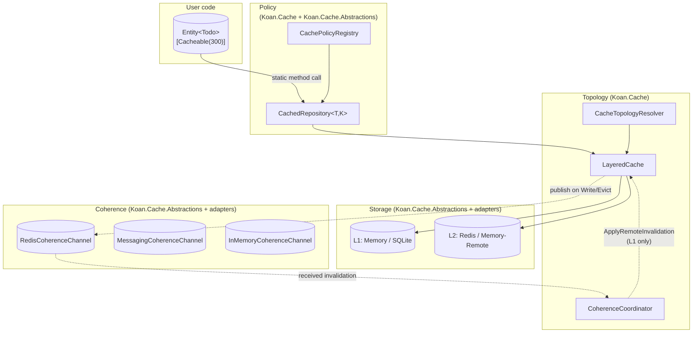

# Koan.Cache v2 — Implementation Plan

**Status:** Approved architecture · ready to build · greenfield
**Scope:** Complete rewrite of the caching pillar (Storage, Coherence, Topology, Policy)
**Version target:** 0.7.0 (breaking change vs 0.6.x — authorized; no current users of cache surface)
**Date:** 2026-05-15

---

## 1. Executive summary

The current caching stack is structurally broken: `ICacheStore` conflates K/V storage with pub/sub coherence, the receive-side coherence logic evicts the wrong tier, no caller publishes invalidations on the write path, and per-policy provider pinning is dead metadata. None of this is in production use.

This plan rebuilds the pillar from first principles around **four orthogonal concerns** — Storage, Coherence, Topology, Policy — each with its own contract and package boundary. The result honours the Koan framework's core principles:

- **Reference = Intent**: adding `Koan.Cache.Adapter.Redis` activates Redis-as-L2 AND cross-node coherence with zero user code.
- **Entity-first**: `[Cacheable]` on a class deriving from `Entity<T>` is the entire surface 90% of users will ever see.
- **Self-reporting**: every cached entity, topology choice, and coherence channel is enumerated in the boot report.
- **Transparency**: developers can drop to `[CachePolicy]` for power-user scenarios without leaving the pipeline.

This document is the complete blueprint: contracts, semantics, configuration, DX walkthroughs, milestones, and test strategy. Implementation can begin immediately after sign-off; the milestones are ordered to ship value incrementally.

---

## 2. Goals and non-goals

### Goals

1. **L1 + L2 transparent caching for any `Entity<T>`** with one attribute.
2. **Cross-node cache coherence** that activates automatically when a coherence-capable adapter is referenced.
3. **Transport-agnostic coherence** — Redis pub/sub, `Koan.Messaging`, in-process, future NATS/Kafka, all plug in identically.
4. **Defense in depth** — correctness when coherence is silent: short L1 TTL, DB-wins on writes, evict-on-coherence-receive.
5. **Per-request opt-out** for admin/diagnostic flows.
6. **HTTP-standard semantics** via `Cache-Control` header mapping.
7. **Test-grade observability** — boot reports, OpenTelemetry metrics, optional diagnostics endpoint.

### Non-goals (out of scope for v2)

- **Query-result caching** (`Query(predicate)`, `Query(string)`). Invalidation semantics for predicate-keyed entries are unsolved; deferred.
- **Distributed transactions across cache + DB.** DB always wins. No 2PC.
- **Cache warmup on boot.**
- **Replacing Newtonsoft.Json with System.Text.Json** for cache serialization. Independent decision.
- **Cache-aside for non-`Entity<T>` types.** Still available via `Cache.WithJson<T>(...)` fluent surface; not the focus here.
- **Per-tenant TTL overrides.** Achievable via `EntityContext` scope + custom `[CachePolicy]`; not in `[Cacheable]`'s shape.

---

## 3. Architecture — four pillars



### Pillar boundaries

| Pillar | Owns | Does NOT know about |
|---|---|---|
| **Storage** | K/V verbs on bytes | Coherence, topology, policy |
| **Coherence** | Broadcast/receive invalidations across nodes | Specific stores, policy |
| **Topology** | L1/L2 wiring, read/write orchestration, applying remote invalidations | Specific transports |
| **Policy** | Per-entity/per-method declarative intent | Wire transports or store types |

Each pillar can be tested in isolation. The four pillars meet exactly in `Koan.Cache`.

---

## 4. Contracts

All contracts live in `Koan.Cache.Abstractions`. Adapters take only this dependency.

### 4.1 Storage — `ICacheStore`

```csharp
namespace Koan.Cache.Abstractions.Stores;

public interface ICacheStore
{
    string Name { get; }
    CacheStorePlacement Placement { get; }
    CacheStoreCapabilities Capabilities { get; }

    ValueTask<CacheFetchResult> Fetch(CacheKey key, CacheReadOptions options, CancellationToken ct);
    ValueTask Set(CacheKey key, CacheValue value, CacheWriteOptions options, CancellationToken ct);
    ValueTask<bool> Remove(CacheKey key, CancellationToken ct);
    ValueTask<bool> Exists(CacheKey key, CancellationToken ct);
    ValueTask Touch(CacheKey key, TimeSpan? newAbsoluteTtl, CancellationToken ct);
    IAsyncEnumerable<TaggedCacheKey> EnumerateByTag(string tag, CancellationToken ct);
}

public enum CacheStorePlacement
{
    Local,    // process-local (Memory, SQLite-on-disk)
    Remote    // shared across nodes (Redis, Memcached, ...)
}

public sealed record CacheStoreCapabilities(
    bool SupportsTags,
    bool SupportsSlidingTtl,
    bool SupportsStaleWhileRevalidate,
    bool SupportsBinary,
    bool SupportsPersistence);
```

**Removed vs v1:** `PublishInvalidation`, `SupportsPubSubInvalidation`, `"pubsub"` hint. Storage is storage.

### 4.2 Coherence — `ICacheCoherenceChannel`

```csharp
namespace Koan.Cache.Abstractions.Coherence;

public readonly record struct CacheInvalidation(
    CacheInvalidationKind Kind,
    CacheKey? Key,                          // null for EvictByTag/EvictAll
    IReadOnlySet<string>? Tags,             // null for EvictKey/EvictAll
    string? Region,
    string? ScopeId,
    Guid OriginNodeId,
    DateTimeOffset PublishedAtUtc);

public enum CacheInvalidationKind
{
    EvictKey,        // single key
    EvictByTag,      // every entry carrying any of Tags
    EvictAll         // entire local cache (use sparingly)
}

public interface ICacheCoherenceChannel
{
    string TransportName { get; }
    CoherenceCapabilities Capabilities { get; }

    ValueTask Publish(CacheInvalidation invalidation, CancellationToken ct);

    ValueTask Subscribe(
        Func<CacheInvalidation, CancellationToken, ValueTask> onReceived,
        CancellationToken ct);

    ValueTask<string?> CatchUp(
        string? cursor,
        Func<CacheInvalidation, CancellationToken, ValueTask> onReceived,
        CancellationToken ct);
}

public sealed record CoherenceCapabilities(
    bool SupportsCatchUp,        // can replay missed messages
    bool GuaranteesAtLeastOnce,  // false = best-effort pub/sub
    bool PreservesPerKeyOrder);
```

Channels declare a `[ProviderPriority]` attribute to control precedence when multiple are registered. The coordinator sorts descending; config pin overrides.

### 4.3 Policy — attributes + descriptor

```csharp
namespace Koan.Cache.Abstractions.Policies;

[AttributeUsage(AttributeTargets.Class | AttributeTargets.Struct, Inherited = true, AllowMultiple = false)]
public class CacheableAttribute : CachePolicyAttribute
{
    public CacheableAttribute(int ttlSeconds = 300)
        : base(CacheScope.Entity, "{TypeName}:{Partition}:{Id}")
    {
        if (ttlSeconds > 0) AbsoluteTtl = TimeSpan.FromSeconds(ttlSeconds);
        Tier     = CacheTier.Layered;
        Strategy = CacheStrategy.GetOrSet;
        Tags     = new[] { "{TypeName}" };
    }

    public int  L1TtlSeconds          { init => L1AbsoluteTtl = TimeSpan.FromSeconds(value); }
    public int  SlidingTtlSeconds     { init => SlidingTtl    = TimeSpan.FromSeconds(value); }
    public int  AllowStaleForSeconds  { init => AllowStaleFor = TimeSpan.FromSeconds(value); }
}

// CachePolicyAttribute — reshaped: TTLs now have int-second sister setters; pin fields are first-class
public class CachePolicyAttribute : Attribute
{
    public CachePolicyAttribute(CacheScope scope, string keyTemplate) { ... }

    public CacheScope          Scope                    { get; }
    public string              KeyTemplate              { get; }
    public CacheStrategy       Strategy                 { get; init; } = CacheStrategy.GetOrSet;
    public CacheConsistencyMode Consistency             { get; init; } = CacheConsistencyMode.StaleWhileRevalidate;
    public CacheTier           Tier                     { get; init; } = CacheTier.Layered;

    public TimeSpan?           AbsoluteTtl              { get; init; }
    public TimeSpan?           L1AbsoluteTtl            { get; init; }   // optional L1 override
    public TimeSpan?           SlidingTtl               { get; init; }
    public TimeSpan?           AllowStaleFor            { get; init; }

    public string[]            Tags                     { get; init; } = [];
    public string?             Region                   { get; init; }
    public string?             ScopeId                  { get; init; }

    public string?             LocalProvider            { get; init; }   // store Name pin
    public string?             RemoteProvider           { get; init; }   // store Name pin
    public bool                ForceCoherenceBroadcast  { get; init; } = true;

    public IDictionary<string, string> Metadata         { get; init; } = new Dictionary<string, string>();
}

public sealed record CachePolicyDescriptor(
    CacheScope                  Scope,
    string                      KeyTemplate,
    CacheStrategy               Strategy,
    CacheConsistencyMode        Consistency,
    CacheTier                   Tier,
    TimeSpan?                   AbsoluteTtl,
    TimeSpan?                   L1AbsoluteTtl,
    TimeSpan?                   SlidingTtl,
    TimeSpan?                   AllowStaleFor,
    IReadOnlyList<string>       Tags,
    string?                     Region,
    string?                     ScopeId,
    string?                     LocalProvider,
    string?                     RemoteProvider,
    bool                        ForceCoherenceBroadcast,
    IReadOnlyDictionary<string, string> Metadata,
    MemberInfo?                 TargetMember,
    Type?                       DeclaringType)
{
    public CacheReadOptions  ToReadOptions();
    public CacheWriteOptions ToWriteOptions();
}
```

**Closed v1 gaps:** descriptor now carries Tier, LocalProvider, RemoteProvider, L1AbsoluteTtl, ForceCoherenceBroadcast.

### 4.4 Primitives — cleaned-up read/write options

```csharp
public sealed record CacheReadOptions(
    string?  Region,
    string?  ScopeId,
    CacheConsistencyMode Consistency,
    TimeSpan? AllowStaleFor);

public sealed record CacheWriteOptions(
    TimeSpan? AbsoluteTtl,
    TimeSpan? L1AbsoluteTtl,           // optional override; null = derive
    TimeSpan? SlidingTtl,
    TimeSpan? AllowStaleFor,
    IReadOnlySet<string> Tags,
    string?  Region,
    string?  ScopeId,
    bool     ForceCoherenceBroadcast);
```

L1 TTL derivation if `L1AbsoluteTtl == null`:
```
L1AbsoluteTtl = AbsoluteTtl is null
    ? null
    : TimeSpan.FromSeconds(Math.Max(30, AbsoluteTtl.TotalSeconds / 2));
```

This is the defense-in-depth default: worst-case L1 staleness is bounded even when coherence is silent.

---

## 5. Topology — `LayeredCache` and `CoherenceCoordinator`

Both internal to `Koan.Cache`. Composition over inheritance — neither implements `ICacheStore`.

### 5.1 `CacheTopologyResolver`

Picks one L1 and one L2 from the registered `ICacheStore`s at startup:

```csharp
internal sealed class CacheTopologyResolver
{
    public CacheTopology Resolve(IEnumerable<ICacheStore> stores, CacheOptions options);
}

internal sealed record CacheTopology(ICacheStore? Local, ICacheStore? Remote);
```

Resolution order (per tier):
1. Explicit config pin (`Koan:Cache:LocalProvider` / `RemoteProvider` matched on `Name`).
2. Highest `[ProviderPriority]` among stores with matching `Placement`.
3. First store with matching `Placement`.
4. Null (single-tier deployment).

Boot fails fast if `CoherenceMode == Required` and no channel is registered with a Remote tier present.

### 5.2 `LayeredCache`

```csharp
internal sealed class LayeredCache
{
    public ValueTask<CacheFetchResult> Read(
        CacheKey key, CacheReadOptions options, CancellationToken ct);

    public ValueTask Write(
        CacheKey key, CacheValue value, CacheWriteOptions options, CancellationToken ct);

    public ValueTask Evict(CacheKey key, CacheEvictReason reason, CancellationToken ct);
    public ValueTask EvictByTag(string tag, CacheEvictReason reason, CancellationToken ct);
    public ValueTask EvictAll(CacheEvictReason reason, CancellationToken ct);

    internal ValueTask ApplyRemoteInvalidation(in CacheInvalidation msg, CancellationToken ct);
}

internal enum CacheEvictReason { Explicit, EntityWrite, EntityDelete, Tag }
```

#### Read path

```
Read(key, options):
  if L1: try L1 fetch
    hit → return
  if L2: try L2 fetch
    hit:
      if L1: backfill L1 fire-and-forget (use derived L1 TTL)
      return
  return Miss
```

#### Write path

```
Write(key, value, options):
  in parallel:
    if L1: L1.Set(key, value, L1Options)
    if L2: L2.Set(key, value, L2Options)
  await both
  if any channel registered AND options.ForceCoherenceBroadcast:
    Publish(EvictKey, key, originNodeId=self)
```

Asymmetric model: **writer write-through, peers evict.** The broadcast message is always `EvictKey` (or `EvictByTag`/`EvictAll`), never `SetWithValue`. DB is the single resolver for any cross-node race.

#### Apply remote invalidation

```
ApplyRemoteInvalidation(msg):
  if msg.OriginNodeId == self.NodeId: return  (origin filter — also done in coordinator)
  if L1 is null: return                       (RemoteOnly deployment)
  switch msg.Kind:
    EvictKey   → L1.Remove(msg.Key)
    EvictByTag → enumerate L1 by each tag → L1.Remove for each
    EvictAll   → L1.Clear (or fall back to scan-and-remove if not supported)
```

**Critical: `ApplyRemoteInvalidation` NEVER touches L2 and NEVER republishes.** Encoded as an explicit method name to prevent accidental reuse of `Evict`.

### 5.3 `CoherenceCoordinator`

```csharp
internal sealed class CoherenceCoordinator : IHostedService, IAsyncDisposable
{
    private readonly Guid _nodeId = Guid.NewGuid();
    private readonly IReadOnlyList<ICacheCoherenceChannel> _channels;  // sorted by [ProviderPriority] desc
    private readonly LayeredCache _cache;
    private readonly CoherenceCoalescingBuffer _coalescer;  // optional, configurable

    public Task StartAsync(CancellationToken ct);
    public Task StopAsync(CancellationToken ct);

    internal ValueTask BroadcastEvict(CacheKey key, IReadOnlySet<string>? tags, CancellationToken ct);
}
```

`StartAsync`:
1. Subscribe handler on every channel.
2. For each channel with `SupportsCatchUp`, invoke `CatchUp(lastSeenCursor, handler)`.
3. Persist subscription tokens for clean shutdown.

`OnReceived` handler:
1. Drop if `msg.OriginNodeId == _nodeId`.
2. Drop if `coalescer` already saw this `(Key, PublishedAtUtc)` within dedupe window.
3. Call `_cache.ApplyRemoteInvalidation(msg, ct)`.

`BroadcastEvict` (called by `LayeredCache.Write` and `Evict`):
- Build `CacheInvalidation` with `OriginNodeId = _nodeId`.
- If `CoalescingMs > 0`: stage into coalescing buffer (key-keyed, debounced).
- Else: publish immediately to every channel in parallel.

Failures publishing to a channel are logged but do not throw — coherence is best-effort by design.

### 5.4 `CoherenceCoalescingBuffer`

Configurable per `CacheOptions.CoherenceCoalescingMs` (default `0` = disabled):
- Key-keyed debounce: multiple writes to the same key within window collapse to one broadcast.
- Tag broadcasts never coalesce (lower-frequency, higher-impact).
- Hard cap (`CoherenceCoalescingMaxBuffered = 10000`) flushes early to prevent memory blowup under storm.

---

## 6. Coherence semantics — the consistency model

The model is **eventual consistency with DB-wins resolution and bounded staleness via L1 TTL.**

### 6.1 Write invariants

Every successful `Upsert` or `Delete` of an entity covered by `[Cacheable]` results in:

1. **Database write commits first.** Cache is never ahead of truth.
2. **Local L1 and L2 are updated** before the method returns:
   - `GetOrSet` / `SetOnly`: write-through (cache holds new value).
   - `GetOnly` / `Invalidate`: evict (cache entry removed).
   - `NoCache`: skipped.
3. **Peers receive `EvictKey`** via coherence (regardless of local strategy). Their next read fetches truth from L2 or DB.

This holds even under `EntityContext.WithCacheBehavior(CacheBehavior.Bypass)` — bypass affects reads, never writes.

### 6.2 Read invariants

For any cached entity:
1. L1 hit → returned (may be up to `L1AbsoluteTtl` stale; bounded by design).
2. L1 miss + L2 hit → L1 backfilled, returned.
3. Both miss → DB fetched via inner repository, cache populated, returned.
4. **Singleflight gate per key**: only one factory invocation per concurrent miss. Stampede-proof.

### 6.3 What this does NOT guarantee

- **Cross-node read-your-writes within milliseconds.** A node writing X does not see Y written by another node until coherence message arrives. Within milliseconds typically; bounded by L1 TTL worst case.
- **Strict serialization across nodes.** No CAS, no distributed locks. DB transactions remain the authority for any operation requiring serialization.

### 6.4 Failure modes and recovery

| Failure | Behavior | Recovery |
|---|---|---|
| Channel publish fails | Logged; write succeeds; peers may be stale until L1 TTL | None needed; L1 TTL caps damage |
| Channel temporarily disconnects | Subscriber misses messages | On reconnect, `CatchUp` replays from cursor if supported; else L1 stays stale until TTL |
| Node restarts | L1 cleared (memory); L2 unchanged | Cold L1; first read on each key backfills from L2 |
| Coordinator startup before channel | `StartAsync` blocks until subscription confirmed (with timeout) | Configurable; default 10s, fail fast on timeout if `CoherenceMode == Required` |

---

## 7. Per-request opt-out — `CacheBehavior`

```csharp
public enum CacheBehavior
{
    Default,      // honor [Cacheable] strategy
    Bypass,       // read: skip cache, hit DB; write: still invalidate
    Refresh,      // read: skip cache, hit DB, repopulate; write: still invalidate
    ReadOnly      // read: use cache if present, don't write-through; write: still invalidate
}

// In Koan.Data.Core.EntityContext (added to existing static surface):
public static IDisposable WithCacheBehavior(CacheBehavior behavior);
public static IDisposable NoCache()       => WithCacheBehavior(CacheBehavior.Bypass);
public static IDisposable RefreshCache()  => WithCacheBehavior(CacheBehavior.Refresh);
```

AsyncLocal stack, mirrors existing `EntityContext.Partition` pattern. `CachedRepository` reads it on every call:

```csharp
var behavior = EntityContext.Current.CacheBehavior ?? CacheBehavior.Default;
var effectiveStrategy = behavior switch
{
    CacheBehavior.Bypass   => CacheStrategy.NoCache,    // read path only
    CacheBehavior.Refresh  => CacheStrategy.SetOnly,    // hit DB, write to cache
    CacheBehavior.ReadOnly => CacheStrategy.GetOnly,    // read cache, don't write
    _                      => _entityPolicy.Strategy
};
```

Writes always go through `HandleWrite`, which always invalidates (broadcast + local).

### HTTP middleware (`Koan.Web`)

```csharp
// PreToolUse: opt-in via AddKoanCacheControl() in startup
app.UseKoanCacheControl();

// Behavior:
// Cache-Control: no-cache  → EntityContext.RefreshCache() for the request scope
// Cache-Control: no-store  → EntityContext.NoCache() for the request scope
// X-Koan-Cache: refresh|bypass|readonly  → matching CacheBehavior (overrides Cache-Control)
```

Opt-in via extension method to avoid surprising existing apps; documented as the recommended default.

---

## 8. Configuration

```csharp
public sealed class CacheOptions
{
    // Tiering
    public CacheTier DefaultTier            { get; set; } = CacheTier.Layered;
    public int       DefaultTtlSeconds      { get; set; } = 300;
    public int?      DefaultL1TtlSeconds    { get; set; }  // null → derive max(30, L2Ttl/2)
    public string?   LocalProvider          { get; set; }  // pin by Name
    public string?   RemoteProvider         { get; set; }  // pin by Name

    // Coherence
    public CoherenceMode CoherenceMode      { get; set; } = CoherenceMode.AutoDetect;
    public string?   CoherenceTransport     { get; set; }  // pin by TransportName
    public int       CoherenceCoalescingMs  { get; set; } = 0;
    public int       CoherenceCoalescingMaxBuffered { get; set; } = 10_000;
    public int       CoherenceStartupTimeoutMs      { get; set; } = 10_000;

    // Policy
    public IList<string> PolicyAssemblies   { get; }     = new List<string>();
    public bool          PublishInvalidationByDefault { get; set; } = true;

    // Diagnostics
    public bool      EnableDiagnosticsEndpoint { get; set; } = true;
    public TimeSpan  DefaultSingleflightTimeout { get; set; } = TimeSpan.FromSeconds(5);
}

public enum CoherenceMode
{
    AutoDetect,   // coordinator active iff ≥1 channel registered (default)
    Required,     // fail at boot if no channel and Remote tier present
    Disabled      // coordinator inactive even if channels registered
}
```

Config section: `Koan:Cache:*`. Validation via `IOptions<CacheOptions>` + custom `IValidateOptions<CacheOptions>` that asserts `DefaultL1TtlSeconds <= DefaultTtlSeconds` when both set.

---

## 9. Reference = Intent walkthrough

The system's character emerges from what happens when you reference packages. No DI calls, no Program.cs configuration required.

### 9.1 Single-node dev

```
Reference:  Koan.Cache
[Cacheable] on Todo
```

Topology: L1 = built-in Memory, L2 = none.
Coherence: none (no channel registered; `AutoDetect` → inactive).
Boot report:
```
Koan.Cache
  Topology    : local-only (memory)
  Coherence   : inactive (no channel registered)
  Policies    : 1
    Todo      : Layered (effective: LocalOnly), TTL=300s, L1=150s, tags=[Todo]
```

When `Tier=Layered` but no Remote is registered, the effective tier is `LocalOnly`. No surprise; reported explicitly.

### 9.2 Add persistent local

```
Reference:  + Koan.Cache.Adapter.Sqlite
```

Topology: L1 = SQLite (higher `[ProviderPriority]` than Memory), L2 = none.

### 9.3 Add distributed L2 — THE critical scenario

```
Reference:  + Koan.Cache.Adapter.Redis
```

Effect (zero user code):
- `RedisCacheStore` registered as Remote.
- `RedisCoherenceChannel` registered as `ICacheCoherenceChannel` (transport: `"redis-pubsub"`).
- `CoherenceCoordinator` becomes active (`AutoDetect` → ≥1 channel found).
- Cross-node L1 invalidation works.

Boot report:
```
Koan.Cache
  Topology    : layered (L1=memory, L2=redis)
  Coherence   : active (transport=redis-pubsub, catch-up=no)
  NodeId      : 7f9a4c2e-...
  Policies    : 1
    Todo      : Layered, TTL=300s, L1=150s, tags=[Todo], broadcast=yes
```

### 9.4 Use existing message bus

```
Reference:  + Koan.Cache.Adapter.Redis + Koan.Cache.Coherence.Messaging
```

Two channels registered. `MessagingCoherenceChannel` has higher `[ProviderPriority]` (rationale: re-uses existing infrastructure). Coordinator picks it; `RedisCoherenceChannel` suppressed unless `Koan:Cache:CoherenceTransport = "redis-pubsub"` overrides.

Boot report names the active channel and lists suppressed channels for diagnostics.

### 9.5 Production strict mode

```
Config: Koan:Cache:CoherenceMode = "Required"
Reference: Koan.Cache + Koan.Cache.Adapter.Redis  (no coherence adapter)
```

`RedisCacheStore` registers (Remote), but no coherence channel. Boot fails fast with a clear message.

---

## 10. Sequence diagrams

### 10.1 Read — layered with coherence active

```mermaid
sequenceDiagram
    autonumber
    actor App
    participant E as Entity&lt;Todo&gt;
    participant CR as CachedRepository
    participant CC as CacheClient
    participant LC as LayeredCache
    participant L1 as L1 Store
    participant L2 as L2 Store
    participant DB as Inner Repository

    App->>E: Todo.Get(id)
    E->>CR: Get(id)
    CR->>CC: GetOrAddAsync(key, factory, opts)
    CC->>LC: Read(key, readOpts)

    LC->>L1: Fetch(key)
    alt L1 hit
        L1-->>LC: Hit
        LC-->>CC: Hit
    else L1 miss
        LC->>L2: Fetch(key)
        alt L2 hit
            L2-->>LC: Hit
            LC->>L1: Set(key, value, L1Ttl)
            LC-->>CC: Hit
        else Both miss
            LC-->>CC: Miss
            CC->>CC: singleflight gate(key)
            CC->>DB: factory()
            DB-->>CC: Todo
            CC->>LC: Write(key, value, opts)
            par
                LC->>L1: Set
                LC->>L2: Set
            end
            Note over LC: no coherence broadcast on cache populate<br/>(only on entity write/delete)
        end
    end

    CC-->>CR: Todo?
    CR-->>E: Todo?
    E-->>App: Todo?
```

Note step 17: **cache populate from a cold read does NOT broadcast** (no data change happened). Broadcast is reserved for entity writes/deletes.

### 10.2 Write — distributed coherence

```mermaid
sequenceDiagram
    autonumber
    actor App
    participant E as Entity&lt;Todo&gt;
    participant CR as CachedRepository
    participant LC as LayeredCache (Node A)
    participant L1A as L1 (Node A)
    participant L2 as L2 (shared)
    participant CHA as Channel (Node A)
    participant CHB as Channel (Node B)
    participant CO as Coordinator (Node B)
    participant L1B as L1 (Node B)
    participant DB as DB

    App->>E: todo.Save()
    E->>CR: Upsert(todo)
    CR->>DB: Upsert(todo)
    DB-->>CR: Todo (canonical)

    CR->>LC: Write(key, value, opts)
    par writer write-through
        LC->>L1A: Set
        LC->>L2: Set
    end
    LC->>CHA: Publish(EvictKey, originNodeId=A)

    CHA-->>CHB: transport delivers
    CHB->>CO: onReceived(msg)
    CO->>CO: filter: msg.origin == self.NodeId?
    Note over CO: origin = A; self = B → continue
    CO->>LC: ApplyRemoteInvalidation(msg) on Node B's LayeredCache
    Note over LC: (different LayeredCache instance on Node B)
    LC->>L1B: Remove(key)
    Note right of L1B: L2 untouched on receiver<br/>(already evicted by writer's L2.Set on shared store)

    CR-->>E: Todo
    E-->>App: Todo
```

Node A's own subscription receives the message too, but the origin filter drops it.

### 10.3 Delete — distributed coherence

Same as 10.2 except `L2.Remove` instead of `L2.Set`, and `L1A.Remove` instead of `L1A.Set`. Broadcast unchanged.

---

## 11. Package layout

```
src/
  Koan.Cache.Abstractions/
    Stores/        ICacheStore, CacheStorePlacement, CacheStoreCapabilities
    Coherence/     ICacheCoherenceChannel, CacheInvalidation, CoherenceCapabilities, CoherenceMode
    Policies/      CachePolicyAttribute, CacheableAttribute, CachePolicyDescriptor,
                   ICachePolicyRegistry, CacheScope, CacheStrategy, CacheTier, CacheBehavior
    Primitives/    CacheKey, CacheValue, CacheReadOptions, CacheWriteOptions,
                   CacheFetchResult, TaggedCacheKey, CacheCapabilities, CacheConsistencyMode
    Serialization/ ICacheSerializer
    CacheConstants.cs

  Koan.Cache/
    Topology/      LayeredCache, CacheStoreRegistry, CacheTopologyResolver, CacheTopology
    Coherence/     CoherenceCoordinator, NodeIdProvider, CoherenceCoalescingBuffer, CursorStore
    Stores/        CacheClient, MemoryCacheStore (default L1), CacheStoreInstrumentation
    Decorators/    CachedRepository<T,K>, CacheRepositoryDecorator, CacheKeyTemplate, CachingBatchSet
    Policies/      CachePolicyRegistry, CachePolicyBootstrapper, CachePolicyMaterializer
    Serialization/ JsonCacheSerializer, StringCacheSerializer, BinaryCacheSerializer
    Singleflight/  CacheSingleflightRegistry
    Scope/         CacheScopeAccessor
    Extensions/    EntityCacheExtensions, CacheServiceCollectionExtensions
    Initialization/ KoanAutoRegistrar
    Diagnostics/   CacheInstrumentation, CacheDiagnosticsEndpoint
    Pillars/       CachingPillarManifest
    Control/       CacheTagSet
    Builders/      CacheEntryBuilder<T>

  Koan.Cache.Adapter.Sqlite/
    Stores/        SqliteCacheStore
    Initialization/ KoanAutoRegistrar, SqliteCacheAdapterRegistrar
    Options/       SqliteCacheAdapterOptions

  Koan.Cache.Adapter.Redis/
    Stores/        RedisCacheStore (storage only; envelope/tag/SWR retained)
    Coherence/     RedisCoherenceChannel (pub/sub-based)
                   RedisStreamsCoherenceChannel (catch-up flavour; optional v1)
    Serialization/ RedisCacheJsonConverter
    Initialization/ KoanAutoRegistrar, RedisCacheAdapterRegistrar
    Options/       RedisCacheAdapterOptions

  Koan.Cache.Coherence.InMemory/       [NEW]
    Channel/       InMemoryCoherenceChannel
    Initialization/ KoanAutoRegistrar

  Koan.Cache.Coherence.Messaging/      [NEW]
    Channel/       MessagingCoherenceChannel
    Initialization/ KoanAutoRegistrar
```

Two new packages (Messaging, InMemory). Memory store stays in `Koan.Cache` as the always-available default.

---

## 12. Implementation milestones

Each milestone is independently shippable and tested. Order is deliberate — later milestones depend on earlier contracts being stable.

### M1 — Abstractions reshape

**Deliverable:** New `Koan.Cache.Abstractions` with split interfaces. No implementations.

**Files:**
- New: all of `Stores/*`, `Coherence/*`, reshape `Policies/*`, reshape `Primitives/*`.
- Old `ICacheStore.PublishInvalidation` removed.
- Old `CacheCapabilities` replaced by `CacheStoreCapabilities` + `CoherenceCapabilities`.

**Tests:**
- Contract tests: compile-time only (interface surface).
- `CacheableAttribute` reflection: defaults match spec (TTL=300, L1 derived, tags=[`{TypeName}`], Tier=Layered, Strategy=GetOrSet).
- `CachePolicyDescriptor` carries all fields incl. Tier/LocalProvider/RemoteProvider/L1AbsoluteTtl/ForceCoherenceBroadcast.
- `CachePolicyDescriptor.ToReadOptions()` / `.ToWriteOptions()` round-trip.
- Negative: `CacheableAttribute` with `ttlSeconds < 0` throws.

**Acceptance:** package compiles standalone; existing `Koan.Cache` is purposefully broken (it's getting rewritten in M2).

---

### M2 — Topology rebuild

**Deliverable:** Working L1+L2 transparent cache, single-node only (no coherence).

**Files (new or rewritten in `Koan.Cache`):**
- `Stores/MemoryCacheStore.cs` — implements `ICacheStore` (Placement=Local). Retains tag indexing + SWR from v1.
- `Topology/LayeredCache.cs` — composition, internal.
- `Topology/CacheStoreRegistry.cs`, `CacheTopologyResolver.cs`, `CacheTopology.cs`.
- `Stores/CacheClient.cs` — consumes `LayeredCache` (not `ICacheStore` directly).
- `Builders/CacheEntryBuilder<T>.cs` — fluent surface unchanged.
- `Singleflight/CacheSingleflightRegistry.cs` — unchanged.
- `Scope/CacheScopeAccessor.cs` — unchanged.
- `Serialization/{Json,String,Binary}CacheSerializer.cs` — unchanged.
- `Extensions/CacheServiceCollectionExtensions.cs` — rewritten registration.
- `Initialization/KoanAutoRegistrar.cs` — rewritten boot report (Topology line).
- `Diagnostics/CacheInstrumentation.cs` — unchanged metrics.

**Tests:**
- Unit: `LayeredCache.Read` — L1 hit, L1 miss/L2 hit (backfill verified), both miss + factory invocation.
- Unit: `LayeredCache.Write` — both tiers receive Set; no broadcast (no channel).
- Unit: `LayeredCache.Evict` — both tiers receive Remove.
- Unit: `CacheTopologyResolver` — pin by config, by `[ProviderPriority]`, by `Placement`, none.
- Unit: `MemoryCacheStore` — full `ICacheStore` contract (Fetch/Set/Remove/Touch/Exists/EnumerateByTag), TTL expiry, SWR window, tag index integrity after eviction.
- Unit: `CacheClient.GetOrAddAsync` — singleflight collapses concurrent factory invocations.
- Integration: full `Cache.WithJson<Todo>("k").GetOrAdd(...)` pipeline against Memory.
- Boot report: Topology line emitted.

**Acceptance:** `Cache.WithJson<T>` fluent API works end-to-end with Memory-only store. All v1 fluent-API tests pass against the new pipeline.

---

### M3 — Coherence runtime + InMemory channel

**Deliverable:** Cross-instance cache coherence working in a single process (proves the contract).

**Files:**
- New `Coherence/CoherenceCoordinator.cs` in `Koan.Cache`.
- New `Coherence/NodeIdProvider.cs`, `CoherenceCoalescingBuffer.cs`, `CursorStore.cs` (in-memory cursor store).
- New `LayeredCache.BroadcastEvict` integration + `ApplyRemoteInvalidation` method.
- New package `Koan.Cache.Coherence.InMemory`:
  - `Channel/InMemoryCoherenceChannel.cs` — single in-process pub/sub via `Channel<CacheInvalidation>` per subscriber.
  - `Initialization/KoanAutoRegistrar.cs` — registers as `ICacheCoherenceChannel` (`[ProviderPriority(int.MinValue)]` so it's a fallback).

**Tests:**
- Unit: `CoherenceCoordinator` — Subscribe called per channel; origin filter drops own messages; `CatchUp` called when `SupportsCatchUp=true`.
- Unit: `LayeredCache.ApplyRemoteInvalidation` — touches L1 only, does NOT touch L2, does NOT republish.
- Unit: `CoherenceCoalescingBuffer` — debounce window collapses bursts; tag broadcasts pass through; hard cap flushes.
- **Integration (the cornerstone test):** two `LayeredCache` instances + `InMemoryCoherenceChannel` + two `MemoryCacheStore` instances in one process. Write on A, verify B's read returns fresh value (DB miss + L2 hit, or DB miss + miss + factory, depending on shared L2).
- Integration: three instances, writes from each are seen by the other two.
- Integration: origin filter — writer's own subscription does not double-evict.
- Integration: `EvictByTag` broadcast invalidates tagged L1 entries across instances.
- Integration: `EvictAll` broadcast clears L1 across instances.
- Integration: `CoherenceMode.Required` with no channel registered → boot failure.

**Acceptance:** the integration test from §10.2's sequence diagram passes using `InMemoryCoherenceChannel` (no Redis needed). This is the canary for the whole architecture.

---

### M4 — Redis adapter rebuild

**Deliverable:** Redis storage and Redis-pubsub coherence as independent registrations from a single package reference.

**Files:**
- `Koan.Cache.Adapter.Redis/Stores/RedisCacheStore.cs` — stripped of pub/sub code, `Channel` accessor, `HandleInvalidationMessage`. Pure `ICacheStore` (Placement=Remote).
- New `Koan.Cache.Adapter.Redis/Coherence/RedisCoherenceChannel.cs` — implements `ICacheCoherenceChannel`. Reuses the existing `IConnectionMultiplexer` DI. `[ProviderPriority(100)]`. `SupportsCatchUp=false`.
- New `Koan.Cache.Adapter.Redis/Coherence/RedisStreamsCoherenceChannel.cs` (optional in v1) — implements catch-up via Redis Streams (`XADD`/`XRANGE`). `[ProviderPriority(200)]`. `SupportsCatchUp=true`.
- Delete: `Koan.Cache.Adapter.Redis/Hosting/RedisInvalidationListener.cs`.
- Delete: `Koan.Cache.Adapter.Redis/Stores/RedisInvalidationMessage.cs` (replaced by abstractions `CacheInvalidation`).
- Update: `Koan.Cache.Adapter.Redis/Initialization/KoanAutoRegistrar.cs` — registers store AND channel.
- Update: `RedisCacheAdapterOptions` — drops `EnablePubSubInvalidation`/`ChannelName` (moved into channel-specific options).

**Tests:**
- Unit (with `Microsoft.Extensions.Caching.StackExchangeRedis` test doubles or in-memory Redis): `RedisCacheStore` full contract.
- Unit: `RedisCoherenceChannel` `Publish` produces correct payload; `Subscribe` deserializes correctly; origin field round-trips.
- Integration (Testcontainers Redis): two `RedisCacheStore` instances share L2 + one `RedisCoherenceChannel` each. End-to-end cross-process eviction.
- Integration: Redis pub/sub temporarily lost (kill `subscribe` connection); after reconnect, **without** `XStreams` channel, document that staleness persists until L1 TTL. **With** `XStreams` channel, verify catch-up replays missed messages.
- Integration: `[ProviderPriority]` — when both `RedisCoherenceChannel` and `RedisStreamsCoherenceChannel` are registered, Streams wins by default.

**Acceptance:** §9.3 scenario passes — referencing `Koan.Cache.Adapter.Redis` and tagging `Todo` with `[Cacheable]` produces cross-node coherence without any user code.

---

### M5 — Policy reshape

**Deliverable:** `[Cacheable]` and `[CachePolicy]` discovery; descriptor carrying all fields; policy registry rebuilt.

**Files:**
- `Koan.Cache.Abstractions/Policies/CacheableAttribute.cs` — already created in M1, but discovery wiring lands here.
- `Koan.Cache/Policies/CachePolicyRegistry.cs` — rewritten to fold `Tier`, `LocalProvider`, `RemoteProvider`, `L1AbsoluteTtl`, `ForceCoherenceBroadcast` into descriptor.
- `Koan.Cache/Policies/CachePolicyBootstrapper.cs` — scans assemblies, calls `CachePolicyMaterializer`.
- New `Koan.Cache/Policies/CachePolicyMaterializer.cs` — resolves `{TypeName}` tokens in tags, derives default `L1AbsoluteTtl` if unset.

**Tests:**
- Unit: `[Cacheable]` on a class → descriptor with TTL=300, L1=150, Tier=Layered, Strategy=GetOrSet, tags=[ClassName], key=`{TypeName}:{Partition}:{Id}`.
- Unit: `[Cacheable(60)]` → TTL=60, L1=30.
- Unit: `[Cacheable(60, L1TtlSeconds=10)]` → L1=10 (explicit override wins).
- Unit: `[Cacheable(600, L1TtlSeconds=0)]` → L1=null (no L1 expiry — opt-in to L1=L2).
- Unit: `[CachePolicy(Scope=Entity, KeyTemplate="x:{Id}", Tier=LocalOnly, LocalProvider="memory")]` — all fields propagate to descriptor.
- Unit: `{TypeName}` tag materialization — `Tags=["{TypeName}"]` on `Todo` → `Tags=["Todo"]` in descriptor.
- Unit: `CachePolicyRegistry` immutable rebuild on `AssemblyLoad`.
- Unit: validation — `L1AbsoluteTtl > AbsoluteTtl` is rejected with clear error.

**Acceptance:** boot report lists every `[Cacheable]` entity with full materialized policy.

---

### M6 — Decorator hardening

**Deliverable:** `CachedRepository` honours partition/source/CacheBehavior; writes always invalidate.

**Files:**
- `Koan.Cache/Decorators/CachedRepository.cs` — major changes:
  - `TryBuildEntityKey` ambient includes `{TypeName}`, `{Partition}` (`EntityContext.Current.Partition ?? "_"`), `{Source}` (`EntityContext.Current.Source ?? "_"`).
  - `Get` consults `EntityContext.Current.CacheBehavior` to select effective strategy.
  - `HandleWrite` always invalidates (broadcasts evict), regardless of `CacheBehavior`.
  - `Delete` and `DeleteMany` always broadcast evict.
- `Koan.Cache/Decorators/CacheRepositoryDecorator.cs` — unchanged (still the `IDataRepositoryDecorator` plug).
- `Koan.Cache/Decorators/CacheKeyTemplate.cs` — unchanged.
- `Koan.Data.Core/EntityContext.cs` — new `CacheBehavior` ambient field + `WithCacheBehavior` / `NoCache` / `RefreshCache` static helpers.

**Tests:**
- Unit: `Get` honours each `CacheBehavior` mode correctly.
- Unit: `Upsert` under `Bypass` — DB hit, cache evict broadcast (not skipped).
- Unit: `Delete` under `Bypass` — DB delete, cache evict broadcast.
- Unit: Partition isolation — same `Id` in `Partition("a")` and `Partition("b")` produce two distinct cache keys.
- Unit: Source isolation — same `Id` under `Source("primary")` vs `Source("readreplica")` produce distinct cache keys.
- Unit: `EntityContext.WithCacheBehavior` AsyncLocal — nested scopes, dispose order, leak protection.
- Unit: missing token in key template → debug log + cache skip + DB hit (existing behaviour preserved).
- Integration: `[Cacheable]` on Todo + two-instance LayeredCache + InMemoryCoherenceChannel:
  - Save on A → read on B returns fresh.
  - Save on A under `EntityContext.NoCache()` → cache on A NOT populated; coherence still broadcast; B's L1 evicted.
  - Refresh on A → A reads from DB, repopulates A's L1; B's L1 evicted.

**Acceptance:** §6.1 write invariants verifiable via integration tests.

---

### M7 — Web integration

**Deliverable:** `Cache-Control` middleware in `Koan.Web`.

**Files:**
- New `Koan.Web/Middleware/KoanCacheControlMiddleware.cs`.
- New `Koan.Web/Extensions/CacheControlExtensions.cs` — `app.UseKoanCacheControl()`.
- Update `Koan.Web/KoanAutoRegistrar.cs` — adds opt-in registration helper; does not auto-`Use` (apps decide where in the pipeline).

**Tests:**
- Unit: `Cache-Control: no-cache` → `EntityContext.Current.CacheBehavior == Refresh` during request.
- Unit: `Cache-Control: no-store` → `Bypass`.
- Unit: `X-Koan-Cache: refresh|bypass|readonly` overrides `Cache-Control`.
- Unit: scope disposed before next request begins (no AsyncLocal leak).
- Integration: HTTP request → cached controller endpoint → `no-cache` header forces DB hit and repopulates cache.

**Acceptance:** documented sample of "refresh by Cache-Control header" works end-to-end.

---

### M8 — Messaging channel

**Deliverable:** `Koan.Cache.Coherence.Messaging` package as alternative to Redis-pubsub.

**Files:**
- New package `Koan.Cache.Coherence.Messaging/`.
- `Channel/MessagingCoherenceChannel.cs` — implements `ICacheCoherenceChannel` over `Koan.Messaging.IMessageBus` (or whatever the canonical interface is — verify against current Koan.Messaging.Core surface). Subject/topic: `koan.cache.invalidations`. `[ProviderPriority(150)]` (above pubsub-Redis, below Redis-Streams).
- `Initialization/KoanAutoRegistrar.cs`.

**Tests:**
- Unit: `MessagingCoherenceChannel` `Publish` produces correct envelope; `Subscribe` handler binds to topic.
- Integration: two app instances, both reference `Koan.Cache.Coherence.Messaging` only (no Redis), share a message bus (in-memory or RabbitMQ via Testcontainers per Koan.Messaging defaults). Write on A → B's L1 evicted.
- Integration: precedence — when both `RedisCoherenceChannel` and `MessagingCoherenceChannel` registered, Messaging wins by priority.

**Acceptance:** §9.4 scenario passes.

---

### M9 — Boot report + diagnostics

**Deliverable:** rich per-entity boot reporting; optional HTTP diagnostics endpoint.

**Files:**
- `Koan.Cache/Initialization/KoanAutoRegistrar.cs` — `Describe` emits:
  - `Topology: layered (L1={localName}, L2={remoteName})` or `local-only` / `remote-only` / `none`.
  - `Coherence: active (transport={name}, catch-up={bool})` or `inactive (reason)`.
  - `NodeId: {guid}` (truncated).
  - Per `CachePolicyDescriptor`: `Policy:{TypeName}: tier={Tier}, ttl={AbsoluteTtl}, l1={L1AbsoluteTtl}, strategy={Strategy}, tags=[{Tags}], broadcast={ForceCoherenceBroadcast}`.
- `Koan.Cache/Diagnostics/CacheDiagnosticsEndpoint.cs` — `GET /diagnostics/cache` (when `EnableDiagnosticsEndpoint=true`):
  - JSON: topology, coherence status, registered channels (including suppressed), live policies, hit/miss/set/remove counters, last invalidation timestamps.
- `Koan.Cache/Diagnostics/CacheInstrumentation.cs` — add metrics:
  - `koan.cache.coherence.published`, `koan.cache.coherence.received`, `koan.cache.coherence.applied` (tagged by transport).
  - `koan.cache.tier.fetches`, `tier.hits`, `tier.misses` (tagged by tier=local|remote).
  - Histograms: `koan.cache.read.duration`, `write.duration` (tagged by hit/miss).

**Tests:**
- Unit: boot report contains all expected lines for each topology/coherence combination.
- Unit: diagnostics endpoint returns JSON shape under config `Enable=true`; 404 under `Enable=false`.
- Integration: metrics emitted under each operation type (read hit, read miss, write, evict, coherence pub/recv).

**Acceptance:** running a sample app and hitting `/diagnostics/cache` returns full state.

---

### M10 — Documentation, sample, migration guide

**Deliverable:** the docs reflect v2 reality and there's a runnable sample.

**Files:**
- Rewrite `docs/reference/data/cache.md` top-down for v2.
- Rewrite `docs/architecture/koan-cache-module.md` to match the four-pillar architecture.
- New `docs/decisions/ARCH-0XXX-cache-v2-greenfield.md` capturing the architecture decision record.
- Add `[Cacheable(120)]` to `samples/S2.Api/Models/Todo.cs`.
- New `.claude/skills/koan-caching/SKILL.md` — pattern recognition entry for AI assistants.
- Update `CLAUDE.md` "Framework Utilities" section: replace v1 cache entries with v2 surface.
- New `docs/migration/cache-v1-to-v2.md` — explicitly empty migration (no prior consumers); placeholder for the rationale.

**Tests:**
- Sample `S2.Api` boots, returns cached Todo, deletes, returns 404, all observable in boot report + metrics.
- Build pipeline (CI): all new docs lint clean.

**Acceptance:** a new contributor reading `docs/reference/data/cache.md` can ship a cached entity without reading any other doc.

---

## 13. Test strategy — cross-cutting

### 13.1 Coverage targets

- **Unit tests**: 90%+ line coverage on contract types, descriptors, key templates, coalescer, coordinator, layered cache, decorator.
- **Integration tests**: every milestone has an end-to-end test that proves the milestone's external behaviour against real components (real Memory store, real SQLite, Testcontainers Redis as appropriate).
- **Cross-pillar tests**: the M3 cornerstone test (2+ LayeredCache instances + InMemoryCoherenceChannel) and the M4 cornerstone test (2+ processes + Redis Testcontainer) are the architectural canaries.

### 13.2 Test categories

| Category | Purpose | Where it lives |
|---|---|---|
| **Contract** | Interface surface compiles; descriptors round-trip; attribute defaults | `Koan.Cache.Abstractions.Tests` |
| **Unit (per-component)** | Each class tested in isolation with mocks/fakes | Per-project `*.Tests` |
| **Integration (in-process)** | Wire real components; use `InMemoryCoherenceChannel` and `MemoryCacheStore` | `Koan.Cache.IntegrationTests` |
| **Integration (Testcontainers)** | Real Redis / SQLite-on-disk / RabbitMQ behind real network | `Koan.Cache.Adapter.Redis.IntegrationTests`, etc. |
| **Property** | Cache key uniqueness, descriptor round-trips under random inputs | `Koan.Cache.PropertyTests` (FsCheck or Bogus) |
| **Concurrency** | Singleflight collapses N concurrent factories to 1; coalescing buffer under storm | `Koan.Cache.ConcurrencyTests` |
| **Failure injection** | Channel publish fails; subscriber loses connection; L2 unavailable | Integration suite using fault-injecting fakes |
| **Sample-as-test** | `samples/S2.Api` runs in CI with `[Cacheable]` enabled | `samples/S2.Api.Tests` |

### 13.3 Shared cache store contract tests

A single test fixture `CacheStoreContractTests<TStore>` exercises the full `ICacheStore` contract:
- Fetch hit/miss/expired/stale.
- Set with each TTL combination (absolute, sliding, SWR).
- Remove returns true once, false subsequently.
- Touch extends TTL without changing value.
- Exists matches Fetch/Remove.
- EnumerateByTag returns only matching keys; doesn't return evicted keys; survives concurrent eviction.
- Capabilities declarations match observed behaviour (e.g., `SupportsSlidingTtl=true` → sliding actually slides).

Each adapter inherits the fixture: `MemoryCacheStoreContractTests`, `SqliteCacheStoreContractTests`, `RedisCacheStoreContractTests`. Same tests, different setup.

### 13.4 Shared coherence channel contract tests

Same approach for `ICacheCoherenceChannel`:
- Publish → Subscribe round-trip.
- Origin filter (publisher's own subscription sees the message but coordinator drops it).
- CatchUp returns missed messages when `SupportsCatchUp=true`; is a no-op otherwise.
- Capabilities declarations match observed behaviour.
- Concurrent publishers; concurrent subscribers; survival under transient publish failures.

Each adapter inherits: `InMemoryCoherenceChannelContractTests`, `RedisCoherenceChannelContractTests`, `RedisStreamsCoherenceChannelContractTests`, `MessagingCoherenceChannelContractTests`.

### 13.5 The M3 / M4 cornerstone tests in detail

**M3 (in-process):**
```csharp
[Fact]
public async Task WriteOnA_InvalidatesL1OnB()
{
    // Arrange: two LayeredCache instances, shared L2 = a single MemoryCacheStore (treated as Remote),
    // two distinct L1 = MemoryCacheStore (Local) each, one InMemoryCoherenceChannel shared.
    var sharedRemote = new MemoryCacheStore(Placement.Remote);
    var channel = new InMemoryCoherenceChannel();

    var nodeA = BuildLayeredCache(local: new MemoryCacheStore(Placement.Local), remote: sharedRemote, channel: channel);
    var nodeB = BuildLayeredCache(local: new MemoryCacheStore(Placement.Local), remote: sharedRemote, channel: channel);

    // Warm up: B reads, populates its L1
    await nodeA.Write(key, value, opts);          // A writes; coherence broadcast
    var initial = await nodeB.Read(key, opts);    // B reads → L1 miss, L2 hit, backfill B.L1
    initial.Hit.Should().BeTrue();

    // Act: A writes a new value
    await nodeA.Write(key, value2, opts);

    // Assert: B's L1 was evicted by coherence; next read hits L2 (which has new value)
    await WaitForCoherence();                     // small delay; in-memory channel is fast
    var fresh = await nodeB.Read(key, opts);
    fresh.Value.ShouldDeserializeAs(value2);
}
```

**M4 (multi-process via Testcontainers):**
- Two test hosts in same xunit assembly (or fixtures), each with its own DI container, both pointing at the same Testcontainers Redis.
- Same logical flow as M3 but over the wire.

### 13.6 Performance tests

Not unit-level perf tests; one perf regression suite under `tests/Koan.Cache.Performance`:
- `BenchmarkDotNet` micro-benchmarks: `LayeredCache.Read` hit / miss, `Write`, singleflight under N concurrent callers.
- Threshold gating in CI: 20% regression on any benchmark fails the build.

---

## 14. Risk register

| Risk | Likelihood | Impact | Mitigation |
|---|---|---|---|
| Coherence message volume on hot writes overwhelms transport | Medium | Medium | Configurable coalescing buffer (`CoherenceCoalescingMs`); default off; documented |
| Subscriber missed messages during disconnect cause stale L1 | High (pubsub) / Low (streams) | Medium | L1 TTL ceiling; opt-in `RedisStreamsCoherenceChannel` for catch-up |
| Two channels registered → double bandwidth | Low | Low | `[ProviderPriority]` ordering + config pin; non-primary channels not subscribed when pin set |
| Origin filter relies on `Guid.NewGuid()` collision | Negligible | N/A | Standard; unit-tested |
| Catch-up cursor lost across restart | Low | Low | On startup, flush local L1 if cursor unknown — safe fallback |
| `L1Ttl >= L2Ttl` causes L1 to outlive L2 (negative defense-in-depth) | Medium | Medium | Validator rejects at boot; documented invariant |
| Test surface for coherence is hard | Medium | Medium | `InMemoryCoherenceChannel` keeps in-process integration cheap; M3 cornerstone test catches regressions |
| Multi-node integration in CI is flaky | Medium | Low | Testcontainers + retry with backoff; quarantine flagged tests |
| `Koan.Messaging` API drift breaks `Koan.Cache.Coherence.Messaging` | Low | Medium | Pin against the public `IMessageBus` interface; integration test in CI |
| Per-entity `LocalProvider`/`RemoteProvider` pinning collides with global topology resolver | Medium | Low | Document: per-entity pin overrides global, but only if both stores are registered |

---

## 15. Open questions (residual)

None blocking. Remaining decisions are deferrable to during-build:

1. **Cursor store backend.** In-memory is the v1 default; if users complain about post-restart staleness with `RedisStreamsCoherenceChannel`, add a `Koan.Cache/Coherence/CursorStore` with file-system or L1-key persistence. Decide based on usage.
2. **`Cache-Control: max-age=N` mapping.** Could push a one-off override of the policy's TTL for the request scope. Useful for "give me data no older than 60s." Not required for v1; can be added without breaking changes.
3. **OpenTelemetry tracing on coherence hops.** Add `Activity` spans on `Publish` and `OnReceived` with linked context for distributed tracing visualization. Nice-to-have; add in M9 if budget allows.
4. **`EvictAll` is a sledgehammer — should it be rate-limited?** `Todo.Cache.FlushAll()` on a hot path could cause cluster-wide L1 thrashing. Document as a tag-flush-style operation (use sparingly); add a metric to detect abuse.

---

## 16. Acceptance criteria

Each of these is an integration test in CI. The pillar is shippable when all pass.

1. **Reference = Intent — single-node.** Project references only `Koan.Cache`. `[Cacheable]` on Todo. `Todo.Get(id)` twice → one DB hit (asserted via inner-repo spy). Boot report names topology = local-only.
2. **Reference = Intent — distributed.** Project additionally references `Koan.Cache.Adapter.Redis`. Two processes / fixtures pointing at the same Testcontainers Redis. Write on A → B's next read returns fresh value. Boot report names topology = layered, coherence = active.
3. **Reference = Intent — messaging.** Project additionally references `Koan.Cache.Coherence.Messaging` (alongside Redis). `[ProviderPriority]` causes Messaging to be chosen. Verified via boot report; verified via integration that Messaging channel is the one carrying invalidations.
4. **L1 TTL defense in depth.** Configure `[Cacheable(300)]`. Stop coherence (e.g., kill Redis pub/sub connection on B). Write on A. B's L1 holds the stale value for up to L1Ttl (150s) and then refreshes from L2. Verified with a sped-up clock or short TTL test override.
5. **Partition isolation.** Same id in `Partition("a")` vs `Partition("b")` returns two distinct entities through cache.
6. **Per-request bypass.** `using (EntityContext.NoCache()) { await Todo.Get(id); }` always hits DB. Subsequent normal `Todo.Get(id)` hits cache (bypass did not pollute or invalidate).
7. **Writes always invalidate.** `using (EntityContext.NoCache()) { await Todo.Upsert(t); }` evicts cache locally AND broadcasts evict. Other nodes' L1 cleared.
8. **HTTP semantics.** GET with `Cache-Control: no-cache` triggers `RefreshCache` for the request scope. Verified by inner-repo spy.
9. **CoherenceMode = Required.** Setting `CoherenceMode = "Required"` with no channel registered and Remote tier present causes boot failure with clear diagnostic message.
10. **Diagnostics endpoint.** `GET /diagnostics/cache` returns a JSON document describing topology, coherence status, policies, and live counters.

---

## 17. Migration

**There are no current consumers** of the v1 cache surface (confirmed). This is treated as greenfield.

- Version bump: 0.6.x → **0.7.0**.
- Migration doc is a one-pager in `docs/migration/cache-v1-to-v2.md` describing the architectural rationale (for future archaeology) and noting that no consumer code changes are required at this point in the framework's lifecycle.
- The four pre-existing samples that touched cache (if any survive) are updated to use `[Cacheable]`.

---

## 18. Build sequencing summary

| Milestone | Lines | Risk | External deps | Independent? |
|---|---|---|---|---|
| M1 Abstractions | ~600 | Low | None | Yes |
| M2 Topology | ~1500 | Medium | M1 | Yes |
| M3 Coherence + InMemory channel | ~800 | High (canary) | M2 | Yes |
| M4 Redis adapter | ~1200 | Medium | M3 | Yes |
| M5 Policy reshape | ~600 | Low | M2 | Mostly (touches M2 registry) |
| M6 Decorator hardening | ~700 | Medium | M5 + Koan.Data.Core for EntityContext | Yes |
| M7 Web middleware | ~200 | Low | M6 + Koan.Web | Yes |
| M8 Messaging channel | ~400 | Medium | M3 + Koan.Messaging | Yes |
| M9 Boot + diagnostics | ~500 | Low | M3 | Yes |
| M10 Docs + sample | N/A | Low | All previous | Yes |

**Critical path:** M1 → M2 → M3 → M4. M5–M10 can parallelize behind M3.

**Estimated effort:** roughly 6500 lines net (new + modified − deleted), spanning ~3 person-weeks at typical Koan-framework velocity. Reviewable in 2–3 PRs (split at M3/M4 boundaries).

---

## 19. Appendix — file index

**New files (M1–M9):**

```
src/Koan.Cache.Abstractions/Stores/CacheStorePlacement.cs
src/Koan.Cache.Abstractions/Stores/CacheStoreCapabilities.cs                   (replaces CacheCapabilities)
src/Koan.Cache.Abstractions/Coherence/ICacheCoherenceChannel.cs
src/Koan.Cache.Abstractions/Coherence/CacheInvalidation.cs
src/Koan.Cache.Abstractions/Coherence/CacheInvalidationKind.cs
src/Koan.Cache.Abstractions/Coherence/CoherenceCapabilities.cs
src/Koan.Cache.Abstractions/Coherence/CoherenceMode.cs
src/Koan.Cache.Abstractions/Policies/CacheableAttribute.cs
src/Koan.Cache.Abstractions/Policies/CacheBehavior.cs
src/Koan.Cache.Abstractions/Primitives/CacheReadOptions.cs
src/Koan.Cache.Abstractions/Primitives/CacheWriteOptions.cs

src/Koan.Cache/Topology/LayeredCache.cs
src/Koan.Cache/Topology/CacheTopology.cs
src/Koan.Cache/Topology/CacheTopologyResolver.cs
src/Koan.Cache/Coherence/CoherenceCoordinator.cs
src/Koan.Cache/Coherence/CoherenceCoalescingBuffer.cs
src/Koan.Cache/Coherence/NodeIdProvider.cs
src/Koan.Cache/Coherence/CursorStore.cs
src/Koan.Cache/Policies/CachePolicyMaterializer.cs
src/Koan.Cache/Diagnostics/CacheDiagnosticsEndpoint.cs

src/Koan.Cache.Adapter.Redis/Coherence/RedisCoherenceChannel.cs
src/Koan.Cache.Adapter.Redis/Coherence/RedisStreamsCoherenceChannel.cs        (optional v1)
src/Koan.Cache.Adapter.Redis/Coherence/RedisInvalidationEnvelope.cs

src/Koan.Cache.Coherence.InMemory/                                              (new project)
src/Koan.Cache.Coherence.Messaging/                                             (new project)

src/Koan.Web/Middleware/KoanCacheControlMiddleware.cs
src/Koan.Web/Extensions/CacheControlExtensions.cs

tests/Koan.Cache.Abstractions.Tests/
tests/Koan.Cache.IntegrationTests/                                              (in-process, InMemory channel)
tests/Koan.Cache.Adapter.Redis.IntegrationTests/                                (Testcontainers)
tests/Koan.Cache.Coherence.Messaging.IntegrationTests/                          (Testcontainers RabbitMQ)
tests/Koan.Cache.PropertyTests/
tests/Koan.Cache.ConcurrencyTests/
tests/Koan.Cache.Performance/                                                   (BenchmarkDotNet)
```

**Modified files (rewritten in place):**

```
src/Koan.Cache.Abstractions/Stores/ICacheStore.cs                              (Publish removed)
src/Koan.Cache.Abstractions/Policies/CachePolicyAttribute.cs                   (reshaped)
src/Koan.Cache.Abstractions/Policies/CachePolicyDescriptor.cs                  (extended)

src/Koan.Cache/Stores/CacheClient.cs                                           (consumes LayeredCache)
src/Koan.Cache/Stores/MemoryCacheStore.cs                                      (Placement=Local; no pub/sub)
src/Koan.Cache/Policies/CachePolicyRegistry.cs
src/Koan.Cache/Policies/CachePolicyBootstrapper.cs
src/Koan.Cache/Decorators/CachedRepository.cs                                  (partition/source/behavior)
src/Koan.Cache/Decorators/CacheKeyTemplate.cs                                  (TypeName ambient)
src/Koan.Cache/Initialization/KoanAutoRegistrar.cs                             (boot report)
src/Koan.Cache/Extensions/CacheServiceCollectionExtensions.cs

src/Koan.Cache.Adapter.Redis/Stores/RedisCacheStore.cs                         (pub/sub stripped)
src/Koan.Cache.Adapter.Redis/Initialization/KoanAutoRegistrar.cs               (registers channel)
src/Koan.Cache.Adapter.Redis/Options/RedisCacheAdapterOptions.cs               (channel opts moved)

src/Koan.Data.Core/EntityContext.cs                                            (CacheBehavior ambient)
```

**Deleted files:**

```
src/Koan.Cache.Adapter.Redis/Hosting/RedisInvalidationListener.cs
src/Koan.Cache.Adapter.Redis/Stores/RedisInvalidationMessage.cs                (replaced by abstractions DTO)
src/Koan.Cache/Stores/LayeredCacheStore.cs                                     (replaced by LayeredCache)
src/Koan.Cache/Stores/CacheStoreRegistry.cs                                    (renamed/relocated under Topology/)
```

---

## 20. Sign-off

This plan is ready for implementation when:

- [ ] Architect signs off on §3–§7 (architecture + contracts + semantics).
- [ ] Decision logged on the optional milestone M4.5 (Redis Streams catch-up channel in v1 or deferred).
- [ ] Initial PR scaffolds (M1 abstractions) created and reviewed.

Recommend logging the v2 architecture as an ADR in `docs/decisions/` before code starts, so the canonical rationale is captured.
