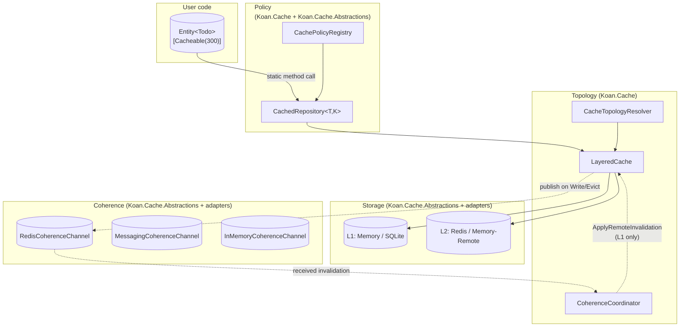

# Koan.Cache — Implementation Plan

**Status:** Approved architecture · ready to build · initial release of the cache pillar
**Scope:** First public release of `Koan.Cache.*` with Storage, Coherence, Topology, and Policy pillars
**Branch:** `feat/koan-cache-pillar` (off `dev`)
**Version target:** next minor release
**Date:** 2026-05-15

---

## 1. Executive summary

Koan needs a coherent cache primitive. The current `Koan.Cache.*` projects on `dev` are scaffolding — no public consumers, broken end-to-end (storage and coherence conflated, receive-side eviction targets the wrong tier, no write-path publisher, dead per-policy metadata). This document is the blueprint for **the actual first release** of the pillar.

The architecture splits the concern into **four orthogonal pillars** — Storage, Coherence, Topology, Policy — each with its own contract and package boundary. It honours Koan's principles:

- **Reference = Intent.** Adding `Koan.Cache.Adapter.Redis` activates Redis-as-L2 AND cross-node coherence with zero user code.
- **Entity-first.** `[Cacheable]` on a class deriving from `Entity<T>` is the entire surface 90% of users will ever see.
- **Self-reporting.** Every cached entity, topology choice, and coherence channel is enumerated in the boot report.
- **Transparency.** Power users drop to `[CachePolicy]` for custom key templates, controller-action caching, and method-level policies without leaving the pipeline.

A strategic audit of existing scaffolding showed **~85% of code in the current `Koan.Cache` projects is high-quality and reusable** (singleflight, scope accessor, serializers, key templating, instrumentation, builders, registries, pillar manifest). This plan is therefore *reshape-shaped, not rewrite-shaped* — most ancillary infrastructure survives; the topology and coherence pillars are the genuine green-field work.

A second strategic finding: the framework already contains **6+ bespoke caches** in other pillars (`InMemoryMediaTransformCache`, `InMemoryRoleAttributionCache`, `RagCorpusMetadata._cache`, `InMemoryDistillationTreeStore`, `McpEntityRegistry._snapshot`, separately-tracked embedding cache). The cache pillar's value extends beyond entities — it's the unifying primitive these bespoke caches can ride. M11 pilots that unification with one migration; future PRs follow.

---

## 2. Goals and non-goals

### Goals

1. L1 + L2 transparent caching for any `Entity<T>` with one attribute (`[Cacheable]`).
2. Cross-node cache coherence that activates automatically when a coherence-capable adapter is referenced.
3. Transport-agnostic coherence — Redis pub/sub, `Koan.Messaging`, in-process, future NATS/Kafka, all plug in identically.
4. Defense in depth — correctness when coherence is silent: short L1 TTL, DB-wins on writes, evict-on-coherence-receive.
5. Per-request opt-out for admin/diagnostic flows.
6. HTTP-standard semantics via `Cache-Control` header mapping.
7. Test-grade observability — boot reports, OpenTelemetry metrics, optional diagnostics endpoint.
8. **Pilot migration of one bespoke cache** (`InMemoryMediaTransformCache`) to prove the pillar's reach beyond entities.

### Non-goals (deferred)

- **Query-result caching** (`Query(predicate)`, `Query(string)`). Invalidation semantics for predicate-keyed entries are unsolved.
- **Distributed transactions across cache + DB.** DB always wins. No 2PC.
- **Cache warmup on boot.**
- **Replacing Newtonsoft.Json with System.Text.Json** for cache serialization. Independent decision.
- **Per-tenant TTL overrides.** Achievable via `EntityContext` scope + custom `[CachePolicy]`; not in `[Cacheable]`'s shape.
- **Migration of the other 5 bespoke caches** (`InMemoryRoleAttributionCache`, `RagCorpusMetadata._cache`, etc.). Cataloged in §21; follow-on PRs.

---

## 3. Architecture — four pillars



### Pillar boundaries

| Pillar | Owns | Does NOT know about |
|---|---|---|
| **Storage** | K/V verbs on bytes | Coherence, topology, policy |
| **Coherence** | Broadcast/receive invalidations across nodes | Specific stores, policy |
| **Topology** | L1/L2 wiring, read/write orchestration, applying remote invalidations | Specific transports |
| **Policy** | Per-entity/per-method declarative intent | Wire transports or store types |

Each pillar can be tested in isolation. The four pillars meet exactly in `Koan.Cache`.

---

## 4. Contracts

All contracts live in `Koan.Cache.Abstractions`. Adapters take only this dependency.

### 4.1 Storage — `ICacheStore`

```csharp
namespace Koan.Cache.Abstractions.Stores;

public interface ICacheStore
{
    string Name { get; }
    CacheStorePlacement Placement { get; }
    CacheStoreCapabilities Capabilities { get; }

    ValueTask<CacheFetchResult> Fetch(CacheKey key, CacheReadOptions options, CancellationToken ct);
    ValueTask Set(CacheKey key, CacheValue value, CacheWriteOptions options, CancellationToken ct);
    ValueTask<bool> Remove(CacheKey key, CancellationToken ct);
    ValueTask<bool> Exists(CacheKey key, CancellationToken ct);
    ValueTask Touch(CacheKey key, TimeSpan? newAbsoluteTtl, CancellationToken ct);
    IAsyncEnumerable<TaggedCacheKey> EnumerateByTag(string tag, CancellationToken ct);
}

public enum CacheStorePlacement
{
    Local,    // process-local (Memory, SQLite-on-disk)
    Remote    // shared across nodes (Redis, Memcached, ...)
}

public sealed record CacheStoreCapabilities(
    bool SupportsTags,
    bool SupportsSlidingTtl,
    bool SupportsStaleWhileRevalidate,
    bool SupportsBinary,
    bool SupportsPersistence);
```

Storage is storage — no broadcast methods, no transport hints.

### 4.2 Coherence — `ICacheCoherenceChannel`

```csharp
namespace Koan.Cache.Abstractions.Coherence;

public readonly record struct CacheInvalidation(
    CacheInvalidationKind Kind,
    CacheKey? Key,                          // null for EvictByTag/EvictAll
    IReadOnlySet<string>? Tags,             // null for EvictKey/EvictAll
    string? Region,
    string? ScopeId,
    Guid OriginNodeId,
    DateTimeOffset PublishedAtUtc);

public enum CacheInvalidationKind
{
    EvictKey,        // single key
    EvictByTag,      // every entry carrying any of Tags
    EvictAll         // entire local cache (use sparingly)
}

public interface ICacheCoherenceChannel
{
    string TransportName { get; }
    CoherenceCapabilities Capabilities { get; }

    ValueTask Publish(CacheInvalidation invalidation, CancellationToken ct);

    ValueTask Subscribe(
        Func<CacheInvalidation, CancellationToken, ValueTask> onReceived,
        CancellationToken ct);

    ValueTask<string?> CatchUp(
        string? cursor,
        Func<CacheInvalidation, CancellationToken, ValueTask> onReceived,
        CancellationToken ct);
}

public sealed record CoherenceCapabilities(
    bool SupportsCatchUp,        // can replay missed messages
    bool GuaranteesAtLeastOnce,  // false = best-effort pub/sub
    bool PreservesPerKeyOrder);
```

Channels declare a `[ProviderPriority(N)]` attribute (from `Koan.Data.Abstractions`, framework canon) to control precedence when multiple are registered. The coordinator sorts descending; config pin overrides.

### 4.3 Policy — attributes + descriptor

```csharp
namespace Koan.Cache.Abstractions.Policies;

[AttributeUsage(AttributeTargets.Class | AttributeTargets.Struct, Inherited = true, AllowMultiple = false)]
public class CacheableAttribute : CachePolicyAttribute
{
    public CacheableAttribute(int ttlSeconds = 300)
        : base(CacheScope.Entity, "{TypeName}:{Partition}:{Id}")
    {
        if (ttlSeconds > 0) AbsoluteTtl = TimeSpan.FromSeconds(ttlSeconds);
        Tier     = CacheTier.Layered;
        Strategy = CacheStrategy.GetOrSet;
        Tags     = new[] { "{TypeName}" };
    }

    public int  L1TtlSeconds          { init => L1AbsoluteTtl = TimeSpan.FromSeconds(value); }
    public int  SlidingTtlSeconds     { init => SlidingTtl    = TimeSpan.FromSeconds(value); }
    public int  AllowStaleForSeconds  { init => AllowStaleFor = TimeSpan.FromSeconds(value); }
}

// CachePolicyAttribute: shipped shape (no migration — initial release)
public class CachePolicyAttribute : Attribute
{
    public CachePolicyAttribute(CacheScope scope, string keyTemplate) { ... }

    public CacheScope          Scope                    { get; }
    public string              KeyTemplate              { get; }
    public CacheStrategy       Strategy                 { get; init; } = CacheStrategy.GetOrSet;
    public CacheConsistencyMode Consistency             { get; init; } = CacheConsistencyMode.StaleWhileRevalidate;
    public CacheTier           Tier                     { get; init; } = CacheTier.Layered;

    public TimeSpan?           AbsoluteTtl              { get; init; }
    public TimeSpan?           L1AbsoluteTtl            { get; init; }   // optional L1 override
    public TimeSpan?           SlidingTtl               { get; init; }
    public TimeSpan?           AllowStaleFor            { get; init; }

    public string[]            Tags                     { get; init; } = [];
    public string?             Region                   { get; init; }
    public string?             ScopeId                  { get; init; }

    public string?             LocalProvider            { get; init; }   // store Name pin
    public string?             RemoteProvider           { get; init; }   // store Name pin
    public bool                ForceCoherenceBroadcast  { get; init; } = true;

    public IDictionary<string, string> Metadata         { get; init; } = new Dictionary<string, string>();
}

public sealed record CachePolicyDescriptor(
    CacheScope                  Scope,
    string                      KeyTemplate,
    CacheStrategy               Strategy,
    CacheConsistencyMode        Consistency,
    CacheTier                   Tier,
    TimeSpan?                   AbsoluteTtl,
    TimeSpan?                   L1AbsoluteTtl,
    TimeSpan?                   SlidingTtl,
    TimeSpan?                   AllowStaleFor,
    IReadOnlyList<string>       Tags,
    string?                     Region,
    string?                     ScopeId,
    string?                     LocalProvider,
    string?                     RemoteProvider,
    bool                        ForceCoherenceBroadcast,
    IReadOnlyDictionary<string, string> Metadata,
    MemberInfo?                 TargetMember,
    Type?                       DeclaringType)
{
    public CacheReadOptions  ToReadOptions();
    public CacheWriteOptions ToWriteOptions();
}
```

### 4.4 Primitives — read/write options

```csharp
public sealed record CacheReadOptions(
    string?  Region,
    string?  ScopeId,
    CacheConsistencyMode Consistency,
    TimeSpan? AllowStaleFor);

public sealed record CacheWriteOptions(
    TimeSpan? AbsoluteTtl,
    TimeSpan? L1AbsoluteTtl,           // optional override; null = derive
    TimeSpan? SlidingTtl,
    TimeSpan? AllowStaleFor,
    IReadOnlySet<string> Tags,
    string?  Region,
    string?  ScopeId,
    bool     ForceCoherenceBroadcast);
```

L1 TTL derivation if `L1AbsoluteTtl == null`:
```
L1AbsoluteTtl = AbsoluteTtl is null
    ? null
    : TimeSpan.FromSeconds(Math.Max(30, AbsoluteTtl.TotalSeconds / 2));
```

Defense-in-depth default: worst-case L1 staleness is bounded even when coherence is silent.

---

## 5. Topology — `LayeredCache` and `CoherenceCoordinator`

Both internal to `Koan.Cache`. Composition over inheritance — neither implements `ICacheStore`.

### 5.1 `CacheTopologyResolver`

Picks one L1 and one L2 from the registered `ICacheStore`s at startup:

```csharp
internal sealed class CacheTopologyResolver
{
    public CacheTopology Resolve(IEnumerable<ICacheStore> stores, CacheOptions options);
}

internal sealed record CacheTopology(ICacheStore? Local, ICacheStore? Remote);
```

Resolution order (per tier):
1. Explicit config pin (`Koan:Cache:LocalProvider` / `RemoteProvider` matched on `Name`).
2. Highest `[ProviderPriority]` among stores with matching `Placement`.
3. First store with matching `Placement`.
4. Null (single-tier deployment).

Boot fails fast if `CoherenceMode == Required` and no channel is registered with a Remote tier present.

### 5.2 `LayeredCache`

```csharp
internal sealed class LayeredCache
{
    public ValueTask<CacheFetchResult> Read(
        CacheKey key, CacheReadOptions options, CancellationToken ct);

    public ValueTask Write(
        CacheKey key, CacheValue value, CacheWriteOptions options, CancellationToken ct);

    public ValueTask Evict(CacheKey key, CacheEvictReason reason, CancellationToken ct);
    public ValueTask EvictByTag(string tag, CacheEvictReason reason, CancellationToken ct);
    public ValueTask EvictAll(CacheEvictReason reason, CancellationToken ct);

    internal ValueTask ApplyRemoteInvalidation(in CacheInvalidation msg, CancellationToken ct);
}

internal enum CacheEvictReason { Explicit, EntityWrite, EntityDelete, Tag }
```

#### Read path

```
Read(key, options):
  if L1: try L1 fetch
    hit → return
  if L2: try L2 fetch
    hit:
      if L1: backfill L1 fire-and-forget (use derived L1 TTL)
      return
  return Miss
```

#### Write path

```
Write(key, value, options):
  in parallel:
    if L1: L1.Set(key, value, L1Options)
    if L2: L2.Set(key, value, L2Options)
  await both
  if any channel registered AND options.ForceCoherenceBroadcast:
    Publish(EvictKey, key, originNodeId=self)
```

Asymmetric model: **writer write-through, peers evict.** The broadcast message is always `EvictKey` (or `EvictByTag`/`EvictAll`), never `SetWithValue`. DB is the single resolver for any cross-node race.

#### Apply remote invalidation

```
ApplyRemoteInvalidation(msg):
  if msg.OriginNodeId == self.NodeId: return  (origin filter — also done in coordinator)
  if L1 is null: return                       (RemoteOnly deployment)
  switch msg.Kind:
    EvictKey   → L1.Remove(msg.Key)
    EvictByTag → enumerate L1 by each tag → L1.Remove for each
    EvictAll   → L1.Clear (or fall back to scan-and-remove if not supported)
```

**Critical: `ApplyRemoteInvalidation` NEVER touches L2 and NEVER republishes.** Encoded as an explicit method name to prevent accidental reuse of `Evict`.

### 5.3 `CoherenceCoordinator`

```csharp
internal sealed class CoherenceCoordinator : IHostedService, IAsyncDisposable
{
    private readonly Guid _nodeId = Guid.NewGuid();
    private readonly IReadOnlyList<ICacheCoherenceChannel> _channels;  // sorted by [ProviderPriority] desc
    private readonly LayeredCache _cache;
    private readonly CoherenceCoalescingBuffer _coalescer;  // optional, configurable

    public Task StartAsync(CancellationToken ct);
    public Task StopAsync(CancellationToken ct);

    internal ValueTask BroadcastEvict(CacheKey key, IReadOnlySet<string>? tags, CancellationToken ct);
}
```

`StartAsync`:
1. Subscribe handler on every channel.
2. For each channel with `SupportsCatchUp`, invoke `CatchUp(lastSeenCursor, handler)`.
3. Persist subscription tokens for clean shutdown.

`OnReceived` handler:
1. Drop if `msg.OriginNodeId == _nodeId`.
2. Drop if `coalescer` already saw this `(Key, PublishedAtUtc)` within dedupe window.
3. Call `_cache.ApplyRemoteInvalidation(msg, ct)`.

`BroadcastEvict` (called by `LayeredCache.Write` and `Evict`):
- Build `CacheInvalidation` with `OriginNodeId = _nodeId`.
- If `CoalescingMs > 0`: stage into coalescing buffer (key-keyed, debounced).
- Else: publish immediately to every channel in parallel.

Failures publishing to a channel are logged but do not throw — coherence is best-effort by design.

### 5.4 `CoherenceCoalescingBuffer`

Configurable per `CacheOptions.CoherenceCoalescingMs` (default `0` = disabled):
- Key-keyed debounce: multiple writes to the same key within window collapse to one broadcast.
- Tag broadcasts never coalesce (lower-frequency, higher-impact).
- Hard cap (`CoherenceCoalescingMaxBuffered = 10000`) flushes early to prevent memory blowup under storm.

---

## 6. Coherence semantics — the consistency model

The model is **eventual consistency with DB-wins resolution and bounded staleness via L1 TTL.**

### 6.1 Write invariants

Every successful `Upsert` or `Delete` of an entity covered by `[Cacheable]` results in:

1. **Database write commits first.** Cache is never ahead of truth.
2. **Local L1 and L2 are updated** before the method returns:
   - `GetOrSet` / `SetOnly`: write-through (cache holds new value).
   - `GetOnly` / `Invalidate`: evict (cache entry removed).
   - `NoCache`: skipped.
3. **Peers receive `EvictKey`** via coherence (regardless of local strategy). Their next read fetches truth from L2 or DB.

This holds even under `EntityContext.WithCacheBehavior(CacheBehavior.Bypass)` — bypass affects reads, never writes.

### 6.2 Read invariants

For any cached entity:
1. L1 hit → returned (may be up to `L1AbsoluteTtl` stale; bounded by design).
2. L1 miss + L2 hit → L1 backfilled, returned.
3. Both miss → DB fetched via inner repository, cache populated, returned.
4. **Singleflight gate per key**: only one factory invocation per concurrent miss. Stampede-proof.

### 6.3 What this does NOT guarantee

- **Cross-node read-your-writes within milliseconds.** A node writing X does not see Y written by another node until coherence message arrives. Within milliseconds typically; bounded by L1 TTL worst case.
- **Strict serialization across nodes.** No CAS, no distributed locks. DB transactions remain the authority for any operation requiring serialization.

### 6.4 Failure modes and recovery

| Failure | Behavior | Recovery |
|---|---|---|
| Channel publish fails | Logged; write succeeds; peers may be stale until L1 TTL | None needed; L1 TTL caps damage |
| Channel temporarily disconnects | Subscriber misses messages | On reconnect, `CatchUp` replays from cursor if supported; else L1 stays stale until TTL |
| Node restarts | L1 cleared (memory); L2 unchanged | Cold L1; first read on each key backfills from L2 |
| Coordinator startup before channel | `StartAsync` blocks until subscription confirmed (with timeout) | Configurable; default 10s, fail fast on timeout if `CoherenceMode == Required` |

### 6.5 Out-of-band writes

`Koan.Data.Direct` (raw SQL/adapter access) and batch jobs that bypass `Entity<T>.Upsert` are not intercepted by `CachedRepository`. They will silently desync the cache.

**Public eviction surface for these cases:**

```csharp
// Already provided by EntityCacheExtensions in current Koan.Cache scaffolding:
await todo.Uncache(ct);                                   // instance form
await EntityCache<Todo, string>().Flush(id, ct);          // typed handle
await EntityCache<Todo, string>().FlushAll(ct);           // type-wide via tag

// New in this release — coherence-aware:
await Cache.Evict<Todo, string>(id, ct);                  // static shortcut, broadcasts
```

Documentation lands in M10 with explicit "call this after Direct mutations" guidance.

---

## 7. Per-request opt-out — `CacheBehavior`

```csharp
public enum CacheBehavior
{
    Default,      // honor [Cacheable] strategy
    Bypass,       // read: skip cache, hit DB; write: still invalidate
    Refresh,      // read: skip cache, hit DB, repopulate; write: still invalidate
    ReadOnly      // read: use cache if present, don't write-through; write: still invalidate
}

// In Koan.Data.Core.EntityContext (added to existing static surface):
public static IDisposable WithCacheBehavior(CacheBehavior behavior);
public static IDisposable NoCache()       => WithCacheBehavior(CacheBehavior.Bypass);
public static IDisposable RefreshCache()  => WithCacheBehavior(CacheBehavior.Refresh);
```

AsyncLocal stack, mirrors existing `EntityContext.Partition` pattern (confirmed via canon audit — `EntityContext.ContextState` is a record with `Source`/`Adapter`/`Partition`/`Transaction`; adding `CacheBehavior` is a 4-field patch).

`CachedRepository` reads it on every call:

```csharp
var behavior = EntityContext.Current?.CacheBehavior ?? CacheBehavior.Default;
var effectiveStrategy = behavior switch
{
    CacheBehavior.Bypass   => CacheStrategy.NoCache,    // read path only
    CacheBehavior.Refresh  => CacheStrategy.SetOnly,    // hit DB, write to cache
    CacheBehavior.ReadOnly => CacheStrategy.GetOnly,    // read cache, don't write
    _                      => _entityPolicy.Strategy
};
```

Writes always go through `HandleWrite`, which always invalidates (broadcast + local).

### HTTP middleware (`Koan.Web`)

```csharp
// Opt-in via AddKoanCacheControl() in startup
app.UseKoanCacheControl();

// Behavior:
// Cache-Control: no-cache  → EntityContext.RefreshCache() for the request scope
// Cache-Control: no-store  → EntityContext.NoCache() for the request scope
// X-Koan-Cache: refresh|bypass|readonly  → matching CacheBehavior (overrides Cache-Control)
```

Opt-in via extension method to avoid surprising existing apps; documented as the recommended default.

---

## 8. Configuration

```csharp
public sealed class CacheOptions
{
    // Tiering
    public CacheTier DefaultTier            { get; set; } = CacheTier.Layered;
    public int       DefaultTtlSeconds      { get; set; } = 300;
    public int?      DefaultL1TtlSeconds    { get; set; }  // null → derive max(30, L2Ttl/2)
    public string?   LocalProvider          { get; set; }  // pin by Name
    public string?   RemoteProvider         { get; set; }  // pin by Name

    // Coherence
    public CoherenceMode CoherenceMode      { get; set; } = CoherenceMode.AutoDetect;
    public string?   CoherenceTransport     { get; set; }  // pin by TransportName
    public int       CoherenceCoalescingMs  { get; set; } = 0;
    public int       CoherenceCoalescingMaxBuffered { get; set; } = 10_000;
    public int       CoherenceStartupTimeoutMs      { get; set; } = 10_000;

    // Policy
    public IList<string> PolicyAssemblies   { get; }     = new List<string>();
    public bool          PublishInvalidationByDefault { get; set; } = true;

    // Diagnostics
    public bool      EnableDiagnosticsEndpoint { get; set; } = true;
    public TimeSpan  DefaultSingleflightTimeout { get; set; } = TimeSpan.FromSeconds(5);
}

public enum CoherenceMode
{
    AutoDetect,   // coordinator active iff ≥1 channel registered (default)
    Required,     // fail at boot if no channel and Remote tier present
    Disabled      // coordinator inactive even if channels registered
}
```

Config section: `Koan:Cache:*` (framework canon confirmed via audit). Validation via `services.AddKoanOptions<CacheOptions>("Koan:Cache")` — wraps `ValidateDataAnnotations` + `ValidateOnStart` per `Koan.Core.Modules.OptionsExtensions`.

---

## 9. Reference = Intent walkthrough

The system's character emerges from what happens when you reference packages. No DI calls, no Program.cs configuration required.

### 9.1 Single-node dev

```
Reference:  Koan.Cache
[Cacheable] on Todo
```

Topology: L1 = built-in Memory, L2 = none.
Coherence: none (no channel registered; `AutoDetect` → inactive).
Boot report:
```
Koan.Cache
  Topology    : local-only (memory)
  Coherence   : inactive (no channel registered)
  Policies    : 1
    Todo      : Layered (effective: LocalOnly), TTL=300s, L1=150s, tags=[Todo]
```

When `Tier=Layered` but no Remote is registered, the effective tier is `LocalOnly`. No surprise; reported explicitly.

### 9.2 Add persistent local

```
Reference:  + Koan.Cache.Adapter.Sqlite
```

Topology: L1 = SQLite (higher `[ProviderPriority]` than Memory), L2 = none.

### 9.3 Add distributed L2 — THE critical scenario

```
Reference:  + Koan.Cache.Adapter.Redis
```

Effect (zero user code):
- `RedisCacheStore` registered as Remote.
- `RedisCoherenceChannel` registered as `ICacheCoherenceChannel` (transport: `"redis-pubsub"`).
- `CoherenceCoordinator` becomes active (`AutoDetect` → ≥1 channel found).
- Cross-node L1 invalidation works.

Boot report:
```
Koan.Cache
  Topology    : layered (L1=memory, L2=redis)
  Coherence   : active (transport=redis-pubsub, catch-up=no)
  NodeId      : 7f9a4c2e-...
  Policies    : 1
    Todo      : Layered, TTL=300s, L1=150s, tags=[Todo], broadcast=yes
```

### 9.4 Use existing message bus

```
Reference:  + Koan.Cache.Adapter.Redis + Koan.Cache.Coherence.Messaging
```

Two channels registered. `MessagingCoherenceChannel` has higher `[ProviderPriority]` (rationale: re-uses existing infrastructure). Coordinator picks it; `RedisCoherenceChannel` suppressed unless `Koan:Cache:CoherenceTransport = "redis-pubsub"` overrides.

Boot report names the active channel and lists suppressed channels for diagnostics.

### 9.5 Production strict mode

```
Config: Koan:Cache:CoherenceMode = "Required"
Reference: Koan.Cache + Koan.Cache.Adapter.Redis  (no coherence adapter)
```

`RedisCacheStore` registers (Remote), but no coherence channel. Boot fails fast with a clear message.

---

## 10. Sequence diagrams

### 10.1 Read — layered with coherence active

```mermaid
sequenceDiagram
    autonumber
    actor App
    participant E as Entity&lt;Todo&gt;
    participant CR as CachedRepository
    participant CC as CacheClient
    participant LC as LayeredCache
    participant L1 as L1 Store
    participant L2 as L2 Store
    participant DB as Inner Repository

    App->>E: Todo.Get(id)
    E->>CR: Get(id)
    CR->>CC: GetOrAddAsync(key, factory, opts)
    CC->>LC: Read(key, readOpts)

    LC->>L1: Fetch(key)
    alt L1 hit
        L1-->>LC: Hit
        LC-->>CC: Hit
    else L1 miss
        LC->>L2: Fetch(key)
        alt L2 hit
            L2-->>LC: Hit
            LC->>L1: Set(key, value, L1Ttl)
            LC-->>CC: Hit
        else Both miss
            LC-->>CC: Miss
            CC->>CC: singleflight gate(key)
            CC->>DB: factory()
            DB-->>CC: Todo
            CC->>LC: Write(key, value, opts)
            par
                LC->>L1: Set
                LC->>L2: Set
            end
            Note over LC: no coherence broadcast on cache populate<br/>(only on entity write/delete)
        end
    end

    CC-->>CR: Todo?
    CR-->>E: Todo?
    E-->>App: Todo?
```

Note step 17: **cache populate from a cold read does NOT broadcast** (no data change happened). Broadcast is reserved for entity writes/deletes.

### 10.2 Write — distributed coherence

```mermaid
sequenceDiagram
    autonumber
    actor App
    participant E as Entity&lt;Todo&gt;
    participant CR as CachedRepository
    participant LC as LayeredCache (Node A)
    participant L1A as L1 (Node A)
    participant L2 as L2 (shared)
    participant CHA as Channel (Node A)
    participant CHB as Channel (Node B)
    participant CO as Coordinator (Node B)
    participant L1B as L1 (Node B)
    participant DB as DB

    App->>E: todo.Save()
    E->>CR: Upsert(todo)
    CR->>DB: Upsert(todo)
    DB-->>CR: Todo (canonical)

    CR->>LC: Write(key, value, opts)
    par writer write-through
        LC->>L1A: Set
        LC->>L2: Set
    end
    LC->>CHA: Publish(EvictKey, originNodeId=A)

    CHA-->>CHB: transport delivers
    CHB->>CO: onReceived(msg)
    CO->>CO: filter: msg.origin == self.NodeId?
    Note over CO: origin = A; self = B → continue
    CO->>LC: ApplyRemoteInvalidation(msg) on Node B's LayeredCache
    Note over LC: (different LayeredCache instance on Node B)
    LC->>L1B: Remove(key)
    Note right of L1B: L2 untouched on receiver<br/>(already evicted by writer's L2.Set on shared store)

    CR-->>E: Todo
    E-->>App: Todo
```

Node A's own subscription receives the message too, but the origin filter drops it.

### 10.3 Delete — distributed coherence

Same as 10.2 except `L2.Remove` instead of `L2.Set`, and `L1A.Remove` instead of `L1A.Set`. Broadcast unchanged.

---

## 11. Package layout

```
src/
  Koan.Cache.Abstractions/
    Stores/        ICacheStore, CacheStorePlacement, CacheStoreCapabilities
    Coherence/     ICacheCoherenceChannel, CacheInvalidation, CoherenceCapabilities, CoherenceMode
    Policies/      CachePolicyAttribute, CacheableAttribute, CachePolicyDescriptor,
                   ICachePolicyRegistry, CacheScope, CacheStrategy, CacheTier, CacheBehavior
    Primitives/    CacheKey, CacheValue, CacheReadOptions, CacheWriteOptions,
                   CacheFetchResult, TaggedCacheKey, CacheConsistencyMode
    Serialization/ ICacheSerializer
    CacheConstants.cs

  Koan.Cache/
    Topology/      LayeredCache, CacheStoreRegistry, CacheTopologyResolver, CacheTopology
    Coherence/     CoherenceCoordinator, NodeIdProvider, CoherenceCoalescingBuffer, CursorStore
    Stores/        CacheClient, MemoryCacheStore (default L1), CacheStoreInstrumentation
    Decorators/    CachedRepository<T,K>, CacheRepositoryDecorator, CacheKeyTemplate, CachingBatchSet
    Policies/      CachePolicyRegistry, CachePolicyBootstrapper, CachePolicyMaterializer
    Serialization/ JsonCacheSerializer, StringCacheSerializer, BinaryCacheSerializer
    Singleflight/  CacheSingleflightRegistry
    Scope/         CacheScopeAccessor
    Extensions/    EntityCacheExtensions, CacheServiceCollectionExtensions
    Initialization/ KoanAutoRegistrar
    Diagnostics/   CacheInstrumentation, CacheDiagnosticsEndpoint
    Pillars/       CachingPillarManifest
    Control/       CacheTagSet
    Builders/      CacheEntryBuilder<T>

  Koan.Cache.Adapter.Sqlite/
    Stores/        SqliteCacheStore
    Initialization/ KoanAutoRegistrar
    Options/       SqliteCacheAdapterOptions

  Koan.Cache.Adapter.Redis/
    Stores/        RedisCacheStore (storage only; envelope/tag/SWR retained)
    Coherence/     RedisCoherenceChannel (pub/sub-based)
                   RedisStreamsCoherenceChannel (catch-up flavour; optional)
    Serialization/ RedisCacheJsonConverter
    Initialization/ KoanAutoRegistrar
    Options/       RedisCacheAdapterOptions

  Koan.Cache.Coherence.InMemory/       [NEW]
    Channel/       InMemoryCoherenceChannel
    Initialization/ KoanAutoRegistrar

  Koan.Cache.Coherence.Messaging/      [NEW — rides Koan.Messaging.Core.IMessageBus]
    Channel/       MessagingCoherenceChannel
    Initialization/ KoanAutoRegistrar
```

### 11.1 Reused from current scaffolding (strategic audit)

These files survive untouched or near-untouched. Listed here to make the scope of NEW work explicit.

**KEEP-AS-IS (no changes):**
- `Koan.Cache/Cache.cs` (static facade)
- `Koan.Cache/Builders/CacheEntryBuilder.cs`
- `Koan.Cache/Stores/CacheStoreRegistry.cs` (relocated to Topology/)
- `Koan.Cache/Singleflight/CacheSingleflightRegistry.cs`
- `Koan.Cache/Scope/CacheScopeAccessor.cs`
- `Koan.Cache/Serialization/JsonCacheSerializer.cs`
- `Koan.Cache/Serialization/StringCacheSerializer.cs`
- `Koan.Cache/Serialization/BinaryCacheSerializer.cs` (+ trivial `await` bugfix at line 43)
- `Koan.Cache/Diagnostics/CacheInstrumentation.cs`
- `Koan.Cache/Control/CacheTagSet.cs`
- `Koan.Cache/Pillars/CachingPillarManifest.cs`
- `Koan.Cache/Extensions/EntityCacheExtensions.cs` (canonical out-of-band evict API)
- `Koan.Cache.Abstractions/Primitives/CacheKey.cs`, `CacheValue.cs`, `TaggedCacheKey.cs`, `CacheFetchResult.cs`, `CacheConsistencyMode.cs`, `CacheStrategy.cs`, `CacheTier.cs`, `CacheScope.cs`, `CacheScopeContext.cs`, `CacheScopeHandle.cs`
- `Koan.Cache.Abstractions/Serialization/ICacheSerializer.cs`
- `Koan.Cache.Abstractions/CacheConstants.cs`
- `Koan.Cache.Abstractions/Adapters/CacheAdapterDescriptor.cs`, `ICacheAdapterRegistrar.cs`

**KEEP-WITH-TWEAKS:**
- `Koan.Cache/Stores/CacheClient.cs` — consumes `LayeredCache` instead of `ICacheStore` directly
- `Koan.Cache/Stores/MemoryCacheStore.cs` — adds `Placement=Local` field
- `Koan.Cache/Stores/LayeredCacheStore.cs` → renamed to `LayeredCache`, composition not inheritance
- `Koan.Cache/Decorators/CachedRepository.cs` — partition/source/CacheBehavior aware; new descriptor fields
- `Koan.Cache/Decorators/CacheKeyTemplate.cs` — `{TypeName}` token added to ambient
- `Koan.Cache/Policies/CachePolicyRegistry.cs` — descriptor extended
- `Koan.Cache/Policies/CachePolicyBootstrapper.cs` — minor
- `Koan.Cache/Initialization/KoanAutoRegistrar.cs` — boot report enriched
- `Koan.Cache/Extensions/CacheServiceCollectionExtensions.cs` — coherence wiring
- `Koan.Cache.Abstractions/Stores/ICacheStore.cs` — `PublishInvalidation` removed
- `Koan.Cache.Abstractions/Policies/CachePolicyAttribute.cs` — int-second sister setters
- `Koan.Cache.Abstractions/Policies/CachePolicyDescriptor.cs` — extended record
- `Koan.Cache.Abstractions/Primitives/CacheCapabilities.cs` → split to `CacheStoreCapabilities` + `CoherenceCapabilities`

**DISCARD (replaced or never wired):**
- `Koan.Cache.Adapter.Redis/Hosting/RedisInvalidationListener.cs`
- `Koan.Cache.Adapter.Redis/Stores/RedisInvalidationMessage.cs` (replaced by abstractions `CacheInvalidation`)

Net effect: ~12 files survive untouched, ~13 files reshape, ~6 files are net-new across the abstractions + topology + coherence work.

---

## 12. Implementation milestones

Each milestone is independently shippable and tested. Order is deliberate — later milestones depend on earlier contracts being stable.

### M1 — Abstractions reshape

**Deliverable:** `Koan.Cache.Abstractions` with split interfaces. No implementations beyond compile-time stubs.

**Files:**
- New: `Stores/CacheStorePlacement.cs`, `Stores/CacheStoreCapabilities.cs`, `Coherence/ICacheCoherenceChannel.cs`, `Coherence/CacheInvalidation.cs`, `Coherence/CacheInvalidationKind.cs`, `Coherence/CoherenceCapabilities.cs`, `Coherence/CoherenceMode.cs`, `Policies/CacheableAttribute.cs`, `Policies/CacheBehavior.cs`, `Primitives/CacheReadOptions.cs`, `Primitives/CacheWriteOptions.cs`.
- Modified: `Stores/ICacheStore.cs` (Publish removed), `Policies/CachePolicyAttribute.cs` (reshape), `Policies/CachePolicyDescriptor.cs` (extend), `Primitives/CacheCapabilities.cs` (split, deprecate).

**Tests** (under `tests/Suites/Cache/Abstractions/`):
- `CacheableAttribute` defaults: TTL=300, L1=150, Tier=Layered, Strategy=GetOrSet, tags=[`{TypeName}`], key=`{TypeName}:{Partition}:{Id}`.
- `CachePolicyDescriptor` carries every field including Tier/LocalProvider/RemoteProvider/L1AbsoluteTtl/ForceCoherenceBroadcast.
- `CachePolicyDescriptor.ToReadOptions()` / `.ToWriteOptions()` round-trip.
- `CacheableAttribute(ttlSeconds: -1)` throws.
- `CacheableAttribute(ttlSeconds: 0)` → no expiration (sentinel).

**Acceptance:** package compiles standalone. `Koan.Cache` purposefully broken; fixed in M2.

---

### M2 — Topology rebuild

**Deliverable:** Working L1+L2 transparent cache, single-node only (no coherence).

**Files (in `Koan.Cache`):**
- New: `Topology/LayeredCache.cs`, `Topology/CacheTopology.cs`, `Topology/CacheTopologyResolver.cs`.
- Modified: `Stores/MemoryCacheStore.cs` (add Placement=Local), `Stores/CacheClient.cs` (consume LayeredCache), `Stores/CacheStoreRegistry.cs` (relocated to Topology/, otherwise unchanged), `Extensions/CacheServiceCollectionExtensions.cs`, `Initialization/KoanAutoRegistrar.cs` (boot report Topology line).
- Discarded: `Stores/LayeredCacheStore.cs` (replaced by `LayeredCache`).

**Tests** (extending existing `tests/Suites/Cache/Unit/`):
- `LayeredCache.Read` — L1 hit, L1 miss/L2 hit (backfill verified), both miss + factory invocation.
- `LayeredCache.Write` — both tiers receive Set; no broadcast (no channel).
- `LayeredCache.Evict` — both tiers receive Remove.
- `CacheTopologyResolver` — pin by config, by `[ProviderPriority]`, by `Placement`, none.
- `MemoryCacheStore` contract suite (extends existing `MemoryCacheStore.Spec.cs`).
- `CacheClient.GetOrAddAsync` — singleflight collapses concurrent factory invocations (already tested in `CacheSingleflightRegistry.Spec.cs`; verify integration).
- Integration: full `Cache.WithJson<Todo>("k").GetOrAdd(...)` pipeline against Memory.
- Boot report contains Topology line.

**Acceptance:** `Cache.WithJson<T>` fluent API works end-to-end with Memory-only store. All existing fluent-API tests pass against the new pipeline.

---

### M3 — Coherence runtime + InMemory channel

**Deliverable:** Cross-instance cache coherence working in a single process (proves the contract).

**Files:**
- New in `Koan.Cache/Coherence/`: `CoherenceCoordinator.cs`, `NodeIdProvider.cs`, `CoherenceCoalescingBuffer.cs`, `CursorStore.cs` (in-memory cursor store for v1).
- Modified: `Koan.Cache/Topology/LayeredCache.cs` — add `BroadcastEvict` integration and `ApplyRemoteInvalidation` method.
- New package: `Koan.Cache.Coherence.InMemory/`
  - `Channel/InMemoryCoherenceChannel.cs` — in-process pub/sub via `Channel<CacheInvalidation>` per subscriber.
  - `Initialization/KoanAutoRegistrar.cs` — registers as `ICacheCoherenceChannel` with `[ProviderPriority(int.MinValue)]` (fallback).

**Tests** (new project `tests/Suites/Cache/Coherence.InMemory/`):
- `CoherenceCoordinator` — `Subscribe` called per channel; origin filter drops own messages; `CatchUp` called when `SupportsCatchUp=true`.
- `LayeredCache.ApplyRemoteInvalidation` — touches L1 only, does NOT touch L2, does NOT republish.
- `CoherenceCoalescingBuffer` — debounce window collapses bursts; tag broadcasts pass through; hard cap flushes.
- **Cornerstone integration test:** two `LayeredCache` instances + `InMemoryCoherenceChannel` + two `MemoryCacheStore` instances in one process. Write on A, verify B's read returns fresh value.
- Three-instance variant: writes from each are seen by the other two.
- Origin filter — writer's own subscription does not double-evict.
- `EvictByTag` broadcast invalidates tagged L1 entries across instances.
- `EvictAll` broadcast clears L1 across instances.
- `CoherenceMode.Required` with no channel registered → boot failure.

**Acceptance:** the integration test from §10.2's sequence diagram passes using `InMemoryCoherenceChannel` (no Redis needed). This is the canary for the whole architecture.

---

### M4 — Redis adapter rebuild

**Deliverable:** Redis storage and Redis-pubsub coherence as independent registrations from a single package reference.

**Files:**
- Modified: `Koan.Cache.Adapter.Redis/Stores/RedisCacheStore.cs` — strip pub/sub code, `Channel` accessor, `HandleInvalidationMessage`. Pure `ICacheStore` (Placement=Remote).
- New: `Koan.Cache.Adapter.Redis/Coherence/RedisCoherenceChannel.cs` — `ICacheCoherenceChannel`. Reuses existing `IConnectionMultiplexer`. `[ProviderPriority(100)]`. `SupportsCatchUp=false`.
- New (optional in v1): `Koan.Cache.Adapter.Redis/Coherence/RedisStreamsCoherenceChannel.cs` — catch-up via Redis Streams. `[ProviderPriority(200)]`. `SupportsCatchUp=true`.
- Discarded: `Koan.Cache.Adapter.Redis/Hosting/RedisInvalidationListener.cs`, `Koan.Cache.Adapter.Redis/Stores/RedisInvalidationMessage.cs`.
- Modified: `KoanAutoRegistrar` — registers store AND channel(s).
- Modified: `RedisCacheAdapterOptions` — pub/sub fields moved into channel-specific options.

**Tests** (extending existing `tests/Suites/Cache/Adapter.Redis/`):
- `RedisCacheStore` contract suite (extends `MemoryCacheStore` parity).
- `RedisCoherenceChannel` `Publish` produces correct payload; `Subscribe` deserializes correctly; origin field round-trips.
- Integration (Testcontainers Redis): two `RedisCacheStore` instances share L2 + one `RedisCoherenceChannel` each. End-to-end cross-process eviction.
- Integration: Redis pub/sub temporarily lost; **without** Streams channel, document staleness until L1 TTL. **With** Streams channel, verify catch-up.
- Integration: `[ProviderPriority]` — Streams wins over pub/sub when both registered.

**Acceptance:** §9.3 scenario passes — referencing `Koan.Cache.Adapter.Redis` + `[Cacheable]` on Todo produces cross-node coherence with zero user code.

---

### M5 — Policy reshape

**Deliverable:** `[Cacheable]` and `[CachePolicy]` discovery; descriptor carrying all fields; policy registry rebuilt.

**Files:**
- `Koan.Cache.Abstractions/Policies/CacheableAttribute.cs` — created in M1, discovery wiring lands here.
- Modified: `Koan.Cache/Policies/CachePolicyRegistry.cs` — fold Tier, LocalProvider, RemoteProvider, L1AbsoluteTtl, ForceCoherenceBroadcast into descriptor.
- Modified: `Koan.Cache/Policies/CachePolicyBootstrapper.cs` — minor.
- New: `Koan.Cache/Policies/CachePolicyMaterializer.cs` — resolves `{TypeName}` tokens in tags, derives default `L1AbsoluteTtl` if unset.

**Tests** (extending existing `tests/Suites/Cache/Unit/CachePolicyRegistry.Spec.cs`):
- `[Cacheable]` on a class → descriptor with TTL=300, L1=150, Tier=Layered, Strategy=GetOrSet, tags=[ClassName], key=`{TypeName}:{Partition}:{Id}`.
- `[Cacheable(60)]` → TTL=60, L1=30.
- `[Cacheable(60, L1TtlSeconds=10)]` → L1=10 (explicit override wins).
- `[Cacheable(600, L1TtlSeconds=0)]` → L1=null (no L1 expiry — opt-in to L1=L2).
- `[CachePolicy(Scope=Entity, KeyTemplate="x:{Id}", Tier=LocalOnly, LocalProvider="memory")]` — all fields propagate.
- `{TypeName}` tag materialization — `Tags=["{TypeName}"]` on `Todo` → `Tags=["Todo"]` in descriptor.
- `CachePolicyRegistry` immutable rebuild on `AssemblyLoad`.
- Validation: `L1AbsoluteTtl > AbsoluteTtl` rejected at boot with clear error.

**Acceptance:** boot report lists every `[Cacheable]` entity with full materialized policy.

---

### M6 — Decorator hardening

**Deliverable:** `CachedRepository` honours partition/source/CacheBehavior; writes always invalidate; decorator ordering canon documented.

**Files:**
- `Koan.Cache/Decorators/CachedRepository.cs` — major changes:
  - `TryBuildEntityKey` ambient includes `{TypeName}`, `{Partition}` (`EntityContext.Current?.Partition ?? "_"`), `{Source}` (`EntityContext.Current?.Source ?? "_"`).
  - `Get` consults `EntityContext.Current?.CacheBehavior` to select effective strategy.
  - `HandleWrite` always invalidates (broadcasts evict), regardless of `CacheBehavior`.
  - `Delete` and `DeleteMany` always broadcast evict.
- `Koan.Cache/Decorators/CacheRepositoryDecorator.cs` — annotate with `[ProviderPriority(N)]` to lock the cache-vs-CQRS decorator order.
- `Koan.Cache/Decorators/CacheKeyTemplate.cs` — `{TypeName}` token added to ambient.
- `Koan.Data.Core/EntityContext.cs` — extend `ContextState` record with `CacheBehavior`; add `WithCacheBehavior` / `NoCache` / `RefreshCache` static helpers (mirrors existing `Partition` pattern verified via canon audit).

**Tests** (extending `tests/Suites/Cache/Unit/CacheRepositoryDecorator.Spec.cs`):
- `Get` honours each `CacheBehavior` mode correctly.
- `Upsert` under `Bypass` — DB hit, cache evict broadcast (not skipped).
- `Delete` under `Bypass` — DB delete, cache evict broadcast.
- Partition isolation — same `Id` in `Partition("a")` vs `Partition("b")` → distinct cache keys.
- Source isolation — same `Id` under `Source("primary")` vs `Source("readreplica")` → distinct keys.
- `EntityContext.WithCacheBehavior` AsyncLocal — nested scopes, dispose order, leak protection.
- Decorator order: `CacheRepositoryDecorator` and `CqrsRepositoryDecorator` both registered. Verify canonical order via `[ProviderPriority]` (cache outer, CQRS inner — cache hits short-circuit before CQRS observes the read; document the rationale).
- Integration with M3 InMemoryCoherenceChannel:
  - Save on A → read on B returns fresh.
  - Save on A under `EntityContext.NoCache()` → cache on A NOT populated; coherence still broadcast; B's L1 evicted.
  - Refresh on A → A reads from DB, repopulates A's L1; B's L1 evicted.

**Acceptance:** §6.1 write invariants verified via integration tests; decorator order documented in code comments and `docs/reference/data/cache.md`.

---

### M7 — Web integration

**Deliverable:** `Cache-Control` middleware in `Koan.Web`.

**Files:**
- New: `Koan.Web/Middleware/KoanCacheControlMiddleware.cs`.
- New: `Koan.Web/Extensions/CacheControlExtensions.cs` — `app.UseKoanCacheControl()`.
- Modified: `Koan.Web/KoanAutoRegistrar.cs` — adds opt-in registration helper; does not auto-`Use`.

**Tests:**
- `Cache-Control: no-cache` → `EntityContext.Current?.CacheBehavior == Refresh` during request.
- `Cache-Control: no-store` → `Bypass`.
- `X-Koan-Cache: refresh|bypass|readonly` overrides `Cache-Control`.
- Scope disposed before next request begins (no AsyncLocal leak).
- Integration: HTTP request → cached controller endpoint → `no-cache` header forces DB hit and repopulates cache.

**Acceptance:** documented sample of "refresh by Cache-Control header" works end-to-end.

---

### M8 — Messaging channel

**Deliverable:** `Koan.Cache.Coherence.Messaging` package as alternative to Redis-pubsub.

**Files:**
- New package `Koan.Cache.Coherence.Messaging/`.
- `Channel/MessagingCoherenceChannel.cs` — implements `ICacheCoherenceChannel` over `Koan.Messaging.Core.IMessageBus` (canon-confirmed surface: `SendAsync<T>`, `CreateConsumerAsync<T>`). Subject/topic: `koan.cache.invalidations`. `[ProviderPriority(150)]` (above pubsub-Redis, below Redis-Streams).
- `Initialization/KoanAutoRegistrar.cs`.

**Tests** (new project `tests/Suites/Cache/Coherence.Messaging/`):
- `MessagingCoherenceChannel` `Publish` produces correct envelope; `Subscribe` handler binds to topic.
- Integration: two app instances, both reference `Koan.Cache.Coherence.Messaging` only (no Redis), share a message bus (in-memory provider). Write on A → B's L1 evicted.
- Precedence: when both `RedisCoherenceChannel` and `MessagingCoherenceChannel` registered, Messaging wins by priority.

**Acceptance:** §9.4 scenario passes.

---

### M9 — Boot report + diagnostics

**Deliverable:** rich per-entity boot reporting; optional HTTP diagnostics endpoint.

**Files:**
- `Koan.Cache/Initialization/KoanAutoRegistrar.cs` — `Describe` emits:
  - `Topology: layered (L1={localName}, L2={remoteName})` or `local-only` / `remote-only` / `none`.
  - `Coherence: active (transport={name}, catch-up={bool})` or `inactive (reason)`.
  - `NodeId: {guid}` (truncated).
  - Per `CachePolicyDescriptor`: `Policy:{TypeName}: tier={Tier}, ttl={AbsoluteTtl}, l1={L1AbsoluteTtl}, strategy={Strategy}, tags=[{Tags}], broadcast={ForceCoherenceBroadcast}`.
- `Koan.Cache/Diagnostics/CacheDiagnosticsEndpoint.cs` — `GET /diagnostics/cache` (when `EnableDiagnosticsEndpoint=true`):
  - JSON: topology, coherence status, registered channels (incl. suppressed), live policies, hit/miss/set/remove counters, last invalidation timestamps.
- `Koan.Cache/Diagnostics/CacheInstrumentation.cs` — add metrics (extends existing):
  - `koan.cache.coherence.published`, `koan.cache.coherence.received`, `koan.cache.coherence.applied` (tagged by transport).
  - `koan.cache.tier.fetches`, `tier.hits`, `tier.misses` (tagged by tier=local|remote).
  - Histograms: `koan.cache.read.duration`, `write.duration` (tagged by hit/miss).

**Tests:**
- Boot report contains all expected lines for each topology/coherence combination.
- Diagnostics endpoint returns JSON shape under config `Enable=true`; 404 under `Enable=false`.
- Integration: metrics emitted under each operation type.

**Acceptance:** running a sample app and hitting `/diagnostics/cache` returns full state.

---

### M10 — Documentation + sample

**Deliverable:** docs reflect the shipped pillar; runnable sample.

**Files:**
- New `docs/reference/data/cache.md` — top-down reference for the pillar (replaces any existing draft).
- New `docs/architecture/koan-cache-module.md` — four-pillar architecture overview.
- New `docs/decisions/ARCH-0075-koan-cache-pillar.md` — ADR (drafted alongside this plan).
- Add `[Cacheable(120)]` to `samples/S2.Api/Models/Todo.cs` (or current sample-app Todo equivalent).
- New `.claude/skills/koan-caching/SKILL.md` — pattern-recognition entry for AI assistants.
- Update `CLAUDE.md` "Framework Utilities" section — current entries match the shipped surface.

**Tests:**
- Sample app boots, returns cached Todo, deletes, returns 404, all observable in boot report + metrics.
- Doc-link lint passes.

**Acceptance:** new contributor reading `docs/reference/data/cache.md` can ship a cached entity without reading any other doc.

---

### M11 — Pilot migration: `InMemoryMediaTransformCache`

**Deliverable:** Prove the cache pillar's reach beyond entities by replacing one bespoke cache with a pillar-backed implementation.

**Why this one as pilot:** Most isolated — single consumer (`MediaContentController`), well-defined cache key shape (storage key + operator chain), no entity coupling. Smallest blast radius for the first migration.

**Files:**
- Modified: `src/Koan.Media.Web/Caching/IMediaTransformCache.cs` — interface unchanged.
- Replaced: `src/Koan.Media.Web/Caching/InMemoryMediaTransformCache.cs` — new implementation wrapping `ICacheClient` (or `Cache.WithBinary(key)` fluent surface).
- Modified: `src/Koan.Media.Web/MediaContentController.cs` — no changes if the interface stays the same.
- Modified: `src/Koan.Media.Web/Caching/MediaTransformCacheOptions.cs` — bridge old size-limit option to pillar's TTL/region knobs.

**Tests:**
- Existing media transform cache tests pass against the new implementation.
- New: across two instances + `InMemoryCoherenceChannel`, a transform computed on A is served from L2 on B (no recompute).
- New: `Cache-Control: no-cache` on the media endpoint bypasses transform cache on that request.

**Acceptance:** `MediaContentController` round-trips transforms through the pillar; coherence makes transforms shareable across nodes; boot report shows a `Policy:MediaTransform` line.

**Risk:** the existing `IMemoryCache`-backed implementation has byte-accurate eviction semantics tied to `SizeLimitBytes`. The pillar uses count + TTL + tags, not bytes. Document the trade-off; tune via `L1AbsoluteTtl` for the transform region.

---

## 13. Test strategy — cross-cutting

### 13.1 Test paths (framework convention)

All cache tests live under `tests/Suites/Cache/`:

```
tests/Suites/Cache/
  Unit/                            (extends existing 12-spec suite)
  Abstractions/                    (new — for M1 contract tests)
  Coherence.InMemory/              (new — for M3 cornerstone tests)
  Adapter.Redis/                   (extends existing; Testcontainers)
  Adapter.Sqlite/                  (extends existing)
  Coherence.Messaging/             (new — for M8)
  Web/                             (new — for M7 middleware)
  Performance/                     (new — BenchmarkDotNet)
  Property/                        (new — FsCheck or similar)
```

### 13.2 Existing test scaffolding (audit findings)

12 spec files already cover the surface that survives:
- `CacheClient.Spec.cs`, `CacheFacade.Spec.cs`, `CacheEntryOptions.Spec.cs`
- `CachePolicyRegistry.Spec.cs`, `CacheRepositoryDecorator.Spec.cs`
- `CacheInstrumentation.Spec.cs`, `CacheServiceCollectionExtensions.Spec.cs`
- `CacheValue.Spec.cs`, `CacheScopeAccessor.Spec.cs`, `CacheSingleflightRegistry.Spec.cs`
- `MemoryCacheStore.Spec.cs`, `CacheAdapterResolver.Spec.cs`

These are **extended, not replaced** — only the policy registry, decorator, and DI extensions specs need significant edits.

### 13.3 Test categories

| Category | Purpose | Where it lives |
|---|---|---|
| **Contract** | Interface surface compiles; descriptors round-trip; attribute defaults | `tests/Suites/Cache/Abstractions/` |
| **Unit (per-component)** | Each class tested in isolation with mocks/fakes | `tests/Suites/Cache/Unit/` |
| **Integration (in-process)** | Wire real components; `InMemoryCoherenceChannel` + `MemoryCacheStore` | `tests/Suites/Cache/Coherence.InMemory/` |
| **Integration (Testcontainers)** | Real Redis / SQLite-on-disk behind real network | `tests/Suites/Cache/Adapter.Redis/`, `tests/Suites/Cache/Adapter.Sqlite/` |
| **Property** | Cache key uniqueness, descriptor round-trips under random inputs | `tests/Suites/Cache/Property/` |
| **Concurrency** | Singleflight collapses N concurrent factories to 1; coalescing under storm | `tests/Suites/Cache/Unit/` |
| **Failure injection** | Channel publish fails; subscriber loses connection; L2 unavailable | Integration suites using fault-injecting fakes |
| **Sample-as-test** | sample app boots with `[Cacheable]` enabled | `tests/Suites/Cache/Sample/` (if added) |

### 13.4 Shared store contract tests

A single test fixture `CacheStoreContractTests<TStore>` exercises the full `ICacheStore` contract; each adapter inherits the fixture:
- `MemoryCacheStoreContractTests`
- `SqliteCacheStoreContractTests`
- `RedisCacheStoreContractTests`

Same tests, different setup. Covers Fetch hit/miss/expired/stale, all TTL combinations, Remove idempotence, Touch, Exists parity, EnumerateByTag correctness under concurrent eviction, declared-capabilities match observed-behaviour.

### 13.5 Shared coherence channel contract tests

Same approach for `ICacheCoherenceChannel`:
- `InMemoryCoherenceChannelContractTests`
- `RedisCoherenceChannelContractTests`
- `RedisStreamsCoherenceChannelContractTests` (if shipped)
- `MessagingCoherenceChannelContractTests`

Each verifies: Publish → Subscribe round-trip, origin filter, CatchUp behaviour matches `SupportsCatchUp`, capabilities match observed behaviour, concurrent publishers/subscribers, survival under transient publish failures.

### 13.6 The M3 / M4 cornerstone tests

**M3 (in-process):** two `LayeredCache` instances + shared L2 (single `MemoryCacheStore` treated as Remote) + two `MemoryCacheStore` (Local) + one `InMemoryCoherenceChannel`. Write on A; verify B's L1 evicted; subsequent read returns fresh from shared L2.

**M4 (multi-process via Testcontainers):** same logical flow but over Redis pub/sub + real network.

### 13.7 Performance tests

`tests/Suites/Cache/Performance/` with `BenchmarkDotNet`:
- `LayeredCache.Read` hit / miss.
- `LayeredCache.Write` with and without coherence.
- Singleflight under N concurrent callers.
- CI threshold gate: 20% regression on any benchmark fails the build.

---

## 14. Risk register

| Risk | Likelihood | Impact | Mitigation |
|---|---|---|---|
| Coherence message volume on hot writes overwhelms transport | Medium | Medium | Configurable coalescing buffer (`CoherenceCoalescingMs`); default off; documented |
| Subscriber missed messages during disconnect cause stale L1 | High (pubsub) / Low (streams) | Medium | L1 TTL ceiling; opt-in `RedisStreamsCoherenceChannel` for catch-up |
| Two channels registered → double bandwidth | Low | Low | `[ProviderPriority]` + config pin; non-primary channels not subscribed when pin set |
| `L1Ttl >= L2Ttl` causes L1 to outlive L2 (negative defense-in-depth) | Medium | Medium | Validator rejects at boot |
| Test surface for coherence is hard | Medium | Medium | `InMemoryCoherenceChannel` keeps in-process integration cheap; M3 cornerstone catches regressions |
| Multi-node integration in CI is flaky | Medium | Low | Testcontainers + retry with backoff; quarantine flagged tests |
| `Koan.Messaging` API drift breaks `Koan.Cache.Coherence.Messaging` | Low | Medium | Pin against the public `IMessageBus` interface; integration test in CI |
| Per-entity `LocalProvider`/`RemoteProvider` pinning collides with global topology resolver | Medium | Low | Document: per-entity pin overrides global; only effective if both stores registered |
| Decorator order (cache vs CQRS) ambiguous | Medium | Medium | Lock via `[ProviderPriority]` on each decorator; integration test verifies order |
| Out-of-band writes via `Koan.Data.Direct` desync cache | High (if undocumented) | Medium | Document `Cache.Evict<T,K>(id)` + `EntityCacheExtensions` as canonical; sample shows both patterns |
| M11 pilot migration changes media-transform eviction semantics (count/TTL vs bytes) | Medium | Low | Document trade-off; tune `L1AbsoluteTtl` for the transform region |

---

## 15. Open questions (residual)

None blocking. Deferrable during build:

1. **Cursor store backend.** In-memory is the default; if users complain about post-restart staleness with `RedisStreamsCoherenceChannel`, add file-system or L1-key persistence.
2. **`Cache-Control: max-age=N` mapping.** Could push a one-off TTL override for the request scope. Not required for v1.
3. **OpenTelemetry tracing on coherence hops.** Nice-to-have; add in M9 if budget allows.
4. **`EvictAll` rate-limiting.** Sledgehammer; document; add a metric to detect abuse.
5. **`Koan.Cache.Adapter.Sqlite`** — promote from "persistent L1 candidate" to "first-class L1 option" with explicit documentation. Already implemented; just needs review pass and contract test inclusion.

---

## 16. Acceptance criteria

Each is an integration test in CI. The pillar is shippable when all pass.

1. **Reference = Intent — single-node.** Project references only `Koan.Cache`. `[Cacheable]` on Todo. `Todo.Get(id)` twice → one DB hit. Boot report names topology = local-only.
2. **Reference = Intent — distributed.** Add `Koan.Cache.Adapter.Redis`. Two processes/fixtures share Testcontainers Redis. Write on A → B's next read returns fresh value. Boot report shows topology = layered, coherence = active.
3. **Reference = Intent — messaging.** Add `Koan.Cache.Coherence.Messaging` alongside Redis. `[ProviderPriority]` causes Messaging to be chosen. Verified via boot report and integration test.
4. **L1 TTL defense in depth.** `[Cacheable(300)]`. Kill coherence on B. Write on A. B's L1 holds stale value for up to L1Ttl (150s) and then refreshes. Verified with sped-up clock or short TTL test override.
5. **Partition isolation.** Same id in `Partition("a")` vs `Partition("b")` returns two distinct entities through cache.
6. **Per-request bypass.** `using (EntityContext.NoCache()) { await Todo.Get(id); }` always hits DB. Subsequent normal `Todo.Get(id)` hits cache (bypass did not pollute or invalidate).
7. **Writes always invalidate.** `using (EntityContext.NoCache()) { await Todo.Upsert(t); }` evicts cache locally AND broadcasts evict. Other nodes' L1 cleared.
8. **HTTP semantics.** GET with `Cache-Control: no-cache` triggers `RefreshCache` for the request scope.
9. **CoherenceMode = Required.** Setting `CoherenceMode = "Required"` with no channel registered and Remote tier present → boot failure with clear diagnostic.
10. **Diagnostics endpoint.** `GET /diagnostics/cache` returns JSON describing topology, coherence status, policies, live counters.
11. **Decorator order canon.** `CacheRepositoryDecorator` and `CqrsRepositoryDecorator` both registered → cache outer, CQRS inner, verified by reflection or recorded operation order.
12. **Out-of-band evict.** `Cache.Evict<Todo, string>(id, ct)` evicts locally + broadcasts; second node's L1 cleared within coherence window.
13. **M11 pilot — `MediaTransformCache`.** Transform computed on A served from L2 on B without recompute.

---

## 17. Build sequencing summary

| Milestone | Risk | External deps | Independent? |
|---|---|---|---|
| M1 Abstractions | Low | None | Yes |
| M2 Topology | Medium | M1 | Yes |
| M3 Coherence + InMemory channel | High (canary) | M2 | Yes |
| M4 Redis adapter | Medium | M3 | Yes |
| M5 Policy reshape | Low | M2 | Mostly (touches M2 registry) |
| M6 Decorator hardening | Medium | M5 + Koan.Data.Core (EntityContext) | Yes |
| M7 Web middleware | Low | M6 + Koan.Web | Yes |
| M8 Messaging channel | Medium | M3 + Koan.Messaging | Yes |
| M9 Boot + diagnostics | Low | M3 | Yes |
| M10 Docs + sample | Low | All previous | Yes |
| M11 MediaTransformCache pilot | Low | M2 + M3 + Koan.Media.Web | Yes |

**Critical path:** M1 → M2 → M3 → M4. M5–M11 parallelize behind M3.

**PR strategy:** ship in 3–4 PRs split at major milestone boundaries (M1–M3, M4–M6, M7–M10, M11 standalone).

---

## 18. Sign-off checklist

- [ ] Architect approves §3–§7 (architecture + contracts + semantics).
- [ ] Decision: ship `RedisStreamsCoherenceChannel` in v1, or defer? Recommend **defer** unless production hardening from day one is required.
- [ ] Branch `feat/koan-cache-pillar` created off `dev` ✅ (done).
- [ ] ADR `ARCH-0075-koan-cache-pillar.md` drafted alongside this plan.
- [ ] First PR scaffolds M1 abstractions reshape.

---

## 19. Appendix — file index

**New files (M1–M11):**

```
src/Koan.Cache.Abstractions/Stores/CacheStorePlacement.cs
src/Koan.Cache.Abstractions/Stores/CacheStoreCapabilities.cs                   (split from CacheCapabilities)
src/Koan.Cache.Abstractions/Coherence/ICacheCoherenceChannel.cs
src/Koan.Cache.Abstractions/Coherence/CacheInvalidation.cs
src/Koan.Cache.Abstractions/Coherence/CacheInvalidationKind.cs
src/Koan.Cache.Abstractions/Coherence/CoherenceCapabilities.cs
src/Koan.Cache.Abstractions/Coherence/CoherenceMode.cs
src/Koan.Cache.Abstractions/Policies/CacheableAttribute.cs
src/Koan.Cache.Abstractions/Policies/CacheBehavior.cs
src/Koan.Cache.Abstractions/Primitives/CacheReadOptions.cs
src/Koan.Cache.Abstractions/Primitives/CacheWriteOptions.cs

src/Koan.Cache/Topology/LayeredCache.cs                                        (renamed from LayeredCacheStore.cs)
src/Koan.Cache/Topology/CacheTopology.cs
src/Koan.Cache/Topology/CacheTopologyResolver.cs
src/Koan.Cache/Coherence/CoherenceCoordinator.cs
src/Koan.Cache/Coherence/CoherenceCoalescingBuffer.cs
src/Koan.Cache/Coherence/NodeIdProvider.cs
src/Koan.Cache/Coherence/CursorStore.cs
src/Koan.Cache/Policies/CachePolicyMaterializer.cs
src/Koan.Cache/Diagnostics/CacheDiagnosticsEndpoint.cs

src/Koan.Cache.Adapter.Redis/Coherence/RedisCoherenceChannel.cs
src/Koan.Cache.Adapter.Redis/Coherence/RedisStreamsCoherenceChannel.cs         (optional v1)
src/Koan.Cache.Adapter.Redis/Coherence/RedisInvalidationEnvelope.cs

src/Koan.Cache.Coherence.InMemory/                                              (new project)
src/Koan.Cache.Coherence.Messaging/                                             (new project)

src/Koan.Web/Middleware/KoanCacheControlMiddleware.cs
src/Koan.Web/Extensions/CacheControlExtensions.cs

tests/Suites/Cache/Abstractions/
tests/Suites/Cache/Coherence.InMemory/
tests/Suites/Cache/Coherence.Messaging/
tests/Suites/Cache/Web/
tests/Suites/Cache/Performance/
tests/Suites/Cache/Property/
```

**Modified files:**

```
src/Koan.Cache.Abstractions/Stores/ICacheStore.cs                              (Publish removed)
src/Koan.Cache.Abstractions/Policies/CachePolicyAttribute.cs                   (int-seconds setters)
src/Koan.Cache.Abstractions/Policies/CachePolicyDescriptor.cs                  (extended)

src/Koan.Cache/Stores/CacheClient.cs                                           (consumes LayeredCache)
src/Koan.Cache/Stores/MemoryCacheStore.cs                                      (Placement=Local)
src/Koan.Cache/Policies/CachePolicyRegistry.cs
src/Koan.Cache/Policies/CachePolicyBootstrapper.cs
src/Koan.Cache/Decorators/CachedRepository.cs                                  (partition/source/behavior)
src/Koan.Cache/Decorators/CacheRepositoryDecorator.cs                          ([ProviderPriority])
src/Koan.Cache/Decorators/CacheKeyTemplate.cs                                  ({TypeName} ambient)
src/Koan.Cache/Initialization/KoanAutoRegistrar.cs                             (boot report)
src/Koan.Cache/Extensions/CacheServiceCollectionExtensions.cs

src/Koan.Cache.Adapter.Redis/Stores/RedisCacheStore.cs                         (pub/sub stripped)
src/Koan.Cache.Adapter.Redis/Initialization/KoanAutoRegistrar.cs               (registers channel)
src/Koan.Cache.Adapter.Redis/Options/RedisCacheAdapterOptions.cs               (channel opts moved)

src/Koan.Data.Core/EntityContext.cs                                            (CacheBehavior ambient)

src/Koan.Media.Web/Caching/InMemoryMediaTransformCache.cs                      (M11 — wrap ICacheClient)
src/Koan.Media.Web/Caching/MediaTransformCacheOptions.cs                       (M11 — bridge to pillar)
```

**Deleted files:**

```
src/Koan.Cache.Adapter.Redis/Hosting/RedisInvalidationListener.cs
src/Koan.Cache.Adapter.Redis/Stores/RedisInvalidationMessage.cs                (replaced by CacheInvalidation)
src/Koan.Cache/Stores/LayeredCacheStore.cs                                     (replaced by LayeredCache)
```

---

## 20. Decorator ordering canon

Two `IDataRepositoryDecorator` implementations exist:
- `CacheRepositoryDecorator` (this pillar)
- `CqrsRepositoryDecorator` (`src/Koan.Data.Cqrs/`)

**Canonical order: cache outer, CQRS inner.**

Rationale:
- **Cache outer**: cache hits short-circuit before the read pipeline runs. Sub-millisecond responses on hot keys.
- **CQRS inner**: CQRS records the *actual* DB operations that occurred. If cache short-circuits a read, no DB read happened → no CQRS record needed. If cache misses, CQRS records the underlying read. Same for writes.

Enforced via `[ProviderPriority(N)]` on each decorator's class:
- `CacheRepositoryDecorator` → `[ProviderPriority(100)]` (outer)
- `CqrsRepositoryDecorator` → `[ProviderPriority(50)]` (inner)

`DataService.ApplyDecorators` already iterates registered decorators; we sort by priority descending at registration time. Documented in code comments at both decorators.

---

## 21. Appendix — bespoke cache inventory (post-v1 migration candidates)

The framework currently contains the following bespoke caches. M11 migrates one (MediaTransformCache); the rest are tracked here for future PRs.

| # | Cache | File | Today's mechanism | Recommended pillar shape |
|---|---|---|---|---|
| 1 | **MediaTransformCache** | `src/Koan.Media.Web/Caching/InMemoryMediaTransformCache.cs` | `IMemoryCache`, single-node, byte-size eviction | M11 ✅ pilot; pillar-backed `CachePolicy(Scope=Custom, KeyTemplate="media:{StorageKey}:{Operators}")` |
| 2 | **RoleAttributionCache** | `src/Koan.Web.Auth.Roles/InMemoryRoleAttributionCache.cs` | `ConcurrentDictionary`, no TTL, no invalidation hooks | Pillar-backed with TTL + role-mutation event eviction |
| 3 | **RagCorpusMetadata cache** | `src/Koan.Rag/Corpus/RagCorpusMetadata.cs` | `ConcurrentDictionary`, unbounded, manually cleared at 1000 | Pillar-backed with explicit TTL + tag eviction |
| 4 | **DistillationTreeStore** | `src/Koan.Rag/Distillation/InMemoryDistillationTreeStore.cs` | In-process, lost on restart | Pillar-backed with persistent L1 (SQLite) + Redis L2 |
| 5 | **McpEntityRegistry snapshot** | `src/Koan.Mcp/McpEntityRegistry.cs` | In-process snapshot, manual invalidation | Pillar-backed; manual invalidation becomes `Cache.Evict` |
| 6 | **Embedding cache** | tracked by `src/Koan.Data.AI/Telemetry/EmbeddingTelemetry.cs` (counters exist; impl location pending location) | TBD — needs audit | Investigate during follow-on PR; embeddings are expensive, distributed cache high-value |

Each migration is a small, isolated PR. Order by independent risk/value; recommend (2) RoleAttributionCache next (smallest blast radius, clear invalidation events from CQRS) and (6) Embedding cache last (needs audit + careful semantics).
