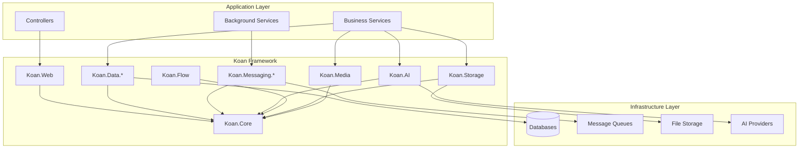
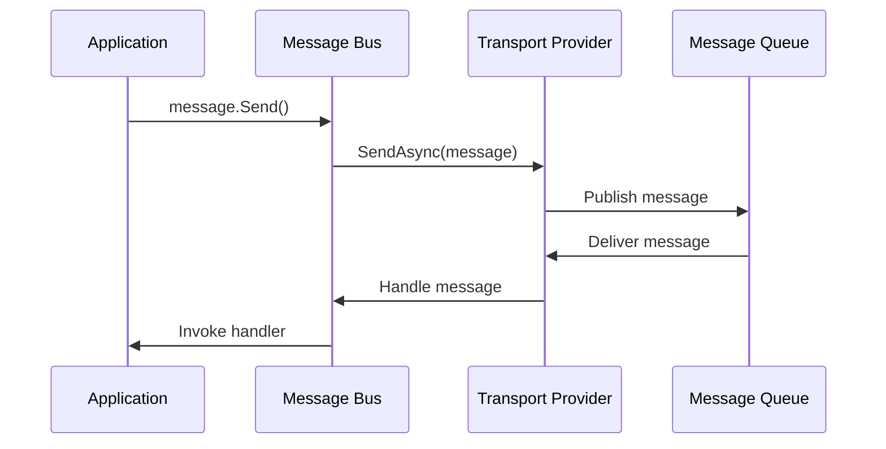
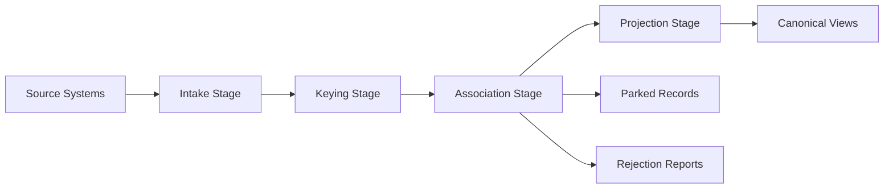

# Architecture Guide

**Document Type**: Reference Documentation (REF)  
**Target Audience**: Architects, Senior Developers, AI Agents  
**Last Updated**: 2025-01-10  
**Framework Version**: v0.2.18+

---

## 🏛️ Koan Framework Architecture Guide

This document provides a comprehensive architectural overview of the Koan Framework, covering its design principles, component relationships, and extensibility patterns.

---

## 🎯 Architectural Philosophy

### Core Design Principles

1. **Composition over Configuration**
   - Modules compose naturally without complex configuration
   - Each pillar is independent and optional
   - Zero-config when possible, explicit config when needed

2. **Convention over Code**
   - Follow .NET conventions and patterns
   - Minimize boilerplate through intelligent defaults
   - Consistent naming and structure across all pillars

3. **Escape Hatches Everywhere**
   - Never lock developers into framework patterns
   - Direct SQL access, custom controllers, raw HTTP handling
   - Framework enhances but never constrains

4. **Progressive Complexity**
   - Start simple, add complexity incrementally
   - Each pillar adds capabilities without breaking existing patterns
   - Clear upgrade paths from prototype to production

---

## 🏗️ High-Level Architecture

### System Overview



### Dependency Flow

```
Application Code
       ↓
   Koan Pillars (Composition Layer)
       ↓
   Koan.Core (Foundation Layer)
       ↓
   .NET Runtime & Infrastructure
```

---

## 🧱 Core Framework Components

### 1. **Koan.Core - Foundation Layer**

The foundational layer that all other pillars depend on.

#### Key Responsibilities
- **Auto-Registration**: `IKoanAutoRegistrar` pattern for module discovery
- **Configuration**: Hierarchical configuration with `KoanEnv` helpers
- **Health Checks**: `IHealthContributor` pattern for monitoring
- **Boot Reports**: Module discovery and initialization reporting
- **Observability**: OpenTelemetry integration (opt-in)

#### Architecture
```csharp
// Auto-Registration Pattern
public interface IKoanAutoRegistrar
{
    string ModuleName { get; }
    string? ModuleVersion { get; }
    void Initialize(IServiceCollection services);
    string Describe() => $"Module: {ModuleName} v{ModuleVersion}";
}

// Health Check Pattern
public interface IHealthContributor
{
    string Name { get; }
    bool IsCritical { get; }
    Task<HealthReport> CheckAsync(CancellationToken cancellationToken = default);
}

// Configuration Pattern
public static class KoanEnv
{
    public static string Environment { get; }
    public static bool IsProduction { get; }
    public static bool IsDevelopment { get; }
    public static bool IsContainer { get; }
}
```

#### Extension Points
- Custom health contributors
- Configuration providers
- Boot report extensions
- Observability customization

---

### 2. **Koan.Web - HTTP Layer**

Provides HTTP handling with security and developer experience focus.

#### Key Responsibilities
- **Controller Discovery**: Auto-registration of controllers
- **Security Headers**: Secure defaults with CSP support
- **Swagger Integration**: Automatic OpenAPI generation in development
- **Authentication**: Multi-provider auth system
- **Payload Transformation**: Request/response shaping

#### Architecture
```csharp
// Entity Controller Pattern
public abstract class EntityController<T> : ControllerBase where T : IEntity
{
    [HttpGet]
    public virtual async Task<ActionResult<T[]>> Get() => await T.All();
    
    [HttpGet("{id}")]
    public virtual async Task<ActionResult<T>> Get(string id) => await T.ByIdAsync(id);
    
    [HttpPost]
    public virtual async Task<IActionResult> Post([FromBody] T entity) { /* ... */ }
    
    // Extensible via virtual methods
}

// Transformer Pattern
public interface IPayloadTransformer<T>
{
    Task<object> TransformRequest(T input, TransformContext context);
    Task<object> TransformResponse(T output, TransformContext context);
}
```

#### Extension Points
- Custom controllers
- Payload transformers
- Authentication providers
- Authorization policies

---

### 3. **Koan.Data.* - Data Access Layer**

Adapter-agnostic data access with multiple provider support.

#### Key Responsibilities
- **Unified API**: Same interface across SQL, NoSQL, JSON, Vector databases
- **Pushdown Optimization**: Query optimization at the database level
- **CQRS Support**: Command/query separation patterns
- **Direct Escape Hatch**: Raw SQL/native query access
- **Vector Operations**: Multi-provider vector database support

#### Architecture
```csharp
// Entity Base Pattern
public abstract class Entity<T> : IEntity where T : class, new()
{
    public string Id { get; set; } = Ulid.NewUlid().ToString();
    public DateTimeOffset Created { get; set; } = DateTimeOffset.UtcNow;
    public DateTimeOffset Modified { get; set; } = DateTimeOffset.UtcNow;
    
    // Static methods are first-class
    public static Task<T[]> All(CancellationToken ct = default);
    public static IQueryable<T> Query();
    public static Task<T?> ByIdAsync(string id, CancellationToken ct = default);
    
    // Instance methods
    public Task SaveAsync(CancellationToken ct = default);
    public Task DeleteAsync(CancellationToken ct = default);
}

// Provider Pattern
public interface IDataProvider
{
    string Name { get; }
    bool CanServe(Type entityType);
    Task<IDataAdapter<T>> GetAdapterAsync<T>() where T : IEntity;
}

// Adapter Pattern  
public interface IDataAdapter<T> where T : IEntity
{
    Task<T[]> GetAllAsync(CancellationToken ct = default);
    Task<T?> GetByIdAsync(string id, CancellationToken ct = default);
    Task SaveAsync(T entity, CancellationToken ct = default);
    Task DeleteAsync(string id, CancellationToken ct = default);
    IQueryable<T> Query();
}
```

#### Provider Architecture
```
┌─────────────────────────────────────────┐
│             Data Layer API              │
├─────────────────────────────────────────┤
│  Entity<T> → IDataProvider → IAdapter   │
├─────────────────────────────────────────┤
│    Postgres | MongoDB | SQLite | ...    │
└─────────────────────────────────────────┘
```

#### Extension Points
- Custom data providers
- Custom adapters
- Query interceptors
- Connection factories

---

### 4. **Koan.Messaging.* - Message Queue Layer**

Capability-aware messaging with multiple transport support.

#### Key Responsibilities
- **Transport Abstraction**: Unified API across RabbitMQ, Redis, in-memory
- **Reliability**: Retry, DLQ, idempotency patterns
- **Type Safety**: Strong-typed message handlers
- **Inbox Services**: Message deduplication and processing

#### Architecture
```csharp
// Message Bus Pattern
public interface IBus
{
    Task SendAsync<T>(T message, CancellationToken ct = default);
    Task SendBatchAsync<T>(IEnumerable<T> messages, CancellationToken ct = default);
    IDisposable Subscribe<T>(Func<T, Task> handler) where T : class;
}

// Message Handler Registration
public static class MessageExtensions
{
    public static async Task Send<T>(this T message, CancellationToken ct = default);
    public static Task On<T>(this object subscriber, Func<T, Task> handler);
}

// Transport Provider Pattern
public interface IMessageTransport
{
    string Name { get; }
    Task<bool> IsAvailableAsync(CancellationToken ct = default);
    Task SendAsync<T>(T message, MessageOptions options, CancellationToken ct = default);
    Task<IDisposable> SubscribeAsync<T>(Func<T, Task> handler, CancellationToken ct = default);
}
```

#### Message Flow


#### Extension Points
- Custom transport providers
- Message interceptors
- Serialization providers
- Dead letter handling

---

### 5. **Koan.AI - AI Integration Layer**

AI capabilities with local and remote provider support.

#### Key Responsibilities
- **Chat Completion**: Streaming and non-streaming chat
- **Embeddings**: Text vectorization for semantic search
- **Vector Search**: Integration with vector databases
- **Budget Controls**: Token and cost management
- **Provider Abstraction**: Support for Ollama, OpenAI, Azure OpenAI

#### Architecture
```csharp
// AI Provider Pattern
public interface IAiProvider
{
    string Name { get; }
    bool IsAvailable { get; }
    Task<AiChatResponse> ChatAsync(AiChatRequest request, CancellationToken ct = default);
    Task<AiEmbeddingResponse> EmbedAsync(AiEmbeddingRequest request, CancellationToken ct = default);
    IAsyncEnumerable<AiChatStreamChunk> ChatStreamAsync(AiChatRequest request, CancellationToken ct = default);
}

// Vector Integration
public static class Vector<T> where T : IEntity
{
    public static Task<T[]> SearchAsync(string query, int limit = 10, CancellationToken ct = default);
    public static Task<T[]> SearchAsync(float[] embedding, int limit = 10, CancellationToken ct = default);
    public static Task IndexAsync(T entity, CancellationToken ct = default);
}

// Budget Control
public interface IAiBudgetManager
{
    Task<bool> CanProcessRequestAsync(AiRequest request, CancellationToken ct = default);
    Task RecordUsageAsync(AiUsage usage, CancellationToken ct = default);
}
```

#### Provider Architecture
```
┌─────────────────────────────────────────┐
│               AI Layer API              │
├─────────────────────────────────────────┤
│  IAiProvider → Provider Implementation  │
├─────────────────────────────────────────┤
│      Ollama | OpenAI | Azure | ...      │
└─────────────────────────────────────────┘
```

#### Extension Points
- Custom AI providers
- Budget policies
- Vector database adapters
- Prompt templates

---

### 6. **Koan.Flow - Data Pipeline Layer**

Model-typed data pipeline for ingestion and transformation.

#### Key Responsibilities
- **Pipeline Stages**: Intake → Standardize → Key → Associate → Project
- **Identity Mapping**: Cross-system entity correlation
- **External ID Tracking**: System-to-system identity resolution
- **Parked Records**: Handling of incomplete or problematic data
- **Canonical Views**: Unified projections of multi-source entities

#### Architecture
```csharp
// Flow Entity Pattern
public abstract class FlowEntity<T> : Entity<T> where T : class, new()
{
    // Aggregation keys for identity resolution
    [AggregationKey] 
    public string SomeKey { get; set; } = "";
}

// Flow Adapter Pattern
[FlowAdapter(system: "erp", adapter: "sap")]
public class SapAdapter : BackgroundService
{
    protected override async Task ExecuteAsync(CancellationToken ct)
    {
        // Send entities through Flow pipeline
        await entity.Send();
    }
}

// Interceptor Pattern
public static class FlowInterceptors
{
    public static FlowInterceptorBuilder<T> For<T>() where T : IFlowEntity;
}

public class FlowInterceptorBuilder<T>
{
    public FlowInterceptorBuilder<T> BeforeIntake(Func<T, Task<FlowIntakeAction>> interceptor);
    public FlowInterceptorBuilder<T> AfterAssociation(Func<T, Task<FlowStageAction>> interceptor);
    // ... other lifecycle methods
}
```

#### Pipeline Flow


#### Extension Points
- Flow interceptors
- Custom pipeline stages
- Identity resolution strategies
- Projection templates

---

## 🔄 Cross-Cutting Concerns

### 1. **Configuration Management**

Hierarchical configuration with environment-specific overrides.

#### Configuration Hierarchy
```
1. Provider Defaults
2. Framework Defaults  
3. appsettings.json
4. appsettings.{Environment}.json
5. Environment Variables
6. Command Line Arguments
7. Code Overrides
```

#### Configuration Pattern
```csharp
public class KoanDataOptions
{
    public const string SectionName = "Koan:Data";
    
    public string DefaultProvider { get; set; } = "Sqlite";
    public Dictionary<string, string> ConnectionStrings { get; set; } = new();
    public bool EnableQueryLogging { get; set; } = false;
}

// Usage
var dataOptions = builder.Configuration.GetSection(KoanDataOptions.SectionName)
    .Get<KoanDataOptions>() ?? new();
```

### 2. **Dependency Injection**

Service lifetime patterns and registration strategies.

#### Service Lifetimes
- **Singleton**: Clients, factories, caches, configuration
- **Scoped**: HTTP request-scoped services, database contexts
- **Transient**: Stateless services, lightweight operations

#### Registration Patterns
```csharp
// Auto-Registration via IKoanAutoRegistrar
public class DataAutoRegistrar : IKoanAutoRegistrar
{
    public void Initialize(IServiceCollection services)
    {
        services.TryAddSingleton<IDataProviderRegistry, DataProviderRegistry>();
        services.TryAddScoped<IDataContext, DataContext>();
        
        // Discover and register providers
        RegisterDataProviders(services);
    }
}

// Manual Registration
builder.Services.AddKoan(options =>
{
    options.EnableTelemetry = true;
    options.DefaultEnvironment = "Development";
});
```

### 3. **Error Handling**

Consistent error handling across all pillars.

#### Error Patterns
```csharp
// Domain Exceptions
public class EntityNotFoundException : KoanException
{
    public EntityNotFoundException(string entityType, string id) 
        : base($"{entityType} with ID '{id}' was not found")
    {
        EntityType = entityType;
        EntityId = id;
    }
    
    public string EntityType { get; }
    public string EntityId { get; }
}

// Controller Error Handling
[ApiController]
public abstract class KoanControllerBase : ControllerBase
{
    protected ActionResult HandleException(Exception ex)
    {
        return ex switch
        {
            EntityNotFoundException notFound => NotFound(new ProblemDetails
            {
                Title = "Entity Not Found",
                Detail = notFound.Message,
                Status = 404
            }),
            ValidationException validation => BadRequest(new ValidationProblemDetails
            {
                Title = "Validation Failed",
                Detail = validation.Message
            }),
            _ => StatusCode(500, new ProblemDetails
            {
                Title = "Internal Server Error",
                Detail = "An unexpected error occurred"
            })
        };
    }
}
```

### 4. **Security**

Security-first design with secure defaults.

#### Security Layers
```csharp
// Secure Headers (Default)
public class SecurityHeadersMiddleware
{
    public async Task InvokeAsync(HttpContext context, RequestDelegate next)
    {
        context.Response.Headers.Add("X-Frame-Options", "DENY");
        context.Response.Headers.Add("X-Content-Type-Options", "nosniff");
        context.Response.Headers.Add("Referrer-Policy", "strict-origin-when-cross-origin");
        
        if (context.Request.IsHttps)
        {
            context.Response.Headers.Add("Strict-Transport-Security", "max-age=31536000");
        }
        
        await next(context);
    }
}

// Authentication Integration
public class AuthConfiguration
{
    public bool EnableAuthentication { get; set; }
    public string[] Providers { get; set; } = Array.Empty<string>();
    public Dictionary<string, object> ProviderSettings { get; set; } = new();
}
```

---

## 🔌 Extensibility Patterns

### 1. **Provider Pattern**

Common pattern across data, messaging, AI, and storage pillars.

#### Provider Interface
```csharp
public interface IProvider
{
    string Name { get; }
    int Priority { get; }
    bool CanServe(object context);
    Task<bool> IsAvailableAsync(CancellationToken ct = default);
}

public interface IProviderRegistry<T> where T : IProvider
{
    void Register(T provider);
    T? GetProvider(object context);
    IEnumerable<T> GetProviders();
}
```

#### Provider Registration
```csharp
public class ProviderRegistry<T> : IProviderRegistry<T> where T : IProvider
{
    private readonly List<T> _providers = new();
    
    public void Register(T provider) => _providers.Add(provider);
    
    public T? GetProvider(object context) =>
        _providers
            .Where(p => p.CanServe(context))
            .OrderByDescending(p => p.Priority)
            .FirstOrDefault();
}
```

### 2. **Auto-Registration Pattern**

Automatic discovery and registration of components.

#### Discovery Process
```csharp
public static class KoanServiceCollectionExtensions
{
    public static IServiceCollection AddKoan(this IServiceCollection services)
    {
        // 1. Scan for auto-registrars
        var registrars = DiscoverAutoRegistrars();
        
        // 2. Initialize each registrar
        foreach (var registrar in registrars)
        {
            registrar.Initialize(services);
        }
        
        // 3. Generate boot report
        services.AddSingleton<IBootReport>(provider =>
            new BootReport(registrars.Select(r => r.Describe())));
        
        return services;
    }
    
    private static IEnumerable<IKoanAutoRegistrar> DiscoverAutoRegistrars()
    {
        var assemblies = GetReferencedAssemblies();
        
        return assemblies
            .SelectMany(a => a.GetTypes())
            .Where(t => typeof(IKoanAutoRegistrar).IsAssignableFrom(t) && !t.IsAbstract)
            .Select(t => (IKoanAutoRegistrar)Activator.CreateInstance(t)!)
            .OrderBy(r => r.ModuleName);
    }
}
```

### 3. **Recipe Pattern**

Best-practice bundles that apply operational patterns.

#### Recipe Structure
```csharp
public abstract class KoanRecipe : IKoanAutoRegistrar
{
    protected abstract bool ShouldApply(IServiceCollection services);
    protected abstract void ApplyRecipe(IServiceCollection services, IConfiguration configuration);
    
    public void Initialize(IServiceCollection services)
    {
        if (!ShouldApply(services))
        {
            Logger.LogInformation("Recipe {RecipeName} skipped - prerequisites not met", ModuleName);
            return;
        }
        
        ApplyRecipe(services, Configuration);
        Logger.LogInformation("Recipe {RecipeName} applied successfully", ModuleName);
    }
}

// Example Recipe
public class ObservabilityRecipe : KoanRecipe
{
    protected override bool ShouldApply(IServiceCollection services) =>
        services.Any(s => s.ServiceType == typeof(ILogger<>));
        
    protected override void ApplyRecipe(IServiceCollection services, IConfiguration configuration)
    {
        services.AddHealthChecks();
        services.AddOpenTelemetry();
        services.AddMetrics();
    }
}
```

---

## 📊 Performance Considerations

### 1. **Data Access Optimization**

#### Query Optimization
- **Pushdown-first**: Operations pushed to database when possible
- **Streaming**: Large datasets processed as streams
- **Paging**: Automatic paging with size limits
- **Caching**: Multi-level caching with Redis and memory cache

#### Performance Patterns
```csharp
// Efficient batch operations
public static async Task ProcessLargeDataset<T>(Func<T, Task> processor) 
    where T : IEntity
{
    await foreach (var batch in T.AllStream().Buffer(1000))
    {
        await Parallel.ForEachAsync(batch, async (item, ct) => await processor(item));
    }
}

// Query optimization
public static async Task<Product[]> GetProductsOptimized(ProductFilter filter)
{
    var query = Product.Query();
    
    // Push filtering to database
    if (!string.IsNullOrEmpty(filter.Category))
        query = query.Where(p => p.Category == filter.Category);
        
    // Use database-level sorting and limiting
    return await query
        .OrderBy(p => p.Name)
        .Take(filter.Limit ?? 50)
        .ToArrayAsync();
}
```

### 2. **Memory Management**

#### Object Lifecycle
- **Entity Caching**: Intelligent caching with expiration
- **Connection Pooling**: Database connection reuse
- **Message Buffering**: Efficient message batching

#### Memory Patterns
```csharp
// Efficient entity processing
public class EntityProcessor<T> : IDisposable where T : IEntity
{
    private readonly SemaphoreSlim _semaphore = new(Environment.ProcessorCount);
    
    public async Task ProcessAsync(IEnumerable<T> entities)
    {
        await Parallel.ForEachAsync(entities, new ParallelOptions
        {
            MaxDegreeOfParallelism = Environment.ProcessorCount
        }, async (entity, ct) =>
        {
            await _semaphore.WaitAsync(ct);
            try
            {
                await ProcessSingleEntity(entity);
            }
            finally
            {
                _semaphore.Release();
            }
        });
    }
    
    public void Dispose() => _semaphore.Dispose();
}
```

### 3. **Async/Await Patterns**

#### Best Practices
```csharp
// Proper async enumeration
public static async IAsyncEnumerable<T> GetEntitiesAsync<T>([EnumeratorCancellation] CancellationToken ct = default)
    where T : IEntity
{
    const int batchSize = 1000;
    int offset = 0;
    
    while (!ct.IsCancellationRequested)
    {
        var batch = await T.Query()
            .Skip(offset)
            .Take(batchSize)
            .ToArrayAsync(ct);
            
        if (!batch.Any()) yield break;
        
        foreach (var entity in batch)
            yield return entity;
            
        offset += batchSize;
    }
}

// Concurrent processing
public static async Task<TResult[]> ProcessConcurrently<TSource, TResult>(
    IEnumerable<TSource> source,
    Func<TSource, Task<TResult>> processor,
    int maxConcurrency = 10)
{
    using var semaphore = new SemaphoreSlim(maxConcurrency);
    
    var tasks = source.Select(async item =>
    {
        await semaphore.WaitAsync();
        try
        {
            return await processor(item);
        }
        finally
        {
            semaphore.Release();
        }
    });
    
    return await Task.WhenAll(tasks);
}
```

---

## 🚀 Deployment Architecture

### 1. **Container Deployment**

#### Multi-Stage Docker Build
```dockerfile
# Build stage
FROM mcr.microsoft.com/dotnet/sdk:9.0 AS build
WORKDIR /src
COPY ["MyApp.csproj", "."]
RUN dotnet restore "MyApp.csproj"
COPY . .
RUN dotnet build "MyApp.csproj" -c Release -o /app/build
RUN dotnet publish "MyApp.csproj" -c Release -o /app/publish

# Runtime stage
FROM mcr.microsoft.com/dotnet/aspnet:9.0 AS runtime
WORKDIR /app
COPY --from=build /app/publish .

# Health check
HEALTHCHECK --interval=30s --timeout=10s --start-period=60s --retries=3 \
  CMD curl -f http://localhost:8080/health || exit 1

ENTRYPOINT ["dotnet", "MyApp.dll"]
```

#### Orchestration with Compose
```yaml
version: '3.8'
services:
  app:
    build: .
    ports:
      - "8080:8080"
    environment:
      - Koan__DATA__DEFAULTPROVIDER=Postgres
      - Koan__DATA__POSTGRES__CONNECTIONSTRING=Host=postgres;Database=myapp;Username=user;Password=pass
    depends_on:
      postgres:
        condition: service_healthy
      redis:
        condition: service_healthy
    healthcheck:
      test: ["CMD", "curl", "-f", "http://localhost:8080/health"]
      interval: 30s
      timeout: 10s
      retries: 3
```

### 2. **Scalability Patterns**

#### Horizontal Scaling
- **Stateless Services**: All state externalized to databases/caches
- **Load Balancing**: Services behind load balancers
- **Message Distribution**: Competing consumers for background processing

#### Vertical Scaling
- **Resource Limits**: Container resource constraints
- **Connection Pooling**: Efficient database connections
- **Memory Management**: Proper disposal and garbage collection

---

## 📋 Architecture Decision Records (ADRs)

Koan Framework uses ADRs to document architectural decisions. Key decisions include:

### Core Architecture
- **ARCH-0011**: Logging + headers layering
- **ARCH-0040**: Config and constants naming
- **ARCH-0046**: Integration recipes
- **ARCH-0047**: Orchestration hosting and exporters

### Data Layer
- **DATA-0061**: Data access pagination and streaming
- **DATA-0044**: Paging guardrails
- **DATA-0029**: JSON filter language

### Web Layer
- **WEB-0035**: EntityController transformers
- **WEB-0046**: Set-based scoping
- **WEB-0047**: Capability authorization

### Messaging
- **MESS-0021-0027**: Messaging capabilities and negotiation

### Observability
- **ARCH-0033**: OpenTelemetry integration
- **OPS-0050**: Scheduling/bootstrap unification

---

## 🎯 Summary

The Koan Framework architecture provides:

1. **Modular Design**: Independent pillars that compose naturally
2. **Extensible Patterns**: Provider, auto-registration, and recipe patterns
3. **Performance Focus**: Efficient data access, memory management, and async patterns
4. **Security First**: Secure defaults with comprehensive security layers
5. **Developer Experience**: Clear patterns, intelligent defaults, escape hatches
6. **Production Ready**: Health checks, observability, scalability patterns

This architecture enables teams to start simple and scale to enterprise-grade systems while maintaining consistency and developer productivity throughout the journey.

---

**Next Steps**: See pillar-specific REF documents for detailed architectural deep-dives into each component.