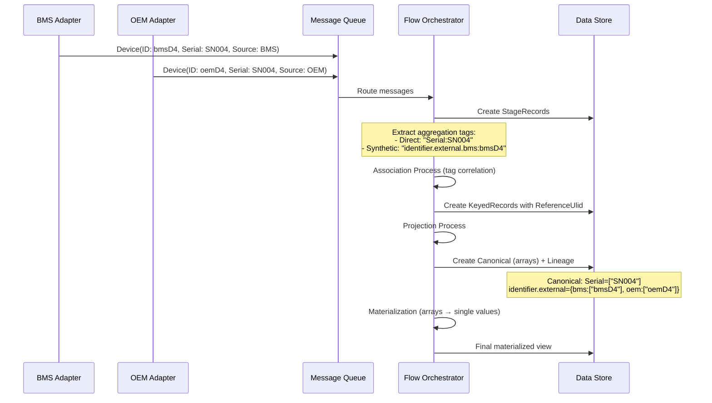

# Sora.Flow Entity Lifecycle Reference Guide

## Table of Contents

1. [Introduction](#introduction)
2. [Core Concepts](#core-concepts)
3. [Entity Types Deep Dive](#entity-types-deep-dive)
4. [The Materialization Process](#the-materialization-process)
5. [Communication Architecture](#communication-architecture)
6. [Progressive Examples](#progressive-examples)
7. [Advanced Scenarios](#advanced-scenarios)
8. [Best Practices](#best-practices)

## Introduction

The Sora.Flow system is a sophisticated event-sourced entity lifecycle management framework designed for distributed systems that need to aggregate, correlate, and materialize entity data from multiple sources. This guide provides developers and architects with a comprehensive understanding of how entities flow through the system, from initial intake to final materialization.

### Key Benefits

- **Multi-source data correlation**: Aggregate data from different systems about the same business entity
- **Identity resolution**: Automatically resolve and match entities across systems using aggregation keys
- **Schema flexibility**: Support both strongly-typed and dynamic entities
- **Audit trails**: Maintain complete lineage of all data changes
- **Conflict resolution**: Apply policies to resolve conflicting data from multiple sources

## Core Concepts

### Flow Entity Identity Resolution

Sora.Flow performs **sophisticated identity resolution** using a dual aggregation key system that handles both temporal updates and cross-source correlation.

**Dual Aggregation Key System**:

1. **Synthetic Aggregation Tags** (from `Id` + source):
   - Format: `"identifier.external.{\"value\": \"source\"}:id"`
   - Example: `"identifier.external.{\"value\": \"bms\"}:bmsD4"`
   - **Purpose**: Match temporal updates from the same source with same ID

2. **Direct Match Keys** (from `[AggregationKey]` properties):
   - Format: `"propertyName:value"`  
   - Example: `"Serial:SN004"`
   - **Purpose**: Match entities across different sources representing same business object

**Identity Resolution Process**:
1. **Extract aggregation tags** from both synthetic (ID+source) and direct (property) keys
2. **Find existing entities** with matching aggregation tags
3. **Correlate entities** → Same logical business object when tags match
4. **Create single canonical entity** with new `ReferenceUlid` 
5. **Preserve source IDs** in `identifier.external` section
6. **Merge all properties** into arrays containing values from all correlated sources

```mermaid
graph TD
    A[BMS: ID=bmsD4, Serial=SN004] --> C[Aggregation Tag Extraction]
    B[OEM: ID=oemD4, Serial=SN004] --> C
    C --> D[Synthetic: bms:bmsD4, oem:oemD4]
    C --> E[Direct: Serial:SN004]
    D --> F[Identity Resolution Engine]
    E --> F
    F --> G[Single Canonical: K4WRFM9W3VEQKM6Z3Q54QZ2TT0]
    G --> H[Arrays: Serial=[SN004], Model=[X-Series, X-Series-Pro]]
```

### Processing Stages

Every entity follows a six-stage pipeline:

1. **Data Arrival**: Entity wrapped with metadata arrives in system
2. **Intake Queue**: Raw data stored awaiting processing  
3. **Tagging**: Aggregation keys extracted (native IDs + [AggregationKey] properties)
4. **Coalescing**: Entity sameness determination with conflict detection
5. **Canonical Storage**: Properties stored as arrays with source lineage
6. **Materialization**: Arrays resolved to single values using policies

## Entity Types Deep Dive

### 1. Flow Entities (FE) - Canonical Business Objects

**Purpose**: Strongly-typed entities representing core business domain objects with stable schemas.

**Definition** (`Typed.cs:13`):
```csharp
public abstract class FlowEntity<TModel> : Entity<TModel> 
    where TModel : FlowEntity<TModel>, new() { }
```

**Key Characteristics**:
- **Strong typing** with compile-time validation
- **Aggregation key attributes** for identity resolution
- **Parent-child relationships** via `[ParentKey]` attributes
- **Canonical roots** that participate in projections

#### Example: Device Entity

```csharp
public sealed class Device : FlowEntity<Device>
{
    public string Inventory { get; set; } = default!;

    [AggregationKey]  // Direct match key ("Serial:SN004")
    public string Serial { get; set; } = default!;
    
    public string Manufacturer { get; set; } = default!;
    public string Model { get; set; } = default!;
    public string Kind { get; set; } = default!;
    public string Code { get; set; } = default!;
}
```

**When to Use**:
- Well-defined domain entities (Customer, Device, Product)
- Stable schemas unlikely to change frequently
- Entities requiring strong typing and validation
- Objects that serve as aggregation roots

### 2. Dynamic Flow Entities (DFE) - Schema-Flexible Objects

**Purpose**: Schema-flexible entities using JSON objects for dynamic property storage.

**Definition** (`Typed.cs:28-32`):
```csharp
public class DynamicFlowEntity<TModel> : Entity<DynamicFlowEntity<TModel>>, IDynamicFlowEntity
{
    public JObject? Model { get; set; }  // Dynamic JSON properties
}
```

**Key Characteristics**:
- **JSON path notation** support (`device.sensors[0].reading`)
- **Dictionary-based configuration** via `[AggregationKeys]` class attribute
- **Runtime schema evolution** without code deployment
- **Provider-friendly serialization** for MongoDB and other document stores

#### Example: Dynamic Manufacturer

```csharp
[AggregationKeys("identifier.code")]  // Class-level configuration
public class Manufacturer : DynamicFlowEntity<Manufacturer> { }

// Usage with dictionary data
var manufacturerData = new Dictionary<string, object>
{
    ["identifier.code"] = "MFG001",
    ["identifier.name"] = "Acme Corp", 
    ["identifier.external.bms"] = "BMS-MFG-001",
    ["manufacturing.country"] = "USA",
    ["manufacturing.established"] = "1985",
    ["manufacturing.facilities"] = new[] { "Plant A", "Plant B" },
    ["products.categories"] = new[] { "sensors", "actuators" }
};
await manufacturerData.Send<Manufacturer>();
```

**When to Use**:
- Integration with external systems having varying schemas
- Rapid prototyping and development
- Configuration or metadata entities
- Entities where schema evolution is frequent

### 3. Flow Value Objects (FVO) - Time-Series and Child Data

**Purpose**: Non-canonical entities representing time-series data or child objects without independent identity.

**Definition** (`Typed.cs:15-19`):
```csharp
public abstract class FlowValueObject<TVo> : Entity<TVo> 
    where TVo : FlowValueObject<TVo>, new() { }
```

**Key Characteristics**:
- **Non-canonical**: Don't participate in identity resolution
- **Parent-scoped**: Always associated with a parent entity
- **Temporal data patterns**: Suitable for time-series or event data
- **Window-based projections**: For latest/historical aggregations

#### Example: Sensor Reading

```csharp
public sealed class Reading : FlowValueObject<Reading>
{
    [ParentKey(parent: typeof(Sensor))]  // References parent entity
    public string SerialNumber { get; set; } = string.Empty;
    
    public double Value { get; set; }
    public string Unit { get; set; } = string.Empty;
    public DateTimeOffset CapturedAt { get; set; } = DateTimeOffset.UtcNow;
    public string? Source { get; set; }
}
```

**When to Use**:
- Time-series data (readings, measurements, logs)
- Child entities without independent business meaning
- Event data requiring temporal aggregation
- Immutable value objects

### Entity Relationships

**Parent-Child Associations** (`FlowRegistry.cs:117-151`):

```csharp
public static (Type Parent, string ParentKeyPath)? GetEntityParent(Type t)
{
    foreach (var p in type.GetProperties(BindingFlags.Instance | BindingFlags.Public))
    {
        var pk = p.GetCustomAttribute<ParentKeyAttribute>(inherit: true);
        if (pk is null || pk.Parent is null) continue;
        
        // Return parent type and the key path for association
        return (pk.Parent, path);
    }
}
```

**Relationship Example**:
```csharp
public sealed class Sensor : FlowEntity<Sensor>
{
    [ParentKey(typeof(Device))]  // References Device by its aggregation key
    public string DeviceId { get; set; } = default!;

    [AggregationKey]
    public string SerialNumber { get; set; } = default!;
    
    public string Code { get; set; } = default!;
    public string Unit { get; set; } = default!;
}
```

## The Complete Pipeline Process

### 1. Data Arrival & Intake Queue

Entities arrive wrapped with metadata and are immediately stored in the intake queue:

**Entity Intake Wrapper**:

```csharp
public sealed class EntityIntakeWrapper<TModel>
{
    public TModel Model { get; set; } = default!;           // The actual entity data
    public string Source { get; set; } = default!;          // Source system identifier
    public string NativeId { get; set; } = default!;        // Source system's ID for this entity
    public Dictionary<string, object?>? Metadata { get; set; }  // Additional metadata
    public DateTimeOffset ReceivedAt { get; set; } = DateTimeOffset.UtcNow;
}
```

**Intake Queue Storage**:

```csharp
public sealed class IntakeRecord<TModel> : Entity<IntakeRecord<TModel>>
{
    public TModel EntityData { get; set; } = default!;
    public string Source { get; set; } = default!;
    public string NativeId { get; set; } = default!;
    public Dictionary<string, object?>? Metadata { get; set; }
    public DateTimeOffset ReceivedAt { get; set; } = DateTimeOffset.UtcNow;
    [Index] public IntakeStatus Status { get; set; } = IntakeStatus.Pending;
}
```

### 2. Intake Processing & Tagging

The intake processor extracts aggregation tags from entities without evaluating sameness:

**Intake Processor**:

```csharp
public sealed class IntakeProcessor<TModel>
{
    /// <summary>
    /// Extract aggregation tags from entity for coalescing
    /// </summary>
    private string[] ExtractAggregationTags(IntakeRecord<TModel> intakeRecord)
    {
        var tags = new List<string>();
        
        // External key: source + native ID  
        tags.Add(CorrelationKeyFormat.External(intakeRecord.Source, intakeRecord.NativeId));
        
        // Property keys from [AggregationKey] attributes
        var aggregationKeyProperties = typeof(TModel).GetProperties()
            .Where(p => p.GetCustomAttribute<AggregationKeyAttribute>() != null);
            
        foreach (var prop in aggregationKeyProperties)
        {
            var value = prop.GetValue(intakeRecord.EntityData)?.ToString();
            if (!string.IsNullOrEmpty(value))
            {
                tags.Add(CorrelationKeyFormat.Property(prop.Name, value));
            }
        }
        
        return tags.ToArray();
    }
}
```

**Tagged Record Result**:

```csharp
public sealed class TaggedRecord<TModel> : Entity<TaggedRecord<TModel>>
{
    public TModel EntityData { get; set; } = default!;
    public string Source { get; set; } = default!;
    public string NativeId { get; set; } = default!;
    
    /// <summary>
    /// Extracted aggregation tags ready for coalescing
    /// Examples: ["external:bms:deviceId", "property:Serial:SN004"]
    /// </summary>
    public string[] AggregationTags { get; set; } = Array.Empty<string>();
    
    [Index] public TaggedStatus Status { get; set; } = TaggedStatus.ReadyForCoalescing;
}
```

### 3. Coalescing Service - Entity Sameness & Conflict Detection

The coalescing service determines if tagged entities represent the same business object and handles conflicts:

**Coalescing Logic with Sophisticated Conflict Detection**:

```csharp
public sealed class CoalescingService<TModel>
{
    /// <summary>
    /// Core coalescing logic with sophisticated conflict detection
    /// </summary>
    private async Task<CoalescingResult> AnalyzeAndCoalesceAsync(
        TaggedRecord<TModel> taggedRecord, 
        CancellationToken ct)
    {
        // Find canonical entities with matching aggregation tags
        var matchingCanonicals = await FindMatchingCanonicalsAsync(taggedRecord.AggregationTags, ct);
        
        return matchingCanonicals.Count switch
        {
            // No matches → new canonical entity
            0 => CoalescingResult.CreateNew(),
            
            // Single match → update existing
            1 => CoalescingResult.UpdateExisting(matchingCanonicals[0].Id),
            
            // Multiple matches → analyze for conflicts
            _ => AnalyzeMultipleMatches(matchingCanonicals, taggedRecord)
        };
    }
    
    private CoalescingResult AnalyzeMultipleMatches(
        List<CanonicalEntity<TModel>> matchingCanonicals,
        TaggedRecord<TModel> taggedRecord)
    {
        // Check if multiple canonicals are actually pointing to different entities
        var distinctCanonicalIds = matchingCanonicals.Select(c => c.Id).Distinct().ToArray();
        
        if (distinctCanonicalIds.Length == 1)
        {
            // All matches point to same canonical → safe to update
            return CoalescingResult.UpdateExisting(distinctCanonicalIds[0]);
        }
        
        // Multiple distinct canonicals matched → conflict analysis
        var conflictAnalysis = AnalyzeTagConflicts(matchingCanonicals, taggedRecord.AggregationTags);
        
        if (conflictAnalysis.HasConflicts)
        {
            // Mismatched tags pointing to different objects → rejected queue
            return CoalescingResult.Reject($"Conflicting canonical references: {conflictAnalysis.ConflictDescription}");
        }
        
        // Some matches, no conflicts → merge into primary canonical
        var primaryCanonical = SelectPrimaryCanonical(matchingCanonicals);
        return CoalescingResult.UpdateExisting(primaryCanonical.Id);
    }
}
```

**Coalescing Outcomes**:

The coalescing service produces one of three outcomes:

1. **All matches / Some matches with no conflicts** → Update existing canonical entity
2. **No matches** → Create new canonical entity  
3. **Mismatched tags pointing to different objects** → Move to rejected queue

```csharp
public enum CoalescingAction
{
    CreateNew,        // No existing canonical found
    UpdateExisting,   // Safe to add to existing canonical
    Reject           // Conflicts detected - manual review needed
}
```

### 4. Canonical Storage - Array-Based Properties

Successfully coalesced entities are stored as canonical entities with array-based properties preserving complete lineage:

**Canonical Entity with Array Properties**:

```csharp
/// <summary>
/// Canonical entity with array-based properties for complete lineage tracking
/// </summary>
public sealed class CanonicalEntity<TModel> : Entity<CanonicalEntity<TModel>>
{
    // Id IS the canonical ULID
    
    /// <summary>
    /// All correlation keys that resolve to this canonical entity
    /// </summary>
    [Index] public string[] CorrelationKeys { get; set; } = Array.Empty<string>();
    
    /// <summary>
    /// All properties as arrays tracking source lineage
    /// Key: property name, Value: array of values from different sources
    /// </summary>
    public Dictionary<string, PropertyValueArray> CanonicalProperties { get; set; } = new();
    
    /// <summary>
    /// All source contributions that built this canonical entity
    /// </summary>
    public EntityContribution<TModel>[] SourceContributions { get; set; } = Array.Empty<EntityContribution<TModel>>();
    
    /// <summary>
    /// Current materialized view (computed from arrays)
    /// </summary>
    public TModel? MaterializedModel { get; set; }
}

/// <summary>
/// Array of property values from different sources with full lineage
/// </summary>
public sealed class PropertyValueArray
{
    public PropertyValue[] Values { get; set; } = Array.Empty<PropertyValue>();
    
    /// <summary>
    /// Single property value with complete attribution
    /// </summary>
    public sealed class PropertyValue
    {
        public object? Value { get; set; }
        public string Source { get; set; } = default!;
        public string NativeEntityId { get; set; } = default!;
        public DateTimeOffset ReceivedAt { get; set; }
    }
}
```

### 5. Materialization Engine - Array to Single Value Resolution

The materialization engine is triggered after successful coalescing and resolves property arrays into single materialized values:

**Materialization After Successful Coalescing**:

```csharp
public sealed class MaterializationEngine<TModel>
{
    /// <summary>
    /// Materialize canonical entity after coalescing update
    /// </summary>
    public async Task MaterializeCanonicalAsync(string canonicalId, CancellationToken ct = default)
    {
        var canonical = await Data<CanonicalEntity<TModel>, string>.GetAsync(canonicalId, ct);
        
        // Materialize each property using appropriate policies
        var materializedModel = new TModel();
        var propertyAttributions = new Dictionary<string, PropertyAttribution>();
        
        foreach (var (propertyName, valueArray) in canonical.CanonicalProperties)
        {
            // Apply materialization policy to resolve array to single value
            var policy = _policyRegistry.GetPolicy<TModel>(propertyName);
            var resolution = await policy.ResolveAsync(valueArray.Values, ct);
            
            // Set materialized value on the model
            SetPropertyValue(materializedModel, propertyName, resolution.Value);
            
            // Track which source "won" and why
            propertyAttributions[propertyName] = new PropertyAttribution
            {
                Source = resolution.WinningSource,
                Policy = resolution.PolicyName,
                ResolvedAt = DateTimeOffset.UtcNow,
                AlternativeValues = valueArray.Values.Select(v => v.Value?.ToString() ?? "").ToArray(),
                WinningReason = resolution.Reason
            };
        }
        
        // Update canonical with materialized result
        canonical.MaterializedModel = materializedModel;
        canonical.PropertySources = propertyAttributions;
        canonical.LastMaterializedAt = DateTimeOffset.UtcNow;
        
        await canonical.Save(ct);
    }
}
```

**Built-in Policies**:

- **Last**: Most recent value wins (default)
- **First**: Oldest value wins
- **Max**: Maximum value across sources
- **Min**: Minimum value across sources
- **Coalesce**: First non-null value

## Communication Architecture

### Source Systems (Data Producers)

Source systems generate entity data and send it to the Flow orchestrator via messaging or HTTP APIs.

**Flow Adapter Pattern** (`S8.Flow.Adapters.Bms/Program.cs:37`):

```csharp
[FlowAdapter(system: "BMS", adapter: "BMS", DefaultSource = "BMS")]
public sealed class BmsPublisher : BackgroundService
{
    protected override async Task ExecuteAsync(CancellationToken ct)
    {
        while (!ct.IsCancellationRequested)
        {
            // Send entity data using extension method
            var device = new Device
            {
                Id = "bmsD1",
                Serial = "DEV001", // Aggregation key
                Manufacturer = "Acme",
                Model = "Model-X"
            };
            
            await device.Send();  // Routes to Flow orchestrator
            
            // Send readings as value objects
            var reading = new Reading
            {
                SerialNumber = "SENSOR001", // Parent reference
                Value = 23.5,
                CapturedAt = DateTimeOffset.UtcNow
            };
            
            await reading.Send();
        }
    }
}
```

### Aggregator (Flow Orchestrator)

The aggregator receives entities from all sources and processes them through the materialization pipeline.

**Orchestrator Setup** (`S8.Flow.Api/Program.cs:104`):

```csharp
[FlowOrchestrator]
public class S8FlowOrchestrator : FlowOrchestratorBase
{
    public S8FlowOrchestrator(ILogger<S8FlowOrchestrator> logger, 
        IConfiguration configuration, IServiceProvider serviceProvider)
        : base(logger, configuration, serviceProvider)
    {
    }
    
    // Inherits all processing logic from base class
    // Can override for custom processing if needed
}
```

**Configuration** (`Program.cs:40-51`):

```csharp
builder.Services.Configure<FlowOptions>(o =>
{
    // Default aggregation tags as fallback
    o.AggregationTags = new[] { Keys.Sensor.Key };
    
    // Performance tuning
    o.PurgeEnabled = true;
    o.KeyedTtl = TimeSpan.FromDays(14);
    
    // Canonical projection filtering
    o.CanonicalExcludeTagPrefixes = new[] { "reading.", "sensorreading." };
});
```

### Message Flow



## Progressive Examples

### Example 1: Simple Sensor Data Flow

**Step 1: Define Entities**

```csharp
// Simple sensor entity
public sealed class Sensor : FlowEntity<Sensor>
{
    [AggregationKey]
    public string SerialNumber { get; set; } = default!;
    
    public string Type { get; set; } = default!;
    public string Location { get; set; } = default!;
}

// Temperature readings
public sealed class TemperatureReading : FlowValueObject<TemperatureReading>
{
    [ParentKey(typeof(Sensor))]
    public string SensorSerial { get; set; } = default!;
    
    public double Temperature { get; set; }
    public DateTimeOffset Timestamp { get; set; }
}
```

**Step 2: Send Data from Source**

```csharp
// Source system sends sensor info
var sensor = new Sensor
{
    Id = "temp001",
    SerialNumber = "TEMP-001",  // Aggregation key
    Type = "Temperature",
    Location = "Building A"
};
await sensor.Send();

// Send readings periodically
var reading = new TemperatureReading
{
    SensorSerial = "TEMP-001",  // Links to parent
    Temperature = 22.5,
    Timestamp = DateTimeOffset.UtcNow
};
await reading.Send();
```

**Step 3: System Processing**

1. **Intake**: Creates `StageRecord<Sensor>` and `StageRecord<TemperatureReading>`
2. **Association**: 
   - Extracts aggregation tags: 
     - Direct: `"SerialNumber:TEMP-001"` (from sensor)
     - Direct: `"SensorSerial:TEMP-001"` (from reading) 
     - Synthetic: `"identifier.external.{\"value\":\"source\"}:temp001"`
   - Correlates based on matching `TEMP-001` values
   - Creates `KeyedRecord<Sensor>` and `KeyedRecord<TemperatureReading>` with same ReferenceUlid
3. **Projection**: Creates canonical projections with property arrays
4. **Materialization**: Applies policies to resolve arrays into single values

### Example 2: Multi-Source Identity Resolution

**Step 1: Multiple Sources Send Same Logical Entity**

```csharp
// BMS system perspective
var bmsDevice = new Device
{
    Id = "bmsD4",                 // Source-specific ID
    Serial = "SN004",             // Aggregation key for correlation
    Manufacturer = "Acme Corp",
    Model = "X-Series",
    Kind = "Controller"
};
await bmsDevice.Send();

// OEM system perspective  
var oemDevice = new Device
{
    Id = "oemD4",                 // Different source-specific ID
    Serial = "SN004",             // Same aggregation key → same logical entity
    Manufacturer = "Acme Corp", 
    Model = "X-Series-Pro",       // Different model info
    Code = "CTRL-2024"            // Additional data
};
await oemDevice.Send();
```

**Step 2: Aggregation Tag Extraction and Correlation**

```csharp
// System extracts aggregation tags from both sources:
// BMS: 
//   - Synthetic: "identifier.external.{\"value\":\"bms\"}:bmsD4"  
//   - Direct: "Serial:SN004"
// OEM:
//   - Synthetic: "identifier.external.{\"value\":\"oem\"}:oemD4"
//   - Direct: "Serial:SN004" 

// Correlation occurs on matching "Serial:SN004" tag
// Creates SINGLE canonical entity with ReferenceUlid: "K4WRFM9W3VEQKM6Z3Q54QZ2TT0"
```

**Step 3: Canonical Projection with Source Preservation**

```json
{
  "_id": "canonical::K4WRFM9W3VEQKM6Z3Q54QZ2TT0",
  "ViewName": "canonical", 
  "ReferenceUlid": "K4WRFM9W3VEQKM6Z3Q54QZ2TT0",
  "Model": {
    "identifier": {
      "external": {
        "{\"value\": \"bms\"}": ["bmsD4"],  // Source ID preservation
        "{\"value\": \"oem\"}": ["oemD4"]   // Source ID preservation
      }
    },
    "Serial": ["SN004"],                    // Consistent across sources
    "Manufacturer": ["Acme Corp"],          // Consistent across sources  
    "Model": ["X-Series", "X-Series-Pro"], // Values from both sources
    "Kind": ["Controller"],                 // From BMS only
    "Code": ["CTRL-2024"]                   // From OEM only
  }
}
```

**Key Insights**:
- **Aggregation tag correlation** enables cross-source entity resolution
- **Synthetic tags** handle temporal updates from same source
- **Direct tags** handle cross-source business object correlation
- **Single canonical entity** created from multiple correlated sources
- **Source IDs preserved** in `identifier.external` section
- **Property arrays** contain all values from correlated sources
- **ReferenceUlid** serves as new canonical identifier for correlated entity cluster

### Example 3: Dynamic Entity with JSON Schema

**Step 1: Define Dynamic Entity**

```csharp
[AggregationKeys("identifier.code")]
public class Product : DynamicFlowEntity<Product> { }
```

**Step 2: Send Complex JSON Data**

```csharp
var productData = new Dictionary<string, object>
{
    ["identifier.code"] = "PROD-001",
    ["identifier.name"] = "Smart Sensor v2",
    ["identifier.sku"] = "SS-2024-001",
    
    ["specifications.power.voltage"] = "12V DC",
    ["specifications.power.consumption"] = "2.4W",
    ["specifications.dimensions.width"] = 45.2,
    ["specifications.dimensions.height"] = 23.8,
    ["specifications.dimensions.units"] = "mm",
    
    ["certifications"] = new[] { "CE", "FCC", "UL" },
    ["features.connectivity"] = new[] { "WiFi", "Bluetooth", "Ethernet" },
    ["features.protocols"] = new[] { "MQTT", "HTTP", "WebSocket" },
    
    ["pricing.msrp"] = 299.99,
    ["pricing.currency"] = "USD",
    ["pricing.tier"] = "Professional"
};

await productData.Send<Product>();
```

**Step 3: Query Canonical Projections**

```csharp
// Query canonical projections with array-based property structure
var products = await Data<CanonicalProjection<Product>>
    .Query()
    .Where(p => p.Model["specifications.power.voltage"].Contains("12V DC"))
    .ToListAsync();

// Access property arrays from canonical projection
var canonicalProduct = products.First();
var voltageArray = canonicalProduct.Model["specifications.power.voltage"];  // Array of values
var powerSpecArray = canonicalProduct.Model["specifications.power.consumption"];  // Array of values

// For materialized single values, use materialization engine
var materializedView = await MaterializationEngine.MaterializeAsync("Product", 
    canonicalProduct.Model, CancellationToken.None);
var singleVoltage = materializedView.values["specifications.power.voltage"];  // Single resolved value
```

## Advanced Scenarios

### Custom Materialization Policies

```csharp
public class WeightedAveragePolicy : IPropertyTransformer
{
    public async Task<MaterializationDecision> MaterializeAsync(
        string modelName, string propertyPath, 
        IReadOnlyCollection<string?> values,
        IReadOnlyDictionary<string, IReadOnlyCollection<string?>> allProperties,
        CancellationToken ct)
    {
        // Custom logic for weighted average calculation
        var numericValues = values.Where(v => double.TryParse(v, out _))
                                 .Select(double.Parse);
        
        var weightedAvg = CalculateWeightedAverage(numericValues);
        
        return new MaterializationDecision
        {
            Value = weightedAvg.ToString(),
            Policy = "WeightedAverage"
        };
    }
}
```

### External ID Correlation

```csharp
[FlowPolicy(ExternalIdPolicy = ExternalIdPolicy.AutoPopulate, ExternalIdKey = "Serial")]
public sealed class Device : FlowEntity<Device>
{
    [AggregationKey]  // Creates direct aggregation tag "Serial:value"
    public string Serial { get; set; } = default!;
    
    // ExternalIdPolicy.AutoPopulate creates additional synthetic correlation paths
    // Enhances cross-system correlation beyond standard aggregation tags
}

// This creates multiple aggregation paths:
// 1. Direct: "Serial:SN004" 
// 2. Synthetic ID: "identifier.external.{\"value\":\"source\"}:deviceId"
// 3. External ID: Additional correlation based on ExternalIdKey policy
```

### Interceptor-Based Processing

```csharp
public class DeviceValidationInterceptor : IFlowInterceptor
{
    public async Task<FlowIntakeAction> BeforeIntakeAsync<T>(
        T payload, string modelName, string? source, 
        Dictionary<string, object?>? metadata, CancellationToken ct)
    {
        if (payload is Device device)
        {
            // Validate device data
            if (string.IsNullOrEmpty(device.Serial))
            {
                return FlowIntakeAction.Drop("Missing required Serial number");
            }
            
            if (!IsValidManufacturer(device.Manufacturer))
            {
                return FlowIntakeAction.Park("Unknown manufacturer requires review");
            }
        }
        
        return FlowIntakeAction.Continue();
    }
}
```

## Best Practices

### 1. Entity Design Guidelines

**Choose Entity Types Appropriately**:
- Use `FlowEntity<T>` for core business objects with stable schemas
- Use `DynamicFlowEntity<T>` for integration scenarios with evolving schemas
- Use `FlowValueObject<T>` for time-series data and child entities

**Aggregation Key Strategy**:
- Choose natural business keys over system-generated IDs
- Prefer composite keys for complex correlation scenarios
- Ensure aggregation keys are immutable and unique across sources

### 2. Performance Optimization

**Batch Processing**:
- Send entities in batches when possible
- Use bulk insert operations for high-volume scenarios
- Configure appropriate batch sizes based on throughput requirements

**Projection Strategy**:
- Exclude unnecessary properties from canonical projections
- Use appropriate TTL settings for keyed records
- Enable purging for high-volume scenarios

### 3. Error Handling

**Parking Strategy**:
- Use parking for recoverable errors requiring manual intervention
- Implement automated retry mechanisms for transient failures
- Monitor parked record queues for operational insights

**Validation Approach**:
- Validate data at source systems when possible
- Use interceptors for cross-cutting validation concerns
- Implement graceful degradation for non-critical validation failures

### 4. Schema Evolution

**Dynamic Entity Migration**:
- Plan for schema evolution using DynamicFlowEntity for integration points
- Maintain backward compatibility during transitions
- Use JSON path notation for flexible property access

**Versioning Strategy**:
- Version entity schemas when making breaking changes
- Maintain parallel processing pipelines during migrations
- Plan deprecation timelines for legacy schemas

### 5. Monitoring and Observability

**Key Metrics**:
- Monitor intake rates and processing throughput
- Track association success rates and key resolution performance
- Monitor parking rates and error patterns

**Logging Strategy**:
- Use structured logging with correlation IDs
- Log key processing milestones for debugging
- Implement distributed tracing across service boundaries

## Conclusion

The Sora.Flow entity lifecycle system provides a robust, scalable foundation for managing complex entity data flows in distributed systems. By understanding the core concepts, processing stages, and best practices outlined in this guide, developers and architects can effectively design and implement systems that leverage the full power of the Flow framework.

The system's strength lies in its ability to handle both strongly-typed and dynamic entities through a unified processing pipeline, while maintaining complete audit trails and providing flexible conflict resolution capabilities. This makes it an ideal choice for enterprise systems that need to aggregate and correlate data from multiple sources while maintaining data quality and governance standards.