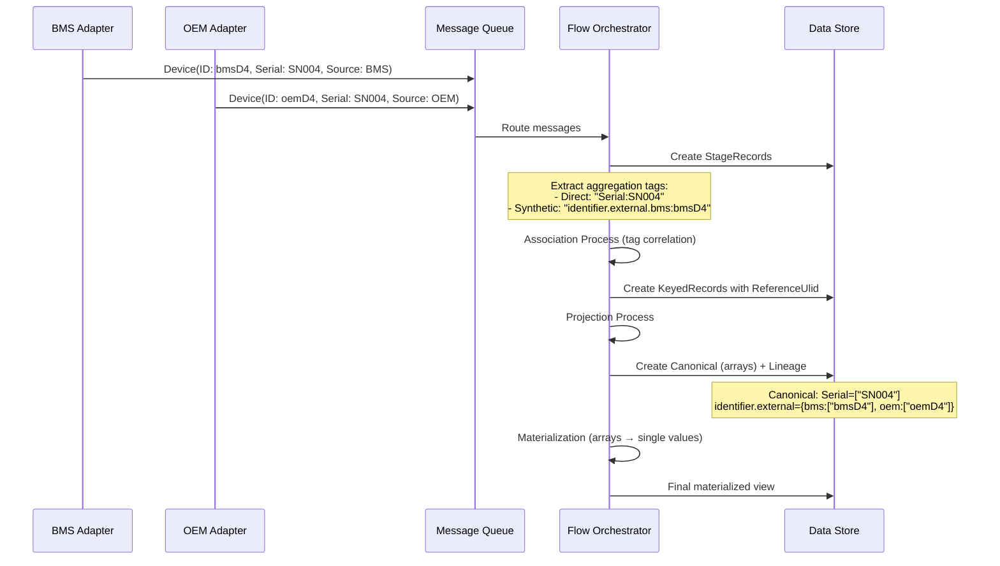

# Sora.Flow Entity Lifecycle Reference Guide

> **Instructions for AI Assistants**: This document serves as the authoritative reference for Sora.Flow architecture and implementation. When working on other documentation in the `/docs/` directory or answering questions about Sora.Flow, treat this document as the definitive source of truth for:
> - Entity lifecycle stages and processing pipeline
> - Storage architecture and data set patterns  
> - Implementation guidance and code examples
> - Best practices and architectural principles
> 
> **Key points to reference when working with Sora.Flow:**
> - Use the **6-stage pipeline** (Data Arrival → Intake → Tagging → Coalescing → Canonical Storage → Materialization)
> - Enforce **complete per-model separation** using `{ModelFullName}#{setName}` storage patterns
> - Use **JObject throughout pipeline** - message envelope → JObject → query by path → deserialize only when needed
> - Follow the **sophisticated coalescing** and conflict detection patterns described
> - Use **array-based canonical storage** with complete source lineage tracking
> - Apply the **policy-driven materialization** framework for conflict resolution
> - **Preserve as JObject** to avoid database serialization issues, deserialize to FE/DFE/FVO types only at boundaries
>
> When creating examples or documentation, use the patterns, naming conventions, and architectural principles established in this guide. Cross-reference this document frequently to ensure consistency across all Sora.Flow documentation.

## Table of Contents

1. [Introduction](#introduction)
2. [Core Concepts](#core-concepts)
3. [Entity Types Deep Dive](#entity-types-deep-dive)
4. [The Materialization Process](#the-materialization-process)
5. [Communication Architecture](#communication-architecture)
6. [Progressive Examples](#progressive-examples)
7. [Advanced Scenarios](#advanced-scenarios)
8. [Best Practices](#best-practices)

## Introduction

The Sora.Flow system is a sophisticated event-sourced entity lifecycle management framework designed for distributed systems that need to aggregate, correlate, and materialize entity data from multiple sources. This guide provides developers and architects with a comprehensive understanding of how entities flow through the system, from initial intake to final materialization.

### Key Benefits

- **Multi-source data correlation**: Aggregate data from different systems about the same business entity
- **Identity resolution**: Automatically resolve and match entities across systems using aggregation keys
- **Schema flexibility**: Support both strongly-typed and dynamic entities
- **Audit trails**: Maintain complete lineage of all data changes
- **Conflict resolution**: Apply policies to resolve conflicting data from multiple sources

## Core Concepts

### Flow Entity Identity Resolution

Sora.Flow performs **sophisticated identity resolution** using a dual aggregation key system that handles both temporal updates and cross-source correlation.

**Dual Aggregation Key System**:

1. **Synthetic Aggregation Tags** (from `Id` + source):
   - Format: `"identifier.external.{\"value\": \"source\"}:id"`
   - Example: `"identifier.external.{\"value\": \"bms\"}:bmsD4"`
   - **Purpose**: Match temporal updates from the same source with same ID

2. **Direct Match Keys** (from `[AggregationKey]` properties):
   - Format: `"propertyName:value"`  
   - Example: `"Serial:SN004"`
   - **Purpose**: Match entities across different sources representing same business object

**Identity Resolution Process**:
1. **Extract aggregation tags** from both synthetic (ID+source) and direct (property) keys
2. **Find existing entities** with matching aggregation tags
3. **Correlate entities** → Same logical business object when tags match
4. **Create single canonical entity** with new `ReferenceUlid` 
5. **Preserve source IDs** in `identifier.external` section
6. **Merge all properties** into arrays containing values from all correlated sources

```mermaid
graph TD
    A[BMS: ID=bmsD4, Serial=SN004] --> C[Aggregation Tag Extraction]
    B[OEM: ID=oemD4, Serial=SN004] --> C
    C --> D[Synthetic: bms:bmsD4, oem:oemD4]
    C --> E[Direct: Serial:SN004]
    D --> F[Identity Resolution Engine]
    E --> F
    F --> G[Single Canonical: K4WRFM9W3VEQKM6Z3Q54QZ2TT0]
    G --> H[Arrays: Serial=[SN004], Model=[X-Series, X-Series-Pro]]
```

### Storage Architecture & Data Sets

**CRITICAL: Sora.Flow enforces complete Separation of Concerns through per-model data sets.**

Every Flow model maintains completely separate storage collections for each lifecycle stage:

#### Data Set Naming Convention

```
{ModelFullName}#{setName}
```

**Examples:**
- `YourApp.Models.Device#flow.intake` - Device intake queue
- `YourApp.Models.Device#flow.tagged` - Tagged devices  
- `YourApp.Models.Device#flow.canonical` - Canonical device entities
- `YourApp.Models.Reading#flow.intake` - Reading intake queue (completely separate)
- `YourApp.Models.Reading#flow.tagged` - Tagged readings (completely separate)

#### Using Data Sets in Code

**1. Basic Data Set Operations:**
```csharp
// Save to specific set for a model type
await Data<IntakeRecord<Device>, string>.UpsertAsync(intakeRecord, "flow.intake", ct);
// Result: Saves to "YourApp.Models.Device#flow.intake"

// Query from specific set for a model type
var deviceIntakes = await Data<IntakeRecord<Device>>.QueryAsync("flow.intake")
    .Where(r => r.Status == IntakeStatus.Pending)
    .ToListAsync(ct);
// Result: Queries "YourApp.Models.Device#flow.intake" only

// Different model type = completely separate storage
await Data<IntakeRecord<Reading>, string>.UpsertAsync(readingRecord, "flow.intake", ct);
// Result: Saves to "YourApp.Models.Reading#flow.intake" (separate from Device)
```

**2. Per-Model Stage Collections:**
```csharp
// Each model gets its own complete set of stage collections:

// Device pipeline stages
await Data<IntakeRecord<Device>, string>.UpsertAsync(deviceIntake, "flow.intake", ct);
await Data<TaggedRecord<Device>, string>.UpsertAsync(deviceTagged, "flow.tagged", ct);
await Data<CanonicalEntity<Device>, string>.UpsertAsync(deviceCanonical, "flow.canonical", ct);
await Data<Device, string>.UpsertAsync(materializedDevice, ct);

// Reading pipeline stages (completely separate)
await Data<IntakeRecord<Reading>, string>.UpsertAsync(readingIntake, "flow.intake", ct);
await Data<TaggedRecord<Reading>, string>.UpsertAsync(readingTagged, "flow.tagged", ct);
await Data<CanonicalEntity<Reading>, string>.UpsertAsync(readingCanonical, "flow.canonical", ct);
await Data<Reading, string>.UpsertAsync(materializedReading, ct);
```

**3. Set Naming Helper Utilities:**
```csharp
// Use FlowSets helper for consistent naming
public static class FlowSets
{
    public const string Intake = "intake";
    public const string Tagged = "tagged";
    public const string Canonical = "canonical";
    public const string Parked = "parked";
    
    // Get model-specific set name
    public static string Stage<TModel>(string stage) => $"flow.{ModelName<TModel>()}.{stage}";
    public static string StageShort(string stage) => $"flow.{stage}";
}

// Usage with helpers
await Data<IntakeRecord<Device>, string>.UpsertAsync(record, FlowSets.StageShort(FlowSets.Intake), ct);
// Result: "YourApp.Models.Device#flow.intake"
```

**4. Complete Separation Example:**
```csharp
// This demonstrates the complete separation principle:

// Device flow - completely isolated
var devices = await Data<Device>.QueryAsync()
    .Where(d => d.Serial.StartsWith("SN"))
    .ToListAsync(ct);
// Queries ONLY: "YourApp.Models.Device"

// Reading flow - completely separate, cannot interfere with Device data
var readings = await Data<Reading>.QueryAsync()
    .Where(r => r.Value > 100)
    .ToListAsync(ct);
// Queries ONLY: "YourApp.Models.Reading"

// Manufacturer flow - also completely separate
var manufacturers = await Data<Manufacturer>.QueryAsync()
    .ToListAsync(ct);
// Queries ONLY: "YourApp.Models.Manufacturer"
```

#### Why Complete Separation Matters

1. **Performance**: Queries only scan relevant data for specific entity types
2. **Maintainability**: Clear data boundaries make debugging and maintenance easier  
3. **Scalability**: Each entity type can be scaled independently
4. **Isolation**: Issues with one entity type don't affect others
5. **Schema Evolution**: Each model can evolve its pipeline independently

**❌ WRONG - Unified Collections:**
```csharp
// This violates Separation of Concerns - DON'T DO THIS
await Data<object, string>.UpsertAsync(anyEntity, "flow.intake.unified", ct);
// All entities mixed together - breaks isolation
```

**✅ CORRECT - Per-Model Collections:**
```csharp
// Each model gets its own isolated storage
await Data<IntakeRecord<Device>, string>.UpsertAsync(deviceRecord, "flow.intake", ct);
await Data<IntakeRecord<Reading>, string>.UpsertAsync(readingRecord, "flow.intake", ct);
// Complete separation maintained
```

### Processing Stages

Every entity follows a six-stage pipeline with dedicated storage at each stage:

1. **Data Arrival**: Entity wrapped with metadata arrives in system
2. **Intake Queue**: Raw data stored awaiting processing  
3. **Tagging**: Aggregation keys extracted (native IDs + [AggregationKey] properties)
4. **Coalescing**: Entity sameness determination with conflict detection
5. **Canonical Storage**: Properties stored as arrays with source lineage
6. **Materialization**: Arrays resolved to single values using policies

## Entity Types Deep Dive

### JObject-First Processing Philosophy

**CRITICAL: Sora.Flow uses JObject throughout the pipeline to avoid serialization issues and provide maximum flexibility.**

The pipeline processes entities as JObject instances and only deserializes to strongly-typed entities when necessary (typically at materialization boundaries). This approach:

- **Avoids database serialization issues** - JObject serializes cleanly to MongoDB/JSON stores
- **Provides query flexibility** - Use JSON path queries to extract values without full deserialization  
- **Handles schema evolution** - New properties don't break existing pipeline logic
- **Supports mixed entity types** - Same pipeline code works for FE, DFE, and FVO without type switching

### 1. Flow Entities (FE) - Canonical Business Objects

**Purpose**: Strongly-typed entities representing core business domain objects with stable schemas.

**Definition** (`Typed.cs:13`):
```csharp
public abstract class FlowEntity<TModel> : Entity<TModel> 
    where TModel : FlowEntity<TModel>, new() { }
```

**Key Characteristics**:
- **Strong typing** with compile-time validation
- **Aggregation key attributes** for identity resolution
- **Parent-child relationships** via `[ParentKey]` attributes
- **Canonical roots** that participate in projections

#### Example: Device Entity

```csharp
public sealed class Device : FlowEntity<Device>
{
    public string Inventory { get; set; } = default!;

    [AggregationKey]  // Direct match key ("Serial:SN004")
    public string Serial { get; set; } = default!;
    
    public string Manufacturer { get; set; } = default!;
    public string Model { get; set; } = default!;
    public string Kind { get; set; } = default!;
    public string Code { get; set; } = default!;
}
```

**When to Use**:
- Well-defined domain entities (Customer, Device, Product)
- Stable schemas unlikely to change frequently
- Entities requiring strong typing and validation
- Objects that serve as aggregation roots

### 2. Dynamic Flow Entities (DFE) - Schema-Flexible Objects

**Purpose**: Schema-flexible entities using JSON objects for dynamic property storage.

**Definition** (`Typed.cs:28-32`):
```csharp
public class DynamicFlowEntity<TModel> : Entity<DynamicFlowEntity<TModel>>, IDynamicFlowEntity
{
    public JObject? Model { get; set; }  // Dynamic JSON properties
}
```

**Key Characteristics**:
- **JSON path notation** support (`device.sensors[0].reading`)
- **Dictionary-based configuration** via `[AggregationKeys]` class attribute
- **Runtime schema evolution** without code deployment
- **Provider-friendly serialization** for MongoDB and other document stores

#### Example: Dynamic Manufacturer

```csharp
[AggregationKeys("identifier.code")]  // Class-level configuration
public class Manufacturer : DynamicFlowEntity<Manufacturer> { }

// Usage with dictionary data
var manufacturerData = new Dictionary<string, object>
{
    ["identifier.code"] = "MFG001",
    ["identifier.name"] = "Acme Corp", 
    ["identifier.external.bms"] = "BMS-MFG-001",
    ["manufacturing.country"] = "USA",
    ["manufacturing.established"] = "1985",
    ["manufacturing.facilities"] = new[] { "Plant A", "Plant B" },
    ["products.categories"] = new[] { "sensors", "actuators" }
};
await manufacturerData.Send<Manufacturer>();
```

**When to Use**:
- Integration with external systems having varying schemas
- Rapid prototyping and development
- Configuration or metadata entities
- Entities where schema evolution is frequent

### 3. Flow Value Objects (FVO) - Time-Series and Child Data

**Purpose**: Non-canonical entities representing time-series data or child objects without independent identity.

**Definition** (`Typed.cs:15-19`):
```csharp
public abstract class FlowValueObject<TVo> : Entity<TVo> 
    where TVo : FlowValueObject<TVo>, new() { }
```

**Key Characteristics**:
- **Non-canonical**: Don't participate in identity resolution
- **Parent-scoped**: Always associated with a parent entity
- **Temporal data patterns**: Suitable for time-series or event data
- **Window-based projections**: For latest/historical aggregations

#### Example: Sensor Reading

```csharp
public sealed class Reading : FlowValueObject<Reading>
{
    [ParentKey(parent: typeof(Sensor))]  // References parent entity
    public string SerialNumber { get; set; } = string.Empty;
    
    public double Value { get; set; }
    public string Unit { get; set; } = string.Empty;
    public DateTimeOffset CapturedAt { get; set; } = DateTimeOffset.UtcNow;
    public string? Source { get; set; }
}
```

**When to Use**:
- Time-series data (readings, measurements, logs)
- Child entities without independent business meaning
- Event data requiring temporal aggregation
- Immutable value objects

### Entity Relationships

**Parent-Child Associations** (`FlowRegistry.cs:117-151`):

```csharp
public static (Type Parent, string ParentKeyPath)? GetEntityParent(Type t)
{
    foreach (var p in type.GetProperties(BindingFlags.Instance | BindingFlags.Public))
    {
        var pk = p.GetCustomAttribute<ParentKeyAttribute>(inherit: true);
        if (pk is null || pk.Parent is null) continue;
        
        // Return parent type and the key path for association
        return (pk.Parent, path);
    }
}
```

**Relationship Example**:
```csharp
public sealed class Sensor : FlowEntity<Sensor>
{
    [ParentKey(typeof(Device))]  // References Device by its aggregation key
    public string DeviceId { get; set; } = default!;

    [AggregationKey]
    public string SerialNumber { get; set; } = default!;
    
    public string Code { get; set; } = default!;
    public string Unit { get; set; } = default!;
}
```

## The Complete Pipeline Process

### 1. Data Arrival & Intake Queue

Entities arrive wrapped with metadata and are immediately stored in the intake queue:

**Message Envelope → JObject Processing**:

```csharp
public sealed class FlowMessageEnvelope 
{
    public string ModelName { get; set; } = default!;        // Entity type name ("Device")
    public Type ModelType { get; set; } = default!;          // Actual .NET type for casting
    public string Source { get; set; } = default!;           // Source system identifier  
    public JObject PayloadJson { get; set; } = default!;     // Raw entity data as JObject
    public Dictionary<string, object?>? Metadata { get; set; } // Additional metadata
    public DateTimeOffset ReceivedAt { get; set; } = DateTimeOffset.UtcNow;
}
```

**Intake Queue Storage (JObject-based with Type Preservation)**:

```csharp
public sealed class IntakeRecord : Entity<IntakeRecord>
{
    public string ModelName { get; set; } = default!;        // "Device", "Reading", etc.
    public string ModelTypeName { get; set; } = default!;    // Full type name for casting: "MyApp.Models.Device"
    public JObject EntityData { get; set; } = default!;      // Preserve as JObject - no serialization issues
    public string Source { get; set; } = default!;
    public string NativeId { get; set; } = default!;         // Extracted via JSON path query
    public Dictionary<string, object?>? Metadata { get; set; }
    public DateTimeOffset ReceivedAt { get; set; } = DateTimeOffset.UtcNow;
    [Index] public IntakeStatus Status { get; set; } = IntakeStatus.Pending;
}
```

### 2. Intake Processing & Tagging

The intake processor extracts aggregation tags from entities without evaluating sameness:

**Intake Processor (JObject-based)**:

```csharp
public sealed class IntakeProcessor
{
    /// <summary>
    /// Extract aggregation tags from JObject entity using JSON path queries
    /// </summary>
    private string[] ExtractAggregationTags(IntakeRecord intakeRecord)
    {
        var tags = new List<string>();
        var entityJson = intakeRecord.EntityData;
        
        // External key: source + native ID (already extracted during intake)
        tags.Add(CorrelationKeyFormat.External(intakeRecord.Source, intakeRecord.NativeId));
        
        // Property keys from JSON path queries - works for FE, DFE, and FVO
        var aggregationPaths = GetAggregationPaths(intakeRecord.ModelName);
        
        foreach (var path in aggregationPaths)
        {
            // Use JSON path to extract values without full deserialization
            var token = entityJson.SelectToken(path.JsonPath);
            var value = token?.ToString();
            
            if (!string.IsNullOrEmpty(value))
            {
                tags.Add(CorrelationKeyFormat.Property(path.PropertyName, value));
            }
        }
        
        return tags.ToArray();
    }
    
    private AggregationPath[] GetAggregationPaths(string modelName)
    {
        // Define aggregation paths per model type
        return modelName switch
        {
            "Device" => new[] 
            {
                new AggregationPath("Serial", "$.Serial"),
                new AggregationPath("MacAddress", "$.MacAddress"),
                new AggregationPath("ExternalId", "$.identifier.external.*") // Flexible path for any external ID
            },
            "Reading" => new[]
            {
                new AggregationPath("DeviceId", "$.DeviceId"),
                new AggregationPath("SensorId", "$.SensorId")
            },
            _ => Array.Empty<AggregationPath>()
        };
    }
}

public record AggregationPath(string PropertyName, string JsonPath);
```

**Tagged Record Result (JObject-based with Type Preservation)**:

```csharp
public sealed class TaggedRecord : Entity<TaggedRecord>
{
    public string ModelName { get; set; } = default!;        // "Device", "Reading", etc.
    public string ModelTypeName { get; set; } = default!;    // Full type name for casting: "MyApp.Models.Device"
    public JObject EntityData { get; set; } = default!;      // Keep as JObject throughout pipeline
    public string Source { get; set; } = default!;
    public string NativeId { get; set; } = default!;
    
    /// <summary>
    /// Extracted aggregation tags ready for coalescing
    /// Examples: ["external:bms:deviceId", "property:Serial:SN004"]
    /// </summary>
    public string[] AggregationTags { get; set; } = Array.Empty<string>();
    
    [Index] public TaggedStatus Status { get; set; } = TaggedStatus.ReadyForCoalescing;
}
```

### 3. Coalescing Service - Entity Sameness & Conflict Detection

The coalescing service determines if tagged entities represent the same business object and handles conflicts:

**Coalescing Logic with Sophisticated Conflict Detection**:

```csharp
public sealed class CoalescingService
{
    /// <summary>
    /// Core coalescing logic with sophisticated conflict detection (JObject-based)
    /// </summary>
    private async Task<CoalescingResult> AnalyzeAndCoalesceAsync(
        TaggedRecord taggedRecord, 
        CancellationToken ct)
    {
        // Check if this entity type participates in canonical storage
        if (!IsCanonicalEntityType(taggedRecord.ModelName))
        {
            // FlowValueObjects bypass coalescing → direct to projections
            return CoalescingResult.ProcessAsValueObject();
        }
        
        // Find canonical entities with matching aggregation tags
        var matchingCanonicals = await FindMatchingCanonicalsAsync(
            taggedRecord.ModelName, 
            taggedRecord.AggregationTags, 
            ct);
        
        return matchingCanonicals.Count switch
        {
            // No matches → new canonical entity
            0 => CoalescingResult.CreateNew(),
            
            // Single match → update existing
            1 => CoalescingResult.UpdateExisting(matchingCanonicals[0].Id),
            
            // Multiple matches → analyze for conflicts
            _ => AnalyzeMultipleMatches(matchingCanonicals, taggedRecord)
        };
    }
    
    private CoalescingResult AnalyzeMultipleMatches(
        List<CanonicalEntity> matchingCanonicals,
        TaggedRecord taggedRecord)
    {
        // Check if multiple canonicals are actually pointing to different entities
        var distinctCanonicalIds = matchingCanonicals.Select(c => c.Id).Distinct().ToArray();
        
        if (distinctCanonicalIds.Length == 1)
        {
            // All matches point to same canonical → safe to update
            return CoalescingResult.UpdateExisting(distinctCanonicalIds[0]);
        }
        
        // Multiple distinct canonicals matched → conflict analysis
        var conflictAnalysis = AnalyzeTagConflicts(matchingCanonicals, taggedRecord.AggregationTags);
        
        if (conflictAnalysis.HasConflicts)
        {
            // Mismatched tags pointing to different objects → rejected queue
            return CoalescingResult.Reject($"Conflicting canonical references: {conflictAnalysis.ConflictDescription}");
        }
        
        // Some matches, no conflicts → merge into primary canonical
        var primaryCanonical = SelectPrimaryCanonical(matchingCanonicals);
        return CoalescingResult.UpdateExisting(primaryCanonical.Id);
    }
    
    private bool IsCanonicalEntityType(string modelName)
    {
        // Define which entity types participate in canonical storage
        return modelName switch
        {
            "Device" => true,      // FlowEntity - canonical
            "Manufacturer" => true, // FlowEntity - canonical  
            "Reading" => false,    // FlowValueObject - non-canonical
            "Alert" => false,      // FlowValueObject - non-canonical
            _ when modelName.StartsWith("Dynamic") => true, // DynamicFlowEntity - canonical
            _ => true // Default to canonical for unknown types
        };
    }
}
```

**Coalescing Outcomes**:

The coalescing service produces one of three outcomes:

1. **All matches / Some matches with no conflicts** → Update existing canonical entity
2. **No matches** → Create new canonical entity  
3. **Mismatched tags pointing to different objects** → Move to rejected queue

```csharp
public enum CoalescingAction
{
    CreateNew,        // No existing canonical found
    UpdateExisting,   // Safe to add to existing canonical
    Reject           // Conflicts detected - manual review needed
}
```

### 4. Canonical Storage - Array-Based Properties

Successfully coalesced entities are stored as canonical entities with array-based properties preserving complete lineage:

**Canonical Entity with Array Properties (JObject-based)**:

```csharp
/// <summary>
/// Canonical entity with array-based properties for complete lineage tracking
/// Uses JObject throughout to avoid serialization issues
/// </summary>
public sealed class CanonicalEntity : Entity<CanonicalEntity>
{
    // Id IS the canonical ULID
    
    /// <summary>
    /// Entity type this canonical represents ("Device", "Manufacturer", etc.)
    /// </summary>
    [Index] public string ModelName { get; set; } = default!;
    
    /// <summary>
    /// All correlation keys that resolve to this canonical entity
    /// </summary>
    [Index] public string[] CorrelationKeys { get; set; } = Array.Empty<string>();
    
    /// <summary>
    /// All properties as arrays tracking source lineage
    /// Key: property name, Value: JArray of values from different sources
    /// Example: { "Serial": ["SN004"], "Model": ["X-Series", "X-Series-Pro"] }
    /// </summary>
    public JObject CanonicalProperties { get; set; } = new();
    
    /// <summary>
    /// All source contributions that built this canonical entity (as JObject)
    /// </summary>
    public JArray SourceContributions { get; set; } = new();
    
    /// <summary>
    /// Current materialized view (as JObject - serialize cleanly)
    /// </summary>
    public JObject? MaterializedModel { get; set; }
    
    /// <summary>
    /// Property resolution metadata
    /// </summary>
    public JObject? PropertySources { get; set; }
    
    public DateTimeOffset LastMaterializedAt { get; set; }
}

/// <summary>
/// Array of property values from different sources with full lineage
/// </summary>
public sealed class PropertyValueArray
{
    public PropertyValue[] Values { get; set; } = Array.Empty<PropertyValue>();
    
    /// <summary>
    /// Single property value with complete attribution
    /// </summary>
    public sealed class PropertyValue
    {
        public object? Value { get; set; }
        public string Source { get; set; } = default!;
        public string NativeEntityId { get; set; } = default!;
        public DateTimeOffset ReceivedAt { get; set; }
    }
}
```

### 5. Materialization Engine - Array to Single Value Resolution

The materialization engine is triggered after successful coalescing and resolves property arrays into single materialized values. **This is where we cast back to strongly-typed entities:**

**Materialization with Type Casting (JObject → Strongly-Typed Entity)**:

```csharp
public sealed class MaterializationEngine
{
    /// <summary>
    /// Materialize canonical entity after coalescing update - cast to strongly-typed entity
    /// </summary>
    public async Task MaterializeCanonicalAsync(string canonicalId, CancellationToken ct = default)
    {
        var canonical = await Data<CanonicalEntity, string>.GetAsync(canonicalId, ct);
        if (canonical == null) return;
        
        // Get the .NET type for casting from preserved type information
        var modelType = Type.GetType(canonical.ModelTypeName);
        if (modelType == null) throw new InvalidOperationException($"Cannot resolve type: {canonical.ModelTypeName}");
        
        // Apply policies to resolve JObject properties to single values
        var resolvedProperties = new JObject();
        var propertyAttributions = new JObject();
        
        foreach (var (propertyName, valueArrayToken) in canonical.CanonicalProperties)
        {
            if (valueArrayToken is JArray valueArray && valueArray.Count > 0)
            {
                // Apply materialization policy (Last, First, Consensus, etc.)
                var policy = _policyRegistry.GetPolicy(canonical.ModelName, propertyName);
                var resolution = await policy.ResolveAsync(canonical.ModelName, propertyName, 
                    valueArray.Select(v => v.ToString()).ToArray(), ct);
                
                // Set resolved single value
                resolvedProperties[propertyName] = JToken.FromObject(resolution.Value);
                
                // Track resolution metadata
                propertyAttributions[propertyName] = JObject.FromObject(new
                {
                    Source = resolution.WinningSource,
                    Policy = resolution.PolicyName,
                    ResolvedAt = DateTimeOffset.UtcNow,
                    AlternativeValues = valueArray.Select(v => v.ToString()).ToArray(),
                    WinningReason = resolution.Reason
                });
            }
        }
        
        // Cast JObject back to strongly-typed entity using preserved type info
        var materializedEntity = resolvedProperties.ToObject(modelType);
        
        // Ensure ID is set to canonical ULID
        if (materializedEntity is IEntity<string> entityWithId)
        {
            entityWithId.Id = canonicalId;
        }
        
        // Save strongly-typed entity to base model collection (no flow prefix)
        await SaveMaterializedEntity(materializedEntity, modelType, ct);
        
        // Update canonical with materialization metadata
        canonical.MaterializedModel = resolvedProperties;
        canonical.PropertySources = propertyAttributions;
        canonical.LastMaterializedAt = DateTimeOffset.UtcNow;
        
        await Data<CanonicalEntity, string>.UpsertAsync(canonical, FlowSets.StageShort("canonical"), ct);
    }
    
    private async Task SaveMaterializedEntity(object materializedEntity, Type modelType, CancellationToken ct)
    {
        // Use reflection to call Data<T, string>.UpsertAsync with the correct type
        var dataType = typeof(Data<,>).MakeGenericType(modelType, typeof(string));
        var upsertMethod = dataType.GetMethod("UpsertAsync", new[] { modelType, typeof(CancellationToken) });
        
        if (upsertMethod != null)
        {
            var task = (Task)upsertMethod.Invoke(null, new[] { materializedEntity, ct });
            await task;
        }
    }
}

// Example usage - casting back to Device from JObject
public class DeviceExample
{
    public async Task ProcessMaterializedDevice(string canonicalId, CancellationToken ct)
    {
        // Query materialized Device from base collection (strongly-typed)
        var materializedDevice = await Data<Device>.QueryAsync()
            .Where(d => d.Id == canonicalId)
            .FirstOrDefaultAsync(ct);
            
        if (materializedDevice != null)
        {
            // Now you have a strongly-typed Device entity with resolved conflicts
            Console.WriteLine($"Device Serial: {materializedDevice.Serial}");
            Console.WriteLine($"Device Model: {materializedDevice.Model}");
            
            // Can use strongly-typed operations
            await materializedDevice.Send("update-downstream-systems");
        }
    }
}
```

**Built-in Policies**:

- **Last**: Most recent value wins (default)
- **First**: Oldest value wins
- **Max**: Maximum value across sources
- **Min**: Minimum value across sources
- **Coalesce**: First non-null value

## Communication Architecture

### Source Systems (Data Producers)

Source systems generate entity data and send it to the Flow orchestrator via messaging or HTTP APIs.

**Flow Adapter Pattern** (`S8.Flow.Adapters.Bms/Program.cs:37`):

```csharp
[FlowAdapter(system: "BMS", adapter: "BMS", DefaultSource = "BMS")]
public sealed class BmsPublisher : BackgroundService
{
    protected override async Task ExecuteAsync(CancellationToken ct)
    {
        while (!ct.IsCancellationRequested)
        {
            // Send entity data using extension method
            var device = new Device
            {
                Id = "bmsD1",
                Serial = "DEV001", // Aggregation key
                Manufacturer = "Acme",
                Model = "Model-X"
            };
            
            await device.Send();  // Routes to Flow orchestrator
            
            // Send readings as value objects
            var reading = new Reading
            {
                SerialNumber = "SENSOR001", // Parent reference
                Value = 23.5,
                CapturedAt = DateTimeOffset.UtcNow
            };
            
            await reading.Send();
        }
    }
}
```

### Aggregator (Flow Orchestrator)

The aggregator receives entities from all sources and processes them through the materialization pipeline.

**Orchestrator Setup** (`S8.Flow.Api/Program.cs:104`):

```csharp
[FlowOrchestrator]
public class S8FlowOrchestrator : FlowOrchestratorBase
{
    public S8FlowOrchestrator(ILogger<S8FlowOrchestrator> logger, 
        IConfiguration configuration, IServiceProvider serviceProvider)
        : base(logger, configuration, serviceProvider)
    {
    }
    
    // Inherits all processing logic from base class
    // Can override for custom processing if needed
}
```

**Configuration** (`Program.cs:40-51`):

```csharp
builder.Services.Configure<FlowOptions>(o =>
{
    // Default aggregation tags as fallback
    o.AggregationTags = new[] { Keys.Sensor.Key };
    
    // Performance tuning
    o.PurgeEnabled = true;
    o.KeyedTtl = TimeSpan.FromDays(14);
    
    // Canonical projection filtering
    o.CanonicalExcludeTagPrefixes = new[] { "reading.", "sensorreading." };
});
```

### Message Flow



## Progressive Examples

### Example 1: Simple Sensor Data Flow

**Step 1: Define Entities**

```csharp
// Simple sensor entity
public sealed class Sensor : FlowEntity<Sensor>
{
    [AggregationKey]
    public string SerialNumber { get; set; } = default!;
    
    public string Type { get; set; } = default!;
    public string Location { get; set; } = default!;
}

// Temperature readings
public sealed class TemperatureReading : FlowValueObject<TemperatureReading>
{
    [ParentKey(typeof(Sensor))]
    public string SensorSerial { get; set; } = default!;
    
    public double Temperature { get; set; }
    public DateTimeOffset Timestamp { get; set; }
}
```

**Step 2: Send Data from Source**

```csharp
// Source system sends sensor info
var sensor = new Sensor
{
    Id = "temp001",
    SerialNumber = "TEMP-001",  // Aggregation key
    Type = "Temperature",
    Location = "Building A"
};
await sensor.Send();

// Send readings periodically
var reading = new TemperatureReading
{
    SensorSerial = "TEMP-001",  // Links to parent
    Temperature = 22.5,
    Timestamp = DateTimeOffset.UtcNow
};
await reading.Send();
```

**Step 3: System Processing**

1. **Intake**: Creates `StageRecord<Sensor>` and `StageRecord<TemperatureReading>`
2. **Association**: 
   - Extracts aggregation tags: 
     - Direct: `"SerialNumber:TEMP-001"` (from sensor)
     - Direct: `"SensorSerial:TEMP-001"` (from reading) 
     - Synthetic: `"identifier.external.{\"value\":\"source\"}:temp001"`
   - Correlates based on matching `TEMP-001` values
   - Creates `KeyedRecord<Sensor>` and `KeyedRecord<TemperatureReading>` with same ReferenceUlid
3. **Projection**: Creates canonical projections with property arrays
4. **Materialization**: Applies policies to resolve arrays into single values

### Example 2: Multi-Source Identity Resolution

**Step 1: Multiple Sources Send Same Logical Entity**

```csharp
// BMS system perspective
var bmsDevice = new Device
{
    Id = "bmsD4",                 // Source-specific ID
    Serial = "SN004",             // Aggregation key for correlation
    Manufacturer = "Acme Corp",
    Model = "X-Series",
    Kind = "Controller"
};
await bmsDevice.Send();

// OEM system perspective  
var oemDevice = new Device
{
    Id = "oemD4",                 // Different source-specific ID
    Serial = "SN004",             // Same aggregation key → same logical entity
    Manufacturer = "Acme Corp", 
    Model = "X-Series-Pro",       // Different model info
    Code = "CTRL-2024"            // Additional data
};
await oemDevice.Send();
```

**Step 2: Aggregation Tag Extraction and Correlation**

```csharp
// System extracts aggregation tags from both sources:
// BMS: 
//   - Synthetic: "identifier.external.{\"value\":\"bms\"}:bmsD4"  
//   - Direct: "Serial:SN004"
// OEM:
//   - Synthetic: "identifier.external.{\"value\":\"oem\"}:oemD4"
//   - Direct: "Serial:SN004" 

// Correlation occurs on matching "Serial:SN004" tag
// Creates SINGLE canonical entity with ReferenceUlid: "K4WRFM9W3VEQKM6Z3Q54QZ2TT0"
```

**Step 3: Canonical Projection with Source Preservation**

```json
{
  "_id": "canonical::K4WRFM9W3VEQKM6Z3Q54QZ2TT0",
  "ViewName": "canonical", 
  "ReferenceUlid": "K4WRFM9W3VEQKM6Z3Q54QZ2TT0",
  "Model": {
    "identifier": {
      "external": {
        "{\"value\": \"bms\"}": ["bmsD4"],  // Source ID preservation
        "{\"value\": \"oem\"}": ["oemD4"]   // Source ID preservation
      }
    },
    "Serial": ["SN004"],                    // Consistent across sources
    "Manufacturer": ["Acme Corp"],          // Consistent across sources  
    "Model": ["X-Series", "X-Series-Pro"], // Values from both sources
    "Kind": ["Controller"],                 // From BMS only
    "Code": ["CTRL-2024"]                   // From OEM only
  }
}
```

**Key Insights**:
- **Aggregation tag correlation** enables cross-source entity resolution
- **Synthetic tags** handle temporal updates from same source
- **Direct tags** handle cross-source business object correlation
- **Single canonical entity** created from multiple correlated sources
- **Source IDs preserved** in `identifier.external` section
- **Property arrays** contain all values from correlated sources
- **ReferenceUlid** serves as new canonical identifier for correlated entity cluster

### Example 3: Dynamic Entity with JSON Schema

**Step 1: Define Dynamic Entity**

```csharp
[AggregationKeys("identifier.code")]
public class Product : DynamicFlowEntity<Product> { }
```

**Step 2: Send Complex JSON Data**

```csharp
var productData = new Dictionary<string, object>
{
    ["identifier.code"] = "PROD-001",
    ["identifier.name"] = "Smart Sensor v2",
    ["identifier.sku"] = "SS-2024-001",
    
    ["specifications.power.voltage"] = "12V DC",
    ["specifications.power.consumption"] = "2.4W",
    ["specifications.dimensions.width"] = 45.2,
    ["specifications.dimensions.height"] = 23.8,
    ["specifications.dimensions.units"] = "mm",
    
    ["certifications"] = new[] { "CE", "FCC", "UL" },
    ["features.connectivity"] = new[] { "WiFi", "Bluetooth", "Ethernet" },
    ["features.protocols"] = new[] { "MQTT", "HTTP", "WebSocket" },
    
    ["pricing.msrp"] = 299.99,
    ["pricing.currency"] = "USD",
    ["pricing.tier"] = "Professional"
};

await productData.Send<Product>();
```

**Step 3: Query Canonical Projections**

```csharp
// Query canonical projections with array-based property structure
var products = await Data<CanonicalProjection<Product>>
    .Query()
    .Where(p => p.Model["specifications.power.voltage"].Contains("12V DC"))
    .ToListAsync();

// Access property arrays from canonical projection
var canonicalProduct = products.First();
var voltageArray = canonicalProduct.Model["specifications.power.voltage"];  // Array of values
var powerSpecArray = canonicalProduct.Model["specifications.power.consumption"];  // Array of values

// For materialized single values, use materialization engine
var materializedView = await MaterializationEngine.MaterializeAsync("Product", 
    canonicalProduct.Model, CancellationToken.None);
var singleVoltage = materializedView.values["specifications.power.voltage"];  // Single resolved value
```

## Advanced Scenarios

### Custom Materialization Policies

```csharp
public class WeightedAveragePolicy : IPropertyTransformer
{
    public async Task<MaterializationDecision> MaterializeAsync(
        string modelName, string propertyPath, 
        IReadOnlyCollection<string?> values,
        IReadOnlyDictionary<string, IReadOnlyCollection<string?>> allProperties,
        CancellationToken ct)
    {
        // Custom logic for weighted average calculation
        var numericValues = values.Where(v => double.TryParse(v, out _))
                                 .Select(double.Parse);
        
        var weightedAvg = CalculateWeightedAverage(numericValues);
        
        return new MaterializationDecision
        {
            Value = weightedAvg.ToString(),
            Policy = "WeightedAverage"
        };
    }
}
```

### External ID Correlation

```csharp
[FlowPolicy(ExternalIdPolicy = ExternalIdPolicy.AutoPopulate, ExternalIdKey = "Serial")]
public sealed class Device : FlowEntity<Device>
{
    [AggregationKey]  // Creates direct aggregation tag "Serial:value"
    public string Serial { get; set; } = default!;
    
    // ExternalIdPolicy.AutoPopulate creates additional synthetic correlation paths
    // Enhances cross-system correlation beyond standard aggregation tags
}

// This creates multiple aggregation paths:
// 1. Direct: "Serial:SN004" 
// 2. Synthetic ID: "identifier.external.{\"value\":\"source\"}:deviceId"
// 3. External ID: Additional correlation based on ExternalIdKey policy
```

### Interceptor-Based Processing

```csharp
public class DeviceValidationInterceptor : IFlowInterceptor
{
    public async Task<FlowIntakeAction> BeforeIntakeAsync<T>(
        T payload, string modelName, string? source, 
        Dictionary<string, object?>? metadata, CancellationToken ct)
    {
        if (payload is Device device)
        {
            // Validate device data
            if (string.IsNullOrEmpty(device.Serial))
            {
                return FlowIntakeAction.Drop("Missing required Serial number");
            }
            
            if (!IsValidManufacturer(device.Manufacturer))
            {
                return FlowIntakeAction.Park("Unknown manufacturer requires review");
            }
        }
        
        return FlowIntakeAction.Continue();
    }
}
```

## Best Practices

### 1. Entity Design Guidelines

**Choose Entity Types Appropriately**:
- Use `FlowEntity<T>` for core business objects with stable schemas
- Use `DynamicFlowEntity<T>` for integration scenarios with evolving schemas
- Use `FlowValueObject<T>` for time-series data and child entities

**Aggregation Key Strategy**:
- Choose natural business keys over system-generated IDs
- Prefer composite keys for complex correlation scenarios
- Ensure aggregation keys are immutable and unique across sources

### 2. Performance Optimization

**Batch Processing**:
- Send entities in batches when possible
- Use bulk insert operations for high-volume scenarios
- Configure appropriate batch sizes based on throughput requirements

**Projection Strategy**:
- Exclude unnecessary properties from canonical projections
- Use appropriate TTL settings for keyed records
- Enable purging for high-volume scenarios

### 3. Error Handling

**Parking Strategy**:
- Use parking for recoverable errors requiring manual intervention
- Implement automated retry mechanisms for transient failures
- Monitor parked record queues for operational insights

**Validation Approach**:
- Validate data at source systems when possible
- Use interceptors for cross-cutting validation concerns
- Implement graceful degradation for non-critical validation failures

### 4. Schema Evolution

**Dynamic Entity Migration**:
- Plan for schema evolution using DynamicFlowEntity for integration points
- Maintain backward compatibility during transitions
- Use JSON path notation for flexible property access

**Versioning Strategy**:
- Version entity schemas when making breaking changes
- Maintain parallel processing pipelines during migrations
- Plan deprecation timelines for legacy schemas

### 5. Monitoring and Observability

**Key Metrics**:
- Monitor intake rates and processing throughput
- Track association success rates and key resolution performance
- Monitor parking rates and error patterns

**Logging Strategy**:
- Use structured logging with correlation IDs
- Log key processing milestones for debugging
- Implement distributed tracing across service boundaries

## Implementation Guide

> **Status**: This section provides implementation hints for building the sophisticated 6-stage pipeline described in this proposal. The current Sora.Flow implementation provides a foundation but requires significant enhancement to achieve this vision.

### Current Implementation Gaps

**What exists today:**
- ✅ Basic messaging infrastructure (`FlowEntityExtensions.Send()`)
- ✅ Entity types (`FlowEntity<T>`, `DynamicFlowEntity<T>`, `FlowValueObject<T>`)
- ✅ Simple intake processing (`FlowOrchestratorBase`)
- ✅ Basic materialization (`FlowMaterializer`)
- ✅ Storage models (`StageRecord<T>`, `KeyedRecord<T>`, `CanonicalProjection<T>`)

**What needs to be built:**
- ❌ **JObject-first pipeline** with JSON path queries for aggregation key extraction
- ❌ Sophisticated `CoalescingService` with conflict detection
- ❌ `TaggedRecord` and proper tagging stage (using JObject throughout)
- ❌ `CanonicalEntity` with JObject-based array properties
- ❌ JObject-based lineage tracking with clean serialization
- ❌ Enhanced `MaterializationEngine` with policy framework

### Implementation Strategy

#### Phase 1: Foundation - JObject-First Pipeline

**Create JObject-based message processing:**

```csharp
// src/Sora.Flow.Core/Pipeline/FlowMessageProcessor.cs
public sealed class FlowMessageProcessor
{
    public async Task<string> ProcessMessageEnvelope(object messageEnvelope, CancellationToken ct)
    {
        // Convert any message envelope to JObject for uniform processing
        var envelopeJson = messageEnvelope switch
        {
            JObject jobj => jobj,
            string json => JObject.Parse(json),
            _ => JObject.FromObject(messageEnvelope)
        };
        
        // Extract metadata using JSON path queries
        var modelName = envelopeJson.SelectToken("$.ModelName")?.ToString() ?? 
                       envelopeJson.SelectToken("$.model")?.ToString() ??
                       throw new InvalidOperationException("Cannot determine model type from envelope");
                       
        // CRITICAL: Preserve the .NET type information for later casting
        var modelType = envelopeJson.SelectToken("$.ModelType")?.ToObject<Type>() ??
                       FlowRegistry.ResolveModelType(modelName) ??
                       throw new InvalidOperationException($"Cannot resolve .NET type for {modelName}");
                       
        var source = envelopeJson.SelectToken("$.Source")?.ToString() ?? 
                    envelopeJson.SelectToken("$.source")?.ToString() ?? "unknown";
                    
        var payloadJson = envelopeJson.SelectToken("$.PayloadJson") as JObject ??
                         envelopeJson.SelectToken("$.payload") as JObject ??
                         envelopeJson; // Assume entire envelope is payload
        
        // Extract native ID using model-specific path
        var nativeId = ExtractNativeId(modelName, payloadJson);
        
        // Create intake record using JObject throughout + preserve type info
        var intakeRecord = new IntakeRecord
        {
            Id = UlidId.New(),
            ModelName = modelName,
            ModelTypeName = modelType.AssemblyQualifiedName, // Preserve for casting
            EntityData = payloadJson, // Keep as JObject - no serialization issues
            Source = source,
            NativeId = nativeId,
            ReceivedAt = DateTimeOffset.UtcNow,
            Status = IntakeStatus.Pending
        };
        
        // Save to model-specific intake collection
        await Data<IntakeRecord, string>.UpsertAsync(intakeRecord, 
            FlowSets.StageShort("intake"), ct);
            
        return intakeRecord.Id;
    }
    
    private string ExtractNativeId(string modelName, JObject entityJson)
    {
        // Define native ID extraction paths per model type
        var idPaths = modelName switch
        {
            "Device" => new[] { "$.Id", "$.DeviceId", "$.identifier.native" },
            "Reading" => new[] { "$.Id", "$.ReadingId", "$.Timestamp" },
            "Manufacturer" => new[] { "$.Id", "$.ManufacturerId", "$.Code" },
            _ => new[] { "$.Id" }
        };
        
        foreach (var path in idPaths)
        {
            var idToken = entityJson.SelectToken(path);
            if (idToken != null && !string.IsNullOrEmpty(idToken.ToString()))
            {
                return idToken.ToString()!;
            }
        }
        
        throw new InvalidOperationException($"Cannot extract native ID for {modelName}");
    }
}
```

**Key entity types remain unchanged** - no interface modifications needed:

```csharp
// Existing entity types work as-is with JObject pipeline
public abstract class FlowEntity<TModel> : Entity<TModel> 
    where TModel : FlowEntity<TModel>, new() { }

public class DynamicFlowEntity<TModel> : Entity<DynamicFlowEntity<TModel>>, IDynamicFlowEntity
{
    public JObject? Model { get; set; } // Already JObject-based
}

public abstract class FlowValueObject<TVo> : Entity<TVo> 
    where TVo : FlowValueObject<TVo>, new() { }
```

#### Phase 2: Storage Models - Enhanced Pipeline Types

**Create the new storage models:**

```csharp
// src/Sora.Flow.Core/Model/PipelineTypes.cs

// Replaces current StageRecord<T> with proper metadata separation
public sealed class IntakeRecord<TModel> : Entity<IntakeRecord<TModel>> where TModel : IFlowModel
{
    public TModel EntityData { get; set; } = default!;
    public string Source { get; set; } = default!;
    public string NativeId { get; set; } = default!;
    public Dictionary<string, object?>? Metadata { get; set; }
    public DateTimeOffset ReceivedAt { get; set; } = DateTimeOffset.UtcNow;
    [Index] public IntakeStatus Status { get; set; } = IntakeStatus.Pending;
}

// New tagging stage record
public sealed class TaggedRecord<TModel> : Entity<TaggedRecord<TModel>> where TModel : IFlowModel
{
    public TModel EntityData { get; set; } = default!;
    public string Source { get; set; } = default!;
    public string NativeId { get; set; } = default!;
    [Index] public string[] AggregationTags { get; set; } = Array.Empty<string>();
    [Index] public TaggedStatus Status { get; set; } = TaggedStatus.ReadyForCoalescing;
}

// Enhanced canonical entity with array-based properties
public sealed class CanonicalEntity<TModel> : Entity<CanonicalEntity<TModel>> where TModel : IFlowModel
{
    [Index] public string[] CorrelationKeys { get; set; } = Array.Empty<string>();
    public Dictionary<string, PropertyValueArray> CanonicalProperties { get; set; } = new();
    public EntityContribution<TModel>[] SourceContributions { get; set; } = Array.Empty<EntityContribution<TModel>>();
    public TModel? MaterializedModel { get; set; }
    public Dictionary<string, PropertyAttribution>? PropertySources { get; set; }
    public DateTimeOffset LastMaterializedAt { get; set; }
}

// Property lineage tracking
public sealed class PropertyValueArray
{
    public PropertyValue[] Values { get; set; } = Array.Empty<PropertyValue>();
    
    public sealed class PropertyValue
    {
        public object? Value { get; set; }
        public string Source { get; set; } = default!;
        public string NativeEntityId { get; set; } = default!;
        public DateTimeOffset ReceivedAt { get; set; }
    }
}

// Materialization attribution
public sealed class PropertyAttribution
{
    public string Source { get; set; } = default!;
    public string Policy { get; set; } = default!;
    public DateTimeOffset ResolvedAt { get; set; }
    public string[] AlternativeValues { get; set; } = Array.Empty<string>();
    public string WinningReason { get; set; } = default!;
}
```

#### Phase 3: Processing Services - Sophisticated Pipeline Logic

**Build the core processing services:**

```csharp
// src/Sora.Flow.Core/Services/IntakeProcessor.cs
public sealed class IntakeProcessor
{
    public async Task ProcessIntakeAsync<TModel>(IntakeRecord<TModel> intakeRecord, CancellationToken ct) 
        where TModel : IFlowModel
    {
        // Extract dual aggregation keys using IFlowModel polymorphism
        var aggregationTags = ExtractAggregationTags(intakeRecord);
        
        var taggedRecord = new TaggedRecord<TModel>
        {
            EntityData = intakeRecord.EntityData,
            Source = intakeRecord.Source, 
            NativeId = intakeRecord.NativeId,
            AggregationTags = aggregationTags,
            Status = TaggedStatus.ReadyForCoalescing
        };
        
        await Data<TaggedRecord<TModel>, string>.UpsertAsync(taggedRecord, FlowSets.StageShort("tagged"), ct);
        
        // Signal next stage
        await SignalCoalescingStage(taggedRecord.Id, ct);
    }
    
    private string[] ExtractAggregationTags<TModel>(IntakeRecord<TModel> intakeRecord) where TModel : IFlowModel
    {
        var tags = new List<string>();
        var flowModel = intakeRecord.EntityData;
        
        // Synthetic key: source + native ID (works for all types)
        tags.Add(CorrelationKeyFormat.External(intakeRecord.Source, flowModel.GetNativeId()));
        
        // Property keys - type-specific extraction using polymorphism
        var modelData = flowModel.GetModelData();
        
        switch (flowModel.ModelType)
        {
            case FlowModelType.Entity:
            case FlowModelType.ValueObject:
                tags.AddRange(ExtractFromTypedModel(modelData, flowModel.GetType()));
                break;
            case FlowModelType.DynamicEntity:
                tags.AddRange(ExtractFromDynamicModel((JObject)modelData, flowModel.GetType()));
                break;
        }
        
        return tags.ToArray();
    }
}

// src/Sora.Flow.Core/Services/CoalescingService.cs  
public sealed class CoalescingService
{
    public async Task ProcessCoalescingAsync<TModel>(TaggedRecord<TModel> taggedRecord, CancellationToken ct)
        where TModel : IFlowModel
    {
        // Check if entity participates in canonical storage
        if (!taggedRecord.EntityData.IsCanonical)
        {
            // FlowValueObjects bypass coalescing
            await ProcessValueObjectProjection(taggedRecord, ct);
            return;
        }
        
        // Sophisticated conflict detection logic
        var result = await AnalyzeAndCoalesceAsync(taggedRecord, ct);
        
        switch (result.Action)
        {
            case CoalescingAction.CreateNew:
                await CreateNewCanonical(taggedRecord, ct);
                break;
            case CoalescingAction.UpdateExisting:
                await UpdateCanonical(result.CanonicalId!, taggedRecord, ct);
                break;
            case CoalescingAction.Reject:
                await ParkForManualReview(taggedRecord, result.Reason, ct);
                break;
        }
    }
}
```

#### Phase 4: Data Access Patterns - Model Store Implementation

**CRITICAL: Implement complete per-model separation using Sora.Data sets**

Every single Flow operation must maintain complete model separation. Here's how to properly implement data access patterns:

**Complete Per-Model Storage Pattern:**
```csharp
// Use Sora.Data's per-model storage with proper set naming
public static class FlowDataAccess
{
    // Intake storage - each model type gets its own intake collection
    public static async Task<string> SaveToIntakeAsync<TModel>(TModel entity, string source, CancellationToken ct)
        where TModel : IFlowModel
    {
        var intakeRecord = new IntakeRecord<TModel>
        {
            Id = UlidId.New(),
            EntityData = entity,
            Source = source,
            NativeId = entity.GetNativeId(),
            ReceivedAt = DateTimeOffset.UtcNow,
            Status = IntakeStatus.Pending
        };
        
        // IMPORTANT: This creates "MyApp.Models.Device#flow.intake" for Device,
        //            "MyApp.Models.Reading#flow.intake" for Reading, etc.
        //            Each model type gets completely separate storage.
        await Data<IntakeRecord<TModel>, string>.UpsertAsync(intakeRecord, FlowSets.StageShort("intake"), ct);
        return intakeRecord.Id;
    }
    
    // Tagged storage - completely separate per model type
    public static async Task SaveTaggedAsync<TModel>(TaggedRecord<TModel> taggedRecord, CancellationToken ct)
        where TModel : IFlowModel
    {
        // Creates separate collections: Device#flow.tagged, Reading#flow.tagged, etc.
        await Data<TaggedRecord<TModel>, string>.UpsertAsync(taggedRecord, FlowSets.StageShort("tagged"), ct);
    }
    
    // Canonical storage - completely separate per model type
    public static async Task SaveCanonicalAsync<TModel>(CanonicalEntity<TModel> canonical, CancellationToken ct)
        where TModel : IFlowModel
    {
        // Creates separate collections: Device#flow.canonical, Reading#flow.canonical, etc.
        await Data<CanonicalEntity<TModel>, string>.UpsertAsync(canonical, FlowSets.StageShort("canonical"), ct);
    }
    
    // Materialized storage - final entities stored in base model collections
    public static async Task SaveMaterializedAsync<TModel>(TModel materializedEntity, CancellationToken ct) 
        where TModel : IFlowModel
    {
        // Stores in base model collection: Device -> "YourApp.Models.Device", Reading -> "YourApp.Models.Reading"
        await Data<TModel, string>.UpsertAsync(materializedEntity, ct);
    }
    
    // Query helpers - each returns data for ONLY the specific model type
    public static IQueryable<IntakeRecord<TModel>> QueryIntake<TModel>() where TModel : IFlowModel
        => Data<IntakeRecord<TModel>>.QueryAsync(FlowSets.StageShort("intake"));
        // Device queries only query Device#flow.intake, never Reading#flow.intake
        
    public static IQueryable<TaggedRecord<TModel>> QueryTagged<TModel>() where TModel : IFlowModel
        => Data<TaggedRecord<TModel>>.QueryAsync(FlowSets.StageShort("tagged"));
        // Reading queries only query Reading#flow.tagged, never Device#flow.tagged
        
    public static IQueryable<CanonicalEntity<TModel>> QueryCanonical<TModel>() where TModel : IFlowModel
        => Data<CanonicalEntity<TModel>>.QueryAsync(FlowSets.StageShort("canonical"));
        // Each model type has completely isolated canonical storage
        
    public static IQueryable<TModel> QueryMaterialized<TModel>() where TModel : IFlowModel
        => Data<TModel>.QueryAsync();
        // Final materialized entities stored in base model collections
}
```

**Per-Model Set Usage Examples:**
```csharp
// Example 1: Device processing - uses only Device collections
public class DeviceFlowProcessor
{
    public async Task ProcessDeviceIntake(Device device, CancellationToken ct)
    {
        // Saves to: "YourApp.Models.Device#flow.intake" ONLY
        var intakeId = await FlowDataAccess.SaveToIntakeAsync(device, "bms-system", ct);
        
        // Queries from: "YourApp.Models.Device#flow.intake" ONLY  
        var pendingDevices = await FlowDataAccess.QueryIntake<Device>()
            .Where(i => i.Status == IntakeStatus.Pending)
            .ToListAsync(ct);
            
        // This will NEVER see Reading intake records - complete isolation
    }
}

// Example 2: Reading processing - completely separate from Device
public class ReadingFlowProcessor  
{
    public async Task ProcessReadingIntake(Reading reading, CancellationToken ct)
    {
        // Saves to: "YourApp.Models.Reading#flow.intake" ONLY
        var intakeId = await FlowDataAccess.SaveToIntakeAsync(reading, "sensor-system", ct);
        
        // Queries from: "YourApp.Models.Reading#flow.intake" ONLY
        var pendingReadings = await FlowDataAccess.QueryIntake<Reading>()
            .Where(i => i.ReceivedAt > DateTime.UtcNow.AddHours(-1))
            .ToListAsync(ct);
            
        // This will NEVER see Device intake records - complete isolation
    }
}

// Example 3: Complete separation demonstrated across all stages
public class FlowSeparationExample
{
    public async Task DemonstrateCompleteSeparation(CancellationToken ct)
    {
        // Device flow pipeline - completely isolated
        var deviceIntakes = await FlowDataAccess.QueryIntake<Device>().CountAsync(ct);
        var deviceTagged = await FlowDataAccess.QueryTagged<Device>().CountAsync(ct); 
        var deviceCanonical = await FlowDataAccess.QueryCanonical<Device>().CountAsync(ct);
        var deviceMaterialized = await FlowDataAccess.QueryMaterialized<Device>().CountAsync(ct); // Queries "YourApp.Models.Device"
        
        // Reading flow pipeline - completely separate, cannot see Device data
        var readingIntakes = await FlowDataAccess.QueryIntake<Reading>().CountAsync(ct);
        var readingTagged = await FlowDataAccess.QueryTagged<Reading>().CountAsync(ct);
        var readingCanonical = await FlowDataAccess.QueryCanonical<Reading>().CountAsync(ct);
        var readingMaterialized = await FlowDataAccess.QueryMaterialized<Reading>().CountAsync(ct); // Queries "YourApp.Models.Reading"
        
        // Manufacturer flow pipeline - also completely separate
        var mfgIntakes = await FlowDataAccess.QueryIntake<Manufacturer>().CountAsync(ct);
        var mfgMaterialized = await FlowDataAccess.QueryMaterialized<Manufacturer>().CountAsync(ct); // Queries "YourApp.Models.Manufacturer"
        
        // Each model type maintains complete isolation across all stages
    }
}
```

**Set Naming Reference:**
```csharp
// All possible Flow sets for a model (e.g., Device):
"YourApp.Models.Device#flow.intake"        // IntakeRecord<Device>
"YourApp.Models.Device#flow.tagged"        // TaggedRecord<Device> 
"YourApp.Models.Device#flow.canonical"     // CanonicalEntity<Device>
"YourApp.Models.Device"  // Device (final resolved)
"YourApp.Models.Device#flow.parked"        // ParkedRecord<Device>

// Completely separate for Reading:
"YourApp.Models.Reading#flow.intake"       // IntakeRecord<Reading>
"YourApp.Models.Reading#flow.tagged"       // TaggedRecord<Reading>
"YourApp.Models.Reading#flow.canonical"    // CanonicalEntity<Reading>  
"YourApp.Models.Reading" // Reading (final resolved)
"YourApp.Models.Reading#flow.parked"       // ParkedRecord<Reading>

// And so on for every Flow model type...
```

**Why This Separation is Critical:**
1. **Data Isolation**: Device issues cannot corrupt Reading data
2. **Query Performance**: Searches only scan relevant model collections
3. **Independent Scaling**: Each model type can scale separately
4. **Clear Boundaries**: Easy debugging and maintenance
5. **Schema Evolution**: Models evolve independently
6. **Operational Safety**: Mistakes affect only one model type

#### Phase 5: Policy Framework - Materialization Engine

**Build sophisticated materialization with policy framework:**

```csharp
// src/Sora.Flow.Core/Materialization/PolicyFramework.cs
public interface IPropertyTransformer  
{
    Task<MaterializationDecision> MaterializeAsync(
        string modelName, 
        string propertyPath,
        IReadOnlyCollection<string?> values,
        IReadOnlyDictionary<string, IReadOnlyCollection<string?>> allProperties,
        CancellationToken ct);
}

public sealed class PolicyRegistry
{
    private readonly Dictionary<string, IPropertyTransformer> _policies = new();
    
    public void RegisterPolicy(string policyName, IPropertyTransformer transformer)
        => _policies[policyName] = transformer;
    
    public IPropertyTransformer GetPolicy<TModel>(string propertyName)
    {
        var modelName = FlowSets.ModelName<TModel>();
        var policyKey = $"{modelName}.{propertyName}";
        
        return _policies.TryGetValue(policyKey, out var policy) 
            ? policy 
            : _policies.GetValueOrDefault("default", new LastValueWinsPolicy());
    }
}

// Built-in policies
public sealed class LastValueWinsPolicy : IPropertyTransformer
{
    public Task<MaterializationDecision> MaterializeAsync(string modelName, string propertyPath, 
        IReadOnlyCollection<string?> values, IReadOnlyDictionary<string, IReadOnlyCollection<string?>> allProperties, 
        CancellationToken ct)
    {
        var result = new MaterializationDecision
        {
            Value = values.LastOrDefault(),
            Policy = "LastValueWins"
        };
        return Task.FromResult(result);
    }
}

public sealed class ConsensusPolicy : IPropertyTransformer
{
    public Task<MaterializationDecision> MaterializeAsync(string modelName, string propertyPath,
        IReadOnlyCollection<string?> values, IReadOnlyDictionary<string, IReadOnlyCollection<string?>> allProperties,
        CancellationToken ct)
    {
        var distinctValues = values.Where(v => !string.IsNullOrEmpty(v)).Distinct().ToArray();
        
        var result = new MaterializationDecision
        {
            Value = distinctValues.Length == 1 ? distinctValues[0] : null,
            Policy = "Consensus",
            WinningReason = distinctValues.Length == 1 ? "All sources agree" : "No consensus reached"
        };
        return Task.FromResult(result);
    }
}
```

#### Phase 6: Migration Strategy - Incremental Implementation

**Migrate existing FlowOrchestratorBase incrementally:**

```csharp
// Phase 6a: Update FlowOrchestratorBase to use IFlowModel
public class FlowOrchestratorBase
{
    // Replace multiple processing methods with unified approach
    public virtual async Task ProcessFlowEntity(object transportEnvelope)
    {
        var envelope = ParseTransportEnvelope(transportEnvelope);
        
        // Deserialize to IFlowModel - handles all entity types uniformly
        var flowModel = DeserializeToFlowModel(envelope);
        
        // Create intake record using IFlowModel
        var intakeId = await FlowDataAccess.SaveToIntakeAsync(flowModel, envelope.Source, CancellationToken.None);
        
        // Signal intake processor
        await SignalIntakeProcessor(intakeId, CancellationToken.None);
    }
    
    private IFlowModel DeserializeToFlowModel(TransportEnvelope envelope)
    {
        var modelType = FlowRegistry.ResolveModel(envelope.ModelName);
        var flowModel = JsonConvert.DeserializeObject(envelope.PayloadJson, modelType) as IFlowModel;
        return flowModel ?? throw new InvalidOperationException($"Failed to deserialize {envelope.ModelName}");
    }
}

// Phase 6b: Background service coordination
public sealed class FlowPipelineCoordinator : BackgroundService
{
    protected override async Task ExecuteAsync(CancellationToken stoppingToken)
    {
        while (!stoppingToken.IsCancellationRequested)
        {
            // Process each pipeline stage
            await ProcessIntakeStage(stoppingToken);
            await ProcessTaggingStage(stoppingToken); 
            await ProcessCoalescingStage(stoppingToken);
            await ProcessMaterializationStage(stoppingToken);
            
            await Task.Delay(TimeSpan.FromSeconds(1), stoppingToken);
        }
    }
}
```

### Implementation Priorities

**Phase 1 (Foundation)**: IFlowModel interface → enables polymorphic processing
**Phase 2 (Storage)**: Enhanced storage models → enables sophisticated tracking
**Phase 3 (Services)**: CoalescingService → enables conflict detection
**Phase 4 (Access)**: Data access patterns → enables proper separation of concerns
**Phase 5 (Policies)**: Materialization framework → enables configurable conflict resolution
**Phase 6 (Migration)**: Incremental updates → preserves existing functionality

### Testing Strategy

```csharp
// Integration tests for the complete pipeline
[Test]
public async Task CompleteFlowPipeline_MultiSourceDevice_ResolvesCorrectly()
{
    // Arrange - Send same device from two sources with conflicting data
    var bmsDevice = new Device { Id = "bmsD4", Serial = "SN004", Model = "X-Series" };
    var oemDevice = new Device { Id = "oemD4", Serial = "SN004", Model = "X-Series-Pro" };
    
    // Act - Send through pipeline
    await bmsDevice.Send("bms");
    await oemDevice.Send("oem");
    
    // Wait for processing
    await WaitForPipelineCompletion(TimeSpan.FromSeconds(30));
    
    // Assert - Single materialized device with resolved conflicts
    var materialized = await FlowDataAccess.QueryMaterialized<Device>()
        .Where(d => d.Serial == "SN004")
        .SingleAsync();
        
    Assert.AreEqual("SN004", materialized.Serial); // Consensus
    Assert.AreEqual("X-Series-Pro", materialized.Model); // Last value wins
    
    // Assert - Complete audit trail preserved
    var canonical = await FlowDataAccess.QueryCanonical<Device>()
        .Where(c => c.CorrelationKeys.Contains("Serial:SN004"))
        .SingleAsync();
        
    Assert.AreEqual(2, canonical.SourceContributions.Length);
    Assert.Contains("bms", canonical.SourceContributions.Select(sc => sc.Source));
    Assert.Contains("oem", canonical.SourceContributions.Select(sc => sc.Source));
}
```

This implementation guide provides the roadmap for building the sophisticated entity lifecycle system described in this proposal while leveraging the existing Sora.Flow foundation.

## Conclusion

The Sora.Flow entity lifecycle system provides a robust, scalable foundation for managing complex entity data flows in distributed systems. By understanding the core concepts, processing stages, and best practices outlined in this guide, developers and architects can effectively design and implement systems that leverage the full power of the Flow framework.

The system's strength lies in its ability to handle both strongly-typed and dynamic entities through a unified processing pipeline, while maintaining complete audit trails and providing flexible conflict resolution capabilities. This makes it an ideal choice for enterprise systems that need to aggregate and correlate data from multiple sources while maintaining data quality and governance standards.