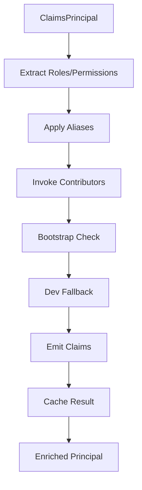

# Koan.Web.Auth.Roles - Technical Reference

## Architecture

### Core Components

**IRoleAttributionService**: Primary service that computes roles and permissions for a `ClaimsPrincipal`. Called by `KoanRoleClaimsTransformation` to enrich claims during authentication pipeline.

**IRoleMapContributor**: Extension point for custom role/permission logic. Multiple contributors can be registered and are invoked during attribution.

**IRoleConfigSnapshotProvider**: Caches role aliases and policy bindings from database to avoid per-request queries. Snapshot is reloaded on admin changes.

**KoanRoleClaimsTransformation**: ASP.NET Core `IClaimsTransformation` that enriches incoming identities with role/permission claims. Integrates into the authentication pipeline automatically.

**Role/Permission Stores**: Data access layer (`IRoleStore`, `IRoleAliasStore`, `IRolePolicyBindingStore`) with default Entity-based implementations.

### Claims Transformation Pipeline



1. **Extract**: Read roles/permissions from configured claim keys
2. **Normalize**: Apply aliases (DB snapshot preferred over options)
3. **Contribute**: Invoke registered `IRoleMapContributor` instances
4. **Bootstrap**: Apply one-time admin elevation if configured
5. **Fallback**: Add dev fallback role if no roles found (Development only)
6. **Emit**: Add `ClaimTypes.Role` and optional permission claims
7. **Cache**: Store result with stable stamp for subsequent requests

### Options Configuration

**Section Path**: `Koan:Web:Auth:Roles`

**Key Options**:
- `ClaimKeys.Roles`: Claim types to read roles from (default: `["roles", "role", "groups", "Koan:role", "Koan:roles"]`)
- `ClaimKeys.Permissions`: Claim types to read permissions from
- `Aliases.Map`: Role name mappings (e.g., `"administrator": "admin"`)
- `EmitPermissionClaims`: Whether to add permission claims (default: `true`)
- `MaxRoles`/`MaxPermissions`: Caps to prevent bloat (default: 256/1024)
- `DevFallback`: Auto-add role in Development (default: enabled, role: `"reader"`)
- `Bootstrap`: One-time admin elevation configuration
- `AllowSeedingInProduction`: Production import safety gate

### Service Registration

The module uses the Koan auto-registrar pattern:

```csharp
// Auto-registration
services.AddKoan().AddKoanWebAuthRoles();

// With options
services.AddKoan().AddKoanWebAuthRoles(opts => {
    opts.DevFallback.Role = "viewer";
    opts.Bootstrap.Mode = RoleBootstrapMode.FirstUser;
});

// With policy integration
services.AddKoan()
    .AddKoanWebAuthRoles()
    .AddKoanRolePolicies();
```

## Data Contracts

### Entities (First-Class Statics)

```csharp
// Role entity
public class Role : Entity<Role>, IKoanAuthRole
{
    public string? Display { get; set; }
    public string? Description { get; set; }
    public byte[]? RowVersion { get; set; }
}

// Usage patterns
var roles = await Role.All(ct);
var admin = await Role.Get("admin", ct);
await Role.UpsertMany(new[] { new Role { Id = "editor" } }, ct);
```

**RoleAlias**: Maps alternative names to canonical roles
- `Id`: Alias key (e.g., "admins")
- `TargetRole`: Canonical role (e.g., "admin")
- `RowVersion`: Optimistic concurrency control

**RolePolicyBinding**: Maps authorization policies to role requirements
- `Id`: Policy name (e.g., "auth.roles.admin")
- `Requirement`: Role expression (e.g., "role:admin")
- `RowVersion`: Optimistic concurrency control

**RoleBootstrapState**: Tracks bootstrap completion
- `Id`: Bootstrap key (e.g., "admin-bootstrap")
- `IsCompleted`: Whether bootstrap was applied
- `CompletedAt`: Timestamp of completion
- `CompletedBy`: User identifier who triggered bootstrap

### Store Abstractions

**IRoleStore**: CRUD operations for roles
```csharp
Task<Role?> GetByIdAsync(string id, CancellationToken ct);
Task<IList<Role>> GetAllAsync(CancellationToken ct);
Task<Role> UpsertAsync(Role role, CancellationToken ct);
Task<bool> DeleteAsync(string id, CancellationToken ct);
```

**IRoleAliasStore**: CRUD operations for aliases
```csharp
Task<RoleAlias?> GetByIdAsync(string alias, CancellationToken ct);
Task<IList<RoleAlias>> GetAllAsync(CancellationToken ct);
Task<RoleAlias> UpsertAsync(RoleAlias alias, CancellationToken ct);
Task<bool> DeleteAsync(string alias, CancellationToken ct);
```

**IRolePolicyBindingStore**: CRUD operations for policy bindings
```csharp
Task<RolePolicyBinding?> GetByIdAsync(string policyName, CancellationToken ct);
Task<IList<RolePolicyBinding>> GetAllAsync(CancellationToken ct);
Task<RolePolicyBinding> UpsertAsync(RolePolicyBinding binding, CancellationToken ct);
Task<bool> DeleteAsync(string policyName, CancellationToken ct);
```

**IRoleBootstrapStateStore**: Tracks bootstrap completion
```csharp
Task<RoleBootstrapState?> GetByIdAsync(string key, CancellationToken ct);
Task<RoleBootstrapState> UpsertAsync(RoleBootstrapState state, CancellationToken ct);
```

Default implementations delegate to Entity statics. Custom stores can be registered to use different schemas while preserving API contracts.

### Configuration Snapshot

**IRoleConfigSnapshotProvider** caches database state to avoid per-request queries:

```csharp
public class RoleConfigSnapshot
{
    public IDictionary<string, string> Aliases { get; set; } = new Dictionary<string, string>();
    public IDictionary<string, string> PolicyBindings { get; set; } = new Dictionary<string, string>();
    public DateTime LoadedAt { get; set; }
}
```

Snapshot is refreshed:
- On first access
- After admin mutations (import/reload)
- When cache expires (configurable TTL)
var roles = await Role.All(ct);
var admin = await Role.Get("admin", ct);
await Role.UpsertMany(new[] { new Role { Id = "editor" } }, ct);
```

**RoleAlias**: Maps alternative names to canonical roles
- `Id`: Alias key (e.g., "admins")
- `TargetRole`: Canonical role (e.g., "admin")

**RolePolicyBinding**: Maps authorization policies to role requirements
- `Id`: Policy name (e.g., "auth.roles.admin")
- `Requirement`: Role expression (e.g., "role:admin")

### Store Abstractions

**IRoleStore**: CRUD operations for roles
**IRoleAliasStore**: CRUD operations for aliases  
**IRolePolicyBindingStore**: CRUD operations for policy bindings

Default implementations delegate to Entity statics. Custom stores can be registered to use different schemas while preserving API contracts.

## Bootstrap Modes

### FirstUser
First authenticated user to trigger attribution gets admin role. State persisted in `RoleBootstrapState` entity with key `"admin-bootstrap"`.

**Configuration**:
```json
{
  "Bootstrap": {
    "Mode": "FirstUser",
    "AdminRole": "admin"
  }
}
```

**Race Condition Handling**: Uses database constraints to ensure only one user gets elevated, even under high concurrency.

### ClaimMatch
Specific users elevated based on claim values:
```json
{
  "Bootstrap": {
    "Mode": "ClaimMatch",
    "ClaimType": "email",
    "ClaimValues": ["admin@company.com"],
    "AdminEmails": ["cto@company.com"],  // Convenience for email claims
    "AdminRole": "admin"
  }
}
```

**Security Note**: Relies on trusted identity provider claims. Should not be used with user-controllable claim sources.

### Off
Disables bootstrap entirely:
```json
{
  "Bootstrap": {
    "Mode": "Off"
  }
}
```

Bootstrap is one-time only. State tracked in database to prevent replay attacks. Once completed, the bootstrap configuration is ignored for all subsequent requests.

## Role Attribution Process

### Attribution Cache

Per-user attribution results are cached using a composite key:
- User identity (name identifier + authentication type)
- Claims stamp (hash of relevant claim values)
- Configuration stamp (snapshot version)

Cache invalidation occurs when:
- User's relevant claims change
- Configuration snapshot is reloaded
- Explicit cache clear (admin reload)

### Contributor Execution

Contributors execute in registration order:

```csharp
foreach (var contributor in contributors)
{
    try
    {
        await contributor.ContributeAsync(user, roles, permissions, context, ct);
    }
    catch (Exception ex)
    {
        logger.LogWarning(ex, "Role contributor {Type} failed", contributor.GetType().Name);
        // Continue with next contributor
    }
}
```

**Best Practices for Contributors**:
- Be idempotent (multiple calls should produce same result)
- Handle cancellation tokens properly
- Log meaningful errors but don't throw unless critical
- Minimize async/database calls in hot path
- Use `context.RequestServices` for scoped dependencies

## Admin API

**Base Route**: `/api/auth/roles`
**Authorization**: Requires `auth.roles.admin` policy
**Content Type**: `application/json`

### Endpoints

#### Roles Management
- `GET /` - List all roles
  - Response: `{ "roles": [{ "id": "admin", "display": "Administrator", "description": "..." }] }`
- `PUT /{id}` - Create/update role
  - Body: `{ "display": "Administrator", "description": "Full system access" }`
  - Response: `{ "role": { ... }, "created": true }`
- `DELETE /{id}` - Delete role
  - Response: `{ "deleted": true }`

#### Aliases Management
- `GET /aliases` - List role aliases
  - Response: `{ "aliases": [{ "id": "admins", "targetRole": "admin" }] }`
- `PUT /aliases/{alias}` - Create/update alias
  - Body: `{ "targetRole": "admin" }`
  - Response: `{ "alias": { ... }, "created": true }`
- `DELETE /aliases/{alias}` - Delete alias
  - Response: `{ "deleted": true }`

#### Policy Bindings Management
- `GET /policy-bindings` - List policy bindings
  - Response: `{ "bindings": [{ "id": "auth.roles.admin", "requirement": "role:admin" }] }`
- `PUT /policy-bindings/{policy}` - Create/update binding
  - Body: `{ "requirement": "role:admin" }`
  - Response: `{ "binding": { ... }, "created": true }`
- `DELETE /policy-bindings/{policy}` - Delete binding
  - Response: `{ "deleted": true }`

#### Configuration Management
- `GET /export` - Export current configuration
  - Response: Options-compatible JSON structure
- `POST /import` - Import from options template
  - Body: Options structure (roles, aliases, policyBindings arrays)
  - Query: `?dryRun=true&force=false`
  - Response: `{ "applied": 5, "skipped": 2, "deleted": 0, "dryRun": true }`
- `POST /reload` - Reload snapshot and clear cache
  - Response: `{ "reloaded": true, "cacheCleared": true }`

### Import Behavior

**Dry Run**: `POST /import?dryRun=true` returns diff without applying changes
**Force Mode**: `?force=true` deletes items not present in template
**Production Guard**: Blocked unless `AllowSeedingInProduction` is true or `KoanEnv.AllowMagicInProduction` is set

**Import Structure**:
```json
{
  "roles": [
    { "id": "admin", "display": "Administrator" }
  ],
  "aliases": [
    { "id": "admins", "targetRole": "admin" }
  ],
  "policyBindings": [
    { "id": "auth.roles.admin", "requirement": "role:admin" }
  ]
}
```

### Error Responses

All endpoints return consistent error structure:
```json
{
  "error": "RoleNotFound",
  "message": "Role 'invalid' not found",
  "details": { "roleId": "invalid" }
}
```

Common HTTP status codes:
- `400` - Validation errors, malformed requests
- `401` - Unauthenticated
- `403` - Insufficient permissions
- `404` - Resource not found
- `409` - Concurrency conflict (RowVersion mismatch)
- `422` - Business logic validation failed

## Performance Characteristics

### Caching Strategy

**Attribution Cache**: Per-user results cached with composite key
- Cache Key: `{UserId}:{ClaimsStamp}:{ConfigStamp}`
- TTL: Configurable (default: 5 minutes)
- Eviction: LRU with size limit
- Thread Safety: ConcurrentDictionary with lock-free reads

**Config Snapshot**: Aliases and policy bindings cached in memory
- Refresh Triggers: Admin mutations, TTL expiry, manual reload
- Concurrency: ReaderWriterLockSlim for snapshot updates
- Fallback: Options-based aliases if snapshot unavailable

**Performance Benchmarks** (per-request overhead):
- Cached attribution: ~0.1ms
- Fresh attribution (no contributors): ~2-5ms
- Fresh attribution (with DB contributors): ~10-50ms
- Snapshot reload: ~50-200ms

### Optimization Notes

- **Stamp-based no-op**: Cached results skip all processing when stamps match
- **Snapshot avoids DB queries**: Aliases/policies resolved from memory
- **Contributor ordering**: Fast contributors execute first; expensive ones last
- **Exception isolation**: Failed contributors don't halt pipeline
- **Deduplication**: Role/permission sets use case-insensitive HashSet
- **Claim extraction**: Multiple claim keys processed efficiently with LINQ

### Scalability Considerations

**Memory Usage**:
- Attribution cache: ~1KB per cached user (configurable limit)
- Config snapshot: ~10KB for typical deployments
- Claims transformer: Singleton, minimal heap allocation

**Database Load**:
- Fresh attribution: 1-3 queries (roles, aliases, bootstrap state)
- Admin operations: 1-2 queries per mutation
- Snapshot reload: 2-3 queries total

**Concurrency**:
- Claims transformation: Thread-safe with minimal locking
- Cache operations: Lock-free reads, synchronized writes
- Bootstrap checks: Atomic database constraints prevent races

## Security Considerations

### Production Safety

**Import/Seeding Controls**:
- Import disabled by default in Production environment
- Requires explicit `AllowSeedingInProduction` configuration
- `KoanEnv.AllowMagicInProduction` emergency override
- Dry-run mode for safe configuration validation

**Admin API Security**:
- Requires `auth.roles.admin` policy authorization
- CORS policy respects app-wide configuration
- Input validation with model binding and custom validators
- SQL injection prevention through parameterized queries

**Bootstrap Security**:
- FirstUser mode: Database constraints prevent race conditions
- ClaimMatch mode: Validate claim sources are trusted
- Bootstrap state prevents replay/re-elevation attacks
- One-time execution tracked persistently

### Attack Vectors & Mitigations

**Role/Permission Inflation**:
- Caps: MaxRoles (256), MaxPermissions (1024)
- Validation: Role names must match `^[a-zA-Z0-9._-]+$`
- Sanitization: Case-insensitive deduplication

**Cache Poisoning**:
- Stamp validation: Claims and config changes invalidate cache
- Isolation: User caches are isolated by identity
- Cleanup: TTL and size limits prevent unbounded growth

**Privilege Escalation**:
- Bootstrap: One-time only, tracked in database
- Contributors: Isolated exception handling
- Aliases: Limited to existing canonical roles

**Denial of Service**:
- Attribution timeout: Configurable per-request limit
- Cache limits: Memory and entry count caps
- Database timeouts: Standard Entity timeout settings

### Development vs Production

**Development Mode** (`IsDevelopment`):
- Dev fallback role automatically added
- More permissive error handling
- Extended logging and diagnostics
- Bootstrap warnings vs errors

**Production Mode**:
- Strict validation and error handling
- Import/seeding disabled by default
- Minimal logging to reduce noise
- Bootstrap failures are hard errors

## Extensibility

### Custom Contributors

Implement `IRoleMapContributor` for external role sources:

```csharp
public class DatabaseRoleContributor : IRoleMapContributor
{
    private readonly IUserRoleStore _userRoleStore;
    
    public DatabaseRoleContributor(IUserRoleStore userRoleStore)
    {
        _userRoleStore = userRoleStore;
    }

    public async Task ContributeAsync(ClaimsPrincipal user, ISet<string> roles, 
        ISet<string> permissions, RoleAttributionContext? context, CancellationToken ct)
    {
        var userId = user.GetUserId();
        if (string.IsNullOrEmpty(userId)) return;

        // Add roles from external system
        var userRoles = await _userRoleStore.GetUserRolesAsync(userId, ct);
        foreach (var role in userRoles)
        {
            roles.Add(role.Name);
            
            // Add associated permissions
            foreach (var permission in role.Permissions)
            {
                permissions.Add(permission);
            }
        }
        
        // Add conditional permissions based on user state
        if (await _userRoleStore.IsUserActiveAsync(userId, ct))
        {
            permissions.Add("user:active");
        }
    }
}

// Registration
services.AddSingleton<IRoleMapContributor, DatabaseRoleContributor>();
```

**Advanced Contributor Patterns**:

```csharp
// Time-based roles
public class TemporaryRoleContributor : IRoleMapContributor
{
    public async Task ContributeAsync(ClaimsPrincipal user, ISet<string> roles, 
        ISet<string> permissions, RoleAttributionContext? context, CancellationToken ct)
    {
        var tempRoles = await GetTemporaryRoles(user, ct);
        foreach (var (role, expiresAt) in tempRoles)
        {
            if (DateTime.UtcNow < expiresAt)
            {
                roles.Add(role);
            }
        }
    }
}

// Hierarchical roles
public class HierarchicalRoleContributor : IRoleMapContributor
{
    private readonly Dictionary<string, string[]> _hierarchy = new()
    {
        ["admin"] = new[] { "editor", "viewer" },
        ["editor"] = new[] { "viewer" }
    };

    public Task ContributeAsync(ClaimsPrincipal user, ISet<string> roles, 
        ISet<string> permissions, RoleAttributionContext? context, CancellationToken ct)
    {
        var currentRoles = roles.ToArray();
        foreach (var role in currentRoles)
        {
            if (_hierarchy.TryGetValue(role, out var inherited))
            {
                foreach (var inheritedRole in inherited)
                {
                    roles.Add(inheritedRole);
                }
            }
        }
        return Task.CompletedTask;
    }
}
```

### Custom Stores

Replace default stores for different schemas:

```csharp
// Custom role store using different table structure
public class CustomRoleStore : IRoleStore
{
    private readonly IDbContext _context;
    
    public async Task<Role?> GetByIdAsync(string id, CancellationToken ct)
    {
        var entity = await _context.UserRoles
            .Where(r => r.RoleName == id)
            .FirstOrDefaultAsync(ct);
            
        return entity == null ? null : new Role 
        { 
            Id = entity.RoleName,
            Display = entity.DisplayName,
            Description = entity.Description 
        };
    }
    
    // ... other methods
}

// Registration with custom implementations
services.AddSingleton<IRoleStore, CustomRoleStore>();
services.AddSingleton<IRoleAliasStore, CustomAliasStore>();
services.AddSingleton<IRolePolicyBindingStore, CustomPolicyStore>();
```

### Policy Integration

Integration with `Koan.Web.Extensions` for capability-based authorization:

```csharp
// Standard setup
services.AddKoanWebAuthRoles()
    .AddKoanRolePolicies();

// Custom policy mappings
services.AddKoanWebAuthRoles()
    .AddKoanRolePolicies(opts =>
    {
        // Map authorization policies to role requirements
        opts.AddPolicy("content.manage", "role:editor,admin");
        opts.AddPolicy("system.admin", "role:admin");
        opts.AddPolicy("user.view", "role:viewer,editor,admin");
    });

// Usage in controllers
[Authorize(Policy = "content.manage")]
public class ContentController : ControllerBase
{
    // Only users with editor or admin roles can access
}

// Usage in Razor views
@if ((await AuthorizationService.AuthorizeAsync(User, "system.admin")).Succeeded)
{
    <button>Admin Function</button>
}
```

### Configuration Extensions

**Custom Options Providers**:

```csharp
public class DatabaseRoleOptionsProvider : IOptionsProvider<RoleAttributionOptions>
{
    public async Task<RoleAttributionOptions> GetOptionsAsync(CancellationToken ct)
    {
        // Load configuration from database instead of appsettings
        return await LoadFromDatabaseAsync(ct);
    }
}
```

**Environment-Specific Configuration**:

```csharp
services.Configure<RoleAttributionOptions>(options =>
{
    if (env.IsProduction())
    {
        options.DevFallback.Enabled = false;
        options.AllowSeedingInProduction = false;
        options.Bootstrap.Mode = RoleBootstrapMode.Off;
    }
    else
    {
        options.DevFallback.Enabled = true;
        options.DevFallback.Role = "developer";
        options.Bootstrap.Mode = RoleBootstrapMode.FirstUser;
    }
});
```

## Error Handling

### Contributor Failures

Contributors that throw exceptions are logged and skipped:

```csharp
// Error handling in attribution service
foreach (var contributor in contributors)
{
    try
    {
        await contributor.ContributeAsync(user, roles, permissions, context, ct);
    }
    catch (Exception ex)
    {
        _logger.LogWarning(ex, 
            "Role contributor {ContributorType} failed for user {UserId}", 
            contributor.GetType().Name, 
            user.GetUserId());
        // Attribution continues with remaining contributors
    }
}
```

**Contributor Error Categories**:
- **Transient Errors**: Database timeouts, network issues → Logged as warnings
- **Configuration Errors**: Missing dependencies, invalid setup → Logged as errors  
- **Authorization Errors**: Insufficient permissions → Logged as information
- **Validation Errors**: Invalid role names, malformed data → Logged as warnings

### Bootstrap Failures

Bootstrap operations have specific error handling:

```csharp
try
{
    await ApplyBootstrapAsync(user, roles, ct);
}
catch (InvalidOperationException ex) when (ex.Message.Contains("already completed"))
{
    // Bootstrap already completed - this is expected
    _logger.LogDebug("Bootstrap already completed for user {UserId}", user.GetUserId());
}
catch (Exception ex)
{
    // Bootstrap failure should not crash the request
    _logger.LogError(ex, "Bootstrap failed for user {UserId}", user.GetUserId());
    // Continue with regular attribution
}
```

### Cache Failures

Cache operations are designed to be resilient:

```csharp
// Cache operations never throw - they degrade gracefully
public async Task<RoleAttributionResult> GetCachedResultAsync(string key)
{
    try
    {
        return await _cache.GetAsync(key);
    }
    catch (Exception ex)
    {
        _logger.LogWarning(ex, "Cache read failed for key {Key}", key);
        return null; // Caller will perform fresh attribution
    }
}

public async Task SetCachedResultAsync(string key, RoleAttributionResult result)
{
    try
    {
        await _cache.SetAsync(key, result, _options.CacheTtl);
    }
    catch (Exception ex)
    {
        _logger.LogWarning(ex, "Cache write failed for key {Key}", key);
        // Silently fail - attribution still works without cache
    }
}
```

## Monitoring & Diagnostics

### Metrics & Telemetry

Key metrics exposed via standard .NET diagnostics:

```csharp
// Attribution performance
- "Koan.auth.roles.attribution.duration" (histogram)
- "Koan.auth.roles.attribution.cache_hit_rate" (gauge)
- "Koan.auth.roles.contributors.execution_time" (histogram)

// Cache statistics  
- "Koan.auth.roles.cache.size" (gauge)
- "Koan.auth.roles.cache.evictions" (counter)
- "Koan.auth.roles.snapshot.reload_count" (counter)

// Error rates
- "Koan.auth.roles.contributor.failures" (counter)
- "Koan.auth.roles.bootstrap.failures" (counter)
- "Koan.auth.roles.api.errors" (counter by status code)
```

### Logging Categories

Structured logging with consistent categories:

```csharp
// High-level operations
"Koan.Web.Auth.Roles.Attribution"
"Koan.Web.Auth.Roles.Bootstrap" 
"Koan.Web.Auth.Roles.Admin"

// Component-specific
"Koan.Web.Auth.Roles.Cache"
"Koan.Web.Auth.Roles.Contributors"
"Koan.Web.Auth.Roles.Snapshot"

// Store operations
"Koan.Web.Auth.Roles.Stores.Role"
"Koan.Web.Auth.Roles.Stores.Alias"
"Koan.Web.Auth.Roles.Stores.PolicyBinding"
```

### Health Checks

Optional health check integration:

```csharp
services.AddHealthChecks()
    .AddCheck<RoleAttributionHealthCheck>("role-attribution")
    .AddCheck<RoleStoreHealthCheck>("role-stores");

// Health check validates:
// - Database connectivity for stores
// - Cache responsiveness  
// - Configuration snapshot health
// - Recent error rates within thresholds
```

## Dependencies

**Required Packages**:
- `Koan.Core` (Entity statics, options binding, environment detection)
- `Koan.Web.Extensions` (policy binding helpers, admin API base)
- `Microsoft.AspNetCore.Authorization` (claims transformation, policies)
- `Microsoft.Extensions.Caching.Memory` (attribution and snapshot caching)

**Optional Packages**:
- Storage providers (auto-configured via Koan boot process)
- `Koan.Diagnostics.Core` (enhanced metrics and telemetry)
- Custom contributor packages
- Policy binding extensions

**Minimum Framework Versions**:
- .NET 8.0 or later
- ASP.NET Core 8.0 or later  
- Entity Framework Core 8.0+ (if using default stores)

**Integration Points**:
- Claims transformer integrates with ASP.NET Core authentication pipeline
- Admin API uses standard MVC controller patterns
- Stores integrate with Koan Entity framework
- Caching uses standard Microsoft.Extensions.Caching abstractions
