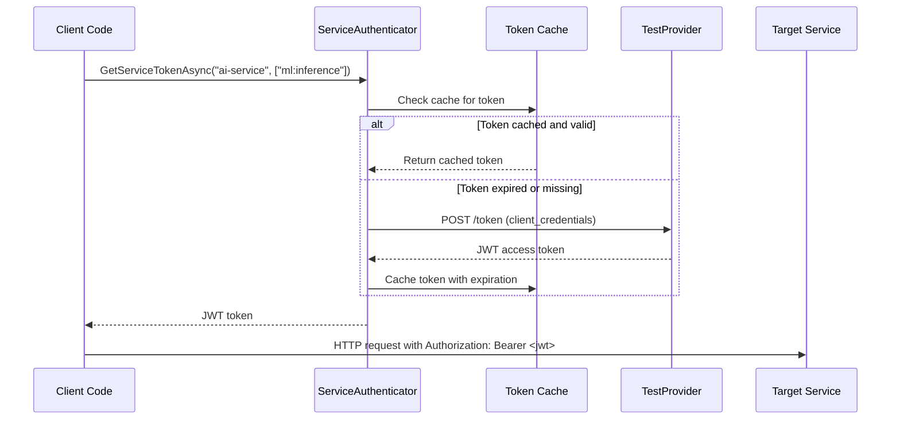
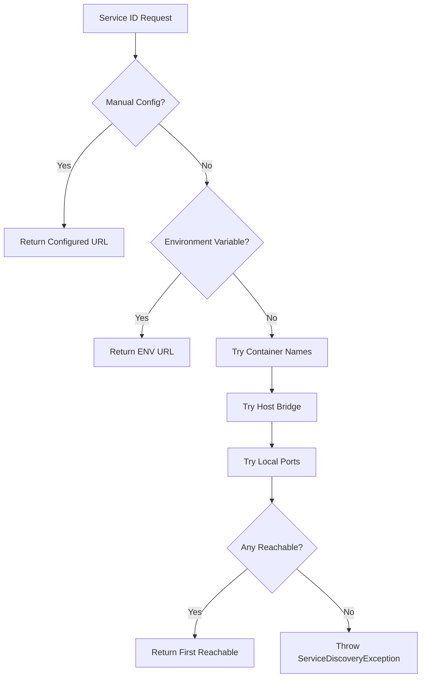

# Koan.Web.Auth.Services - Technical Documentation

## Architecture Overview

The Koan.Web.Auth.Services module implements a hybrid authentication architecture that separates user authentication from service-to-service communication:

```
┌─────────────────┐    ┌─────────────────┐    ┌─────────────────┐
│    Browser      │    │   Service A     │    │   Service B     │
│                 │    │                 │    │                 │
│ Session Cookie  │───▶│ JWT Bearer      │───▶│ JWT Bearer      │
│ (HTTP-Only)     │    │ Token           │    │ Token           │
└─────────────────┘    └─────────────────┘    └─────────────────┘
```

### Core Components

#### 1. Service Authenticator
**Location:** `Authentication/ServiceAuthenticator.cs`
**Responsibility:** Acquires and manages JWT tokens for service calls

Key Features:
- OAuth 2.0 Client Credentials flow implementation
- Memory-based token caching with configurable expiration
- Automatic token refresh with buffer time
- Environment-aware client credential generation

#### 2. Service Discovery
**Location:** `Discovery/KoanServiceDiscovery.cs`
**Responsibility:** Resolves service endpoints using container-aware patterns

Discovery Chain:
1. Manual configuration (`ServiceEndpoints` dictionary)
2. Environment variables (`KOAN_SERVICE_{SERVICEID}_URL`)
3. Container service names (`http://{serviceId}:8080`)
4. Host-accessible ports (`http://host.docker.internal:{port}`)
5. Local development ports (`http://localhost:{port}`)

#### 3. Authenticated HTTP Client
**Location:** `Http/KoanServiceClient.cs`
**Responsibility:** Provides HTTP client with automatic authentication

Features:
- Automatic JWT token injection via Authorization header
- Service endpoint resolution
- JSON serialization/deserialization
- Comprehensive error handling and logging

#### 4. Auto-Registration System
**Location:** `Initialization/KoanAutoRegistrar.cs`
**Responsibility:** Discovers and registers services automatically

Process:
1. Scans entry assembly for `[KoanService]` and `[CallsService]` attributes
2. Registers discovered services with dependency injection container
3. Configures HTTP clients with authentication handlers
4. Reports discovered services in boot report

## Implementation Details

### Token Acquisition Flow



### Service Discovery Resolution



### Attribute Processing

The auto-registrar processes attributes using reflection:

```csharp
private ServiceMetadata[] DiscoverServices()
{
    var assembly = Assembly.GetEntryAssembly();
    var services = new List<ServiceMetadata>();

    foreach (var type in assembly.GetTypes())
    {
        var serviceAttr = type.GetCustomAttribute<KoanServiceAttribute>();
        if (serviceAttr == null) continue;

        var dependencies = type.GetCustomAttributes<CallsServiceAttribute>()
            .Concat(GetMethodDependencies(type))
            .DistinctBy(d => d.ServiceId)
            .ToArray();

        services.Add(new ServiceMetadata(
            ServiceId: serviceAttr.ServiceId,
            ProvidedScopes: serviceAttr.ProvidedScopes,
            Dependencies: dependencies.Select(d => new ServiceDependency(...)).ToArray(),
            ControllerType: type
        ));
    }

    return services.ToArray();
}
```

## Configuration Reference

### ServiceAuthOptions

| Property | Default | Description |
|----------|---------|-------------|
| `TokenCacheDuration` | 55 minutes | How long to cache tokens |
| `TokenRefreshBuffer` | 5 minutes | Buffer time before token expiration |
| `EnableTokenCaching` | `true` | Whether to cache tokens |
| `EnableAutoDiscovery` | `true` (dev) | Auto-discover service endpoints |
| `ClientId` | Auto-generated | OAuth client identifier |
| `ClientSecret` | Auto-generated (dev) | OAuth client secret |
| `TokenEndpoint` | `/.testoauth/token` | Token acquisition endpoint |
| `ValidateServerCertificate` | `true` (prod) | TLS certificate validation |

### Environment Variables

| Variable | Purpose | Example |
|----------|---------|---------|
| `KOAN_SERVICE_{SERVICEID}_URL` | Manual endpoint override | `KOAN_SERVICE_AI_SERVICE_URL=http://ai.internal:8080` |
| `KOAN_SERVICE_SECRET_{CLIENTID}` | Production client secret | `KOAN_SERVICE_SECRET_MYSERVICE=prod-secret-123` |

### TestProvider Integration

The TestProvider is enhanced to support client credentials:

```csharp
// appsettings.Development.json
{
  "Koan": {
    "Web": {
      "Auth": {
        "TestProvider": {
          "EnableClientCredentials": true,
          "AllowedScopes": ["ml:inference", "analytics:write"],
          "RegisteredClients": {
            "my-service": {
              "ClientId": "my-service",
              "ClientSecret": "dev-secret",
              "AllowedScopes": ["ml:inference"]
            }
          }
        }
      }
    }
  }
}
```

## Security Model

### Token Security
- **Short-lived tokens**: Default 1-hour expiration
- **Scope-based authorization**: Minimal required permissions
- **Memory-only caching**: Tokens never persisted to disk
- **Automatic refresh**: Tokens refreshed before expiration

### Development vs Production

| Aspect | Development | Production |
|--------|-------------|------------|
| Client Secrets | Auto-generated deterministic | Explicit configuration required |
| TLS Validation | Relaxed (`false`) | Strict (`true`) |
| Service Discovery | Auto-discovery enabled | Manual configuration preferred |
| Logging | Verbose debugging | Minimal security-aware |

### Threat Model

**Mitigated Threats:**
- Man-in-the-middle attacks (TLS enforcement)
- Token replay attacks (short expiration)
- Privilege escalation (scope-based authorization)
- Secret exposure (environment variable config)

**Assumptions:**
- Network security between services
- Secure secret management in production
- Trusted container environment

## Performance Characteristics

### Token Caching
- **Cache Hit**: ~1ms (memory lookup)
- **Cache Miss**: ~100-500ms (network token acquisition)
- **Memory Usage**: ~1KB per cached token

### Service Discovery
- **Manual Config**: ~1ms (dictionary lookup)
- **Environment Variable**: ~5ms (environment access)
- **Container Discovery**: ~50-200ms (network health check)

### HTTP Client
- **Connection Pooling**: Managed by HttpClientFactory
- **Timeout**: 30 seconds default
- **Retry Policy**: 3 attempts with exponential backoff

## Error Handling

### Exception Types

#### ServiceDiscoveryException
**Thrown when:** Service endpoint cannot be resolved
**Contains:** Service ID and attempted resolution methods
**Recovery:** Check service configuration and network connectivity

#### ServiceAuthenticationException
**Thrown when:** Token acquisition fails
**Contains:** Service ID, requested scopes, and error details
**Recovery:** Verify client credentials and TestProvider configuration

### Graceful Degradation

Optional services (marked with `Optional = true`) allow graceful failure:

```csharp
[CallsService("optional-service", Optional = true)]
public async Task ProcessWithOptionalService()
{
    try
    {
        await _client.PostAsync("optional-service", "/process", data);
    }
    catch (ServiceDiscoveryException)
    {
        _logger.LogInformation("Optional service unavailable - continuing");
        // Continue processing without optional service
    }
}
```

## Monitoring and Diagnostics

### Logging

The module provides structured logging at multiple levels:

```csharp
// Token acquisition
_logger.LogInformation("Successfully acquired token for service {TargetService}, expires at {ExpiresAt}");

// Service discovery
_logger.LogDebug("Service {ServiceId} reachable at {Url}");

// HTTP calls
_logger.LogDebug("Sending {Method} request to {ServiceId}{Endpoint}");
```

### Boot Report Integration

Services discovered during startup are reported:

```
[12:34:56] Koan.Web.Auth.Services v1.0.0
  Mode: Development
  Auto Discovery: True
  Token Caching: True
  Services Discovered: 2
    └─ recommendation-service | Scopes: recommendations:read,recommendations:write | Dependencies: 1
    └─ analytics-service | Scopes: analytics:write | Dependencies: 0
```

### Health Checks

The module integrates with ASP.NET Core health checks:

```csharp
// Automatic health check registration for discovered services
services.AddHealthChecks()
    .AddServiceAuthHealthCheck("ai-service")
    .AddServiceAuthHealthCheck("analytics-service");
```

## Extension Points

### Custom Service Discovery

Implement `IServiceDiscovery` for custom resolution logic:

```csharp
public class ConsulServiceDiscovery : IServiceDiscovery
{
    public async Task<ServiceEndpoint> ResolveServiceAsync(string serviceId, CancellationToken ct)
    {
        var consulResponse = await _consulClient.Catalog.Service(serviceId, ct);
        var service = consulResponse.Response.FirstOrDefault();

        return new ServiceEndpoint(
            serviceId,
            new Uri($"http://{service.ServiceAddress}:{service.ServicePort}"),
            service.ServiceTags
        );
    }
}

// Register custom implementation
services.AddSingleton<IServiceDiscovery, ConsulServiceDiscovery>();
```

### Custom Authentication

Implement `IServiceAuthenticator` for custom token acquisition:

```csharp
public class AzureAdServiceAuthenticator : IServiceAuthenticator
{
    public async Task<string> GetServiceTokenAsync(string targetService, string[]? scopes, CancellationToken ct)
    {
        var credential = new DefaultAzureCredential();
        var tokenRequest = new TokenRequestContext(scopes ?? new[] { $"api://{targetService}/.default" });
        var token = await credential.GetTokenAsync(tokenRequest, ct);

        return token.Token;
    }
}
```

## Testing Support

### Test Doubles

```csharp
public class TestKoanServiceClient : IKoanServiceClient
{
    private readonly Dictionary<string, object> _mockResponses = new();

    public TestKoanServiceClient WithMockResponse<T>(string serviceId, string endpoint, T response)
    {
        _mockResponses[$"{serviceId}:{endpoint}"] = response;
        return this;
    }

    public async Task<T?> PostAsync<T>(string serviceId, string endpoint, object? data, CancellationToken ct) where T : class
    {
        var key = $"{serviceId}:{endpoint}";
        return _mockResponses.TryGetValue(key, out var response) ? (T)response : null;
    }
}

// Usage in tests
services.AddSingleton<IKoanServiceClient>(provider =>
    new TestKoanServiceClient()
        .WithMockResponse("ai-service", "/api/inference", new InferenceResult { Confidence = 0.95 }));
```

### Integration Testing

```csharp
public class ServiceAuthenticationIntegrationTests : IClassFixture<WebApplicationFactory<Program>>
{
    [Fact]
    public async Task Should_Authenticate_Service_Calls()
    {
        // Arrange
        var client = _factory.CreateClient();

        // Act
        var response = await client.PostAsJsonAsync("/api/recommendations/generate", new RecommendationRequest());

        // Assert
        response.StatusCode.Should().Be(HttpStatusCode.OK);

        // Verify token was acquired and used
        _mockTokenServer.Verify(x => x.IssueToken(It.IsAny<ClientCredentialsRequest>()), Times.Once);
        _mockAiService.Verify(x => x.ReceiveAuthenticatedRequest(It.IsAny<string>()), Times.Once);
    }
}
```

This technical documentation provides comprehensive coverage of the implementation details, enabling developers to understand, extend, and troubleshoot the service authentication system.